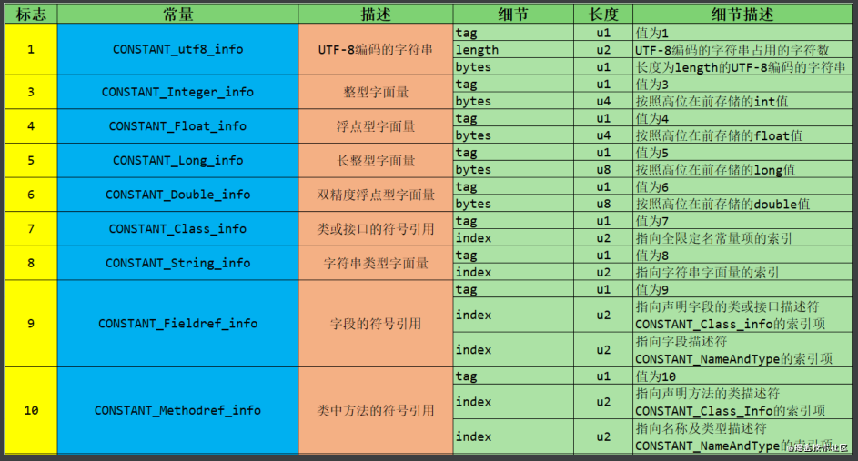
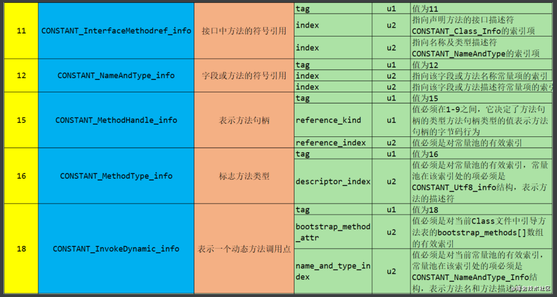

# 平台无关性

Java虚拟机不和包括Java在内的任何语言绑定，它**只与“.class”这种特定的二进制文件格式所关联**。class文件中包含了Java虚拟机指令集和符号表以及若干辅助信息。


# Class类文件结构

class文件是一组以字节为单位的二进制流，各个数据项目严格按照顺序紧凑地排列在Class文件之中，中间没有分隔符。

class文件采用一种类似于C语言结构体的伪结构来存储数据，这种伪结构只有两种数据类型：无符号数和表。

无符号数属于基本的数据类型，以u1、u2、u4、u8来表示1个字节，2个字节，4个字节，8个字节的无符号数，无符号数可以用来描述数字，引用，数量值或者按照UTF8编码构成字符串值。

表是由多个无符号数或者其他表作为数据项构成的复合数据类型，所有表都习惯性地以"_info"结尾。表用于描述有层次关系的复合结构的数据，整个class文件本质上就是一个表。

class文件格式：

| 类型           | 名称                | 数量                    |
| -------------- | ------------------- | ----------------------- |
| u4             | magic               | 1                       |
| u2             | minor_version       | 1                       |
| u2             | major_version       | 1                       |
| u2             | constant_pool_count | 1                       |
| cp_info        | constant_pool       | constant_pool_count - 1 |
| u2             | access_flags        | 1                       |
| u2             | this_class          | 1                       |
| u2             | super_class         | 1                       |
| u2             | interfaces_count    | 1                       |
| u2             | interfaces          | interfaces_count        |
| u2             | fields_count        | 1                       |
| field_info     | fields              | fields_count            |
| u2             | methods_count       | 1                       |
| method_info    | methods             | methods_count           |
| u2             | attributes_count    | 1                       |
| attribute_info | attributes          | attributes_count        |

无论是无符号数还是表，当需要描述同一类型但数量不定的多个数据时，经常会使用一个前置的容量计数器加若干个连续的数据项的形式，这时称这一系列连续的某一类型的数据为某一类型的集合。


## 魔数和class文件版本

每个class文件的前四个字节被称为魔数，它的唯一作用是确定这个文件是否为一个能被虚拟机接受的class文件。类似gif、jpeg文件等在文件头中都存在魔数。

Class文件的魔数值为：0xCAFEBABE（咖啡宝贝）。


紧接着魔数的是minor version和major version，分别代表主版本号和次版本号。高版本的JDK能兼容低版本的class文件，但反之则不行。

## 常量池

紧接着的是常量池容量计数值，这个容量计数值是从1开始的。

例如：


第九个和第十个字节0x0022表示常量池的大小为十进制的34，代表常量池有33个常量，索引为1-33。

在Class文件格式规范制定之时，设计者将第0项常量空出来是有特殊考虑的，这样做的目的在于满足后面某些指向常量池的索引值的数据在特定情况下需要表达“不引用任何一个常量池项目”的含义，这种情况就可以把索引值置为0来表示（也就是说，0x22的下一个字节0x0A是索引为1的常量的tag）。

其他集合类型，包括接口索引集合、字段表集合、方法表集合等的容量计数值都是从0开始的。

常量池中主要存放两大类常量：字面量(literal)和符号引用(symbolic references)。

字面量：字符串、声明为final的常量等。

符号引用：类和接口的全限定名，字段的名称和描述符，方法的名称和描述符等。

> 符号引用以一组符号来描述所引用的目标。符号引用可以是任何形式的字面量，JAVA 在编译的时候一个每个 java 类都会被编译成一个 class 文件，但**在编译的时候虚拟机并不知道所引用类的地址(实际地址)**，就用符号引用来代替，而在类的解析阶段就是为了把 这个符号引用转化成为真正的地址的阶段。 一个 java 类（假设为 People 类）被编译成一个 class 文件时，如果 People 类引用了 Tool 类，但是在编译时 People 类并不知道引用类的实际内存地址，因此只能使用符号引用（org.simple.Tool）来代替。而在类装载器装载 People 类时，此时可以通过虚拟机获取 Tool 类的实际内存地址，因此便可以既将符号 org.simple.Tool 替换为 Tool 类的实际内存地址。

Java代码在编译时不像C和C++一样链接的步骤，而是在虚拟机加载Class文件的时候进行动态链接。因此，class文件中不保存各个方法和字段的最终内存布局信息，因此这些字段和方法的符号引用不经过运行期转换的话无法得到真正的内存入口地址，也就无法直接被虚拟机使用。

当虚拟机运行时，需要从常量池获取对应的符号引用，再在类创建或运行时解析，翻译到具体的内存地址之中。

在JDK1.7之前共有十一种结构各不相同的表结构，表开始的第一个字节是一个u1类型的标志位，代表当前这个常量属于哪种数据类型。

具体结构：





例如：


该图中，常量池的第一个字节为地址0x000A处的0x0A，查上表，得知之后的数据是一个类中方法的符号引用。

类中方法的符号引用CONSTANT_Methodref_info的结构为：

```java
//功能： 表示方法符号引用
CONSTANT_Methodref_info {
    u1 tag;   //0x0A
    u2 class_index; //方法所属的类的CONSTANT_Class_info的索引值(必须是类，不能是接口)
    u2 name_and_type_index; //CONSTANT_NameAndType_info类型的索引值
}
```

CONSTANT_NameAndType_info的结构为：

```java
CONSTANT_NameAndType_info {  
   u1 tag;  //0x0C
   u2 name_index;  //字段和方法名常量的索引值，为代码里出现的方法名或字段名(例如，函数void f()的方法名就是f)
   u2 descriptor_index;  //字段和方法描述符常量的索引值，字段描述符就是字段类型的描述符，方法描述符是方法参数的描述符和返回值的描述符
} 
//基本类型，引用类型等类型都设计了不同的描述符
//name_index也可以是一个特殊的方法(<init>)的索引值
```

接下来的0x0006表示方法/字段名在常量池的第六个结构，0x0014表示方法/字段的描述符在常量池的第20个结构。


使用javap解析class文件后，可以看出，6号位置的值为java/lang/Object，20号位置的值为``"<init>":()V`

随后的0x09代表一个字段引用，结构为：

```java
//功能： 表示字段字面量
//格式：

CONSTANT_Fieldref_info {
    u1 tag;     //9
    u2 class_index; //CONSTANT_Fieldref_info 结构的 class_index 项的类型既可以是类也可以是接口。
    u2 name_and_type_index;
}
//class_index 项的值必须是对常量池的有效索引， 常量池在该索引处的项必须是CONSTANT_Class_info 结构，表示一个类或接口，当前字段或方法是这个类或接口的成员。
//name_and_type_index: 项的值必须是对常量池的有效索引， 常量池在该索引处的项必须是 CONSTANT_NameAndType_info 结构，它表示当前字段或方法的名字和描述符。
```

两个索引指向的常量分别为类名和类中方法的描述。

……

**Tips：**

- 常量池中没有出现boolean、byte、short、char类型的字面量，是因为这些类型的变量在Javac编译时都被替换成了Integer类型。

## 访问标志

在常量池结束之后，紧接着的2个字节代表访问标志（access_flags），这个标志用于识别一些类或者接口层次的访问信息，包括：这个Class是类还是接口；是否定义为public类型；是否定义为abstract类型；如果是类的话，是否被声明为final；等等。


具体的标志位以及标志的含义见下图。

<table><thead><tr><th>标志名称</th><th>标志值</th><th>含义</th></tr></thead><tbody><tr><td>ACC_PUBLIC</td><td>0x0001</td><td>标志为public类型</td></tr><tr><td>ACC_FINAL</td><td>0x0010</td><td>标志被声明为final，只有类可以设置</td></tr><tr><td>ACC_SUPER</td><td>0x0020</td><td>标志允许使用invokespecial字节码指令的新语义，JDK1.0.2之后编译出来的类的这个标志默认为真。（使用增强的方法调用父类方法）</td></tr><tr><td>ACC_INTERFACE</td><td>0x0200</td><td>标志这是一个接口</td></tr><tr><td>ACC_ABSTRACT</td><td>0x0400</td><td>是否为abstract类型，对于接口或者抽象类来说，次标志值为真，其他类型为假</td></tr><tr><td>ACC_SYNTHETIC</td><td>0x1000</td><td>标志此类并非由用户代码产生（即：由编译器产生的类，没有源码对应）</td></tr><tr><td>ACC_ANNOTATION</td><td>0x2000</td><td>标志这是一个注解</td></tr><tr><td>ACC_ENUM</td><td>0x4000</td><td>标志这是一个枚举</td></tr></tbody></table>

- 每一种类型的表示都是通过设置访问标记的32位中的特定位来实现的。比如，若是public final的类，则该标记为ACC_PUBLIC | ACC_FINAL。

- 使用ACC_SUPER可以让类更准确地定位到父类的方法super.method（），现代编译器都会设置并且使用这个标记。

- 带有ACC_INTERFACE标志的class文件表示的是接口而不是类，反之则表示的是类而不是接口。

- 如果一个class文件被设置了ACC_INTERFACE 标志，那么同时也得设置ACC_ABSTRACT 标志。同时它不能再设置ACC_FINAL、ACC_SUPER或ACC_ENUM 标志。


在Solution.class文件中，access_flags的值为：


地址0x00000190的0x0021，表示该类的访问标志为ACC_PUBLIC+ACC_SUPER。

## 类索引、父类索引和接口索引集合

this_class和super_class是u2类型的数据，interfaces是一组u2类型数据的集合，Class文件由这三个数据来确定类的继承关系。除了Object类，所有Java类的父类索引都不为0。

类索引查找全限定名的过程：


每一个接口的数据占用两个字节，内容是常量池中一个接口的索引。

在Solution.class文件中，类索引和父类索引的值分别为0x0005和0x0006。


两个字节的接口计数器值为0x0000，表示该类没有接口。若值为0x0005，代表后面的五个u2分别指向五个不同的常量池中的接口。

## 字段表集合

字段表集合位于class文件中的接口集合之后。其结构为：


**这里所讲的字段是指在类中定义的静态或者非静态的变量，而不是在类中的方法内定义的变量（类中或实例中的变量）。**

注意：字段表集合中不会列出从父类或者实现的接口中继承而来的字段，但有可能列出原本Java代码之中不存在的字段。譬如内部类为了保持对外部类的访问性，会自动添加指向外部类实例的字段。

field_info的结构为：


访问标志的规定为：


数据类型的表示：


### 字段的属性表

字段属性表的一般结构为：


ConstantValue属性的作用是通知虚拟机自动为静态变量赋值。同时被static和final关键字修饰的变量才能使用这项属性。


在定义field字段的过程中，我们有时候会很自然地对field字段直接赋值，如下所示：

	public static final int MAX=100;
	public int count = 0;
对于虚拟机而言，上述的两个field字段赋值的时机是不同的：

- 对于非静态（即无static修饰）的field字段的赋值将会出现在实例构造方法``<init>()``中

- 对于静态的field字段，如果没有final修饰，它会在类的初始化阶段在类的`<clinit>()`中初始化，否则，JVM使用ConstantValue属性在类的准备阶段使用常量对它进行赋值。

对于上述的`public static final init MAX=100;` javac编译器在编译此**field**字段构建**field_info**结构体时，除了访问标志、名称索引、描述符索引外，会增加一个**ConstantValue**类型的属性表。

示例：

```java
package com.louis.jvm;
 
public class Simple {
	private  transient static final String str ="This is a test";
}
```


**字段的访问标志**是**0x009A**,二进制是**00000000 10011010**，即第**9、12、13、15**位标志位为**1**，这个字段的标志符有：**ACC_TRANSIENT、ACC_FINAL、ACC_STATIC、ACC_PRIVATE;**


## 方法表集合

**方法表集合**是指由若干个方法表（method_info）组成的集合，位于字段表集合之后，如下图所示：


method_info的结构为：


例如：`	public static synchronized final void greeting(){}`


### 方法的属性表

方法的属性表的一般结构如下：


### Code属性

Java程序方法体的代码经过编译后最终变成字节码存储在Code属性内。Code属性出现在方法表的属性集合之中，但并非所有方法表都必须存在这个属性，例如接口或抽象类中的方法就没有Code属性。


Code属性表的结构：

| 类型           | 名称                   | 数量                   |
| -------------- | ---------------------- | ---------------------- |
| u2             | attribute_name_index   | 1                      |
| u4             | attribute_length       | 1                      |
| u2             | max_stack              | 1                      |
| u2             | max_locals             | 1                      |
| u4             | code_length            | 1                      |
| u1             | code                   | code_length            |
| u2             | exception_table_length | 1                      |
| exception_info | exception_table        | exception_table_length |
| u2             | attributes_count       | 1                      |
| attribute_info | attributes             | attributes_count       |

max_stack代表了操作数栈的最大深度，JVM运行时会根据这个值来分配栈帧中的操作数栈深度。

max_locals代表了局部变量表所需的存储空间。max_locals的单位是Slot，对于byte、char、float、int、short、boolean和returnAddress等长度不超过4字节的数据类型，每个局部变量占据一个Slot，double和long类型的局部变量占据两个Slot。

操作数栈和局部变量表直接决定一个该方法的栈帧所耗费的内存，Java虚拟机通过对局部变量表的Slot进行重用来节省内存的使用量（当代码执行超过一个局部变量的作用域后，将该局部变量的Slot给其他局部变量使用）。

Java编译器会根据变量的作用于来分配Slot给各个变量使用，根据同时生存的最大局部变量数和类型计算出max_locals的大小。

code_length和code存储Java源程序编译后生成的字节码指令。

示例：


0002表示方法区有两个方法，0001表示第一个方法的权限为public，0009表示方法名为init，000A表示方法描述符为void()，0001表示属性表有一个属性。

000B是属性名索引，查询常量表得到Code字符串。0000002F表示属性长度为47个字节（不算属性名索引和属性长度这6个字节），即后边的47个字节全是属性Code的数据。

0001表示最大栈深度为1，下一个0001表示局部变量表大小为1个Slot（这是类的构造方法）。

00000005表示代码长度为5个字节，代码为：0x2A B7 00 01 B1

1）查表知2A对应aload_0，表示将第0个slot中引用类型的本地变量推送到操作数栈栈顶。

2）B7对应invokespecial，表示将栈顶的引用类型的数据指向的对象作为方法接收者，调用此对象的实例构造器方法、private方法或父类的方法。该方法后边的两个字节数据为该方法的参数，即0x0001，说明具体调用哪个方法，指向常量池中的一个Methodref：

`#1 = Methodref          #8.#39         // java/lang/Object."<init>":()V`。

3）读入0001，这是invokespecial指令的参数。

4）读入B1，查表知对应指令为return。

另一个方法的数据为：


所有实例方法的args_size都大于0，因为所有方法都隐含一个this参数。

code属性表之后的是异常处理属性表，其结构为：

| 类型 | 名称       | 数量 |
| ---- | ---------- | ---- |
| u2   | start_pc   | 1    |
| u2   | end_pc     | 1    |
| u2   | handler_pc | 1    |
| u2   | catch_type | 1    |

异常处理表运作示例：

源代码：

```java
public class Solution {
    public int inc() {
        int x;
        try {
            x = 1;
            return x;
        }catch (Exception e) {
            x = 2;
            return x;
        }finally {
            x = 3;
        }
    }
}
```

字节码：

```java
  public int inc();
    descriptor: ()I
    flags: ACC_PUBLIC
    Code:
      stack=1, locals=5, args_size=1
         0: iconst_1	//将常量1压入操作数栈
         1: istore_1	//将1存入局部变量表的slot1
         2: iload_1		//从局部变量表的slot1加载数据（整数1）
         3: istore_2	//将1存入局部变量表的slot2
         4: iconst_3	//将3压入操作数栈
         5: istore_1	//将3保存到slot1
         6: iload_2		//加载局部变量表slot2的数据
         7: ireturn		//返回2
         8: astore_2	//给catch块的Exception e赋值，并保存到slot2中
         9: iconst_2	//将2压入操作数栈
        10: istore_1	//保存2到slot1
        11: iload_1		//加载slot1的2
        12: istore_3	//保存2到slot3
        13: iconst_3	//将3压入操作数栈
        14: istore_1	//保存到slot1
        15: iload_3		//加载slot3的数据
        16: ireturn		//返回
        17: astore        4  //出现了不属于Exception及其子类的异常
        19: iconst_3		 //finally中的x=3
        20: istore_1
        21: aload         4  //将异常放置到栈顶并抛出
        23: athrow
      Exception table:
         from    to  target type
             0     4     8   Class java/lang/Exception
             0     4    17   any
             8    13    17   any
            17    19    17   any
```

- 如果try语句出现Excetion及其子类，转到catch语句处理。
- 如果try语句出现不属于Exception及其子类的异常，转到finally语句块处理。
- 如果catch语句块中未出现任何异常，转到finally语句块处理。

### Exceptions属性

此处的Exceptions属性是指和Code平级的一项属性，作用是列举出方法中可能抛出的异常。

结构为：

| 类型 | 名称                  | 数量                 |
| ---- | --------------------- | -------------------- |
| u2   | attribute_name_index  | 1                    |
| u4   | attribute_length      | 1                    |
| u2   | number_of_exceptions  | 1                    |
| u2   | exception_index_table | number_of_exceptions |

### LineNumberTable属性

该属性用于描述java源码行号与字节码行号之间的对应关系（不是必要的属性）。

| 类型             | 名称                     | 数量                     |
| ---------------- | ------------------------ | ------------------------ |
| u2               | attribute_name_index     | 1                        |
| u4               | attribute_length         | 1                        |
| u2               | line_number_table_length | 1                        |
| line_number_info | line_number_table        | line_number_table_length |

line_number_info包含两个u2类型的数据，前者是字节码行号，后者是Java源码行号。

### LocalVariableTable属性

LocalVariableTable用于描述栈帧中局部变量表的变量和Java源码中定义的变量之间的关系（不是必要的属性）。


start_pc和length指示这个变量的生命周期。

## 属性表集合

Class文件、字段表、方法表都可以携带自己的属性表集合，以描述某些场景专有的信息。

Class文件的属性表位于方法表之后。

与Class文件中其他的数据项目要求严格的顺序、长度和内容不同，属性表集合的限制稍微宽松一些，不再要求各个属性表具有严格顺序，并且《Java虚拟机规范》允许只要不与已有属性名重复，任何人实现的编译器都可以向属性表中写入自己定义的属性信息，Java虚拟机运行时会忽略掉它不认识的属性。

虚拟机预定义的属性(JDK8)：

| 属性名称                             | 使用位置           | 含义                                                         |
| ------------------------------------ | ------------------ | ------------------------------------------------------------ |
| Code                                 | 方法表             | Java代码编译成的字节码指令                                   |
| ConstantValue                        | 字段表             | 由final关键字定义的常量值                                    |
| Deprecated                           | 类、方法表、字段表 | 被声明为Deprecated的字段和方法                               |
| Exceptions                           | 方法表             | 方法抛出的异常列表                                           |
| EnclosingMethod                      | 类文件             | 仅当一个类为局部类或者匿名类时才能拥有这个属性，这个属性用于表示这个类所在的外围方法 |
| InnerClasses                         | 类文件             | 内部类列表                                                   |
| LineNumberTable                      | Code属性           | Java源码的行号和字节码指令的对应关系。                       |
| LocalVariableTable                   | Code属性           | 方法的局部变量描述。                                         |
| StackMapTable                        | Code属性           | JDK6新增的属性，供新的TypeChecker使用。                      |
| Signature                            | 类、方法、字段表   | JDK5新增的属性，用于支持泛型情况的方法签名。在Java语言中，任何类、接口、初始化方法或成员的泛型签名如果包含了类型变量或参数化类型，则Signature属性会为它记录泛型签名信息。 |
| SourceFile                           | 类文件             | 记录源文件名称。                                             |
| SourceDebugExtension                 | 类文件             | JDK5新增，存储额外的调试信息。                               |
| Synthetic                            | 类、方法表、字段表 | 表示方法或字段是编译器自动生成的。                           |
| LocalVariableTypeTable               | 类                 | JDK5新增属性，使用特征签名代替描述符，是为了引入泛型语法之后能描述泛型参数化类型而添加。 |
| RuntimeVisibleAnnotations            | 类、方法表、字段表 | JDK5新增，为动态注解提供支持。                               |
| RuntimeInvisibleAnnotations          | 类、方法表、字段表 | JDK5新增，用于指明哪些注解是运行时不可见的。                 |
| RuntimeVisibleParameterAnnotations   | 方法表             | JDK5新增，作用对象为方法参数。                               |
| RuntimeInvisibleParameterAnnotations | 方法表             | JDK5新增，作用对象为方法参数。                               |
| AnnotationDefault                    | 方法表             | JDK5新增，记录注解类元素的默认值。                           |
| BootstrapMethods                     | 类文件             | JDK7新增属性，用于保存invokedynamic指令引用的引导方法限定符  |

每个属性的结构为（attribute_name_index指向常量池中的一个utf8常量）：

| 类型 | 名称                 | 数量             |
| ---- | -------------------- | ---------------- |
| u2   | attribute_name_index | 1                |
| u4   | attribute_length     | 1                |
| u1   | info                 | attribute_length |

### InnerClasses属性

InnerClasses属性用于记录内部类和宿主类之间的关联。如果一个类中定义了内部类，则编译器会为它以及它所包含的内部类生成InnerClasses属性。

结构为：

| 类型               | 名称                 | 数量              |
| ------------------ | -------------------- | ----------------- |
| u2                 | attribute_name_index | 1                 |
| u4                 | attribute_length     | 1                 |
| u2                 | number_of_classes    | 1                 |
| inner_classes_info | inner_classes        | number_of_classes |

inner_classes_info表的结构为：

| 类型 | 名称                     | 数量 |
| ---- | ------------------------ | ---- |
| u2   | inner_class_info_index   | 1    |
| u2   | outer_class_info_index   | 1    |
| u2   | inner_name_index         | 1    |
| u2   | inner_class_access_flags | 1    |

inner_class_info_index和outer_class_info_index分别指向常量池中CONSTANT_Class_info类型常量的索引，分别代表内部类和宿主类的符号引用。

inner_name_index指向内部类名称字符串，如果是匿名内部类，这项值为0。

inner_class_access_flags：内部类访问权限。


父类：


子类：


# 字节码指令

Java虚拟机的指令是由一个操作码(opcode)和若干个操作数(operand)组成的，操作码和单个操作数的长度都是一个字节。

由于字节码指令集限制了其操作码长度为1个字节(0~255)，即意味着整个指令集中包含的指令总数不超过256条。在虚拟机处理超过1个字节的数据时，会在运行时重新构建出具体的数据结构。譬如：如果要将一个16位无符号的整数使用两个无符号字节存储起来（命名为byte1和byte2）那么这个16位无符号数的值应该这样表示：``(byte1 << 8) | byte2`。

> 这种操作在某种程度上会导致执行字节码时损失一些性能。但这样做的优势也非常明显，放弃了操作数长度对齐，就意味着可以节省很多填充和间隔符号；用一个字节来代表操作码，也是为了尽可能获得短小精干的编译代码。这种追求尽可能小数据量、高传输效率 的设计是由Java语言设计之初面向网络、智能家电的技术背景所决定的并沿用至今。

Java虚拟机的**字节码指令由**1个字节长度的**操作码(Opcode)**以及紧随其后的0~多个**操作数(Operands)构成**。如果忽略异常处理，那么Java虚拟机的解释器通过下面这个伪代码的循环即可有效工作：

```text
do{
    自动计算pc寄存器以及从pc寄存器的位置取出操作码;
    if(存在操作数){
        取出操作数;
    }
    执行操作码所定义的操作;
} while(处理下一次循环);
```

在java虚拟机的指令集中，大多数指令都包含了其操作数对应的数据类型信息。如：iload指令用于从局部变量表中加载int型数据到操作数栈，fload指令加载的是float类型的数据，而aload指令加载的是一个引用(reference)类型的数据。

这些指令都是和数据类型相关的指令，即指令中直接包含了相应操作数的数据类型信息。类似的指令中，i代表int类型的数据类型、l代表long、s代表short、c代表char、f代表float、d代表double、a代表reference。

还有一些没有明确指示操作类型的指令如arraylength指令，其操作数只能是一个数组类型的对象、goto指令表示无条件跳转也和数据类型无关。

在Java虚拟机指令集设计的过程中，由于操作码长度为1字节，导致所有指令的总数必须控制在256个以内，而Java有8大基本数据类型，如果给每种类型都设计一套指令，那么就会产生8套重复冗余的指令，指令总数肯定是超过256个的，所以为了避免这个问题，Java虚拟机指令集在设计时刻意避开了一些数据类型。

大部分的指令都没有直接支持byte、char、short、boolean类型数据。编译器会在编译器或运行期将byte和short类型的数据(采用了类型转换指令)带符号拓展为相应的int类型数据，将boolean和char类型数据零位拓展为相应int类型数据。

**因此，大多数对java中boolean、byte、short和char类型数据的操作，实际上都是使用JVM中int类型作为运算类型来操作的。**

**常用字节码指令**

