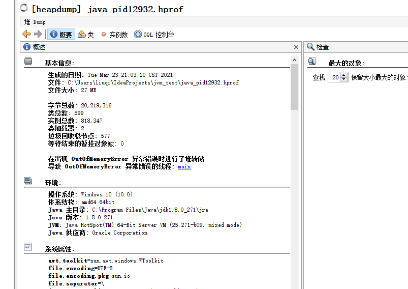
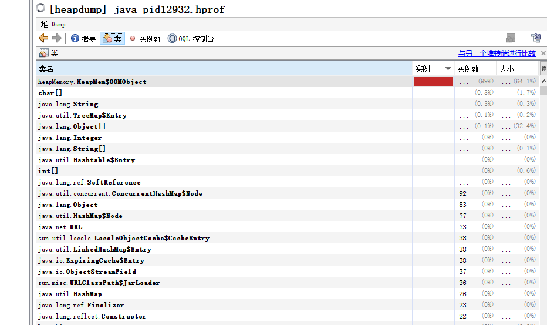

# 创建对象的方法

- 通过new关键字创建对象
- Class的`newInstance`方法，利用反射方式创建对象，只能调用类的public无参构造方法。
- Constructor的`newInstance`方法，利用反射方式创建对象，可以调用任意构造方法。
- clone方法，需要类实现Cloneable接口，不调用任何构造器。
- 反序列化，需要类实现Serializable接口。

# 创建对象的步骤

当一个对象被创建时，虚拟机就会为其分配内存来存放对象自己的实例变量及其从父类继承过来的实例变量(即使这些从超类继承过来的实例变量有可能被隐藏也会被分配空间)。在为这些实例变量分配内存的同时，这些实例变量也会被赋予默认值(零值)。在内存分配完成之后，Java虚拟机就会开始对新创建的对象按照程序员的配置进行初始化。

**一、检查对象所属类是否被加载过**

JVM执行到一条new指令，首先判断指令的参数能否在元空间定位到一个类的符号引用，并检查这个符号引用对应的类是否已经被加载、链接和初始化（即判断类的元信息是否存在）。如果没有，则加载该类，并生成对应的Class类对象。

**二、为对象分配内存**

计算对象占用空间大小，然后给它分配内存。

① 如果内存工整，使用指针碰撞算法分配内存：即指针一侧是占用的空间，一侧是空闲空间，分配内存时移动指针即可。

②内存不规整时，使用空闲列表方式分配。JVM维护一张表存储空闲内存块，找到一块足够大的空间分配给对象，更新列表。

取决于采用的垃圾收集器是否带有压缩整理的功能。

**三、解决并发安全问题**

1. Compare and swap：失败重试，区域枷锁，保证指针更新操作的原子性。
2. TLAB，划分线程专用堆内存。

**四、初始化实例变量**

给对象的实例变量赋零值。

**五、设置对象的对象头**

将对象的所属类（即类的元数据信息）、对象的`HashCode`和对象的GC信息、锁信息等数据存储在对象的对象头中。这个过程的具体设置方式取决于JVM实现。

**六、执行`init`方法**

# 对象的内存布局

在`HotSpot`虚拟机中，对象在堆内存中的存储布局可以划分为三个部分：Header、`InstanceData`和Padding（对齐填充）。

对象头Header部分包括：

- 运行时元数据
  - 哈希值（ `HashCode` ）
  - GC分代年龄
  - 锁状态标志
  - 线程持有的锁
  - 偏向线程ID
  - 偏向时间戳
- 类型指针：确定该对象所属的类型
- 说明：如果是数组，还需记录数组的长度

`InstanceData`部分对象中从父类继承来的数据和对象中的数据。

# 对象的访问定位

对象访问方式是由虚拟机决定的，主流的访问方式有句柄和直接指针两种：

1 句柄

使用句柄的方式访问对象时，Java堆中将划分出一块内存来作为句柄池，栈中的引用存储的是对象的句柄地址，而句柄中包含了对象实例数据和类型数据各自具体的地址信息。


2 直接指针访问

使用直接指针访问时，引用中存储的是对象在堆中的地址，但是需要在对象中存储其类型数据的地址。


这两种方式各有优点，使用句柄的好处是：对象移动后不需要改变reference，只需改变句柄中的实例数据指针。使用直接指针的好处是访问速度更快，因为节省了一次指针定位的开销，HotSpot是使用的第二种方式。

# Java堆溢出

模拟堆溢出，将JVM的堆内存初始值和最大值均设置为20MB。

```java
package heapMemory;

import java.util.ArrayList;
import java.util.List;

/**
 * VM参数：-Xms20m -Xmx20m -XX:+HeapDumpOnOutOfMemoryError
 */

public class HeapMem {
    static class OOMObject {

    }
    public static void main(String[] args) {
        List<OOMObject> list = new ArrayList<>();
        while(true) {
            list.add(new OOMObject());
        }
    }
}
```

控制台：

```sh
java.lang.OutOfMemoryError: Java heap space
Dumping heap to java_pid12932.hprof ...
Heap dump file created [28299620 bytes in 0.070 secs]
Exception in thread "main" java.lang.OutOfMemoryError: Java heap space
	at java.util.Arrays.copyOf(Arrays.java:3210)
	at java.util.Arrays.copyOf(Arrays.java:3181)
	at java.util.ArrayList.grow(ArrayList.java:267)
	at java.util.ArrayList.ensureExplicitCapacity(ArrayList.java:241)
	at java.util.ArrayList.ensureCapacityInternal(ArrayList.java:233)
	at java.util.ArrayList.add(ArrayList.java:464)
	at heapMemory.HeapMem.main(HeapMem.java:13)

Process finished with exit code 1
```

利用Java自带的JVisualVM可以查看fprof文件。





# 虚拟机栈和本地方法栈溢出

`HotSpot`虚拟机中不区分本地方法栈和虚拟机栈，因此`-Xoss`参数（设置本地方法栈大小）没有作用。栈容量只由`-Xss`参数指定。

虚拟机栈和本地方法栈中存在两种异常：

- 线程请求的栈深度大于虚拟机所允许的深度，将抛出`StackOverflowError`
- 虚拟机栈动态扩展时无法申请到足够的内存，将抛出`OutOfMemoryError`

《Java虚拟机规范》允许Java虚拟机自行选择是否支持栈的动态扩展，而`HotSpot`虚拟机不支持扩展。因此线程运行前无法申请到足够内存时会出现`OutOfMemoryError`，线程运行时只会因为栈容量无法容纳新的栈帧而出现`StackOverflowError`。

1 测试`StackOverflowError`

使用`-Xss`参数限制栈内存容量

```java
package vmstack;

public class OverflowError {
    /**
     * -Xss128k
     */
    public int stacklength = 1;
    private void go() {
        stacklength++;
        go();
    }
    public static void main(String[] args) {
        OverflowError overflowError = new OverflowError();
        try {
            overflowError.go();
        }catch (Throwable e) {
            System.out.println("stack length" + overflowError.stacklength);
            throw e;
        }
    }
}
```


```shell
stack length992
Exception in thread "main" java.lang.StackOverflowError
	at vmstack.OverflowError.go(OverflowError.java:9)
	at vmstack.OverflowError.go(OverflowError.java:10)
	at vmstack.OverflowError.go(OverflowError.java:10)
	at vmstack.OverflowError.go(OverflowError.java:10)
	at vmstack.OverflowError.go(OverflowError.java:10)
	at vmstack.OverflowError.go(OverflowError.java:10)
```

当栈帧过大时，在不允许动态扩展栈容量的虚拟机上同样会引发`StackOverflowError`。但是，在允许动态扩展栈容量的虚拟机上，栈帧过大引起的是`OutOfMemoryError`。

在`HotSpot`虚拟机不断创建新的线程时，同样会引发`OutOfMemoryError`。出现这种情况时，可以通过较少最大堆和减少栈容量来限制单个线程占用的空间大小，从而提高可创建的线程数。

# 方法区和运行时常量池溢出

`String::intern()`是一个本地方法，作用是：

判断字符串常量是否存在于常量池
        如果存在
       判断存在内容是引用还是常量
            如果是引用
                 返回引用地址指向堆空间对象
            如果是常量，
                 直接返回常量池常量
  如果不存在
       将当前对象引用复制到常量池，并且返回当前对象的引用

在JDK6之前，常量池都在永生代中，可以通过-XX:PermSize和-XX:MaxPermSize来限制永生代的大小，然后间接限制常量池的容量。

但是JDK7之后，运行时常量池被移动到了堆之中。

```java
public class intern {
    public static void main(String[] args) {
        String str1 = new StringBuilder("计算机").append("软件").toString();
        //true
        System.out.println(str1.intern() == str1);
        String str2 = new StringBuilder("ja").append("r").toString();
        //false
        System.out.println(str2.intern() == str2);
    }
}
```

由于字符串在堆中存储，`str1.intern()`返回str1的地址。

常量池中，有默认字符串常量这样的机制。JVM从启动，到执行main里面的第一条代码，在加载类的过程中，常量池会存入一系列常量，这些常量中包含了"jar"这样的字符串。

**创建字符串分析：**

1 直接使用双引号创建字符串

判断这个常量是否存在于常量池
  如果存在
       判断这个常量是堆中对象的引用还是常量
            如果是引用，返回引用地址指向的堆空间对象，
            如果是常量，则直接返回常量池常量，
  如果不存在
            在常量池中创建该常量，并返回此常量

2 使用new String创建字符串

在堆上创建对象(无论堆上是否存在相同字面量的对象)
判断常量池中是否存在该字符串
  如果不存在
       在常量池上创建常量
  如果存在
       不做任何操作

JDK8以后，元空间替换了永生代。

- `-XX:MaxMetaspaceSize`：设置元空间最大值，默认为不限制
- `-XX:MetaspaceSize`：设置元空间初始大小
- `-XX:MinMetaspaceFreeRatio`：在垃圾收集之后控制最小的元空间剩余容量的百分比

