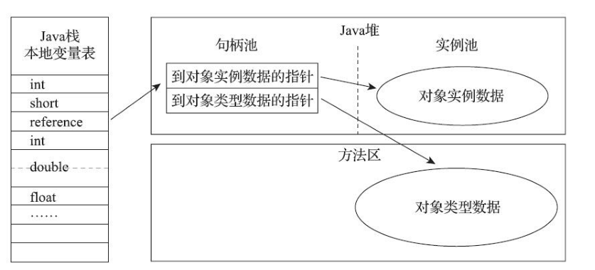
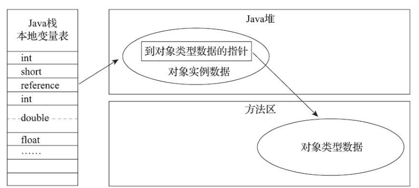

# 对象的内存分配

选择哪种分配方式由Java堆是否规整决定，而Java堆是否规整又由所采用的**垃圾收集器是否带有压缩整理功能**决定。

一般的垃圾回收期都带有压缩整理功能使用指针碰撞方式简单又高效，但是**CMS不带压缩整理功能**，所以CMS理论上只能使用空闲列表。

## 指针碰撞


如果Java堆中内存是绝对规整的，所有用过的内存都放在一边，空闲的内存放在另一边，中间放着一个**指针**作为分界点的指示器，那所分配内存就仅仅是把那个指针向空闲空间那边挪动一段与对象大小相等的距离，这种分配方式称为“**指针碰撞**”。

## 空闲列表


前提是堆内存空间中已被使用与未被使用的空间是交织在一起的， 这时，虚拟机就需要**通过一个列表来记录**哪些空间是可以使用的，哪些空间是已被使用的，接下来找出可以容纳下新创建对象的且未被使用的空间，在此空间存放该对象，同时还要修改列表上的记录

## 内存分配的并发安全

除如何划分可用空间之外，还有另外一个需要考虑的问题是对象创建在虚拟机中是非常频繁的行为，即使是仅仅修改一个指针所指向的位置，在并发情况下也并不是线程安全的，可能出现正在给对象 A 分配内存，指针还没来得及修改，对象 B 又同时使用了原来的指针来分配内存的情况。

解决这个问题有两种方案

### CAS 机制

一种是对分配内存空间的动作进行同步处理——实际上虚拟机采用 CAS 配上失败重试的方式保证更新操作的原子性；

CAS失败再来一次的时候要再去读取一遍old值。(实际上发现该位置有值了就不会再在该位置分配了，会去下一个空闲空间分配。)


### 线程分配缓冲


另一种是把内存分配的动作按照线程划分在不同的空间之中进行，即每个线程在 Java 堆中预先分配一小块私有内存，也就是**本地线程分配缓冲（Thread Local Allocation Buffer,TLAB）**，JVM 在线程初始化时，同时也会申请一块指定大小的内存，只给当前线程使用，这样每个线程都单独拥有一个 Buffer，如果需要分配内存，就在自己的 Buffer 上分配，这样就不存在竞争的情况，可以大大提升分配效率，**当** **Buffer** **容量不够的时候，再重新从** **Eden 区域申请一块继续使用**。

TLAB 的目的是在为新对象分配内存空间时，让每个 Java 应用线程能在使用自己专属的分配指针来分配空间，减少同步开销。

分配缓冲受制于内存大小，一般情况下一个TLAB为**Eden区的1%**，如果需要分配的内存大于TLAB的大小，就不会采用分配缓冲，而是采用CAS机制。

TLAB 只是让每个线程有私有的分配指针，但底下存对象的内存空间还是给所有线程访问的，只是其它线程无法在这个区域分配而已。当一个 TLAB 用满（分配指针 top 撞上分配极限 end 了），就新申请一个 TLAB。

参数：`-XX:+UseTLAB`，允许在年轻代空间中使用线程本地分配块（TLAB）。


# 创建对象的方法

- 通过new关键字创建对象
- Class的`newInstance`方法，利用反射方式创建对象，只能调用类的public无参构造方法。
- Constructor的`newInstance`方法，利用反射方式创建对象，可以调用任意构造方法。
- clone方法，需要类实现Cloneable接口，不调用任何构造器。
- 反序列化，需要类实现Serializable接口。

# 创建对象的步骤

当一个对象被创建时，虚拟机就会为其分配内存来存放对象自己的实例变量及其从父类继承过来的实例变量(即使这些从超类继承过来的实例变量有可能被隐藏也会被分配空间)。在为这些实例变量分配内存的同时，这些实例变量也会被赋予默认值(零值)。在内存分配完成之后，Java虚拟机就会开始对新创建的对象按照程序员的配置进行初始化。

**一、检查对象所属类是否被加载过**

JVM执行到一条new指令，首先判断指令的参数能否在元空间定位到一个类的符号引用，并检查这个符号引用对应的类是否已经被加载、链接和初始化（即判断类的元信息是否存在）。如果没有，则加载该类，并生成对应的Class类对象。

**二、为对象分配内存**

计算对象占用空间大小，然后给它分配内存。

① 如果内存工整，使用指针碰撞算法分配内存：即指针一侧是占用的空间，一侧是空闲空间，分配内存时移动指针即可。

②内存不规整时，使用空闲列表方式分配。JVM维护一张表存储空闲内存块，找到一块足够大的空间分配给对象，更新列表。

取决于采用的垃圾收集器是否带有压缩整理的功能。

**三、解决并发安全问题**

1. Compare and swap：失败重试，区域加锁，保证指针更新操作的原子性。
2. TLAB，划分线程专用堆内存。

**四、初始化实例变量**

给对象的实例变量赋零值。

**五、设置对象的对象头**

将对象的所属类（即类的元数据信息）、对象的`HashCode`和对象的GC信息、锁信息等数据存储在对象的对象头中。这个过程的具体设置方式取决于JVM实现。

**六、执行`init`方法**

# 对象的分配策略

**1、对象优先在Eden分配** 

大多数情况下，对象在新生代 Eden 区中分配。当 Eden 区没有足够空间分配时，虚拟机将发起一次 Minor GC。

2、空间分配担保

在发生 Minor GC 之前，虚拟机会先检查**老年代最大可用的连续空间是否大于新生代所有对象总空间**，如果这个条件成立，那么可以确保这一次Minor GC是安全的。如果不成立，则虚拟机会查看 `HandlePromotionFailure` 设置值是否允许担保失败。如果允许，那么会继续检查老年代最大可用的连续空间是否大于**历次晋升到老年代对象的平均大小**，如果大于，将尝试着进行一次 Minor GC，尽管这次 Minor GC 是有风险的，**如果担保失败则会进行一次 Full GC**；如果小于，或者 `HandlePromotionFailure` 设置不允许冒险，那这时也要改为进行一次 Full GC。

survivor 区比较小，当无法容纳所有存活对象时，需要把多余的对象存储到老年代。

3、大对象直接进入老年代 

大对象就是指需要大量连续内存空间的 Java 对象，最典型的大对象便是那种很长的字符串，或者元素数量很庞大的数组。

大对象对虚拟机的内存分配来说就是一个不折不扣的坏消息，比遇到一个大对象更加坏的消息就是遇到一群“朝生夕灭”的“短命大对象”，我们写程序的时候应注意避免。

在 Java 虚拟机中要避免大对象的原因是，在分配空间时，它容易导致内存明明还有不少空间时就提前触发垃圾收集，以获取足够的连续空间才能安置好它们。而当复制对象时，**大对象就意味着高额的内存复制开销**。

`HotSpot` 虚拟机提供了`-XX:PretenureSizeThreshold` 参数，指定大于该设置值的对象直接在老年代分配，这样做的目的就是避免在 Eden 区及两个 Survivor区之间来回复制，产生大量的内存复制操作。

这样做的目的：

1.避免大量内存复制,

2.避免提前进行垃圾回收，明明内存有空间进行分配。

`PretenureSizeThreshold` 参数只对 `Serial` 和 `ParNew` 两款收集器有效。

4、长期存活的对象进入老年代 

`HotSpot` 虚拟机中多数收集器都采用了分代收集来管理堆内存，那内存回收时就必须能决策哪些存活对象应当放在新生代，哪些存活对象放在老年代中。为做到这点，虚拟机给每个对象定义了一个对象年龄(Age)计数器，存储在对象头中。

如果对象在 Eden 出生并经过第一次 Minor GC 后仍然存活，并且能被 Survivor 容纳的话，将被移动到 Survivor 空间中，并将对象年龄设为 1，对象在 Survivor区中每熬过一次 Minor GC，年龄就增加 1，当它的年龄增加到一定程度(并发的垃圾回收器**默认为 15**),**CMS 是 6** 时，就会被晋升到老年代中。

`-XX:MaxTenuringThreshold` 调整

5、动态对象年龄判定 

为了能更好地适应不同程序的内存状况，虚拟机并不是永远地要求对象的年龄必须达到了 `MaxTenuringThreshold` 才能晋升老年代，如果在 Survivor 空间中相同年龄所有对象大小的总和大于 Survivor空间(From或者To)的一半，年龄大于或等于该年龄的对象就可以直接进入老年代，无须等到 `MaxTenuringThreshold` 中要求的年龄

# 对象的内存布局

在`HotSpot`虚拟机中，对象在堆内存中的存储布局可以划分为三个部分：Header、`InstanceData`和Padding（对齐填充）。

对象头Header部分包括：

- 运行时元数据
  - 哈希值（ `HashCode` ）
  - GC分代年龄
  - 锁状态标志
  - 线程持有的锁
  - 偏向线程ID
  - 偏向时间戳
- 类型指针：指向该对象所属的类的元数据
- 说明：如果是数组，还需记录数组的长度

`InstanceData`：部分对象中从父类继承来的数据和对象中的数据。

> Java的对象头在无锁、偏向锁和重量锁时有不同的格式，所以Java中的加锁其实是改变对象的对象头的状态

# 对象的访问定位

对象访问方式是由虚拟机决定的，主流的访问方式有句柄和直接指针两种：

## 句柄

使用句柄的方式访问对象时，Java堆中将划分出一块内存来作为句柄池，栈中的引用存储的是对象的句柄地址，而句柄中包含了对象实例数据和类型数据各自具体的地址信息。



## 直接指针访问

使用直接指针访问时，引用中存储的是对象在堆中的地址，但是需要在对象中存储其类型数据的地址。



这两种方式各有优点，使用句柄的好处是：对象移动后不需要改变reference，只需改变句柄中的实例数据指针。使用直接指针的好处是访问速度更快，因为节省了一次指针定位的开销，`HotSpot`是使用的第二种方式。

# 对象的引用类型

JDK1.2后，Java对引用的概念进行了扩充，将引用分为强引用(Strong Reference)、软引用(Soft Reference)、弱引用(Weak Reference)和虚引用(Phantom Reference)。


## 强引用

传统的引用，例如`Object obj = new Object()`，任何情况下，只要强引用关系存在，GC就不会回收被引用的对象。

## 软引用

一些有用但非必须的对象。系统在将要发生内存溢出异常时会将这些对象列进回收范围进行第二次回收。

```java
/**
 * 软引用
 * -Xms20m -Xmx20m
 */
public class TestSoftRef {
	//对象
	public static class User{
		public int id = 0;
		public String name = "";
		public User(int id, String name) {
			super();
			this.id = id;
			this.name = name;
		}
		@Override
		public String toString() {
			return "User [id=" + id + ", name=" + name + "]";
		}
	}
	//
	public static void main(String[] args) {
		User u = new User(1,"King"); //new是强引用
		SoftReference<User> userSoft = new SoftReference<User>(u);//软引用
		u = null;//干掉强引用，确保这个实例只有userSoft的软引用
		System.out.println(userSoft.get()); //看一下这个对象是否还在
		System.gc();//进行一次GC垃圾回收  千万不要写在业务代码中。
		System.out.println("After gc");
		System.out.println(userSoft.get());
		//往堆中填充数据，导致OOM
		List<byte[]> list = new LinkedList<>();
		try {
			for(int i=0;i<100;i++) {
				//System.out.println("*************"+userSoft.get());
				list.add(new byte[1024*1024*1]); //1M的对象 100m
			}
		} catch (Throwable e) {
			//抛出了OOM异常时打印软引用对象
			System.out.println("Exception*************"+userSoft.get());
		}

	}
}
```


## 弱引用

一些非必须的对象。当GC开始工作时，无论当前内存是否足够，都会回收掉只被弱引用关联的对象。

```java
/**
 * 弱引用
 */
public class TestWeakRef {
	public static class User{
		public int id = 0;
		public String name = "";
		public User(int id, String name) {
			super();
			this.id = id;
			this.name = name;
		}
		@Override
		public String toString() {
			return "User [id=" + id + ", name=" + name + "]";
		}
	}
	public static void main(String[] args) {
		User u = new User(1,"King");
		WeakReference<User> userWeak = new WeakReference<User>(u);
		u = null;//干掉强引用，确保这个实例只有userWeak的弱引用
		System.out.println(userWeak.get());
		System.gc();//进行一次GC垃圾回收,千万不要写在业务代码中。
		System.out.println("After gc");
		System.out.println(userWeak.get());
	}
}
```


## 虚引用

一个对象是否有虚引用的存在，完全不会对其生存时间产生影响，也无法通过虚引用取得一个对象实例，虚引用的作用是在对象被回收后收到一个系统通知。

