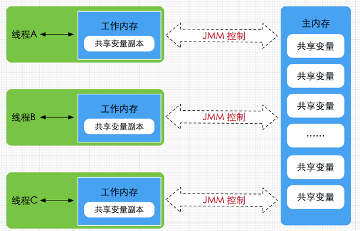
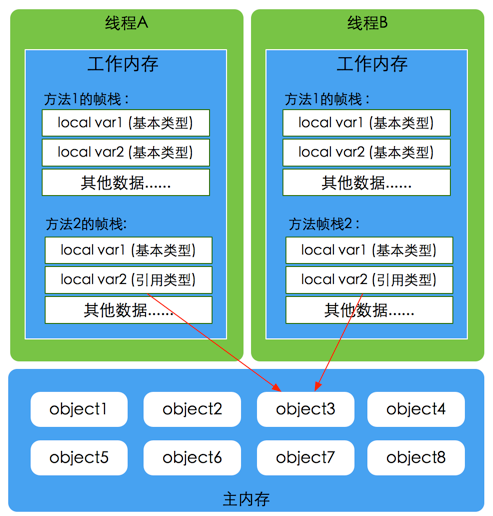
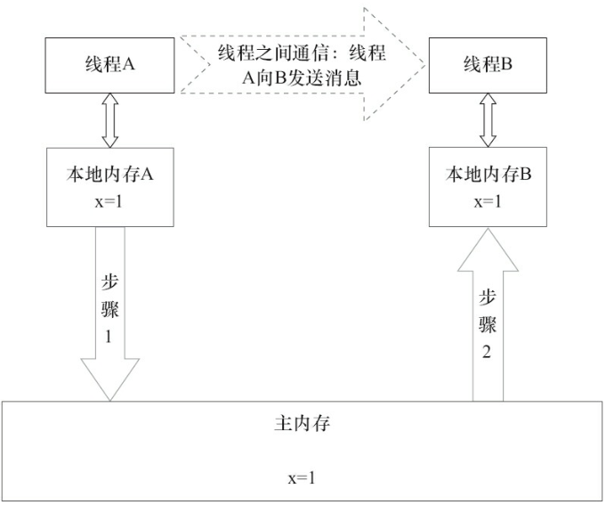
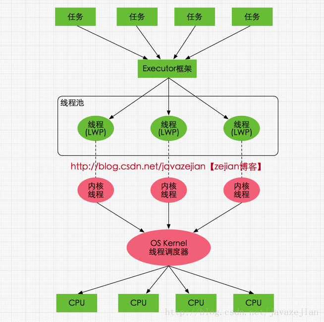

# overview

Java内存模型(即Java Memory Model，简称JMM)本身是一种抽象的概念，并不真实存在，它描述的是一组规则或规范，通过这组规范定义了程序中各个变量（包括实例字段，静态字段和构成数组对象的元素）的访问方式。

JVM运行程序的实体是线程，每个线程创建时JVM都会为其创建一个工作内存(有些地方称为栈空间)，用于存储线程私有的数据。




主内存

主要存储的是Java实例对象，所有线程创建的实例对象都存放在主内存中，不管该实例对象是成员变量还是方法中的局部变量，当然也包括了共享的类信息、常量、静态变量。由于是共享数据区域，多条线程对同一个变量进行访问可能会发现线程安全问题。

工作内存

主要存储当前方法的所有本地变量信息(工作内存中存储着主内存中的变量副本拷贝)，每个线程只能访问自己的工作内存，即线程中的本地变量对其它线程是不可见的，就算是两个线程执行的是同一段代码，它们也会各自在自己的工作内存中创建属于当前线程的本地变量，当然也包括了字节码行号指示器、相关Native方法的信息。注意由于工作内存是每个线程的私有数据，线程间无法相互访问工作内存，因此存储在工作内存的数据不存在线程安全问题。

根据虚拟机规范，对于一个实例对象中的成员方法而言，如果方法中包含本地变量是基本数据类型（`boolean`,byte,short,char,`int`,long,float,double），将直接存储在工作内存的帧栈结构中，但倘若本地变量是引用类型，那么该变量的引用会存储在功能内存的帧栈中，而对象实例将存储在主内存(共享数据区域，堆)中。但对于实例对象的成员变量，不管它是基本数据类型或者包装类型(Integer、Double等)还是引用类型，都会被存储到堆区。static变量以及类本身相关信息将会存储在主内存中。需要注意的是，在主内存中的实例对象可以被多线程共享，倘若两个线程同时调用了同一个对象的同一个方法，那么两条线程会将要操作的数据拷贝一份到自己的工作内存中，执行完成操作后才刷新到主内存，简单示意图如下所示：



**注意**：对象存储在堆区由线程共享，但是某个线程需要对对象中的某个数据进行修改时，例如：

```
Obj ojb = new Obj();
obj.age = 15;
```

age成员变量首先被拷贝到工作内存，修改后再flush到主内存中。


# 线程通信

线程A和B需要进行通信时，需要以下的步骤：

1. A把本地内存中更新过的共享变量刷新到主内存
2. B在主内存中读取A刷新过的共享变量



# 重排序

在执行程序时，为了提高性能，编译器和处理器常常会对指令做重排序。


## 重排序的类型

1）编译器优化的重排序。编译器在不改变单线程程序语义的前提下，可以重新安排语句的执行顺序。

2）指令级并行的重排序。现代处理器采用了指令级并行技术（Instruction-LevelParallelism，ILP）来将多条指令重叠执行。如果不存在数据依赖性，处理器可以改变语句对应机器指令的执行顺序。

3）内存系统的重排序。由于处理器使用缓存和读/写缓冲区，这使得加载和存储操作看上去可能是在乱序执行。

Java编译器在生成指令序列的适当位置会插入内存屏障指令来禁止特定类型的处理器重排序，从而让程序按我们预想的流程去执行。
 1、保证特定操作的执行顺序。
 2、影响某些数据（或则是某条指令的执行结果）的内存可见性。

## as-if-serial语义

as-if-serial语义的意思指：不管怎么重排序（编译器和处理器为了提高并行度），（单线程）程序的执行结果不能被改变。编译器，runtime 和处理器都必须遵守as-if-serial语义。

as-if-serial语义把单线程程序保护了起来，遵守as-if-serial语义的编译器，runtime 和处理器共同为编写单线程程序的程序员创建了一个幻觉：单线程程序是按程序的顺序来执行的。as-if-serial语义使单线程程序员无需担心重排序会干扰他们，也无需担心内存可见性问题。

## 内存屏障的类型

<div class="table-box"><table width="600px" border="1"><tbody><tr><td>屏障类型</td><td>指令示例</td><td>说明</td></tr><tr><td>LoadLoad Barriers</td><td>Load1; LoadLoad; Load2</td><td>确保Load1数据的装载，之前于Load2及所有后续装载指令的装载。</td></tr><tr><td>StoreStore Barriers</td><td>Store1; StoreStore; Store2</td><td>确保Store1数据对其他处理器可见（刷新到内存），之前于Store2及所有后续存储指令的存储。</td></tr><tr><td>LoadStore Barriers</td><td>Load1; LoadStore; Store2</td><td>确保Load1数据装载，之前于Store2及所有后续的存储指令刷新到内存。</td></tr><tr><td>StoreLoad Barriers</td><td>Store1; StoreLoad; Load2</td><td>确保Store1数据对其他处理器变得可见（指刷新到内存），之前于Load2及所有后续装载指令的装载。StoreLoad Barriers会使该屏障之前的所有内存访问指令（存储和装载指令）完成之后，才执行该屏障之后的内存访问指令。</td></tr></tbody></table></div>

`StoreLoad Barriers`是一个“全能型”的屏障，它同时具有其他三个屏障的效果。现代的多处理器大都支持该屏障（其他类型的屏障不一定被所有处理器支持）。执行该屏障开销会很昂贵，因为当前处理器通常要把写缓冲区中的数据全部刷新到内存中（buffer fully flush）。

## 数据依赖性

如果两个操作访问同一个变量，且这两个操作中有一个为写操作，此时这两个操作之间就存在数据依赖性。数据依赖分下列三种类型：

| 名称   | 代码示例      | 说明                           |
| ------ | ------------- | ------------------------------ |
| 写后读 | a = 1; b = a; | 写一个变量之后，再读这个位置。 |
| 写后写 | a = 1;a = 2;  | 写一个变量之后，再写这个变量。 |
| 读后写 | a = b;b = 1;  | 读一个变量之后，再写这个变量。 |

# happens-before

Java内存模型中定义的两项操作之间的次序关系，如果说操作A先行发生于操作B，操作A产生的影响能被操作B观察到，“影响”包含了修改了内存中共享变量的值、发送了消息、调用了方法等。

下面是Java内存模型下一些”天然的“happens-before关系，这些happens-before关系无须任何同步器协助就已经存在，可以在编码中直接使用。如果两个操作之间的关系不在此列，并且无法从下列规则推导出来的话，它们就没有顺序性保障，虚拟机可以对它们进行随意地重排序。

a.程序次序规则(Pragram Order Rule)：在一个线程内，按照程序代码顺序，书写在前面的操作先行发生于书写在后面的操作。准确地说应该是控制流顺序而不是程序代码顺序，因为要考虑分支、循环结构。

b.管程锁定规则(Monitor Lock Rule)：一个unlock操作先行发生于后面对同一个锁的lock操作。这里必须强调的是同一个锁，而”后面“是指时间上的先后顺序。

c.volatile变量规则(Volatile Variable Rule)：对一个volatile变量的写操作先行发生于后面对这个变量的读取操作，这里的”后面“同样指时间上的先后顺序。

d.线程启动规则(Thread Start Rule)：Thread对象的start()方法先行发生于此线程的每一个动作。

e.线程终于规则(Thread Termination Rule)：线程中的所有操作都先行发生于对此线程的终止检测，我们可以通过Thread.join()方法结束，Thread.isAlive()的返回值等作段检测到线程已经终止执行。

f.线程中断规则(Thread Interruption Rule)：对线程interrupt()方法的调用先行发生于被中断线程的代码检测到中断事件的发生，可以通过Thread.interrupted()方法检测是否有中断发生。

g.对象终结规则(Finalizer Rule)：一个对象初始化完成(构造方法执行完成)先行发生于它的finalize()方法的开始。

g.传递性(Transitivity)：如果操作A先行发生于操作B，操作B先行发生于操作C，那就可以得出操作A先行发生于操作C的结论。

**happens-before仅仅保证前一个操作的结果对后一个操作可见，不要求前一个操作的指令一定先于后一个指令执行（通过禁用特定类型的重排序来保证）。**

# volatile的内存语义

demo：

```java
class VolatileExample {
    int a = 0;
    volatile boolean flag = false;
    public void writer() {
        a = 1;			//1
        flag = true;	//2
    }
    public void reader() {
        if(flag) {		//3
            int i = a;	//4
            ...
        }
    }
}
```

1. 按照程序次序规则，单个线程中1 happens-before 2; 3 happens-before 4
2. 按照volatile规则，2 happens-before 3
3. 按照传递性规则，1 happens - before 4, 1 happens-before 3

读一个volatile变量时：JMM将该线程对应的本地内存置为无效，强制从主存中读取。

写一个volatile变量时：JMM将本地内存的共享变量强制刷新回主存。

# 锁的内存语义

当线程释放锁时，JMM会把该线程对应的本地内存中的共享变量刷新到主内存中。

当线程获取锁时，JMM会把该线程对应的本地内存置为无效。从而使得被监视器保护的临界区代码必须从主内存中读取共享变量。

#  final的内存语义

编译器和处理器要遵守两个重排序规则：

- 在构造函数内对一个final域的写入，与随后把这个被构造对象的引用赋值给一个引用变量，这两个操作之间不能重排序。
- 初次读一个包含final域的对象的引用，与随后初次读这个final域，这两个操作之间不能重排序。

final域为引用类型：

- 增加了如下规则：在构造函数内对一个final引用的对象的成员域的写入，与随后在构造函数外把这个被构造对象的引用赋值给一个引用变量，这两个操作之间不能重排序。

final语义在处理器中的实现：

- 会要求编译器在final域的写之后，构造函数return之前插入一个`StoreStore`屏障
- 读final域的重排序规则要求编译器在读final域的操作前面插入一个`LoadLoad`屏障
- 

# 线程与CPU

Java线程执行时会调用系统内核的线程模型，由OS Kernel调度到不同的CPU执行。

