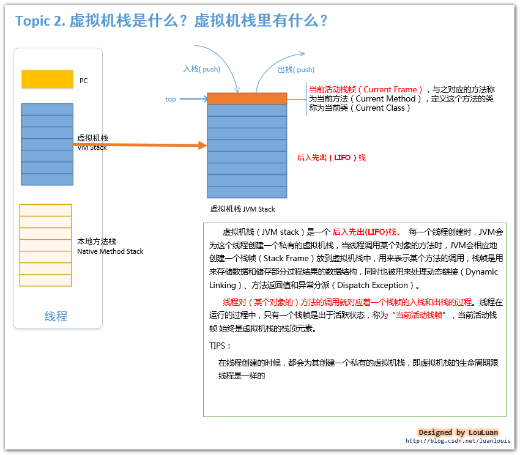
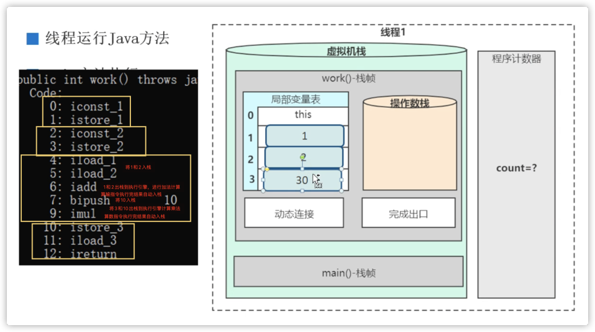

# Java 内存结构

Java虚拟机在执行Java程序的过程中会把它所管理的内存划分为若干个不同的数据区域，这些区域有其各自的用途，以及创建销毁的时间，其中有些会一直存在，即随着虚拟机的启动而创建、随着虚拟机的退出而销毁；另外一些则是与虚拟机中的单个线程一一对应，这些与线程相对应的数据区域会随着线程的开始而创建、随着线程的结束即销毁。


PC的内存区域是在Java虚拟机规范中唯一一个没有规定任何`OutOfMemoryError`情况的区域。

>native方法多由C和C++语言实现，譬如`java.lang.Object`类中的`hashCode()`方法就是native方法，其底层是通过C++实现的。

# 线程私有区域

## 虚拟机栈

由于跨平台性的设计，java的指令都是根据栈来设计的。不同平台CPU架构不同，所以不能设计为基于寄存器的。
**优点是跨平台，指令集小，编译器容易实现，缺点是性能下降，实现同样的功能需要更多的指令。**

虚拟机栈的访问速度仅次于PC。

大小限制： **–Xss 默认1M(Linux 64位)**



### 栈帧




**栈帧之间数据共享**

在一般的模型中，两个不同的栈帧的内存区域是独立的，但是大部分的 JVM 在实现中会进行一些优化，使得两个栈帧出现一部分重叠。（主要体现在方 法中有参数传递的情况），让下面栈帧的操作数栈和上面栈帧的部分局部变量重叠在一起，这样做不但节约了一部分空间，更加重要的是在进行方法调

用时就可以直接公用一部分数据，无需进行额外的参数复制传递了。

如果两个方法的调用之间传递了参数，比如A方法调用B方法并传递了参数10，则10在**A方法的操作数栈**中，也应该在**B方法的局部变量表**中，JVM对此进行了优化，对这一部分进行了共享。


### 局部变量表

虚拟机栈中的局部变量表部分存放了编译期已知的各种基本数据类型(`boolean, byte, int float, double……`)和对象引用（reference类型）。

long和double类型的数据会占用两个局部变量空间（slot），其余的数据类型只占用一个。局部变量表所需的空间在编译期间完成分配，当进入一个方法时，这个方法需要在栈中分配多大的局部变量空间是完全确定的，在运行期间局部变量表的大小不会改变（根据代码段的作用域，局部变量表的 slot 可以进行复用）。单个slot的具体大小（占用比特数）由虚拟机在实现时自行规定。

每个方法都有 this 引用作为一个局部变量，占用一个 slot。

### ==动态链接==

每一个栈帧内部都包含一个指向运行时常量池或该栈帧所属方法的引用，包含这个引用的目的就是为了支持当前方法的代码能够实现动态链接，如`invokedynamic`指令（支撑java的lambda表达式）。

静态链接：当JVM加载一个类的class文件时，如果一个方法在编译期可知，且运行期保持不变，则在类加载过程的解析阶段将方法的符号引用转换为内存中的直接索引。

动态链接：如果某个方法在编译期无法被确定下来，只能在程序运行期间将符号引用转换为实际地址，则称这种转换动作为动态链接。

静态链接和动态链接也被称为early binding和late binding。

Java中的非虚方法包括final方法，私有方法，静态方法，实例构造器及父类方法，其他方法均为虚方法，即仅在运行期间才能确定调用的实际方法。

**动态语言和静态语言的区别：**

- 动态语言和静态语言的区别在于其对类型的检查是在编译期还是在运行期，满足前者就是静态类型语言，反之则是动态类型语言。
- 直白来说 **静态语言是判断变量自身的类型信息；动态语言是判断变量值的类型信息，变量没有类型信息，变量值才有类型信息**，这是动态语言的一个重要特征。
- Java是静态类型语言（尽管lambda表达式为其增加了动态特性），java script，python是动态语言。


两种异常：

- 线程请求的栈深度大于虚拟机所允许的深度，将抛出`StackOverflowError`
- 虚拟机栈动态扩展时无法申请到足够的内存，将抛出`OutOfMemoryError`

可以使用`-Xss`选项设置线程的最大栈空间，例如`-Xss128k`。

## 本地方法栈

本地方法栈和虚拟机栈发挥的作用非常相似，只不过执行的是本地方法而不是Java方法。甚至有的JVM虚拟机直接把本地方法栈和虚拟机栈合二为一。

# 线程公有区域

## 堆

The heap is the runtime data area from which memory for all class instances and arrays is allocated.

也被称为GC堆(Garbage Collected Heap)。

1. Java堆被所有线程共享，是Java虚拟机所管理的内存中最大的一块，Java堆在虚拟机启动时创建。
2. Java堆唯一的目的是存放对象实例，几乎所有的对象实例和数组都在这里。

Java堆可以处于物理上不连续的内存空间中，但在逻辑上它应该是连续的。

**可通过参数 `-Xms 初始堆大小`和`-Xmx 最大堆大小`**设置堆的大小。

在JDK7之前，`HotSpot`虚拟机将堆划分成了：

- Young Generation Space：新生代，又被分为Eden区和Survivor区，Young/New。两个Survivor区又叫from和to，在进行垃圾回收时，会将Eden和Survivor1的存活对象全部复制到另一个Survivor2，然后将Eden和Survivor1清空，下次回收时两个Survivor身份转换，这样做的好处是可以在不移动对象的前提下解决内存碎片问题。

- Tenure generation Space：老生代，Old/Tenure。

- Permanent Space：永久代，Perm。


JDK8之后，永久代被元数据取代。

配置新生代与老年代在堆结构的占比：

- 默认`-XX：NewRatio=2`，表示新生代占1，老年代占2，新生代占整个堆的1/3。
- 可以修改`-XX:NewRatio=4`，表示新生代占1，老年代占4，新生代占整个堆的1/5。

对象分配过程：

- 新建的对象先放在Eden区。
- 当Eden区的空间不足时，垃圾回收器将对Eden区进行垃圾回收（Minor GC)，将Eden区和from区的存活对象复制到to区，并清空Eden和from；
- 再次触发垃圾回收时，form和to交换，将新的from和Eden的存活对象移动到to，清空Eden和from。
- 某对象经历15次垃圾回收后会移动到老生代。可以设置参数：`-XX:MaxTenuringThreshold`指定默认次数。
- 老生代内存不足时，触发Major GC，进行老生代的垃圾回收。
- 若养老区执行了Major GC之后内存仍不足，则产生OOM异常。

### TLAB

从分配内存的角度看，所有线程共享的Java堆中可以划分出多个线程私有的分配缓冲区（Thread Local Allocation Buffer，TLAB），以提升对象分配时的效率（防止因同步产生的开销）。不过无论从什么角度，无论如何划分，堆中存储的都只能是对象的实例，将Java堆细分的目的只是为了更好地回收内存，或者更快地分配内存。


## 方法区

**方法区**是JVM规范里面规定的一块空间，是一个**逻辑划分**。但并没有规定它的具体实现。

JDK1.7中它的实现是**永久代(使用JVM内存)**，JDK1.8里面它的实现是**元空间(使用本地内存)**。

用于存储已被虚拟机加载的类型信息、常量、静态变量、即时编译器编译后的代码缓存等**元信息**。

该区域的内存回收目标主要是针对**常量池的回收和对类型的卸载**，一般来说这个区域的回收效果比较难令人满意，尤其是类型的卸载，条件相当苛刻，但是这部分区域的回收有时又确实是必要的。

方法区是线程共享内存区域，类的class文件会被加载到方法区。

设置方法区的大小：

```java
/**
 * jdk6/7中：
 * -XX:PermSize=10m -XX:MaxPermSize=10m
 *
 * jdk8中：
 * -XX:MetaspaceSize=10m -XX:MaxMetaspaceSize=10m
 *
 */
```

### 静态常量池

使用`javap -v XXX.class`查看，本身就存在于class文件中的常量池叫做静态常量池。


### 运行时常量池

- JDK1.7之前，运行时常量池（字符串常量池也在里边）是存放在**方法区**，此时方法区的实现是**永久代**。
- JDK1.7，字符串常量池被单独从方法区移到**堆中**，运行时常量池剩下的还在永久代（方法区）
- JDK1.8，永久带更名为元空间（方法区的新的实现），但字符串常量池还在**堆中**，运行时常量池在元空间（方法区）。

运行时常量池（Runtime Constant Pool）是每一个类或接口的常量池（Constant_Pool）的运行时表示形式，它包括了若干种不同的常量：从编译期可知的数值字面量到必须运行期解析后才能获得的方法或字段引用。运行时常量池是在类加载完成之后，将 Class 常量池中的符号引用值转存到运行时常量池中，类在解析之后，将符号引用替换成直接引用（根据类名和方法名找到对应的地址，替换符号引用）。 **运行时常量池在 JDK1.7 版本之后，就移到堆内存中了，这里指的是物理空间，而逻辑上还是属于方法区（方法区是逻辑分区）**。 在 JDK1.8 中，使用元空间代替永久代来实现方法区，但是方法区并没有改变。变动的只是方法区中内容的物理存放位置，但是**运行时常量池和字符串常量池被移动到了堆**中。但是不论它们物理上如何存放，逻辑上还是属于方法区的。

运行时常量池就是**将符号引用转为直接引用之后**的常量所存储的地方。

### 元空间

**移除永久代的影响**

移除永久代后，执行堆中的GC时不再需要对永久代做特殊处理，能够提高回收效率。

由于类的元数据分配在本地内存中，元空间的最大可分配空间就是系统可用内存空间。因此，我们就不会遇到永久代存在时的内存溢出错误，也不会出现泄漏的数据移到交换区这样的事情。最终用户可以为元空间设置一个可用空间最大值，如果不进行设置，JVM会自动根据类的元数据大小元空间的容量。

**注意**:永久代的移除并不代表自定义的类加载器泄露问题就解决了。因此，你还必须监控你的内存消耗情况，因为一旦发生**内存泄漏**，会占用你的大量本地内存,并且还可能导致交换区交换更加糟糕。

**元空间**

64位JVM默认21M，超过后会触发Full GC，如果空间还不够就会动态扩容，直至物理内存大小。  

准确的来说，每一个类加载器的存储区域**都称作一个元空间**，所有的元空间合在一起就是我们一直说的元空间。当一个类加载器被垃圾回收器标记为不再存活,其对应的元空间会被回收。在元空间的回收过程中没有重定位和压缩等操作。但是元空间内的元数据会进行扫描来确定Java引用。

元空间的内存管理由元空间虚拟机来完成。先前，对于类的元数据我们需要不同的垃圾回收器进行处理，现在只需要执行元空间虚拟机的 C++ 代码即可完成。在元空间中，类和其元数据的生命周期和其对应的类加载器是相同的。话句话说，只要类加载器存活，其加载的类的元数据也是存活的，因而不会被回收掉。


### 为什么要有方法区？

主要是**垃圾回收**的原因。方法区和堆都是属于内存共享的区域，但方法区是一个静态的区域。

堆中的对象会经常创建和回收，创建的对象中，很难回收的或者说一次创建永久使用的，就把他们放入方法区。

- Java虚拟机规范表示可以不要求虚拟机在方法区实现GC，这区GC的“性价比”一般比较低
- 在堆中，尤其是在新生代，常规应用进行一次GC一般可以回收70%~95%的空间，而方法区的GC效率远小于此
- 当前的商业JVM都有实现方法区的GC，主要回收两部分内容:废弃常量与无用类


# 字符串常量池

以 JDK1.8 为例，字符串常量池是存放在堆中，并且与` java.lang.String` 类有很大关系。

设计这块内存区域的原因在于：**String 对象作为 Java 语言中重要的数据类型，是内存中占据空间最大的一个对象。高效地使用字符串，可以提升系统的整体性能。**

## String 类分析（JDK1.8）

 

String 对象是对 char 数组进行了封装实现的对象，主要有 2 个成员变量：char 数组，hash 值。

String 对象的不可变性：String 类被 final 修饰了，代表该类不可被继承，且 value 数组被 final + private 修饰，代表了 String 对象不可被更改。Java 实现的这个特性叫作 String  对象的不可变性，即 String 对象一旦创建成功，就不能再对它进行改变。

**Java** **这样做的好处在哪里呢？**

1. 保证 String 对象的**安全性**。假设 String 对象是可变的，那么 String 对象将可能被恶意修改。
2. 保证 **hash值**不会频繁变更，确保了**唯一性，**使得类似 `HashMap` 的容器能实现相应的 key-value 缓存功能。
3. 利用这种实现可以实现**字符串常量池**。在 Java 中，通常有两种创建字符串对象的方式，一种是通过字符串常量的方式创建，如 `String str=“abc”`另一种是字符串变量通过 new 形式的创建，如 `String str = new String(“abc”)`

## String 的创建方式

 1、`String str=“abc”`

当代码中使用这种方式创建字符串对象时，JVM 首先会检查该对象是否在字符串常量池中，如果在，就返回该对象引用，否则新的字符串将在常量池中被创建。这种方式可以减少同一个值的字符串对象的重复创建，节约内存。（`str`只是一个引用）


2、`String str = new String(“abc”)`

首先在**编译**类文件时，`"abc"`常量字符串将会放入到常量结构中，在类加载时，`“abc"`将会在常量池中创建；其次，在调用 new 时，JVM 命令将会调用 String的构造函数，同时引用常量池中的`"abc”` 字符串，在堆内存中创建一个 String 对象；最后，`str` 将引用 String 对象。


## intern

根据统计，把常见应用进行堆转储（Dump Heap），然后分析对象组成，会发现平均 25% 的对象是字符串，并且其中约半数是重复的。如果能避免创建重复字符串，可以有效降低内存消耗和对象创建开销。

对于位于堆中的字符串，使用intern方法后，会首先在常量池查询在字符串是否存在，如果存在，返回其常量池中的索引。

否则，JDK1.6以前，会在常量池中创建该字符串，并返回其索引（存在的问题：被缓存的字符串被存在永久代，很少被垃圾回收，很容易导致 OOM）；JDK7及之后，会将堆中字符串对象的索引复制到常量池之中。

在后续版本中，这个缓存被放置在堆中，这样就极大避免了永久代占满的问题，甚至永久代在 JDK 8 中被 `MetaSpace`（元数据区）替代了。而且，默认缓存大小也在不断地扩大中，从最初的 1009，到 7u40 以后被修改为 60013。你可以使用下面的参数直接打印具体数字，可以拿自己的 JDK 立刻试验一下。

```
-XX:+PrintStringTableStatistics
```

你也可以使用下面的 JVM 参数手动调整大小，但是绝大部分情况下并不需要调整，除非你确定它的大小已经影响了操作效率。

```
-XX:StringTableSize=N
```

Intern 是一种**显式的排重机制**，但是它也有一定的副作用，因为需要开发者写代码时明确调用，一是不方便，每一个都显式调用是非常麻烦的；另外就是我们很难保证效率，应用开发阶段很难清楚地预计字符串的重复情况，有人认为这是一种污染代码的实践。

幸好在 Oracle JDK 8u20 之后，推出了一个新的特性，也就是 G1 GC 下的字符串排重。它是通过将相同数据的字符串指向同一份数据来做到的，是 JVM 底层的改变，并不需要 Java 类库做什么修改。

注意这个功能目前是默认关闭的，你需要使用下面参数开启，并且记得指定使用 G1 GC：

```
-XX:+UseStringDeduplication
```

demo1：

```java
String str2 = new String("str") + new String("01"); //常量池中存在"str"和"01"，不存在"str01"
str2.intern();	//将堆中"str01"的索引复制到常量池
String str1 = "str01"; //str1指向堆中的字符串对象
System.out.println(str2==str1); //true
//在JDK1.6之前，由于会把字符串复制到常量池，因此返回false
```

将中间两行顺序调换后：

```java
String str2 = new String("str")+new String("01");
String str1 = "str01"; //堆中没有“str01”，因此在堆中新建该字符串并返回其索引
str2.intern();	//什么都不做
System.out.println(str2==str1); //false
```

demo2：

```java
public static void main(String[] args) {
    String x = new String("state");
    x.intern();
    String y = "state";
    System.out.println(x == y);  //false
}
//new String("state")编译后，会将“state”字符串往常量池也添加一份，因此x.intern()什么都没做
//因此y指向常量池的对象，x指向堆中的对象
```

demo3：

```java
public class intern {
    public static void main(String[] args) {
        String str1 = new StringBuilder("计算机").append("软件").toString();
        //true
        System.out.println(str1.intern() == str1);
        String str2 = new StringBuilder("ja").append("r").toString();
        //false
        System.out.println(str2.intern() == str2);
    }
}
```

由于字符串在堆中存储，`str1.intern()`返回str1的地址。

常量池中，有默认字符串常量这样的机制。JVM从启动，到执行main里面的第一条代码，在加载类的过程中，常量池会存入一系列常量，这些常量中包含了"jar"这样的字符串。

# 内存溢出

## 堆溢出

模拟堆溢出，将JVM的堆内存初始值和最大值均设置为20MB。

```java
package heapMemory;

import java.util.ArrayList;
import java.util.List;

/**
 * VM参数：-Xms20m -Xmx20m -XX:+HeapDumpOnOutOfMemoryError
 */

public class HeapMem {
    static class OOMObject {

    }
    public static void main(String[] args) {
        List<OOMObject> list = new ArrayList<>();
        while(true) {
            list.add(new OOMObject());
        }
    }
}
```

控制台：

```sh
java.lang.OutOfMemoryError: Java heap space
Dumping heap to java_pid12932.hprof ...
Heap dump file created [28299620 bytes in 0.070 secs]
Exception in thread "main" java.lang.OutOfMemoryError: Java heap space
	at java.util.Arrays.copyOf(Arrays.java:3210)
	at java.util.Arrays.copyOf(Arrays.java:3181)
	at java.util.ArrayList.grow(ArrayList.java:267)
	at java.util.ArrayList.ensureExplicitCapacity(ArrayList.java:241)
	at java.util.ArrayList.ensureCapacityInternal(ArrayList.java:233)
	at java.util.ArrayList.add(ArrayList.java:464)
	at heapMemory.HeapMem.main(HeapMem.java:13)

Process finished with exit code 1
```

利用Java自带的JVisualVM可以查看fprof文件。


## 栈溢出

`HotSpot`虚拟机中不区分本地方法栈和虚拟机栈，因此`-Xoss`参数（设置本地方法栈大小）没有作用。栈容量只由`-Xss`参数指定。

虚拟机栈和本地方法栈中存在两种异常：

- 线程请求的栈深度大于虚拟机所允许的深度，将抛出`StackOverflowError`
- 虚拟机栈动态扩展时无法申请到足够的内存，将抛出`OutOfMemoryError`

《Java虚拟机规范》允许Java虚拟机自行选择是否支持栈的动态扩展，而`HotSpot`虚拟机不支持扩展。因此线程运行前无法申请到足够内存时会出现`OutOfMemoryError`，线程运行时只会因为栈容量无法容纳新的栈帧而出现`StackOverflowError`。

1 测试`StackOverflowError`

使用`-Xss`参数限制栈内存容量

```java
package vmstack;

public class OverflowError {
    /**
     * -Xss128k
     */
    public int stacklength = 1;
    private void go() {
        stacklength++;
        go();
    }
    public static void main(String[] args) {
        OverflowError overflowError = new OverflowError();
        try {
            overflowError.go();
        }catch (Throwable e) {
            System.out.println("stack length" + overflowError.stacklength);
            throw e;
        }
    }
}
```


```shell
stack length992
Exception in thread "main" java.lang.StackOverflowError
	at vmstack.OverflowError.go(OverflowError.java:9)
	at vmstack.OverflowError.go(OverflowError.java:10)
	at vmstack.OverflowError.go(OverflowError.java:10)
	at vmstack.OverflowError.go(OverflowError.java:10)
	at vmstack.OverflowError.go(OverflowError.java:10)
	at vmstack.OverflowError.go(OverflowError.java:10)
```

当栈帧过大时，在不允许动态扩展栈容量的虚拟机上同样会引发`StackOverflowError`。但是，在允许动态扩展栈容量的虚拟机上，栈帧过大引起的是`OutOfMemoryError`。

在`HotSpot`虚拟机不断创建新的线程时，同样会引发`OutOfMemoryError`。出现这种情况时，可以通过较少最大堆和减少栈容量来限制单个线程占用的空间大小，从而提高可创建的线程数。

## 方法区溢出

`java.lang.OutOfMemoryError: Metaspace`

1. 运行时常量池溢出 
2. 方法区中保存的 Class 对象没有被及时回收掉或者 Class 信息占用的内存超过了我们配置。

```java
/**
 * 方法区导致的内存溢出
 * VM Args: -XX:MetaspaceSize=10M -XX:MaxMetaspaceSize=10M
 * */
public class MethodAreaOutOfMemory {

    public static void main(String[] args) {
        while (true) {
            Enhancer enhancer = new Enhancer();
            enhancer.setSuperclass(TestObject.class);
            enhancer.setUseCache(false);
            enhancer.setCallback(new MethodInterceptor() {
                public Object intercept(Object arg0, Method arg1, Object[] arg2, MethodProxy arg3) throws Throwable {
                    return arg3.invokeSuper(arg0, arg2);
                }
            });
            enhancer.create();
        }
    }

    public static class TestObject {
        private double a = 34.53;
        private Integer b = 9999999;
    }
}

```


# 面试题

1、**使用PC寄存器存储字节码指令地址有什么用呢？/ 为什么使用PC寄存器记录当前线程的执行地址呢？** 

答：CPU需要不停的切换各个线程，切换回某线程后，可以通过PC的值得知该线程执行到了什么位置；JVM的字节码解释器需要通过改变PC寄存器的值来确定下一条需要执行的字节码指令，通过PC可以实现分支、循环等逻辑。

2、成员变量和局部变量需不需要进行显式初始化？

答：

- 成员变量：在使用前，都经历过默认初始化赋值
  - static修饰：类变量：类加载linking的准备阶段给类变量默认赋值，然后在初始化阶段给类变量显式赋值即静态代码块赋值；
  - 不被static修饰：实例变量：随着对象的创建，会在堆空间分配实例变量空间，并进行默认赋值。
- 局部变量：在使用前，必须要进行显式赋值，否则，编译不通过。

3、垃圾回收是否会涉及到虚拟机栈？

<table>
<thead>
<tr>
<th>内存区块</th>
<th>Error</th>
<th>GC</th>
</tr>
</thead>
<tbody>
<tr>
<td>程序计数器</td>
<td>❌</td>
<td>❌</td>
</tr>
<tr>
<td>本地方法栈</td>
<td>✅</td>
<td>❌</td>
</tr>
<tr>
<td>jvm虚拟机栈</td>
<td>✅</td>
<td>❌</td>
</tr>
<tr>
<td>堆</td>
<td>✅</td>
<td>✅</td>
</tr>
<tr>
<td>方法区</td>
<td>✅</td>
<td>✅</td>
</tr>
</tbody>
</table>
4、分配的栈内存越大越好么？

答：不是，为单个线程分配过多栈内存会挤占其他线程的内存空间。

5、为什么把字符串常量放在堆空间？

答：字符串常量位于元空间时，只有在进行永久代的GC时才会回收字符串常量，回收效率太低。


