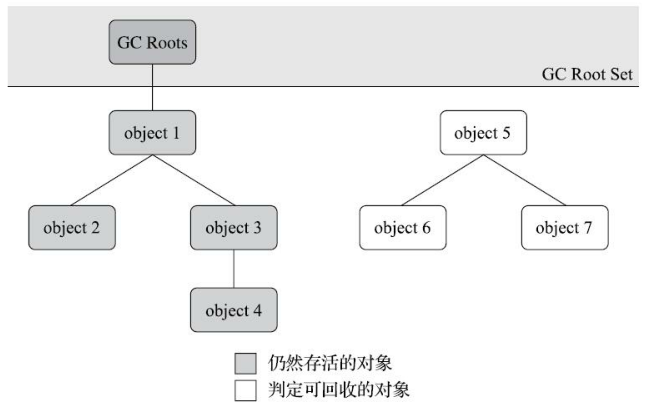
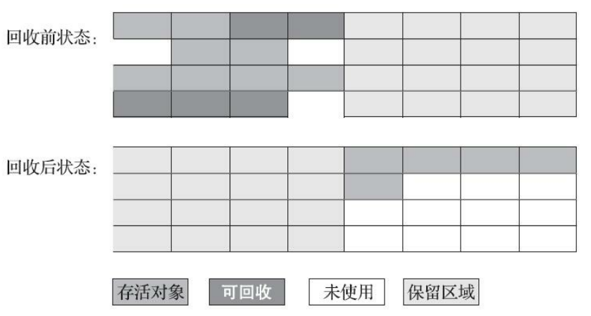
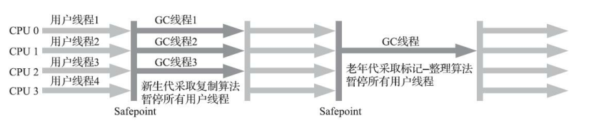
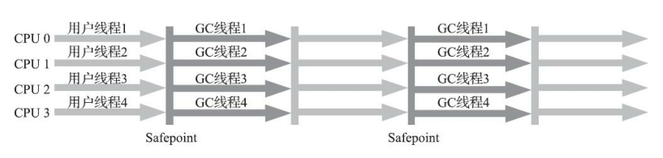

# Overview

 An object is considered garbage when it can no longer be reached from any pointer in the running program.

# 垃圾对象标记算法

## 引用计数算法

在对象中添加一个引用计数器，每当有一个地方引用它时，计数器值就加一；引用失效时，计数器值就减一；任何时刻计数器为0的对象就是需要被回收的对象。

引用计数器算法的原理简单，判定效率也很高，但**主流的虚拟机都没有选用引用计数算法**，原因是它必须配合大量额外处理才能正确地工作。比如，单纯的引用计数算法无法解决对象间循环引用的问题。

Python中支持引用计数算法，它通过一个额外的标准库解决对象的循环引用问题。

例如：

```java
public static void main(String[] args) {
    Demo a = new Demo();
    Demo b = new Demo();
    a.instance = b;
    b.instance = a;
    a = null;
    b = null;
    System.gc();
}
```

## 可达性分析算法

也叫根搜索算法或追踪性垃圾收集算法，可以有效解决循环引用问题，防止内存泄漏的发生。

通过一系列称为“GC Roots”的根对象作为起始节点集，从这些节点开始，根据引用关系向下搜索，搜索过程走过的路径叫做”引用链“，如果从GC Roots到某个对象不可达，则该对象是需要被回收的对象。



作为 GC Roots 的对象包括下面几种（重点是**前面 4 种**）：

- **虚拟机栈**(栈帧中的本地变量表)**中引用的对象**：各个**线程调用方法栈**中使用到的参数、局部变量、临时变量等。
- 方法区中类**静态属性引用的对象**：java 类的引用类型静态变量。

- 方法区中**常量引用的对象**：字符串常量池里的引用。
- 本地方法栈中引用的对象（即 Native 方法引用的对象）。

- JVM 的内部引用（class 对象、异常对象 `NullPointException`、`OutofMemoryError`，系统类加载器）。（非重点）
- 所有被**同步锁(**synchronized关键)**持有**的对象。（非重点）

- JVM 内部的 `JMXBean`、JVMTI 中注册的回调、本地代码缓存等（非重点）
- JVM 实现中的“临时性”对象，跨代引用的对象（在使用分代模型回收只回收部分代的对象）（非重点）


# 回收方法区

方法区的垃圾收集主要回收废弃的常量和不再使用的类型。

- 常量：例如，一个字符串常量“jar”，如果当前系统中没有任何地方引用这个字面量，且虚拟机中没有其他地方引用这个字面量，就可以将这个常量清除出方法区。
- 类：条件较为苛刻。

回收类的条件：

1、该类所有的**实例**都已经被回收，也就是堆中不存在该类的任何实例。

2、 加载该类的 `ClassLoader` 已经被回收。

3、 该类对应的 `java.lang.Class` 对象没有在任何地方被**引用**，无法在任何地方通过反射访问该类的方法。

在大量使用**反射，动态代理，`CGLib`等`ByteCode`框架，动态生成的JSP，OSGI这类频繁自定义`ClassLoader`**的场景中需要j JVM 具备类卸载的功能，保证方法区不会溢出。


# 垃圾收集算法

## 分代收集理论

分代收集理论建立在三个假说之上：

1. 弱分代假说：绝大多数对象都是朝生夕死的。
2. 强分代假说：熬过越多次垃圾收集过程的对象越难以消亡。
3. 跨代引用假说：跨代引用相对于同代引用来说仅占极少数。

垃圾收集器一致的设计原则：将Java堆分出不同的区域，然后将回收对象根据其年龄分配到不同的区域之中存储。设计者一般会把堆划分为新生代和老生代两个区域。

在新生代中，只要标记少量存活对象即可；对于老生代，可以降低回收该区域的频率以降低时间开销。

为了解决跨代引用的问题，需要在新生代建立一个数据结构存储老生代中发生了跨代引用的区域，在回收新生代时仅扫描发生了跨代引用的老生代区域即可。

新生代收集（`MinorGC/YoungGC`）

老生代收集（`MajorGC/OldGC`）：目前只有 CMS 垃圾回收器会有这个单独的回收老年代的行为。

整堆回收（`fullGC`）：回收整个堆+方法区。

## 标记清除算法

标记垃圾，清除垃圾。

缺点：

- 执行效率不稳定。当多数对象都可回收时，需要进行大量标记和清除的动作，适用于老生代。
- 内存空间碎片化问题。
- 需要两次扫描。


## 标记整理算法

标记整理算法在标记垃圾后，让所有存活的对象向内存空间一端移动，然后直接清理掉边界以外的内存。


这种算法更适用于老生代。

缺陷是移动存活对象时，要更新所有引用这些对象的地方，且在执行移动操作时必须暂停用户应用程序，这样的停顿被最初的虚拟机设计者描述为“Stop The World”。

如果不移动对象，就需要通过更复杂的内存分配器和内存访问其来解决空间碎片化问题，降低内存访问效率。

一种和稀泥式的方案是平时执行标记清除算法，内存碎片过多时再执行一次标记整理算法。

## 标记复制算法

将内存空间分为大小相等的两块，每次只使用其中的一块。当清理完一块的垃圾后，将其中存活的对象全部复制到另一块中的连续内存区域，再把之前整块内存都一次清理掉。

当块中大多数对象都可回收时，仅需要复制少量存活对象，此时算法效率较高。复制后对象连续存储，因此不会存在内存碎片。

缺陷是浪费了一半的内存空间，如果不想浪费50%的空间，就**需要有额外的空间进行分配担保**用于应付半区内存中所有对象都100%存活的极端情况，所以在老年代一般不能直接选用这种算法。

在对象存活率高时效率有所下降，且复制后程序中对应的引用需要更新。



现在的商用Java虚拟机大多都优先采用了这种收集算法回收新生代。

新生代中大部分对象都熬不过第一轮收集，因此并不需要按照1比1的比例来划分新生代的内存空间。

Appel 式回收：


将新生代分为一块较大的 Eden 空间和两块较小的 Survivor 空间，每次分配内存只使用 Eden和一块 Survivor，发生 GC 时将 Eden 和 Survivor 中的存活对象复制到另一块 Survivor 中。默认比例为8:1:1。

当 Survivor 区域内存不足时，就需要找老生代借空间，添加额外的空间分配担保程序。

# 垃圾收集器

新生代垃圾收集器：`Serial`，`ParNew`，`Parallel Scavenge`

老年代垃圾收集器：`CMS`，`Serial Old`，`Parallel Old`

全能收集器：`G1`

搭配使用：只有`Serial`，`ParNew`可以和`CMS`搭配使用，三种新生代收集器都可以跟`Serial Old`收集器搭配使用，`Parallel Old` 和`Parallel Scavenge` 搭配使用，是吞吐量优先的收集器。

## 单线程Serial系列

### Serial

Serial是最基础、历史最悠久的收集器，是一个单线程工作的收集器，采用标记复制算法。

它在进行垃圾收集时，会暂停其他所有工作线程，直到收集结束。


目前，它仍是Hot Spot虚拟机在客户端**客户端**模式下的默认收集器。

Serial收集器没有线程交互的开销，在资源受限的环境中拥有很好的表现。

在微服务应用中，由于虚拟机管理的内存一般比较小，垃圾收集的停顿时间往往在几十毫秒，Serial收集器是一个很好的选择。

### Serial Old

Serial Old是Serial收集器的老生代版本，同样是一个单线程收集器，使用**标记整理**算法。

Serial Old收集器的主要用法是供客户端模式下的`HotSpot`虚拟机使用，在服务端模式下，它可以和Parallel Scavenge收集器搭配使用或者作为CMS收集器发生失败时的后备预案。

## 并行多线程收集器

采用多线程模型，多个线程共同进行GC，此时用户线程处于等待状态。

### `ParNew`收集器

`ParNew`收集器是`Serial`收集器的多线程并行版本，除了同时使用多条线程进行垃圾收集之外，其余的行为，包括`Serial`收集器可用的所有控制参数（例如：`-XX:SurvivorRatio,-XX:PretenureSizeThreshold`等）、收集算法、Stop The World、对象分配规则、回收策略等都与Serial收集器完全一致。



JDK1.5中，`ParNew`和CMS（老生代并行收集器）配合作为服务器端推荐的收集器。

只有`ParNew`和`Serial`收集器能够与CMS收集器配合工作。

JDK9开始，面向全堆的G1收集器取代了`ParNew`收集器。

### Parallel Scavenge

采用标记复制算法，追求尽量缩短垃圾收集时用户线程的停顿时间，Parallel Scavenge收集器的设计目的是吞吐量最大化，它允许较长时间的`STW`换取总吞吐量最大化。
### Parallel Old收集器

Parallel Old是Parallel Scavenge收集器的老生代版本，支持多线程并发收集，基于标记整理算法实现。

**Parallel Scavenge + Parallel Old = 高吞吐量**(JDK1.8默认这两种收集器)



## 并发多线程CMS

CMS(Concurrent Mark Sweep)收集器是一种以获取最短回收停顿时间为目标的收集器，只回收老年代，搭配是 `ParNew` + `CMS`。

CMS收集器是基于标记清除算法实现的，其执行过程可以分为以下四个阶段：

1. 初始标记：标记GC Roots能直接关联到的对象，时间较短。
2. 并发标记：从GC Roots的直接关联对象开始遍历整个对象图。
3. 重新标记：修正并发标记阶段因用户程序继续运行而产生变动的那一部分对象的标记记录，比并发标记阶段时间短，比初始标记阶段时间长。
4. 并发清除：清理标记阶段判断的已经死亡的对象。

初始标记和重新标记两个步骤需要“Stop The World”。


初始标记仅仅只标记一下GC Roots能直接关联到的对象，速度很快。

并发标记是对GC Roots进行追踪的过程。

重新标记阶段为了修正并发标记期间因用户程序继续运作而导致标记产生变动的那一部分对象的标记记录，这个阶段的停顿时间就比初始标记阶段的时间长一点了！但远比并发标记的时间短。

这四个过程中，使用时间最长的是并发标记和并发清除，但是这两个阶段的收集器线程是和用户线程一起工作的。

CMS的缺点：

1. CMS收集器对CPU资源非常敏感，因为其要占用一部分CPU核心，当CPU核心数不足四个时，会严重降低效率
2. CMS无法处理浮动垃圾，在并发标记阶段，垃圾还在不断产生，CMS无法在这次清理掉他们，只能等下次GC时再清理掉，这部分垃圾称为“浮动垃圾”。
3. CMS会产生内存碎片，为了解决这个问题，CMS 提供一个参数：-`XX:+UseCMSCompactAtFullCollection`，一般是开启的，如果分配不了大对象，就进行内存碎片的整理过程。这里一般会使用 Serial Old。


## 并发多线程Garbage First收集器

The Garbage-First (G1) collector is a server-style garbage collector, targeted for multi-processor machines with large memories. 

It meets garbage collection (GC) pause time goals with a high probability, while achieving high throughput. 

Garbage First（简称G1）收集器是一款面向服务端的垃圾收集器，通过-XX:+UseG1GC参数来启用。

在JDK9之后，G1宣布取代Parallel Scavenge加Parallel Old组合，成为服务端模式下的默认垃圾收集器。

随着 JVM 中内存的增大，STW 的时间成为 JVM 急迫解决的问题，但是如果按照传统的分代模型，总跳不出 STW 时间不可预测这点。

G1之前的收集器的回收范围是新生代、老生代或Java堆，而G1将堆内存划分成多个**大小相等**独立区域（Region），每一个 Region 都可以根据需要，扮演新生代的 Eden 空间、Survivor 空间，或者老年代空间。回收器能够对扮演不同角色的 Region 采用不同的策略去处理，这样无论是新创建的对象还是已经存活了一段时间、熬过多次收集的旧对象都能获取很好的收集效果。


### Region

G1的各代存储地址是不连续的，每一代都使用了n个不连续的大小相同的Region，每个Region占有一块连续的虚拟内存地址。如下图所示：


在上图中，我们注意到还有一些 Region 标明了 H，它代表 Humongous，这表示这些 Region 存储的是巨大对象（humongous object，`H-obj`)，即大小大于等于 region 一半的对象，巨大对象可能占据几个连续的 Region。

一个 Region 的大小可以通过参数`-XX:G1HeapRegionSize`设定，取值范围从 1M 到 32M，且是 2 的指数。如果不设定，那么 G1 会根据Heap大小自动决定。

G1 的垃圾回收大多数情况下都把 Humongous Region 作为老年代的一部分来进行处理。

### G1 的过程

**1、初始标记**

仅仅标记 GC roots 能够直接关联到的对象，并且修改 TAMS 指针的值，让下一阶段用户线程并发运行时，能正确地在可用的 Region 中分配新对象。这个阶段需要停顿线程，但耗时很短，而且是借用进行 Minor GC 的时候同步完成的，所以 G1 收集器在这个阶段实际并没有额外的停顿。

> 要达到 GC 与用户线程并发运行，必须要解决回收过程中新对象的分配，所以 G1 为每一个 Region 区域设计了两个名为 TAMS（Top at Mark Start）的指针， 从 Region 区域划出一部分空间用于记录并发回收过程中的新对象。这样的对象认为它们是存活的，不纳入垃圾回收范围。

**2、并发标记**

**从 GC Root 开始对堆中对象进行可达性分析**，递归扫描整个堆里的对象图，找出要回收的对象，这阶段耗时较长，但可与用户程序并发执行。当对象图扫描完成以后， 并发时有引用变动的对象， 这些对象会漏标（ 三色标记 ） ， 漏标的对象会被一个叫做SATB(snapshot-at-the-beginning)算法来解决。

**3、最终标记**

对用户线程做另一个短暂的暂停，用于处理并发阶段结后仍遗留下来的最后那少量的 SATB 记录(漏标对象)。

**4、筛选回收**

负责更新 Region 的统计数据，**对各个 Region 的回收价值和成本进行排序，根据用户所期望的停顿时间来制定回收计划**，可以自由选择任意多个 Region 构成回收集，然后把决定回收的那一部分 Region 的存活对象复制到空的 Region 中，再清理掉整个旧 Region 的全部空间。这里的操作涉及存活对象的移动， 是必须暂停用户线程，由多条收集器线程并行完成的。

### 特点

- **并行与并发**：G1 能充分利用多 CPU、多核环境下的硬件优势，使用多个 CPU（CPU 或者 CPU 核心）来缩短 Stop-The-World 停顿的时间，部分其他收集器原本需要停顿 Java 线程执行的 GC 动作，G1 收集器仍然可以通过并发的方式让 Java 程序继续执行。
- **分代收集**：与其他收集器一样，分代概念在 G1 中依然得以保留。虽然 G1 可以不需要其他收集器配合就能独立管理整个 GC 堆，但它能够采用不同的方式去处理新创建的对象和已经存活了一段时间、熬过多次 GC 的旧对象以获取更好的收集效果。

- **空间整合**：与 CMS 的“标记-清除”算法不同，G1 从整体来看是基于“标记-整理”算法实现的收集器，从局部（两个 Region 之间）上来看是基于“复制”算法实现的，但无论如何，这两种算法都意味着 G1 运作期间不会产生内存空间碎片，收集后能提供规整的可用内存。这种特性有利于程序长时间运行，分配大对象时不会因为无法找到连续内存空间而提前触发下一次 GC。
- **追求停顿时间**：`-XX:MaxGCPauseMillis` 指定目标的最大停顿时间，G1 尝试调整新生代和老年代的比例，堆大小，晋升年龄来达到这个目标时间。

该垃圾回收器适合回收堆空间上百 G。一般在 G1 和 CMS 中间选择的话平衡点在 6~8G，建议6G以上才使用，只有内存比较大 G1 才能发挥优势。

## 并发标记和三色标记

三色标记法前的算法叫 Mark-And-Sweep（标记清除）。