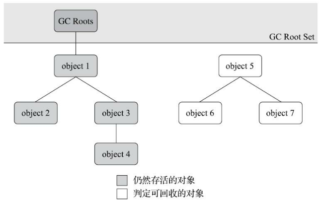
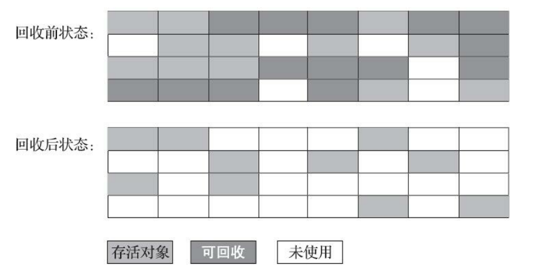
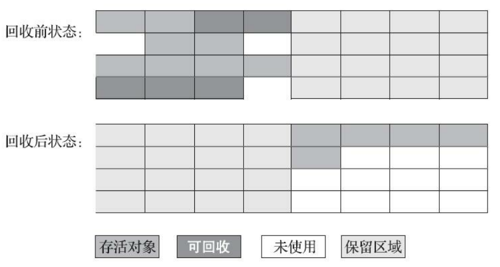
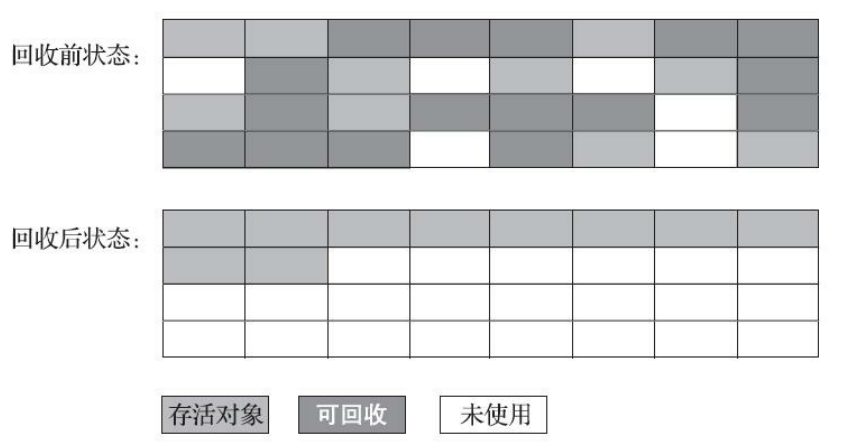
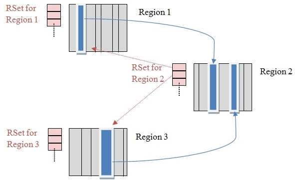

# Overview

 An object is considered garbage when it can no longer be reached from any pointer in the running program.

# 垃圾对象标记算法

## 引用计数算法

在对象中添加一个引用计数器，每当有一个地方引用它时，计数器值就加一；引用失效时，计数器值就减一；任何时刻计数器为0的对象就是需要被回收的对象。

引用计数器算法的原理简单，判定效率也很高，但**主流的虚拟机都没有选用引用计数算法**，原因是它必须配合大量额外处理才能正确地工作。比如，单纯的引用计数算法无法解决对象间循环引用的问题。

Python中支持引用计数算法，它通过一个额外的标准库解决对象的循环引用问题。

例如：

```java
public static void main(String[] args) {
    Demo a = new Demo();
    Demo b = new Demo();
    a.instance = b;
    b.instance = a;
    a = null;
    b = null;
    System.gc();
}
```

## 可达性分析算法

也叫根搜索算法或追踪性垃圾收集算法，可以有效解决循环引用问题，防止内存泄漏的发生。

通过一系列称为“GC Roots”的根对象作为起始节点集，从这些节点开始，根据引用关系向下搜索，搜索过程走过的路径叫做”引用链“，如果从GC Roots到某个对象不可达，则该对象是需要被回收的对象。



在Java语言中，GC Roots包含以下几类元素：

- 虚拟机栈中引用的对象，如各个线程被调用的方法中的局部变量、参数等。
- 本地方法栈中引用的对象。
- 方法区中类静态属性引用的对象
- 方法区中常量引用的对象，如常量池中的引用
- 被同步锁持有的对象
- JVM内部的引用


# 引用

JDK1.2后，Java对引用的概念进行了扩充，将引用分为强引用(Strong Reference)、软引用(Soft Reference)、弱引用(Weak Reference)和虚引用(Phantom Reference)。

- 强引用：传统的引用，例如`Object obj = new Object()`，任何情况下，只要强引用关系存在，GC就不会回收被引用的对象。
- 软引用：一些有用但非必须的对象。系统在将要发生内存溢出异常时会将这些对象列进回收范围进行第二次回收。
- 弱引用：一些非必须的对象。当GC开始工作时，无论当前内存是否足够，都会回收掉只被弱引用关联的对象。
- 虚引用：一个对象是否有虚引用的存在，完全不会对其生存时间产生影响，也无法通过虚引用取得一个对象实例，虚引用的作用是在对象被回收后收到一个系统通知。


# 回收方法区

方法区的垃圾收集主要回收废弃的常量和不再使用的类型。

- 常量：例如，一个字符串常量“jar”，如果当前系统中没有任何地方引用这个字面量，且虚拟机中没有其他地方引用这个字面量，就可以将这个常量清除出方法区。
- 类：条件较为苛刻。

在大量使用**反射，动态代理，`CGLib`等`ByteCode`框架，动态生成的JSP，OSGI这类频繁自定义`ClassLoader`**的场景中需要j JVM 具备类卸载的功能，保证方法区不会溢出。


# 垃圾收集算法

## 分代收集理论

分代收集理论建立在三个假说之上：

1. 弱分代假说：绝大多数对象都是朝生夕死的。
2. 强分代假说：熬过越多次垃圾收集过程的对象越难以消亡。
3. 跨代引用假说：跨代引用相对于同代引用来说仅占极少数。

垃圾收集器一致的设计原则：将Java堆分出不同的区域，然后将回收对象根据其年龄分配到不同的区域之中存储。设计者一般会把堆划分为新生代和老生代两个区域。

在新生代中，只要标记少量存活对象即可；对于老生代，可以降低回收该区域的频率以降低时间开销。

为了解决跨代引用的问题，需要在新生代建立一个数据结构存储老生代中发生了跨代引用的区域，在回收新生代时仅扫描发生了跨代引用的老生代区域即可。

新生代收集（`MinorGC/YoungGC`）

老生代收集（`MajorGC/OldGC`）

## 标记清除算法

标记垃圾，清除垃圾或标记存活，清除垃圾。

缺点：

- 执行效率不稳定。当多数对象都可回收时，需要进行大量标记和清除的动作。
- 内存空间碎片化问题。



## 标记复制算法

将内存空间分为大小相等的两块，每次只使用其中的一块。当清理完一块的垃圾后，将其中存活的对象全部复制到另一块中的连续内存区域，再把之前整块内存都一次清理掉。

当块中大多数对象都可回收时，仅需要复制少量存活对象，此时算法效率较高。复制后对象连续存储，因此不会存在内存碎片。

缺陷是浪费了一半的内存空间。




现在的商用Java虚拟机大多都优先采用了这种收集算法回收新生代。

新生代中大部分对象都熬不过第一轮收集，因此并不需要按照1比1的比例来划分新生代的内存空间。

Appel式回收：

将新生代分为一块较大的Eden空间和两块较小的Survivor空间，每次分配内存只使用Eden和一块Survivor，发生GC时将Eden和Survivor中的存活对象复制到另一块Survivor中。默认比例为8:1:1。

当Survivor区域内存不足时，就需要找老生代借空间，添加额外的空间分配担保程序。

## 标记整理算法

老生代一般不会采用标记复制算法。

标记整理算法在标记垃圾后，让所有存活的对象向内存空间一端移动，然后直接清理掉边界以外的内存。



这种算法更适用于老生代。

缺陷是移动存活对象时，要更新所有引用这些对象的地方，且在执行移动操作时必须暂停用户应用程序，这样的停顿被最初的虚拟机设计者描述为“Stop The World”。

如果不移动对象，就需要通过更复杂的内存分配器和内存访问其来解决空间碎片化问题，降低内存访问效率。


一种和稀泥式的方案是平时执行标记清除算法，内存碎片过多时再执行一次标记整理算法。


# 垃圾收集器

新生代垃圾收集器：`Serial`，`ParNew`，`Parallel Scavenge`

老年代垃圾收集器：`CMS`，`Serial Old`，`Parallel Old`

全能收集器：`G1`

搭配使用：只有`Serial`，`ParNew`可以和`CMS`搭配使用，三种新生代收集器都可以跟`Serial Old`收集器搭配使用，`Parallel Old` 和`Parallel Scavenge` 搭配使用，是吞吐量优先的收集器。

## Serial收集器

Serial是最基础、历史最悠久的收集器，是一个单线程工作的收集器。

它在进行垃圾收集时，会暂停其他所有工作线程，直到收集结束。


目前，它仍是Hot Spot虚拟机在客户端客户端模式下的默认收集器。

Serial收集器没有线程交互的开销，在资源受限的环境中拥有很好的表现。

在微服务应用中，由于虚拟机管理的内存一般比较小，垃圾收集的停顿时间往往在几十毫秒，Serial收集器是一个很好的选择。

## `ParNew`收集器

`ParNew`收集器是`Serial`收集器的多线程并行版本，除了同时使用多条线程进行垃圾收集之外，其余的行为，包括`Serial`收集器可用的所有控制参数（例如：`-XX:SurvivorRatio,-XX:PretenureSizeThreshold`等）、收集算法、Stop The World、对象分配规则、回收策略等都与Serial收集器完全一致。


JDK1.5中，`ParNew`和CMS（老生代并行收集器）配合作为服务器端推荐的收集器。

只有`ParNew`和`Serial`收集器能够与CMS收集器配合工作。

JDK9开始，面向全堆的G1收集器取代了`ParNew`收集器。

## Parallel Scavenge

不同于其他收集器，追求尽量缩短垃圾收集时用户线程的停顿时间，Parallel Scavenge收集器的设计目的是达到一个可控制的吞吐量。
$$
吞吐量 = \frac{运行用户代码时间}{运行用户代码时间+运行垃圾收集时间}
$$


它提供了参数用来精确控制吞吐量。

## Serial Old收集器

Serial Old是Serial收集器的老生代版本，同样是一个单线程收集器，使用标记整理算法。


Serial Old收集器的主要用法是和Parallel Scavenge收集器搭配使用或者作为CMS收集器发生失败时的后备预案。

## Parallel Old收集器

Parallel Old是Parallel Scavenge收集器的老生代版本，支持多线程并发收集，基于标记整理算法实现，能够与Parallel Scavenge收集器配合工作。


## CMS收集器

CMS(Concurrent Mark Sweep)收集器是一种以获取最短回收停顿时间为目标的收集器。

CMS收集器是基于标记清除算法实现的，其执行过程可以分为以下四个阶段：

1. 初始标记：标记GC Roots能直接关联到的对象，时间较短。
2. 并发标记：从GC Roots的直接关联对象开始遍历整个对象图。
3. 重新标记：修正并发标记阶段因用户程序继续运行而产生变动的那一部分对象的标记记录，比并发标记阶段时间短，比初始标记阶段时间长。
4. 并发清除：清理标记阶段判断的已经死亡的对象。

初始标记和重新标记两个步骤需要“Stop The World”。


初始标记仅仅只标记一下GC Roots能直接关联到的对象，速度很快。

并发标记是对GC Roots进行追踪的过程。

重新标记阶段为了修正并发标记期间因用户程序继续运作而导致标记产生变动的那一部分对象的标记记录，这个阶段的停顿时间就比初始标记阶段的时间长一点了！但远比并发标记的时间短。

这四个过程中，使用时间最长的是并发标记和并发清除，但是这两个阶段的收集器线程是和用户线程一起工作的。

但CMS还有缺点：

1. CMS收集器对CPU资源非常敏感，因为其要占用一部分CPU核心，在CPU核心少时就会严重降低效率
2. CMS无法处理浮动垃圾，在并发标记阶段，垃圾还在不断产生，CMS无法在这次清理掉他们，只能等下次
3. CMS会产生内存碎片，因为其使用的是"标记-清除"算法


## Garbage First收集器

The Garbage-First (G1) collector is a server-style garbage collector, targeted for multi-processor machines with large memories. It meets garbage collection (GC) pause time goals with a high probability, while achieving high throughput. 

The G1 collector is designed for applications that:

- Can operate concurrently with applications threads like the CMS collector. 
- Compact free space without lengthy GC induced pause times.
- Need more predictable GC pause durations.
- Do not want to sacrifice a lot of throughput performance. 
- Do not require a much larger Java heap.

Garbage First（简称G1）收集器是一款面向服务端的垃圾收集器，通过-XX:+UseG1GC参数来启用。

在JDK9之后，G1宣布取代Parallel Scavenge加Parallel Old组合，成为服务端模式下的默认垃圾收集器。

G1之前的收集器的回收范围是新生代、老生代或Java堆，而G1跳出了这个限制，可以面向堆内存的任意部分组成回收集进行回收。

在G1的实现过程中，引入了一些新的概念，对于实现高吞吐、没有内存碎片、收集时间可控等功能起到了关键作用。下面我们就一起看一下G1中的这几个重要概念。

### Region

传统的GC收集器将连续的内存空间划分为新生代、老年代和永久代（JDK 8去除了永久代，引入了元空间 Meta space），这种划分的特点是各代的存储地址（逻辑地址，下同）是连续的。如下图所示：


而G1的各代存储地址是不连续的，每一代都使用了n个不连续的大小相同的Region，每个Region占有一块连续的虚拟内存地址。如下图所示：

在上图中，我们注意到还有一些 Region 标明了 H，它代表 Humongous，这表示这些 Region 存储的是巨大对象（humongous object，`H-obj`)，即大小大于等于 region 一半的对象。`H-obj` 有如下几个特征：

- `H-obj` 直接分配到了 `old gen`，防止了反复拷贝移动。 
- `H-obj` 在 `global concurrent marking` 阶段的 `cleanup` 和 `full GC`阶段回收。
- 在分配 `H-obj` 之前先检查是否超过 `initiating heap occupancy percent` 和 `the marking threshold`, 如果超过的话，就启动 `global concurrent marking`，为的是提早回收，防止 `evacuation failures` 和 `full GC`。

为了减少连续`H-objs`分配对 GC 的影响，需要把大对象变为普通的对象，建议增大 Region size。

一个 Region 的大小可以通过参数`-XX:G1HeapRegionSize`设定，取值范围从 1M 到 32M，且是 2 的指数。如果不设定，那么 G1 会根据Heap大小自动决定。

### SATB

全称是 Snapshot-At-The-Beginning，由字面理解，是 GC 开始时活着的对象的一个快照。它是通过 Root Tracing 得到的，作用是维持并发 GC 的正确性。 那么它是怎么维持并发 GC 的正确性的呢？根据三色标记算法，我们知道对象存在三种状态： 

- 白：对象没有被标记到，标记阶段结束后，会被当做垃圾回收掉。
- 灰：对象被标记了，但是它的字段还没有被标记或标记完。
- 黑：对象被标记了，且它的所有字段也被标记完了。

由于并发阶段的存在，`Mutator`和`Garbage Collector`线程同时对对象进行修改，就会出现白对象漏标的情况，这种情况发生的前提是：`Mutator`赋予一个黑对象该白对象的引用。 `Mutator`删除了所有从灰对象到该白对象的直接或者间接引用。

对于第一个条件，在并发标记阶段，如果该白对象是new出来的，并没有被灰对象持有，那么它会不会被漏标呢？Region中有两个top-at-mark-start（TAMS）指针，分别为`prevTAMS`和`nextTAMS`。在TAMS以上的对象是新分配的，这是一种隐式的标记。对于在GC时已经存在的白对象，如果它是活着的，它必然会被另一个对象引用，即条件二中的灰对象。如果灰对象到白对象的直接引用或者间接引用被替换了，或者删除了，白对象就会被漏标，从而导致被回收掉，这是非常严重的错误，所以SATB破坏了第二个条件。也就是说，一个对象的引用被替换时，可以通过write barrier 将旧引用记录下来。

```c++
//  share/vm/gc_implementation/g1/g1SATBCardTableModRefBS.hpp
// This notes that we don't need to access any BarrierSet data
// structures, so this can be called from a static context.
template <class T> static void write_ref_field_pre_static(T* field, oop newVal) {
  T heap_oop = oopDesc::load_heap_oop(field);
  if (!oopDesc::is_null(heap_oop)) {
    enqueue(oopDesc::decode_heap_oop(heap_oop));
  }
}
// share/vm/gc_implementation/g1/g1SATBCardTableModRefBS.cpp
void G1SATBCardTableModRefBS::enqueue(oop pre_val) {
  // Nulls should have been already filtered.
  assert(pre_val->is_oop(true), "Error");
  if (!JavaThread::satb_mark_queue_set().is_active()) return;
  Thread* thr = Thread::current();
  if (thr->is_Java_thread()) {
    JavaThread* jt = (JavaThread*)thr;
    jt->satb_mark_queue().enqueue(pre_val);
  } else {
    MutexLockerEx x(Shared_SATB_Q_lock, Mutex::_no_safepoint_check_flag);
    JavaThread::satb_mark_queue_set().shared_satb_queue()->enqueue(pre_val);
  }
}
```

SATB也是有副作用的，如果被替换的白对象就是要被收集的垃圾，这次的标记会让它躲过GC，这就是float garbage。因为SATB的做法精度比较低，所以造成的float garbage也会比较多。

### RSet

全称是Remembered Set，是辅助GC过程的一种结构，典型的空间换时间工具，和Card Table有些类似。还有一种数据结构也是辅助GC的：Collection Set（CSet），它记录了GC要收集的Region集合，集合里的Region可以是任意年代的。在GC的时候，对于old->young和old->old的跨代对象引用，只要扫描对应的CSet中的RSet即可。 逻辑上说每个Region都有一个RSet，RSet记录了其他Region中的对象引用本Region中对象的关系，属于points-into结构（谁引用了我的对象）。而Card Table则是一种points-out（我引用了谁的对象）的结构，每个Card 覆盖一定范围的Heap（一般为512Bytes）。G1的RSet是在Card Table的基础上实现的：每个Region会记录下别的Region有指向自己的指针，并标记这些指针分别在哪些Card的范围内。 这个RSet其实是一个Hash Table，Key是别的Region的起始地址，Value是一个集合，里面的元素是Card Table的Index。

下图表示了RSet、Card和Region的关系（[出处](http://www.infoq.com/articles/tuning-tips-G1-GC)）：



上图中有三个Region，每个Region被分成了多个Card，在不同Region中的Card会相互引用，Region1中的Card中的对象引用了Region2中的Card中的对象，蓝色实线表示的就是points-out的关系，而在Region2的RSet中，记录了Region1的Card，即红色虚线表示的关系，这就是points-into。 而维系RSet中的引用关系靠post-write barrier和Concurrent refinement threads来维护，操作伪代码如下（[出处](http://hllvm.group.iteye.com/group/topic/44381)）：

```c++
void oop_field_store(oop* field, oop new_value) {
  pre_write_barrier(field);             // pre-write barrier: for maintaining SATB invariant
  *field = new_value;                   // the actual store
  post_write_barrier(field, new_value); // post-write barrier: for tracking cross-region reference
}
```

post-write barrier记录了跨Region的引用更新，更新日志缓冲区则记录了那些包含更新引用的Cards。一旦缓冲区满了，Post-write barrier就停止服务了，会由Concurrent refinement threads处理这些缓冲区日志。 RSet究竟是怎么辅助GC的呢？在做YGC的时候，只需要选定young generation region的RSet作为根集，这些RSet记录了old->young的跨代引用，避免了扫描整个old generation。 而mixed gc的时候，old generation中记录了old->old的RSet，young->old的引用由扫描全部young generation region得到，这样也不用扫描全部old generation region。所以RSet的引入大大减少了GC的工作量。

### Pause Prediction Model

Pause Prediction Model 即停顿预测模型。它在G1中的作用是： >G1 uses a pause prediction model to meet a user-defined pause time target and selects the number of regions to collect based on the specified pause time target.

G1 GC是一个响应时间优先的GC算法，它与CMS最大的不同是，用户可以设定整个GC过程的期望停顿时间，参数-XX:MaxGCPauseMillis指定一个G1收集过程目标停顿时间，默认值200ms，不过它不是硬性条件，只是期望值。那么G1怎么满足用户的期望呢？就需要这个停顿预测模型了。G1根据这个模型统计计算出来的历史数据来预测本次收集需要选择的Region数量，从而尽量满足用户设定的目标停顿时间。 停顿预测模型是以衰减标准偏差为理论基础实现的：

```c++
//  share/vm/gc_implementation/g1/g1CollectorPolicy.hpp
double get_new_prediction(TruncatedSeq* seq) {
    return MAX2(seq->davg() + sigma() * seq->dsd(),
                seq->davg() * confidence_factor(seq->num()));
}
```

在这个预测计算公式中：davg表示衰减均值，sigma()返回一个系数，表示信赖度，dsd表示衰减标准偏差，confidence_factor表示可信度相关系数。而方法的参数TruncateSeq，顾名思义，是一个截断的序列，它只跟踪了序列中的最新的n个元素。

在G1 GC过程中，每个可测量的步骤花费的时间都会记录到TruncateSeq（继承了AbsSeq）中，用来计算衰减均值、衰减变量，衰减标准偏差等：

```c++
// src/share/vm/utilities/numberSeq.cpp

void AbsSeq::add(double val) {
  if (_num == 0) {
    // if the sequence is empty, the davg is the same as the value
    _davg = val;
    // and the variance is 0
    _dvariance = 0.0;
  } else {
    // otherwise, calculate both
    _davg = (1.0 - _alpha) * val + _alpha * _davg;
    double diff = val - _davg;
    _dvariance = (1.0 - _alpha) * diff * diff + _alpha * _dvariance;
  }
}
```

比如要预测一次GC过程中，RSet的更新时间，这个操作主要是将Dirty Card加入到RSet中，具体原理参考前面的RSet。每个Dirty Card的时间花费通过_cost_per_card_ms_seq来记录，具体预测代码如下：

```c++
//  share/vm/gc_implementation/g1/g1CollectorPolicy.hpp

 double predict_rs_update_time_ms(size_t pending_cards) {
    return (double) pending_cards * predict_cost_per_card_ms();
 }
 double predict_cost_per_card_ms() {
    return get_new_prediction(_cost_per_card_ms_seq);
 }
```

get_new_prediction就是我们开头说的方法，现在大家应该基本明白停顿预测模型的实现原理了。