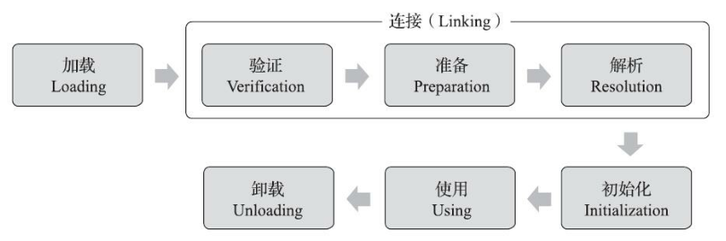
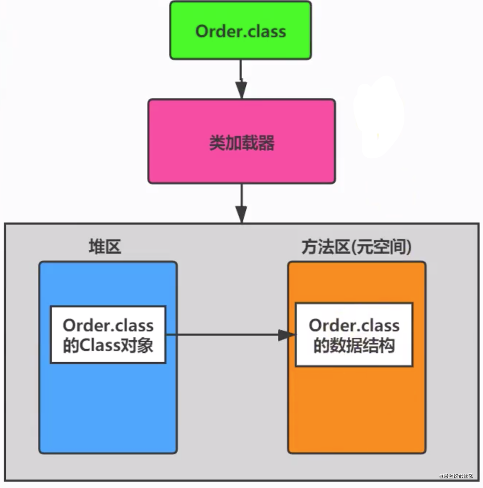
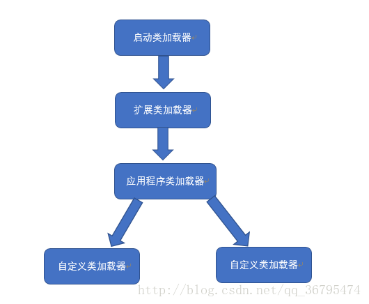
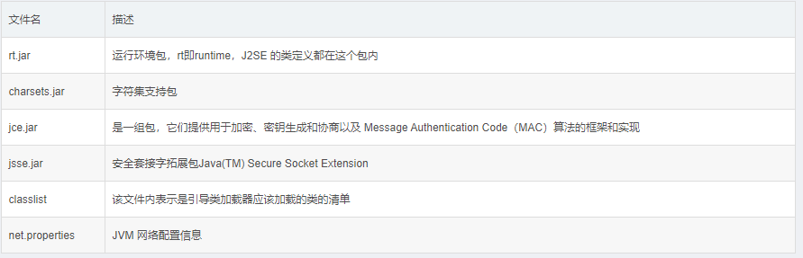
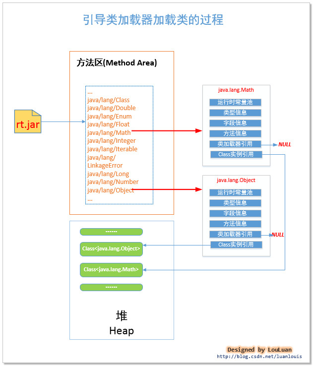

# overview

Java虚拟机将class文件加载到内存，并对数据进行校验、转换、解析和初始化，最后形成能够被jvm直接使用的java类型，这个过程称为jvm的类加载机制。

本文中类型指的是一个类或一个接口。

# 类加载的时机

一个类型被加载到jvm到卸载出内存，其生命周期为：



**注意**：这些阶段往往是按顺序开始的（开始之后可能会交叉混合进行），但是解析阶段在某些情况下可以位于初始化之后（这是为了支持Java语言的运行时绑定特性）。

Java虚拟机规范规定了有且只有以下六种情况，必须立即对类进行初始化：

1. 遇到new、getstatic、putstatic或invokestatic(调用类方法)这四条指令时，需要立即进行初始化。典型的场景包括：
   - 使用new实例化一个对象；
   - 读取或设置一个类型的静态字段；
   - 调用一个类型的静态方法；
2. 使用Java.lang.reflect包进行反射调用的时候。
3. 初始化一个类时，如果其父类未进行过初始化，需要先初始化其父类。
4. Jvm启动时，用户指定一个需要执行的主类，然后虚拟机对其初始化。
5. 使用JDK7新加入的动态语言支持时，如果一个`java.lang.invoke.MethodHandle`实例最后的解析结果为REF_getStatic、REF_putStatic、REF_invokeStatic、REF_newInvokeSpecial四种类型的方法句柄，并且这个方法句柄对应的类没有进行过初始化，则需要先进行初始化。

6. 当一个接口中定义了JDK8新加入的default方法时，如果有这个接口的实现类发生了初始化，那该接口要在其之前被初始化。

Demo1：

```java
package com.lq.demo;

class SuperClass {
    static {
        System.out.println("super class init");
    }
    public static int value = 10;
}
class SubClass extends SuperClass{
    static {
        System.out.println("sub class init");
    }
}
public class Test {
    public static void main(String[] args) {
        System.out.println(SubClass.value);
    }
}
```

```
super class init
10
```

对于静态字段，只有直接定义该字段的类才会被初始化。

Demo2：

```java
public class Test {
    public static void main(String[] args) {
        SuperClass[] list = new SuperClass[100];
    }
}
//输出为空
//创建类型数据未引起类的初始化
```

Demo3：

```java
package com.lq.demo;

class SuperClass {
    static {
        System.out.println("super class init");
    }
    public static final int value = 10;
}
class SubClass extends SuperClass{
    static {
        System.out.println("sub class init");
    }
}
public class Test {
    public static void main(String[] args) {
        System.out.println(SubClass.value);
    }
}
//输出：10
```

final型的变量在编译class文件时已经被优化，存储在了常量池里，因此对它的访问未触发类的初始化。

# 类加载过程

## Loading

在加载阶段，Java虚拟机需要完成以下三件事情：

1. 通过一个类的全限定名来获取定义此类的二进制字节流；
2. 将这个字节流所代表的静态存储结构转化为方法区的运行时数据结构。
3. 在内存中生成代表这个类的Class对象（封装类位于方法区内的数据结构），作为方法区这个类的各种数据的访问入口。

Java虚拟机规范没有指明二进制字节流要从哪里获取，从这一点上，就衍生出了很多Java技术，例如：从压缩包获取（JAR、WAR），从网络获取（Applet），运行时动态生成（动态代理）、由其他文件生成（jsp）、从数据库读取等。

对于数组类而言，其本身并不通过类加载器创建，而是由JVM直接创建的。但数组类的元素类型最终仍要靠类加载器去创建，一个数组类创建过程遵循以下规则：

- 如果数组的Content Type是引用类型，则会递归调用上面的三个步骤加载其类型，并将数组类标记在该组件类型的类加载器的类名称空间上。
- 如果不是引用类型，如int[]，JVM会将数组类标记为与引导类加载器关联，且访问权限默认为public。

加载阶段结束后，二进制字节流就按照JVM设定的格式存储在**方法区**了（JVM内存中方法区是唯一的，所有class文件的二进制数据都被加载到方法区中）。



对每个被加载的.class文件，JVM会在堆内存中立即创建一个java.lang.class\<T>类型的对象，用来作为访问类的元数据的入口（这是一个单例），其中也保存了指向方法区的类静态成员的引用。

Class类的构造方法是私有的，只有JVM可以调用，它提供了访问Class实例信息的接口，demo：

```java
 /* 过程一：加载阶段
 * 通过Class类，获得了java.lang.String类的所有方法信息，并打印方法访问标识符、描述符
 */
public class LoadingTest {
    public static void main(String[] args) {
        try {
            Class clazz = Class.forName("java.lang.String");
            //获取当前运行时类声明的所有方法
            Method[] ms = clazz.getDeclaredMethods();
            for (Method m : ms) {
                //获取方法的修饰符
                String mod = Modifier.toString(m.getModifiers());
                System.out.print(mod + " ");
                //获取方法的返回值类型
                String returnType = m.getReturnType().getSimpleName();
                System.out.print(returnType + " ");
                //获取方法名
                System.out.print(m.getName() + "(");
                //获取方法的参数列表
                Class<?>[] ps = m.getParameterTypes();
                if (ps.length == 0) System.out.print(')');
                for (int i = 0; i < ps.length; i++) {
                    char end = (i == ps.length - 1) ? ')' : ',';
                    //获取参数的类型
                    System.out.print(ps[i].getSimpleName() + end);
                }
                System.out.println();
            }
        } catch (ClassNotFoundException e) {
            e.printStackTrace();
        }

    }
}
```


## Linking

### 验证

验证是连接阶段的第一步，目的是确保Class文件中的字节流包含的信息符合Java虚拟机规范，保证这些代码运行后不会威胁JVM自身的安全。

Java语言本身是相对安全的编程语言，一些不合理的操作会直接被编译器拦截，但是Class文件也可以直接使用文本编辑器修改，这是就需要检查字节流的安全性。

#### 文件格式验证

- 是否以0xCAFEBABE开头
- 主次版本号是否在当前java虚拟机接受范围之内
- 常量池中的常量类型是否被支持
- 指向常量的索引值中是否有索引指向不存在或不符合类型要求的常量
- ……

第一阶段验证的主要目的是保证输入的字节流能正确地解析并存储在方法区之内。

#### 元数据验证

第二阶段是对字节码描述的信息进行语义分析，保证其描述的信息符合java语言规范。

例如：

- 某个类是否有父类
- 某个类的父类是否继承了不允许被继承的类
- 某个类是否实现了父类或接口中要求实现的方法
- 类中的字段、方法是否与父类产生冲突
- ……

#### 字节码验证

通过数据流分析和控制流分析，确定程序语义是合法的、符合逻辑的。

对类的Code属性进行校验分析，保证类的方法在运行时不会做出危害虚拟机安全的行为。

#### 符号引用验证

符号引用验证发生在虚拟机将符号引用转化成直接引用的时候，这个转化动作将在连接的第三阶段—解析阶段发生。可以看作是对类自身以外的各类信息（常量池中的各种符号引用）进行匹配性校验。

### 准备

准备阶段是正式为类中定义的变量（static变量）分配内存并设置类变量初始值的阶段（不包括实例变量），类变量将被分配到方法区中。

准备阶段通常只为静态变量设定默认初始值。例如：

`public static int val = 100;`

在准备阶段之后，val被初始化为0，赋值操作要在类的初始化阶段才会执行，其putstatic指令存放在类的``<clinit>``方法中。

当类字段的字段属性表中存在ConstantValue属性（同时被static和final修饰的类变量）时，在准备阶段，变量值会被初始化为ConstantValue属性所指定的初始值：

`public static final int val = 1200;`

此时准备阶段结束val会被初始化为1200。

### 解析

解析阶段是JVM将常量池内的符号引用替换成直接引用的过程，即替换为其在内存中某个表的偏移量。

**解析阶段的过程是方法重写的本质。**

- 符号引用（Symbolic References）：符号引用以一组符号来描述被引用的目标，符号可以是任何形式的字面量。符号引用与虚拟机实现的内存布局无关，引用的目标并不一定是已经加载到虚拟机内存中的内容。各种虚拟机实现的内存布局可以不同，但能接受的符号引用是一致的，因为符号引用的字面量形式明确定义在Java虚拟机规范中。
- 直接引用（Direct References）：直接引用是可以直接指向目标的指针、相对偏移量或一个能直接定位到目标的句柄。如果有了直接引用，引用的目标必定已在虚拟机内存中存在。

Java虚拟机规范只要求在执行用于操作符号引用的字节码指令前，先对对应的符号引用进行解析。

Demo：

```java
class Super{
	public static int m = 11;
	static{
		System.out.println("执行了super类静态语句块");
	}
}
 
 
class Father extends Super{
	public static int m = 33;
	static{
		System.out.println("执行了父类静态语句块");
	}
}
 
class Child extends Father{
	static{
		System.out.println("执行了子类静态语句块");
	}
}
 
public class StaticTest{
	public static void main(String[] args){
		System.out.println(Child.m);
	}
}
```

执行结果：

```
执行了super类静态语句块
执行了父类静态语句块
33
```

在解析m变量时，首先查找Child，然后查找Father，在Father中找到了m，因此将m和Father类关联在一起。

解析阶段发生在初始化阶段之前，因此并未有触发Child的初始化。

访问m时，执行了getstatic指令，触发了Father的初始化阶段，需要递归调用Super的初始化，因此输出上述结果。

#### 类或接口的解析

设当前代码所处的类为D，如果要把一个从未解析过的符号引用N解析为一个类或接口C的直接引用，其步骤为：

- 如果C不是一个数组类型，虚拟机会把N的全限定名传递给D的类加载器去加载这个类C。
- 如果C是一个数组类型，且数组的元素类型为对象，则虚拟机会按照对象的类型加载数组中的元素。
- 如果前两步成功，则C在虚拟机中已经是一个有效的类或接口了，随后进行符号引用验证，确认D是否具备对C的访问权限。

#### 字段解析

解析一个未被解析过的字段符号引用，首先会对字段表内class_index项索引的CONSTANT_class_info符号引用进行解析，即字段所属的类或接口的符号引用。解析成功后，将字段所属的类或接口用C表示，再执行以下步骤：

1. 如果C本身就包含了名称和描述符都与目标相匹配的字段，则返回这个字段的直接引用。
2. 否则，如果C中实现了接口，则按照继承关系递归搜索各个接口和父接口。
3. 否则，如果C不是Object类，递归搜索其父类。
4. 否则，查找失败，抛出`java.lang.NoSuchFieldError`

如果查找成功返回了引用，将会对这个字段进行权限验证。

#### 类方法解析

方法解析也会首先解析方法表中的class_index索引的类或接口，使用C代表解析出的类或接口，再执行以下步骤：

1. 如果class_index指向一个接口，抛出`java.lang.IncompatibleClassChangeError`异常。
2. 在C中查找。
3. 否则，在C的父类中递归查找。
4. 否则，在C实现的接口列表以及父接口中递归查找。如果找到了，说明C是一个抽象类，抛出`java.lang.AbstactMethodError`异常。
5. 查找失败。

#### 接口方法解析

步骤：

1. 如果class_index指向一个类，抛出`java.lang.IncompatibleClassChangeError`异常。
2. 否则，在接口C中查找是否有简单名称和描述符都与目标匹配的方法。
3. 否则，在接口C的父接口中递归查找，直到Object类。
4. 由于Java中接口允许多继承，如果C的不同父类中有多个与目标相匹配的方法，将会在这些方法中任意返回一个（根据具体JVM实现而定）。
5. 否则，查找失败，抛出`java.lang.NoSuchMethodError`异常。

## Initialization

初始化阶段是类加载的最后一个步骤，在上文的类加载过程中，除了加载阶段用户可以通过自定义类加载器的方式局部参与之外，其他步骤都是由JVM单独完成的，直到初始化阶段，JVM才真正开始执行类中的Java代码。

准备阶段时变量已经被赋过一次系统默认的初始零值，在初始化阶段，将会根据程序员的设定去初始化资源。

**初始化阶段就是递归执行类构造器`<clinit>`方法的过程（需要注意同步问题）。**

> `<clinit>`方法是由编译器自动收集类中的所有静态变量的赋值动作和静态语句块中的语句合并产生的，编译器收集的顺序是由语句在源文件中出现的顺序决定的。

static语句块只能访问到定义在它之前的变量，定义在它之后的变量可以赋值，但不能访问。

demo：

```java
public class Test {
    static {
        i = 10;
        //System.out.println(i); //非法向前引用
    }
    static int i = 5;

    public static void main(String[] args) {
        System.out.println(Test.i); //输出5
    }
}

//相当于先后执行：static int i; 
//static {i = 10; i = 5;}
```

JVM需要保证子类的\<clinit>方法执行前，父类的\<clinit>方法已经执行。

```java
class SuperClass {
    static {
        value = 9;
    }
    public static int value = 10;
}
class SubClass extends SuperClass{
    public static int subValue = value; //父类<clinit>方法已执行
}
public class Test {
    public static void main(String[] args) {
        System.out.println(SubClass.subValue);	//out: 10
    }
}
```

当一个类没有静态语句块和对静态变量的赋值操作时，编译器可以不为这个类生成\<clinit>方法。

接口中不能使用静态语句块，但仍然有变量初始化的赋值操作，因此接口与类一样都会生成\<clinit>方法。但接口与类不同的是，执行接口的\<clinit>()方法不需要先执行父接口的\<clinit>方法，因为只有当父接口中定义的变量被使用时，父接口才会被初始化。此外，接口的实现类在初始化时也一样不会执行接口的\<clinit>方法。

# 类加载器

jvm允许开发人员自定义类加载器，以便让应用程序自己决定如何去获取所需的二进制流！

这是一项创新，是为了Java Applet创造的，不过Java Applet已经死掉，但自定义类加载器却在类层次划分，代码加密，远程调用等方面大放异彩。

## 类与类加载器

对于任意一个类，都必须由它的类加载器和类本身共同确立其在Java虚拟机中的唯一性，每一个类加载器，都有一个独立的类名称空间。也就是说，比较两个类是否相等（包括类的Class对象的equals方法，isInstance方法和isAssignableFrom方法），只有在这两个类是由同一个类加载器加载的前提下才有意义。

```java
package com.lq.leetcode;

import java.io.IOException;
import java.io.InputStream;

public class Test {
    public static void main(String[] args) throws Exception{
        ClassLoader myLoader = new ClassLoader() {
            @Override
            public Class<?> loadClass(String name) throws ClassNotFoundException {
                try {
                    String filename = name.substring(name.lastIndexOf(".") + 1) + ".class";
                    InputStream is = getClass().getResourceAsStream(filename);
                    if(is == null)
                        return super.loadClass(name);
                    byte[] b = new byte[is.available()];
                    is.read(b);
                    return defineClass(name, b, 0, b.length);
                }catch (IOException e) {
                    throw new ClassNotFoundException(name);
                }
            }
        };
        Object obj = myLoader.loadClass("com.lq.leetcode.Test").newInstance();
        System.out.println(obj.getClass());
        Test test = new Test();
        System.out.println(obj instanceof com.lq.leetcode.Test);
        System.out.println(test instanceof com.lq.leetcode.Test);
    }
}
```

输出：

```
class com.lq.leetcode.Test
false
true
```

## 双亲委派模型

站在JVM的角度看，只存在两种不种的类加载器，一种是启动类加载器（Bootstrap Class Loader），使用C++实现，是java虚拟机本身的一部分；另一种是其它类加载器，继承自`java.lang.ClassLoader`，独立存在于JVM外部。

站在开发人员的角度，类加载器可以分为三种：

- 启动类加载器（Bootstrap Class Loader）：使用C++代码实现的加载器，用以加载存放在{JAVA_HOME}/lib目录下，JVM能够识别（按照文件名识别，如rt.jar、tool.jar）的系统类库。启动类加载器不能被Java代码访问到，但是，可以查询某个类是否被引导类加载器加载过。用户在编写自定义类加载器时，如果需要把加载请求委派给引导类加载器去处理，那直接使用null代替即可。当JVM系统启动的时候，引导类加载器会将系统类库中的相关数据加载到 JVM内存的方法区中。
- 扩展类加载器（Extension Class Loader）：该加载器用于加载java的拓展类 ，拓展类一般放在{JRE_HOME}/lib/ext/ 目录下，用来提供除了系统类之外的额外功能，使用 Java 实现。
- 应用程序类加载器（Application Class Loader）：该类加载器用于加载用户代码，是用户代码的入口。由于应用程序类加载器是getSystemClassLoader()方法的返回值，因此也叫系统类加载器，使用 Java 实现。

双亲委派模型：



图中的层次关系，称为类加载器的双亲委派模型。双亲委派模型要求除了顶层的根类加载器以外，其余的类加载器都应该有自己的父类加载器(一般不是以继承实现，而是使用**组合关系**来复用父加载器的代码)。如果一个类收到类加载请求，它首先请求父类加载器去加载这个类，只有当父类加载器无法完成加载时(其目录搜索范围内没找到需要的类)，子类加载器才会自己去加载。

ps：父加载器不是父类，只是逻辑上的父子关系。

类加载过程源代码：

```java
protected Class<?> loadClass(String name, boolean resolve)
        throws ClassNotFoundException
    {
        synchronized (getClassLoadingLock(name)) {
            // First, check if the class has already been loaded
            Class<?> c = findLoadedClass(name);
            if (c == null) {
                long t0 = System.nanoTime();
                try {
                    if (parent != null) {
                        c = parent.loadClass(name, false);
                    } else {
                        //extension 
                        c = findBootstrapClassOrNull(name);
                    }
                } catch (ClassNotFoundException e) {
                    // ClassNotFoundException thrown if class not found
                    // from the non-null parent class loader
                }

                if (c == null) {
                    // If still not found, then invoke findClass in order
                    // to find the class.
                    long t1 = System.nanoTime();
                    c = findClass(name);

                    // this is the defining class loader; record the stats
                    sun.misc.PerfCounter.getParentDelegationTime().addTime(t1 - t0);
                    sun.misc.PerfCounter.getFindClassTime().addElapsedTimeFrom(t1);
                    sun.misc.PerfCounter.getFindClasses().increment();
                }
            }
            if (resolve) {
                resolveClass(c);
            }
            return c;
        }
    }
```

## 破坏双亲委派模型


# Demo

```java
package com.lq.leetcode;

import sun.security.pkcs11.P11Util;

public class Test {
    public static void main(String[] args) {
        System.out.println("Hello,World!");
        ClassLoader loader = P11Util.class.getClassLoader();
        System.out.println(loader);
    }
}
```

output:

```
Hello,World!
sun.misc.Launcher$ExtClassLoader@77459877
```

执行程序后，会依次进行以下步骤：

**一、根据JVM内存配置要求，为JVM申请特定大小的内存空间**

**二、创建一个启动类加载器实例，初步加载系统类到内存方法区区域中**

启动类加载器实例创建后，会读取**{JRE_HOME}/lib** 下的jar包和配置，然后将这些系统类加载到方法区内。

主要包括：



加载结束后，JVM内存会呈现以下状态：



**三、创建JVM 启动器实例 Launcher，并取得类加载器ClassLoader**

JVM虚拟机调用已经加载在方法区的类`sun.misc.Launcher` 的静态方法getLauncher()，获取`sun.misc.Launcher`实例：

```JAVA
sun.misc.Launcher launcher = sun.misc.Launcher.getLauncher(); //获取Java启动器
ClassLoader classLoader = launcher.getClassLoader();          //获取类加载器ClassLoader用来加载class到内存来
```

`sun.misc.Launcher` 使用了单例模式设计，保证一个JVM虚拟机内只有一个`sun.misc.Launcher`实例。

在Launcher的内部，其定义了两个ClassLoader，分别是`sun.misc.Launcher.ExtClassLoader`和`sun.misc.Launcher.AppClassLoader`。

此时launcher.getClassLoader方法将返回AppClassLoader对象。


**四、使用上述获取的ClassLoader实例加载我们定义的com.lq.leetcode.Test类**

**五、加载完成后JVM执行Test类的main方法**

**六、java程序运行结束，JVM销毁。**


