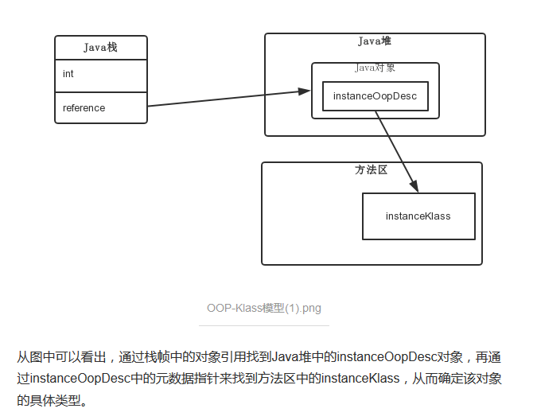

# overview

Java虚拟机将class文件加载到内存，并对数据进行校验、转换、解析和初始化，最后形成能够被jvm直接使用的java类型，这个过程称为jvm的类加载机制。

本文中类型指的是一个类或一个接口。

# 类加载的时机

一个类型被加载到jvm到卸载出内存，其生命周期为：


**注意**：这些阶段往往是按顺序开始的（开始之后可能会交叉混合进行），但是解析阶段在某些情况下可以位于初始化之后（这是为了支持Java语言的运行时绑定特性）。

Demo1：

```java
package com.lq.demo;

class SuperClass {
    static {
        System.out.println("super class init");
    }
    public static int value = 10;
}
class SubClass extends SuperClass{
    static {
        System.out.println("sub class init");
    }
}
public class Test {
    public static void main(String[] args) {
        System.out.println(SubClass.value);
    }
}
```

```
super class init
10
```

对于静态字段，只有直接定义该字段的类才会被初始化。

Demo2：

```java
public class Test {
    public static void main(String[] args) {
        SuperClass[] list = new SuperClass[100];
    }
}
//输出为空
//创建类型数据未引起类的初始化
```

Demo3：

```java
package com.lq.demo;

class SuperClass {
    static {
        System.out.println("super class init");
    }
    public static final int value = 10;
}
class SubClass extends SuperClass{
    static {
        System.out.println("sub class init");
    }
}
public class Test {
    public static void main(String[] args) {
        System.out.println(SubClass.value);
    }
}
//输出：10
```

final型的变量在编译class文件时已经被优化，存储在了常量池里，因此对它的访问未触发类的初始化。

# OOP-Klass模型

在JVM中，使用了OOP-KLASS模型来表示java对象，即：

- jvm在加载class时，会创建instanceKlass，表示其元数据，包括常量池、字段、方法等，存放在方法区；instanceKlass是jvm中的数据结构；
- 在new一个对象时，jvm创建instanceOopDesc，来表示这个对象，存放在堆区，其引用，存放在栈区；它用来表示对象的实例信息，看起来像个指针实际上是藏在指针里的对象；instanceOopDesc对应java中的对象实例；
- HotSpot并不把instanceKlass暴露给Java，而会另外创建对应的instanceOopDesc来表示java.lang.Class对象，并将后者称为前者的“Java镜像”，klass持有指向oop引用(_java_mirror便是该instanceKlass对Class对象的引用)；
- 要注意，new操作返回的instanceOopDesc类型指针指向instanceKlass，而instanceKlass指向了对应的类型的Class实例的instanceOopDesc；有点绕，简单说，就是Person实例——>Person的instanceKlass——>Person的Class。

```
• Klass表示Java类在JVM中的存在形式
    • InstanceKlass表示类的元信息
		• InstanceMirrorKlass表示类的Class对象
		• InstanceRefKlass表示?
	• ArrayKlass表示数组类的元信息
		• TypeArrayKlass表示基本数组类的元信息
		• ObjArrayKlass表示引用数组类的元信息
• oopDesc表示JAVA对象在JVM中的存在形式
	• instanceOopDesc表示普通类对象（非数组类对象）
	• arrayOopDesc表示数组类对象
		• typeArrayOopDesc表示基本数组类对象
		• objArrayOopDesc表示引用数组类对象
```

1. 对象头，也叫Mark Word，主要存储对象运行时记录信息，如hashcode, GC分代年龄，锁状态标志，线程ID，时间戳等;

2. 元数据指针，即指向方法区的instanceKlass实例 （虚拟机通过这个指针来群定这个对象是哪个类的实例。
3. 实例数据;

4. 另外，如果是数组对象，还多了一个数组长度




# 类加载过程

## Loading

在加载阶段，Java虚拟机需要完成以下三件事情：

1. 通过一个类的全限定名来获取定义此类的二进制字节流；
2. 将这个字节流所代表的静态存储结构转化为方法区的`instanceKlass`。
3. 在堆中生成代表这个类的 **InstanceMirrorKlass **对象，作为方法区这个类的各种数据的访问入口。

> **为什么有了 instanceKlass 还需要有 InstanceMirrorKlass ？**
>
> 主要是为了安全性考虑，jvm的开发者不希望直接暴露 instanceKlass 里面类的全部元信息，而且作为Java程序员也没有必要去知道这些信息，使用权限标识符去控制就已经足够了。
>
> 如果暴露了，那么黑客可以使用 C++ 或者 JNI 来写一些漏洞或者外挂，来绕过 Java 本身的权限判断，就会有很大的安全问题了。

**静态属性是存储在堆里面，也就是挂载到 InstanceMirrorKlass上面的。**

**loadClass 与class.forName的区别：**

- Class.forName 得到的 class 是已经初始化完成的
- Classloder.loadClass 得到的 class 是还没有链接的

Java虚拟机规范没有指明二进制字节流要从哪里获取，从这一点上，就衍生出了很多Java技术，例如：从压缩包获取（JAR、WAR），从网络获取（Applet），运行时动态生成（动态代理）、由其他文件生成（jsp）、从数据库读取等。

加载阶段结束后，二进制字节流就按照JVM设定的格式存储在**方法区**了（JVM内存中方法区是唯一的，所有class文件的二进制数据都被加载到方法区中）。


对每个被加载的.class文件，JVM会在堆内存中立即创建一个java.lang.class\<T>类型的对象，用来作为访问类的元数据的入口（这是一个单例），其中也保存了指向方法区的类静态成员的引用。

Class类的构造方法是私有的，只有JVM可以调用，它提供了访问Class实例信息的接口。

demo：

```java
 /* 过程一：加载阶段
 * 通过Class类，获得了java.lang.String类的所有方法信息，并打印方法访问标识符、描述符
 */
public class LoadingTest {
    public static void main(String[] args) {
        try {
            Class clazz = Class.forName("java.lang.String");
            //获取当前运行时类声明的所有方法
            Method[] ms = clazz.getDeclaredMethods();
            for (Method m : ms) {
                //获取方法的修饰符
                String mod = Modifier.toString(m.getModifiers());
                System.out.print(mod + " ");
                //获取方法的返回值类型
                String returnType = m.getReturnType().getSimpleName();
                System.out.print(returnType + " ");
                //获取方法名
                System.out.print(m.getName() + "(");
                //获取方法的参数列表
                Class<?>[] ps = m.getParameterTypes();
                if (ps.length == 0) System.out.print(')');
                for (int i = 0; i < ps.length; i++) {
                    char end = (i == ps.length - 1) ? ')' : ',';
                    //获取参数的类型
                    System.out.print(ps[i].getSimpleName() + end);
                }
                System.out.println();
            }
        } catch (ClassNotFoundException e) {
            e.printStackTrace();
        }

    }
}
```

## Linking

### 验证

验证是连接阶段的第一步，目的是确保Class文件中的字节流包含的信息符合Java虚拟机规范，保证这些代码运行后不会威胁JVM自身的安全。

Java语言本身是相对安全的编程语言，一些不合理的操作会直接被编译器拦截，但是Class文件也可以直接使用文本编辑器修改，这是就需要检查字节流的安全性。

#### 文件格式验证

- 是否以0xCAFEBABE开头
- 主次版本号是否在当前java虚拟机接受范围之内
- 常量池中的常量类型是否被支持
- 指向常量的索引值中是否有索引指向不存在或不符合类型要求的常量
- ……

第一阶段验证的主要目的是保证输入的字节流能正确地解析并存储在方法区之内。

#### 元数据验证

第二阶段是对字节码描述的信息进行语义分析，保证其描述的信息符合java语言规范。

例如：

- 某个类是否有父类
- 某个类的父类是否继承了不允许被继承的类
- 某个类是否实现了父类或接口中要求实现的方法
- 类中的字段、方法是否与父类产生冲突
- ……

#### 字节码验证

通过数据流分析和控制流分析，确定程序语义是合法的、符合逻辑的。

对类的Code属性进行校验分析，保证类的方法在运行时不会做出危害虚拟机安全的行为。

#### 符号引用验证

符号引用验证发生在虚拟机将符号引用转化成直接引用的时候，这个转化动作将在连接的第三阶段—解析阶段发生。可以看作是对类自身以外的各类信息（常量池中的各种符号引用）进行匹配性校验。

### 准备

准备阶段是正式为类中定义的变量（static变量）分配内存并设置类变量初始值的阶段（不包括实例变量），类变量将被分配到方法区中。

准备阶段通常只为静态变量设定默认初始值。例如：

`public static int val = 100;`

在准备阶段之后，val被初始化为0，赋值操作要在类的初始化阶段才会执行，其putstatic指令存放在类的``<clinit>``方法中。

当类字段的字段属性表中存在ConstantValue属性（同时被static和final修饰的类变量）时，在准备阶段，变量值会被初始化为ConstantValue属性所指定的初始值：

`public static final int val = 1200;`

此时准备阶段结束val会被初始化为1200。

准备阶段的意义：在一个变量还没有被初始化时，其他的变量初始化时如果要用到该变量，可以使用该变量的零值。

### 解析

解析阶段是JVM将常量池内的符号引用替换成直接引用的过程，即替换为其在内存中某个表的偏移量。

**解析阶段的过程是方法重写的本质。**

- 符号引用（Symbolic References）
- 直接引用（Direct References）：直接引用是可以直接指向目标的指针、相对偏移量或一个能直接定位到目标的句柄。如果有了直接引用，引用的目标必定已在虚拟机内存中存在。

Java虚拟机规范只要求在执行用于操作符号引用的字节码指令前，先对对应的符号引用进行解析。

Demo：

```java
class Super{
	public static int m = 11;
	static{
		System.out.println("执行了super类静态语句块");
	}
}
 
 
class Father extends Super{
	public static int m = 33;
	static{
		System.out.println("执行了父类静态语句块");
	}
}
 
class Child extends Father{
	static{
		System.out.println("执行了子类静态语句块");
	}
}
 
public class StaticTest{
	public static void main(String[] args){
		System.out.println(Child.m);
	}
}
```

执行结果：

```
执行了super类静态语句块
执行了父类静态语句块
33
```

在解析m变量时，首先查找Child，然后查找Father，在Father中找到了m，因此将m和Father类关联在一起。

解析阶段发生在初始化阶段之前，因此并未有触发Child的初始化。

访问m时，执行了getstatic指令，触发了Father的初始化阶段，需要递归调用Super的初始化，因此输出上述结果。

解析类型：

- 类或接口的解析

- 字段解析

- 类方法解析

- 接口方法解析

几个经常发生的异常：

- java.lang.NoSuchFieldError 根据继承关系从下往上，找不到相关字段时的报错。（字段解析异常） 
- java.lang.IllegalAccessError 字段或者方法，访问权限不具备时的错误。（类或接口的解析异常） 

- java.lang.NoSuchMethodError 找不到相关方法时的错误。（类方法解析、接口方法解析时发生的异常）


## Initialization

初始化阶段是类加载的最后一个步骤，在上文的类加载过程中，除了加载阶段用户可以通过自定义类加载器的方式局部参与之外，其他步骤都是由JVM单独完成的，直到初始化阶段，JVM才真正开始执行类中的Java代码。

准备阶段时变量已经被赋过一次系统默认的初始零值，在初始化阶段，将会根据程序员的设定去初始化资源。

**初始化阶段就是递归执行类构造器`<clinit>`方法的过程（需要注意同步问题）。**

> `<clinit>`方法是由编译器自动收集类中的所有静态变量的赋值动作和静态语句块中的语句合并产生的，编译器收集的顺序是由语句在源文件中出现的顺序决定的。

static语句块只能访问到定义在它之前的变量，定义在它之后的变量可以赋值，但不能访问。

demo：

```java
public class Test {
    static {
        i = 10;
        //System.out.println(i); //非法向前引用
    }
    static int i = 5;

    public static void main(String[] args) {
        System.out.println(Test.i); //输出5
    }
}

//相当于先后执行：static int i; 
//static {i = 10; i = 5;}
```

JVM需要保证子类的\<clinit>方法执行前，父类的\<clinit>方法已经执行。

```java
class SuperClass {
    static {
        value = 9;
    }
    public static int value = 10;
}
class SubClass extends SuperClass{
    public static int subValue = value; //父类<clinit>方法已执行
}
public class Test {
    public static void main(String[] args) {
        System.out.println(SubClass.subValue);	//out: 10
    }
}
```

当一个类没有静态语句块和对静态变量的赋值操作时，编译器可以不为这个类生成\<clinit>方法。

接口中不能使用静态语句块，但仍然有变量初始化的赋值操作，因此接口与类一样都会生成\<clinit>方法。但接口与类不同的是，执行接口的\<clinit>()方法不需要先执行父接口的\<clinit>方法，因为只有当父接口中定义的变量被使用时，父接口才会被初始化。此外，接口的实现类在初始化时也一样不会执行接口的\<clinit>方法。

Java虚拟机规范规定了有且只有以下六种情况，必须立即对类进行初始化：

1. 遇到new、getstatic、putstatic或invokestatic(调用类方法)这四条指令时，需要立即进行初始化。典型的场景包括：
   - 使用new实例化一个对象；
   - 读取或设置一个类型的静态字段；
   - 调用一个类型的静态方法；
2. 使用Java.lang.reflect包进行反射调用的时候。
3. 初始化一个类时，如果其父类未进行过初始化，需要先初始化其父类（接口没有该要求）。
4. Jvm启动时，用户指定一个需要执行的主类，然后虚拟机对其初始化。
5. 使用JDK7新加入的动态语言支持时，如果一个`java.lang.invoke.MethodHandle`实例最后的解析结果为REF_getStatic、REF_putStatic、REF_invokeStatic、REF_newInvokeSpecial四种类型的方法句柄，并且这个方法句柄对应的类没有进行过初始化，则需要先进行初始化。
6. 当一个接口中定义了JDK8新加入的default方法时，如果有这个接口的实现类发生了初始化，那该接口要在其之前被初始化。

### 主动使用和被动使用

1. 通过子类访问父类的静态变量或静态方法，为子类的被动使用，**不会导致子类初始化**

```java
//对于静态字段来说，只有直接定义了该字段的类初始化，该静态字段才会被初始化。
public class ClassLoadTest {
    public static void main(String[] args) {
        System.out.println(Child.str1);
		//  System.out.println(Child.str2);
    }
}

class Parent {
    //    static String str1 = "-------------------welcome Parent-------------------";
    static {
        str1 = "Parent11111111111";
		// System.out.println("Parent.str1=" + str1);//str1在下面的时候编译错误
        System.out.println("-------------------from Parent class-------------------");
    }
    static String str1 = "-------------------welcome Parent-------------------";
}

class Child extends Parent {
    static String str2 = "-------------------welcome Child-------------------";
    static {
        System.out.println("-------------------from Child class-------------------");
    }
}

//输出结果为：
//-------------------from Parent class-------------------
//-------------------welcome Parent-------------------
```

2. 通过数组定义类引用类，为类的被动使用，不会触发此类的初始化。如：`ArrayList[] = new ArrayList[10];`，不会调用 ArrayList 的 clinit 方法。
3. **常量**在编译阶段会存入调用方法所在的类的常量池中，本质上没有直接引用到定义常量的类，因此不会触发定义常量的类的初始化。例如：`public static final int i = 10; `
4. 当一个**接口**在初始化时，并**不要求**其父接口都完成了初始化**，只有在**真正使用到父接口的时候（如引用接口中定义的常量），才会初始化。


# 卸载

当MySample类被加载、连接和初始化后，它的生命周期就开始了。当代表MySample类的Class对象不再被引用，即不可触及时，Class对象就会结束生命周期，MySample类在方法区内的数据也会被卸载，从而结束MySample类的生命周期。

一个类何时结束生命周期，取决于代表它的Class对象何时结束生命周期。

不会被卸载的类：由**Java虚拟机自带的类加载器所加载的类**，在虚拟机的生命周期中，始终不会被卸载。Java 虚拟机本身会始终引用这些类加载器，而这些类加载器则会始终引用它们所加载的类的Class对象，因此这些Class对象**始终是可触及的**。

可以被卸载的类：由**用户自定义的类加载器所加载的类**是可以被卸载的。

## 可以被卸载的类

由**用户自定义的类加载器所加载的类**是可以被卸载的。

# 类加载器

jvm允许开发人员自定义类加载器，以便让应用程序自己决定如何去获取所需的二进制流，这是一项创新，是为了Java Applet创造的，不过Java Applet已经死掉，但自定义类加载器却在类层次划分，代码加密，远程调用等方面大放异彩。

**只有数组不是由类加载器加载的，而是由JVM动态生成的！数组是JVM内置类型，继承Object。**

## 类与类加载器

对于任意一个类，都必须由它的类加载器和类本身共同确立其在Java虚拟机中的唯一性，每一个类加载器，都有一个独立的类名称空间。也就是说，比较两个类是否相等（包括类的Class对象的equals方法，isInstance方法和isAssignableFrom方法），只有在这两个类是由同一个类加载器加载的前提下才有意义。

```java
package com.lq.leetcode;

import java.io.IOException;
import java.io.InputStream;

public class Test {
    public static void main(String[] args) throws Exception{
        ClassLoader myLoader = new ClassLoader() {
            @Override
            public Class<?> loadClass(String name) throws ClassNotFoundException {
                try {
                    String filename = name.substring(name.lastIndexOf(".") + 1) + ".class";
                    InputStream is = getClass().getResourceAsStream(filename);
                    if(is == null)
                        return super.loadClass(name);
                    byte[] b = new byte[is.available()];
                    is.read(b);
                    return defineClass(name, b, 0, b.length);
                }catch (IOException e) {
                    throw new ClassNotFoundException(name);
                }
            }
        };
        Object obj = myLoader.loadClass("com.lq.leetcode.Test").newInstance();
        System.out.println(obj.getClass());
        Test test = new Test();
        System.out.println(obj instanceof com.lq.leetcode.Test);
        System.out.println(test instanceof com.lq.leetcode.Test);
    }
}
```

输出：

```
class com.lq.leetcode.Test
false
true
```

## 双亲委派模型

站在JVM的角度看，只存在两种不种的类加载器，一种是启动类加载器（Bootstrap Class Loader），使用C++实现，是java虚拟机本身的一部分；另一种是其它类加载器，继承自`java.lang.ClassLoader`，独立存在于JVM外部。

站在开发人员的角度，类加载器可以分为三种：

- 启动类加载器（Bootstrap Class Loader）：使用C++代码实现的加载器，用以加载存放在{JAVA_HOME}/lib目录下，JVM能够识别（按照文件名识别，如rt.jar、tool.jar）的系统类库。启动类加载器不能被Java代码访问到，但是，可以查询某个类是否被引导类加载器加载过。用户在编写自定义类加载器时，如果需要把加载请求委派给引导类加载器去处理，那直接使用null代替即可。当JVM系统启动的时候，引导类加载器会将系统类库中的相关数据加载到 JVM内存的方法区中。
- 扩展类加载器（Extension Class Loader）：该加载器用于加载java的拓展类 ，拓展类的 jar 文件一般放在{JRE_HOME}/lib/ext/ 目录下，用来提供除了系统类之外的额外功能，使用 Java 实现。
- 系统类加载器（Application Class Loader）：该类加载器用于加载用户代码，从环境变量 classpath 所指定的目录中加载类，是用户**自定义的类的默认父加载器**。使用 Java 实现。

双亲委派模型：


图中的层次关系，称为类加载器的双亲委派模型。双亲委派模型要求除了顶层的根类加载器以外，其余的类加载器都应该有自己的父类加载器(一般不是以继承实现，而是使用**组合关系**来复用父加载器的代码)。如果一个类收到类加载请求，它首先请求父类加载器去加载这个类，只有当父类加载器无法完成加载时(其目录搜索范围内没找到需要的类)，子类加载器才会自己去加载。

ps：父加载器不是父类，只是逻辑上的父子关系，**子加载器包含父加载器的引用**。

1. **自底向上检查类是否已经加载**
2. **自顶向下尝试加载类**

类加载过程源代码：

```java
protected Class<?> loadClass(String name, boolean resolve)
        throws ClassNotFoundException
    {
        synchronized (getClassLoadingLock(name)) {
            // First, check if the class has already been loaded
            Class<?> c = findLoadedClass(name);
            if (c == null) {
                long t0 = System.nanoTime();
                // 调用父加载器，如果父加载器为空，就调用启动类加载器
                try {
                    if (parent != null) {
                        c = parent.loadClass(name, false);
                    } else {
                        c = findBootstrapClassOrNull(name);
                    }
                } catch (ClassNotFoundException e) {
                    // ClassNotFoundException thrown if class not found
                    // from the non-null parent class loader
                }

                if (c == null) {
                    // If still not found, then invoke findClass in order
                    // to find the class.
                    long t1 = System.nanoTime();
                    // 父类加载失败，调用自身的findClass完成加载
                    c = findClass(name);

                    // this is the defining class loader; record the stats
                    sun.misc.PerfCounter.getParentDelegationTime().addTime(t1 - t0);
                    sun.misc.PerfCounter.getFindClassTime().addElapsedTimeFrom(t1);
                    sun.misc.PerfCounter.getFindClasses().increment();
                }
            }
            if (resolve) {
                resolveClass(c);
            }
            return c;
        }
    }
```

双亲委派模型的好处：

- 避免类的重复加载
- 保证了安全性

## 破坏双亲委派模型

双亲委派过程都是在loadClass方法中实现的，那么**想要破坏这种机制，那么就自定义一个类加载器，重写其中的loadClass方法，使其不进行双亲委派即可。**

ClassLoader中和类加载有关的方法有很多：

- *loadClass()* 就是主要进行类加载的方法，默认的双亲委派机制就实现在这个方法中。
- *findClass()* 根据名称或位置加载.class字节码
- *definclass()* 把字节码转化为Class

JDK1.2之后已不再提倡用户直接覆盖loadClass()方法，而是建议把自己的类加载逻辑实现到findClass()方法中。

双亲委派模型被破坏的情况：

**第一种被破坏的情况是在双亲委派出现之前。**

由于双亲委派模型是在JDK1.2之后才被引入的，而在这之前已经有用户自定义类加载器在用了。这些自定义的类加载器可能并没有遵守双亲委派的原则。

**第二种，是JNDI、JDBC等需要加载SPI接口实现类的情况。**

**第三种是为了实现热插拔热部署工具。**为了让代码动态生效而无需重启，实现方式时把模块连同类加载器一起换掉就实现了代码的热替换。

**第四种是tomcat等web容器的出现。**

**第五种是OSGI、Jigsaw等模块化技术的应用。**


### **为什么JNDI，JDBC等需要破坏双亲委派？**

我们日常开发中，大多数时候会通过API的方式调用Java提供的那些基础类，这些基础类时被Bootstrap加载的。

但是，调用方式除了API之外，还有一种SPI的方式。

如典型的JDBC服务，我们通常通过以下方式创建数据库连接：

```text
Connection conn = DriverManager.getConnection("jdbc:mysql://localhost:3306/mysql", "root", "1234");
```

在以上代码执行之前，DriverManager会先被类加载器加载，因为java.sql.DriverManager类是位于rt.jar下面的 ，所以他会被根加载器加载。

类加载时，会执行该类的静态方法。其中有一段关键的代码是：

```text
ServiceLoader<Driver> loadedDrivers = ServiceLoader.load(Driver.class);
```

这段代码，会尝试加载classpath下面的所有实现了Driver接口的实现类。

那么，问题就来了。

**DriverManager是被根加载器加载的，那么在加载时遇到以上代码，会尝试加载所有Driver的实现类，但是这些实现类基本都是第三方提供的，根据双亲委派原则，第三方的类不能被根加载器加载。**

那么，怎么解决这个问题呢？

于是，就**在JDBC中通过引入ThreadContextClassLoader（线程上下文加载器，默认情况下是AppClassLoader）的方式破坏了双亲委派原则。**

我们深入到ServiceLoader.load方法就可以看到：

```java
	public static <S> ServiceLoader<S> load(Class<S> service) {

        ClassLoader cl = Thread.currentThread().getContextClassLoader();

        return ServiceLoader.load(service, cl);

    }
```

第一行，获取当前线程的线程上下⽂类加载器 AppClassLoader，⽤于加载 classpath 中的具体实现类。

### **为什么Tomcat要破坏双亲委派**

我们知道，Tomcat是web容器，那么一个web容器可能需要部署多个应用程序。

不同的应用程序可能会依赖同一个第三方类库的不同版本，但是不同版本的类库中某一个类的全路径名可能是一样的。

如多个应用都要依赖hollis.jar，但是A应用需要依赖1.0.0版本，但是B应用需要依赖1.0.1版本。这两个版本中都有一个类是com.hollis.Test.class。

**如果采用默认的双亲委派类加载机制，那么是无法加载多个相同的类。**

所以，**Tomcat破坏双亲委派原则，提供隔离的机制，为每个web容器单独提供一个WebAppClassLoader加载器。**

Tomcat的类加载机制：为了实现隔离性，优先加载 Web 应用自己定义的类，所以没有遵照双亲委派的约定，每一个应用自己的类加载器——WebAppClassLoader负责加载本身的目录下的class文件，加载不到时再交给CommonClassLoader加载，这和双亲委派刚好相反。


# Demo

```java
package com.lq.leetcode;

import sun.security.pkcs11.P11Util;

public class Test {
    public static void main(String[] args) {
        System.out.println("Hello,World!");
        ClassLoader loader = P11Util.class.getClassLoader();
        System.out.println(loader);
    }
}
```

output:

```
Hello,World!
sun.misc.Launcher$ExtClassLoader@77459877
```

执行程序后，会依次进行以下步骤：

**一、根据JVM内存配置要求，为JVM申请特定大小的内存空间**

**二、创建一个启动类加载器实例，初步加载系统类到内存方法区区域中**

启动类加载器实例创建后，会读取**{JRE_HOME}/lib** 下的jar包和配置，然后将这些系统类加载到方法区内。

主要包括：


加载结束后，JVM内存会呈现以下状态：


**三、创建JVM 启动器实例 Launcher，并取得类加载器ClassLoader**

JVM虚拟机调用已经加载在方法区的类`sun.misc.Launcher` 的静态方法getLauncher()，获取`sun.misc.Launcher`实例：

```JAVA
sun.misc.Launcher launcher = sun.misc.Launcher.getLauncher(); //获取Java启动器
ClassLoader classLoader = launcher.getClassLoader();          //获取类加载器ClassLoader用来加载class到内存来
```

`sun.misc.Launcher` 使用了单例模式设计，保证一个JVM虚拟机内只有一个`sun.misc.Launcher`实例。

在Launcher的内部，其定义了两个ClassLoader，分别是`sun.misc.Launcher.ExtClassLoader`和`sun.misc.Launcher.AppClassLoader`。

此时launcher.getClassLoader方法将返回AppClassLoader对象。


**四、使用上述获取的ClassLoader实例加载我们定义的com.lq.leetcode.Test类**

**五、加载完成后JVM执行Test类的main方法**

**六、java程序运行结束，JVM销毁。**


