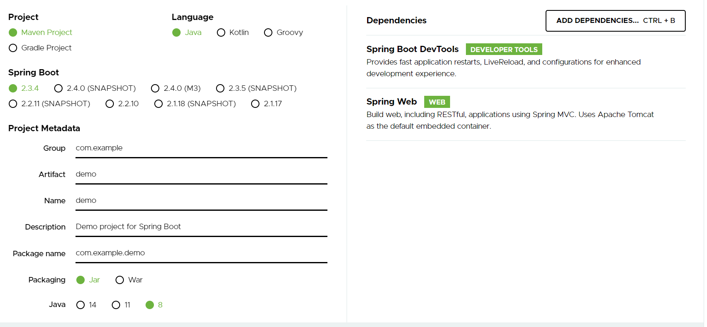

# 一、SpringBoot入门

## introduction
我们刚开始学习 JavaWeb 的时候，使用 Servlet/JSP 做开发，一个接口搞一个 Servlet ，很头大，后来我们通过隐藏域或者反射等方式，可以减少 Servlet 的创建，但是依然不方便，再后来，我们引入 Struts2/SpringMVC 这一类的框架，来简化我们的开发 ，和 Servlet/JSP 相比，引入框架之后，生产力确实提高了不少，但是用久了，又发现了新的问题，即配置繁琐易出错，要做一个新项目，先搭建环境，环境搭建来搭建去，就是那几行配置，不同的项目，可能就是包不同，其他大部分的配置都是一样的，Java 总是被人诟病配置繁琐代码量巨大，这就是其中一个表现。那么怎么办？Spring Boot 应运而生，Spring Boot 主要提供了如下功能：
1. 为所有基于 Spring 的 Java 开发提供方便快捷的入门体验。
2. 开箱即用，有自己自定义的配置就是用自己的，没有就使用官方提供的默认的。
3. 提供了一系列通用的非功能性的功能，例如嵌入式服务器、安全管理、健康检测等。
4. 绝对没有代码生成，也不需要XML配置。

Spring Boot 的出现让 Java 开发又回归简单，因为确实解决了开发中的痛点，因此这个技术得到了非常广泛的使用。

## 创建一个SpringBoot项目
### 在线创建

访问https://start.spring.io，填写项目信息：



- Project字段：Maven 主要用于后端项目多一些，Gradle一般用于安卓开发。
- SpringBoot默认选择最新的稳定版本。
- Group和Artifact唯一的标识一个项目。
- War包一般用于较大的单体应用，配合外部的Tomcat或者其他容器使用。SpringBoot项目内嵌了Tomcat，因此打成Jar包即可直接运行，建议将项目打包成Jar。

点击generate，将压缩包下载到本地，解压后使用IDEA导入。

### 使用IDEA创建SpringBoot项目

首先在创建项目时选择 Spring Initializr，如下图：


然后点击 Next ，填入 Maven 项目的基本信息，如下：


最后选择需要添加的依赖，如下图：


## SpringBoot HelloWorld

### 创建Web工程

选择Spring Initializer


点击Next，输入项目信息


在依赖中选择Spring Web，然后点击Next


确认项目位置，Finish


初始项目结构如下：


创建Controller类：


HelloController：

```java
package com.lq.helloworld.controller;

import org.springframework.web.bind.annotation.GetMapping;
import org.springframework.web.bind.annotation.RestController;

@RestController
public class HelloController {
    @GetMapping("/hello")
    public String hello() {
        return "Hello World";
    }
}

```

@RestController是一个组合注解，相当于@Controller+@ResponseBody，前者标记该类由Spring容器管理，后者标记该类返回的Java对象将被自动转换成json对象，并提交给Tomcat。

完成后点击运行，控制台输出以下内容代表部署成功：


打开浏览器，输入http://localhost:8080/hello，将显示以下内容：


### 项目解析

#### resources目录文件结构：

- static：存放所有静态的资源，例如：css，js，images

- templates：保存所有的模板页面（Spring Boot默认jar包使用嵌入式的Tomcat，默认不支持JSP页面），可以使用模板引擎（freemarker、thymeleaf）；
- application.properties：Springboot应用程序的默认配置文件，用户可在其中添加自定义配置覆盖某些默认配置。

#### pom.xml分析：

```xml
<parent>
        <groupId>org.springframework.boot</groupId>
        <artifactId>spring-boot-starter-parent</artifactId>
        <version>2.3.4.RELEASE</version>
        <relativePath/> <!-- lookup parent from repository -->
    </parent>
    <groupId>com.lq</groupId>
    <artifactId>helloworld</artifactId>
    <version>0.0.1-SNAPSHOT</version>
    <name>helloworld</name>
    <description>Demo project for Spring Boot</description>
```

自动创建一个SpringBoot工程时，会自动继承org.springframework.boot.spring-boot-starter-parent类，该类完成的功能有：

1. 定义JAVA编译版本为1.8
2. 使用UTF-8格式编码
3. 继承自spring-boot-dependencies，spring-boot-dependencies里定义了SpringBoot各种依赖组件的版本，因此在pom.xml导入依赖时不需要声明依赖的版本。
4. 执行打包操作的配置。
5. 自动化资源过滤。
6. 自动化插件配置。
7. 针对applicaiton.properties和applicaiton.yaml的资源过滤，包括通过profile定义的不同环境的配置文件，例如application-dev.properties 和 application-dev.yml。

**请注意，由于application.properties和application.yml文件接受Spring样式占位符 `$ {...}` ，因此 Maven 过滤更改为使用 `@ .. @` 占位符。**

**源码分析：**

使用IDEA时，按住Ctrl并单击spring-boot-starter-parent即可定位到源代码：


打开源码后可以看到spring-boot-starter-parent继承了spring-boot-dependencies类：


打开spring-boot-dependencies，可以看到该文件规定了SpringBoot所有组件的版本号：


由此，实现了功能3。

#### starter

```xml
<dependency>
    <groupId>org.springframework.boot</groupId>
    <artifactId>spring-boot-starter-web</artifactId>
</dependency>
```

**spring-boot-starter-web**：

spring-boot-starter：spring-boot场景启动器；帮我们导入了web模块正常运行所依赖的组件；

Spring Boot将所有的功能场景都抽取出来，做成一个个的starters（启动器），只需要在项目里面引入这些starter相关场景的所有依赖都会导入进来。要用什么功能就导入什么场景的启动器。

#### 入口类，主程序类

```java
/**
 *  @SpringBootApplication 来标注一个主程序类，说明这是一个Spring Boot应用
 */
package com.liuqi.yaml_example;

import org.springframework.boot.SpringApplication;
import org.springframework.boot.autoconfigure.SpringBootApplication;

@SpringBootApplication
public class YamlExampleApplication {

    public static void main(String[] args) {
        SpringApplication.run(YamlExampleApplication.class, args);
    }

}
```

@**SpringBootApplication**:    Spring Boot应用标注在某个类上说明这个类是SpringBoot的主配置类，SpringBoot就应该运行这个类的main方法来启动SpringBoot应用；

SpringBootApplication实现类：

```java
@Target({ElementType.TYPE})
@Retention(RetentionPolicy.RUNTIME)
@Documented
@Inherited
@SpringBootConfiguration
@EnableAutoConfiguration
@ComponentScan(
    excludeFilters = {@Filter(
    type = FilterType.CUSTOM,
    classes = {TypeExcludeFilter.class}
), @Filter(
    type = FilterType.CUSTOM,
    classes = {AutoConfigurationExcludeFilter.class}
)}
)
```

- @Target：标注注解的适用范围（方法，类……）。
- @Retention(RetentionPolicy.RUNTIME)：表示需要运行时去获取注解的信息。
- @SpringBootConfiguration：表示该JAVA类是一个SpringBoot配置类。
- @EnableAutoConfiguration：SpringBoot会自动导入所有依赖的默认配置类并自动配置。


Spring Boot在启动的时候从类路径下的META-INF/spring.factories中获取EnableAutoConfiguration指定的值，将这些值作为自动配置类导入到容器中，自动配置类就生效，帮我们进行自动配置工作；以前我们需要自己配置的东西，自动配置类都帮我们；

J2EE的整体整合解决方案和自动配置都在spring-boot-autoconfigure-2.3.4.RELEASE.jar；


# 二、配置文件

## 1.SpringBoot配置文件

在 Spring Boot 中，配置文件有两种不同的格式，一个是 properties ，另一个是 yaml 。虽然 properties 文件比较常见，但是相对于 properties 而言，yaml 更加简洁明了，而且使用的场景也更多，很多开源项目都是使用 yaml 进行配置（例如 Hexo）。除了简洁，yaml 还有另外一个特点，就是 yaml 中的数据是有序的，properties 中的数据是无序的，在一些需要路径匹配的配置中，顺序就显得尤为重要（例如我们在 Spring Cloud Zuul 中的配置），此时我们一般采用 yaml。

配置文件的作用是修改SpringBoot自动配置的默认值。

## 2.YAML

YAML 语言（发音 /ˈjæməl/ ）的设计目标，就是方便人类读写。它实质上是一种通用的数据串行化格式。

**以数据为中心**，比json、xml等更适合做配置文件；

基本语法：

> - 大小写敏感。
> - 使用缩进表示层级关系。
> - 缩进时不允许使用Tab键，只允许使用空格。
> - 缩进的空格数不重要，只需同级元素左侧对齐即可。

*#*：表示注释

YAML支持三种数据结构

- 对象：键值对的集合，又称为映射（mapping），哈希，字典
- 数组：一组按次数排列的值，又称为list（数组）/sequence（序列）
- 纯量：单个的，不可再分的值 

### 对象：

对象的一组键值对使用冒号表示（**冒号后一定要有空格**）：

```yaml
person: 
  name: Bob
  age: 20
```

或者使用行内写法：

```yaml
person: {name: Bob, age: 20}
```

对应的JS为：

```javas
{person: {name: 'Bob',age: 20} }
```

### 数组：

一组以-开头的行，构成一个数组

```yaml
aliases:
  - 土豆
  - 洋芋
  - potato
```

### 纯量：

- 字符串
- 布尔值：布尔变量用true和false表示。
- 整数
- 浮点数
- Null
- 时间
- 日期

数据直接以字面量的形式表示。

字符串默认不加引号，但是如果字符串包含空格或者特殊字符，需要放在引号之内。

- 单引号会对特殊字符进行转义
- 双引号不会会对特殊字符进行转义


**null用一个~表示**，例如：

`child: ~`


日期表示方式：

`data: 1999-06-09`

时间表示方式：

`time: 2020-09-25 16:01:00`


## 3.配置文件值注入

### 1. 利用@ConfigurationProperties

新建SpringBoot项目，添加Web和Spring Configuration Processor依赖。

创建目录：


Person类：

```java
package com.liuqi.yaml_example.pojo;

import org.springframework.boot.context.properties.ConfigurationProperties;
import org.springframework.stereotype.Component;

import java.util.Date;
import java.util.List;
import java.util.Map;
//在Spring中注册该类
@Component
//读取YAML文件前缀后的数据
@ConfigurationProperties(prefix = "person")
public class Person {
    private int age;
    private String name;
    private Boolean isMan;
    private Date birth;

    private Map<String, Object> children;
    private List<Object> aliases;
    private Address address;

    @Override
    public String toString() {
        return "Person{" +
                "age=" + age +
                ", name='" + name + '\'' +
                ", isMan=" + isMan +
                ", birth=" + birth +
                ", children=" + children +
                ", aliases=" + aliases +
                ", address=" + address +
                '}';
    }

    public int getAge() {
        return age;
    }

    public void setAge(int age) {
        this.age = age;
    }

    public String getName() {
        return name;
    }

    public void setName(String name) {
        this.name = name;
    }

    public Boolean getMan() {
        return isMan;
    }

    public void setMan(Boolean man) {
        isMan = man;
    }

    public Date getBirth() {
        return birth;
    }

    public void setBirth(Date birth) {
        this.birth = birth;
    }

    public Map<String, Object> getChildren() {
        return children;
    }

    public void setChildren(Map<String, Object> children) {
        this.children = children;
    }

    public List<Object> getAliases() {
        return aliases;
    }

    public void setAliases(List<Object> aliases) {
        this.aliases = aliases;
    }

    public Address getAddress() {
        return address;
    }

    public void setAddress(Address address) {
        this.address = address;
    }

}
```

Address类：

```java
package com.liuqi.yaml_example.pojo;
public class Address {
    private String address;

    public String getAddress() {
        return address;
    }

    public void setAddress(String address) {
        this.address = address;
    }

    @Override
    public String toString() {
        return "Address{" +
                "address='" + address + '\'' +
                '}';
    }
}
```

Controller类：

```java
package com.liuqi.yaml_example.controller;

import com.liuqi.yaml_example.pojo.Person;
import org.springframework.beans.factory.annotation.Autowired;
import org.springframework.web.bind.annotation.GetMapping;
import org.springframework.web.bind.annotation.RestController;

@RestController
public class PersonController {
    @Autowired
    Person person;
    @GetMapping("/person")
    public String getPerson() {
        return person.toString;
    }
}
```

在Yaml文件中填写数据：

application.yaml

```yaml
person:
  name: 张三
  age: 18
  isMan: false
  birth: 2017/12/12
  children:
    {first: bob, second: Alice}
  address:
    address: 南极洲

  aliases:
    - 赵亿
    - 赵万
    - 赵百
```

在浏览器输入：http://localhost:8080/person

输出为：


### 2. 利用@Value

```java
package com.liuqi.yaml_example.pojo;

import org.springframework.boot.context.properties.ConfigurationProperties;
import org.springframework.stereotype.Component;

import java.util.Date;
import java.util.List;
import java.util.Map;
/*
 *相当于：
 *<bean class = "Person">
 *		<property name = "name", value = "bob"></property>
 *</bean>
 *从properties后缀的配置文件读取数据时value = "${person.name}"
 *读取表达式时：value = "#{12*15}"
 */
//在Spring中注册该类
@Component
public class Person {
    @Value("#{10*2}")
    private int age;
    @Value("Bob")
    private String name;
    //从person.properties文件中读取person.isMan变量
    @Value("${person.isMan}")
    private Boolean isMan;
    private Date birth;

    private Map<String, Object> children;
    private List<Object> aliases;
    private Address address;
    .......
```


### 3. 总结

|                        | @ConfigurationProperties | @Value       |
| ---------------------- | ------------------------ | ------------ |
| 功能                   | 批量导入配置文件中的数据 | 单个注入数据 |
| 松散语法               | 支持                     | 不支持       |
| 表达式                 | 不支持                   | 支持         |
| 数据校验(例如@Email)   | 支持                     | 不支持       |
| 复杂类型封装(e.g. Map) | 支持                     | 不支持       |

- 单个获取用@Value
- 获取Bean所有属性用@ConfigurationPeoperties

## 4.自定义Bean的数据源

#### @PropertySource

注意：@PropertySource不支持yaml文件

​			必须设置setter和getter

```java
package com.liuqi.yaml_example.pojo;

import org.springframework.boot.context.properties.ConfigurationProperties;
import org.springframework.context.annotation.PropertySource;
import org.springframework.stereotype.Component;

@Component
@PropertySource(value = "classpath:student.properties")
@ConfigurationProperties(prefix = "student")
public class Student {
    private int age;
    private String name;
    private int height;

    public int getAge() {
        return age;
    }

    public void setAge(int age) {
        this.age = age;
    }

    public String getName() {
        return name;
    }

    public void setName(String name) {
        this.name = name;
    }

    public int getHeight() {
        return height;
    }

    public void setHeight(int height) {
        this.height = height;
    }

    @Override
    public String toString() {
        return "Student{" +
                "age=" + age +
                ", name='" + name + '\'' +
                ", height=" + height +
                '}';
    }
}
```

student.properties

```properties
student.age=18
student.height=190
student.name=张三
```

#### @ImportResource

在SpringBoot项目中导入Spring的配置文件，使其生效(Spring Boot不推荐)

需要添加到SpringBoot项目的主启动类之中

例如：

```java
package com.liuqi.yaml_example;

import org.springframework.boot.SpringApplication;
import org.springframework.boot.autoconfigure.SpringBootApplication;

@SpringBootApplication
@ImportResource(locations = "classpath:beans.xml")
public class YamlExampleApplication {

    public static void main(String[] args) {
        SpringApplication.run(YamlExampleApplication.class, args);
    }

}

```

**SpringBoot推荐的加入Spring配置文件的方式：**

1. 创建配置类，加上注解@Configuration
2. 使用@Bean为IOC容器添加组件(方法名为bean的id)

```java
@Configuration
public class MyConfig {
    @Bean
    public HelloService getHelloService() {
        return new HelloService();
    }
}
```

## 5.配置文件占位符

### 随机数

```properties
${random.value}
${random.int}	${random.int(20)}	${random.int(200,500)}
```

### 占位符获取之前配置的值，用：设置默认值

```properties
person.age=10
person.name=张三
person.cat=${person.name:上帝}_cat
```

## 6.Profile

### 多profile环境

在编写配置文件时，文件名可以是application-{profile}.properties/yaml

默认使用application.properties中的配置

### 激活profile

例如，创建application-dev.properties和application-prod.properties文件。

**方式一：**

在application.properties添加如下语句：

```properties
spring.profiles.active=dev
```

将会使application-dev.properties文件中的配置生效

**方式二**

在运行程序时加入命令：

```shell
java -jar xxx.jar --spring.profiles.active=dev
```

### yaml文档块

YAML可以通过分隔符“---”来划分代码块，可以在同一个文件中定义多种生产环境，例如：

```yaml
server: 
	port: 8081
spring: 
	profiles: 
		active: prod

---
server: 
	port: 8082
spring: 
	profiles: dev

---
server: 
	port: 8083
spring: 
	profiles: prod
```

## 7.classpath

springboot项目创建完成后，会生成该项目名称+iml后缀的文件。该文件位于项目的根目录下。
 打开后，在name="NewModuleRootManager"的component声明中，会有几个默认content声明


```bash
    <content url="file://$MODULE_DIR$/../userpermissions">
      <sourceFolder url="file://$MODULE_DIR$/../userpermissions/src/main/java" isTestSource="false" />
      <sourceFolder url="file://$MODULE_DIR$/../userpermissions/src/main/resources" type="java-resource" />
      <sourceFolder url="file://$MODULE_DIR$/../userpermissions/src/test/java" isTestSource="true" />
      <excludeFolder url="file://$MODULE_DIR$/../userpermissions/target" />
    </content>
```

其中sourceFolder 中声明的就是classpath，只是类型不同。
 对应的工程文件目录：


项目目录.png

其中蓝色的java目录：保存项目的java文件。
 resources是项目的资源目录，里面通常包含static与templates目录
 绿色的test/java目录是编写的测试类的目录。

- 工程编译后，会将src/main/java中的.java文件按照包文件结构编译成.class存入target/classes目录。
- 工程编译后，会将src/main/resources中的static、templates目录里的文件分别拷贝入classes/static 与classes/template 中。结构保持一致。
- 工程编译后，会将test/java 中的文件编译进classes/test-classes目录中。

可以根据项目需要，修改.iml文件的content，来添加不同的资源路径。


## 8. 配置文件加载位置

SpringBoot启动时会默认扫描以下位置中的application.properties或者application.yaml文件作为其默认配置文件。

```
- file: ./config/           #根目录的config文件下
- file: ./					#根目录下
- classpath:/config/		
- classpath:/
```

这四个路径的优先级由高到低，所有位置的配置文件都会被加载，高优先级的配置会覆盖掉低优先级的配置。

当同一个目录下同时存在properties和yml文件时，会优先加载properties文件里的内容，两个文件中的内容会进行互补操作，即SpringBoot会读取两份文件中的所有内容，会加载所有不同的配置项，汇成一个总的配置，如果同一个配置两个文件中都存在，那么properties中的配置会被加载，而忽略yml文件中的配置。
# 三、SpringBoot整合Mybatis

首先，创建新的Springboot项目，在依赖中选择SpringWeb和MybtisFrameWork。

创建数据库，命名为mybatis，然后执行以下SQL语句建表：

```sql
CREATE TABLE `users` (
    `id` int(10) unsigned NOT NULL AUTO_INCREMENT,
    `username` varchar(255) NOT NULL,
    `age` int(10) NOT NULL,
    `phone` bigint NOT NULL,
    `email` varchar(255) NOT NULL,
    PRIMARY KEY (`id`)
)ENGINE=InnoDB AUTO_INCREMENT=1 DEFAULT CHARSET=utf8;
```

向表中插入数据：

```sql
insert into users values(1,'赵',23,158,'3658561548@qq.com');
insert into users values(2,'钱',27,136,'3658561548@126.com');
insert into users values(3,'孙',31,159,'3658561548@163.com');
insert into users values(4,'李',35,130,'3658561548@sina.com')
```

在IDEA中连接数据库。

创建以下的目录结构：


User类：

```java
public class User {
    private String username;
    private int age;
    private int id;
    private Integer phone;
    private String email;

    public String getUsername() {
        return username;
    }

    public void setUsername(String username) {
        this.username = username;
    }

    public int getAge() {
        return age;
    }

    public void setAge(int age) {
        this.age = age;
    }

    public int getId() {
        return id;
    }

    public void setId(int id) {
        this.id = id;
    }

    public Integer getPhone() {
        return phone;
    }

    public void setPhone(Integer phone) {
        this.phone = phone;
    }

    public String getEmail() {
        return email;
    }

    public void setEmail(String email) {
        this.email = email;
    }
}
```

UserMapper类：

当主启动类与需要扫描的类不在一个包下时：将Mapper类注册到Spring有两种方式，一种方式时在Mapper类的上面加上@Mapper注解，另一种方式是在启动类中加上@MapperScan("com.lq.springboot_mybatis_demo.dao")，推荐使用第二种方式，避免每个mapper都要加注解。

```java
package com.lq.springboot_mybatis_demo.dao;

import com.lq.springboot_mybatis_demo.pojo.User;
import org.apache.ibatis.annotations.Mapper;
import org.apache.ibatis.annotations.Select;

import java.util.List;

public interface UserMapper {
    @Select("select * from users")
    List<User> getUserList();
}
```

UserSerivce类：

```java
package com.lq.springboot_mybatis_demo.service;

import com.lq.springboot_mybatis_demo.pojo.User;

import java.util.List;

public interface UserService {
    List<User> getUser();
}
```

UserServiceImpl类：

**（此处在userMapper处，IDEA可能会误报找不到bean，可通过设置将警告级别设为warning）**

```java
package com.lq.springboot_mybatis_demo.service;


import com.lq.springboot_mybatis_demo.dao.UserMapper;
import com.lq.springboot_mybatis_demo.pojo.User;
import org.springframework.beans.factory.annotation.Autowired;
import org.springframework.stereotype.Service;

import java.util.List;

@Service
public class UserServiceImpl implements UserService {
    @Autowired
    private UserMapper userMapper;

    @Overridejava
    public List<User> getUser() {
        return userMapper.getUserList();
    }
}
```

SpringbootMybatisDemoApplication类：

```java
package com.lq.mybatis_demo;

import org.springframework.boot.SpringApplication;
import org.springframework.boot.autoconfigure.SpringBootApplication;

@SpringBootApplication()
@MapperScan("com.lq.springboot_mybatis_demo.dao")
public class MybatisDemoApplication {

    public static void main(String[] args) {
        SpringApplication.run(MybatisDemoApplication.class, args);
    }

}

```

UserController:

```java
package com.lq.springboot_mybatis_demo.controller;

import com.lq.springboot_mybatis_demo.pojo.User;
import com.lq.springboot_mybatis_demo.service.UserService;
import org.springframework.beans.factory.annotation.Autowired;
import org.springframework.web.bind.annotation.GetMapping;
import org.springframework.web.bind.annotation.RestController;

import java.util.List;

@RestController
public class UserController {
    @Autowired
    UserService userService;
    
    @GetMapping("/user")
    public List<User> getUsers() {
        return userService.getUser();
    }
}
```

修改application.yaml

**注意，在url之后需要加上servierTimezone，否则运行程序时会报错，这属于mysql6.0以上版本的bug**

```yaml
Spring:
  datasource:
    url: jdbc:mysql://localhost:3306/mybatis?useUnicode=true&characterEncoding=utf-8&useSSL=true&serverTimezone=Asia/Shanghai
    username: root
    password: root
    driver-class-name: com.mysql.cj.jdbc.Driver
```

最后，运行程序，访问http://localhost:8080/user


# 四、在Centos7启动SpringBoot应用程序

1. 在Centos7中安装jdk1.8，并配置环境变量。

   可参考：https://blog.csdn.net/liuqi_67676767/article/details/108813945

2. 使用Maven将SpringBoot应用打Jar包，用Xshell与Xftp将文件复制到Centos7中。

3. VMware虚拟机使用NAT网络地址自动转换，输入：`ip addr`查看虚拟机IP地址。

4. 关闭Linux防火墙  `systemctl stop firewalld`

5. 进入jar文件所在目录，执行`java -jar xxx.jar`

   需要让centos在后台执行jar应用时，在命令后加上& `java -jar xxx.jar &`

6. 在主机打开浏览器，输入虚拟机IP加端口与web请求路径，例如：

   `http://192.168.85.130:8080/hello`

# 五 SpringBoot Web开发

## 导入静态资源

webjars：以Jar形式为Web工程提供静态资源

Springboot的静态资源路径为（均映射到localhost:8080/）：

```
"classpath:/META-INF/resources/",      //Web jars路径
"classpath:/resources/", 
"classpath:/static/", 
"classpath:/public/"
```

优先级排序：resources > static > public

## 欢迎页

在静态资源路径中添加index.html文件，即可设置欢迎页。

## Thymeleaf

向Html中装载数据。

```java
public static final String DEFAULT_PREFIX = "classpath:/templates/";
public static final String DEFAULT_SUFFIX = ".html";
```

### Demo
创建实体类User
```java
package com.example.springboot_web_demo.entity;

public class User {
    private String name;
    private int age;
    private User friend;

    public User(String name, int age) {
        this.name = name;
        this.age = age;
    }

    public User(String name) {
        this.name = name;
    }

    public User(String name, int age, User friend) {
        this.name = name;
        this.age = age;
        this.friend = friend;
    }

    public String getName() {
        return name;
    }

    public void setName(String name) {
        this.name = name;
    }

    public int getAge() {
        return age;
    }

    public void setAge(int age) {
        this.age = age;
    }

    public User getFriend() {
        return friend;
    }

    public void setFriend(User friend) {
        this.friend = friend;
    }
}

```
添加Controller

```java
package com.example.springboot_web_demo.controller;

import com.example.springboot_web_demo.entity.User;
import org.springframework.stereotype.Controller;
import org.springframework.ui.Model;
import org.springframework.web.bind.annotation.GetMapping;

import java.util.ArrayList;

@Controller
public class TestController {
    @GetMapping("/test")
    public String test(Model model) {
        model.addAttribute("msg", "悲伤逆流成河");
        //使用th:utext可以进行转义
        model.addAttribute("convert_msg", "<h3>转义后的悲伤</h3>");
        //使用th:each遍历数组
        ArrayList<User> list = new ArrayList<>();
        list.add(new User("张三", 10));
        list.add(new User("张四", 40));
        list.add(new User("张八", 80));
        model.addAttribute("user_list", list);
        //处理对象
        User user = new User("张三", 20, new User("路人甲"));
        model.addAttribute("user", user);
        return "test";
    }
}

```

在templates下添加test.html，使用th:text="${msg}"取出session中的数据

```html
<!DOCTYPE html>
<html lang="en" xmlns:th="http://www.thymeleaf.org">
<head>
    <meta charset="UTF-8">
    <title>First Thymeleaf</title>
</head>
<body>
    <div th:text="${msg}">ai</div>
    <div th:utext="${convert_msg}">default</div>
<table border="1">
    <thead>
        <tr th:each="user:${user_list}">
            <td th:text="${user.age}">1</td>
            <td th:text="${user.name}">a</td>
        </tr>
    </thead>
</table>
    <h5>
        <p>Name: <span th:text="${user.name}">Jack</span>.</p>
        <p>Age: <span th:text="${user.age}">21</span>.</p>
        <p>friend: <span th:text="${user.friend.name}">Rose</span>.</p>
    </h5>
</body>
</html>
```

### 基本语法

- 简单表达式

  - 变量\${...}

  - 消息#{...}

  - URL@{...}

- 字面值
	- 文本：'abc'   'wq'
	- 数字：10  61  80
	- 布尔：true false
	- Null：null

## SpringMVC自定义配置

新建Java类并实现WebMvcConfigurer接口

```java
package com.example.springboot_web_demo.config;

import org.springframework.context.annotation.Configuration;
import org.springframework.web.servlet.config.annotation.ViewControllerRegistry;
import org.springframework.web.servlet.config.annotation.WebMvcConfigurer;
//扩展SpringMVC的默认配置
@Configuration
public class MyMvcConfig implements WebMvcConfigurer {
    @Override
    public void addViewControllers(ViewControllerRegistry registry) {
        registry.addViewController("/jump_test").setViewName("jump_test");
    }
}
```


