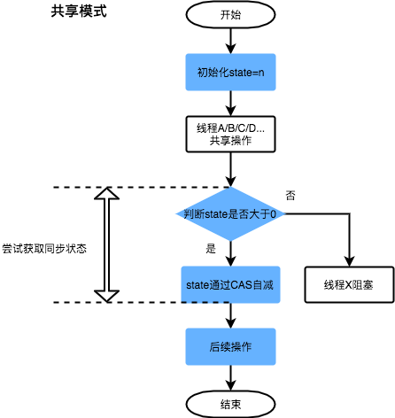

# 线程

现代操作系统在运行一个程序时，会为其创建一个进程。现代操作系统调度的最小单位是线程，也叫轻量级进程，在一个进程里可以创建多个线程，这些线程都拥有各自的PC，堆栈和局部变量等属性，并且能访问共享的内存变量，处理器在这些线程之间高速切换，让使用者感觉到这些线程在同时执行。

线程的优点：

- 充分利用处理器核心。
- 线程之间很容易共享内存。
- 创建线程的开销比较小。


# 线程的创建和启动

Java使用Thread类代表线程，所有线程对象都必须是Thread类或其子类的实例。

## 使用Thread类创建线程类

示例：

```java
public class ThreadTest extends Thread {
    private int i;
    @Override
    public void run() {
        for(; i < 100; i++) {
            System.out.println(getName()+" "+i);
        }
    }
    //main为主线程
    public static void main(String[] args) {
        for (int i = 0; i < 100; i++) {
            System.out.println(Thread.currentThread().getName()+" "+i);
            if(i == 20) {
                new ThreadTest().start();
                new ThreadTest().start();
            }
        }

    }
}
```

执行结果（三个线程交替执行）

```
...
main 26
main 27
main 28
Thread-1 0
Thread-0 0
Thread-1 1
main 29
Thread-1 2
Thread-1 3
Thread-1 4
Thread-0 1
Thread-1 5
main 30
Thread-1 6
Thread-0 2
Thread-0 3
...
```

上述代码中，`Thread.currentThread()`方法获取当前线程对应的实例，`getName()`返回线程的名字，`setName()`可以用于设置线程的名字。

**使用继承Thread类的方法来创建线程类时，多个线程之间无法共享线程类的实例变量。**

## 使用Runnable接口创建线程类

定义Runnable接口的实现类，重写run方法，然后以Runnable对象为参数实例化Thread类。

示例：

```java
public class ThreadTest implements Runnable {
    private int i;
    @Override
    public void run() {
        for(; i < 100; i++) {
            System.out.println(Thread.currentThread().getName() + " "+i);
        }
    }
    //main为主线程
    public static void main(String[] args) {
        for (int i = 0; i < 100; i++) {
            System.out.println(Thread.currentThread().getName()+" "+i);
            if(i == 20) {
                new Thread(new ThreadTest(), "thread_a").start();
                new Thread(new ThreadTest(), "thread_b").start();
            }
        }
    }
}
```

可以使用一个Runnable对象创建两个Thread对象，此时，两个Thread可以共享线程实例的成员变量。

```java
public class ThreadTest implements Runnable {
    private int i;
    @Override
    public void run() {
        for(; i < 100; i++) {
            System.out.println(Thread.currentThread().getName() + " "+i);
        }
    }
    //main为主线程
    public static void main(String[] args) {
        for (int i = 0; i < 100; i++) {
            System.out.println(Thread.currentThread().getName()+" "+i);
            if(i == 20) {
                Runnable r = new ThreadTest();
                new Thread(r, "thread_a").start();
                new Thread(r, "thread_b").start();
            }
        }
    }
}
```

Runnable是一个函数式接口，可以使用Lambda表达式创建实例。

## 使用Callable和Future创建线程

Callable接口提供了一个call()方法可以作为线程执行体，该方法具有返回值，并且可以抛出异常。

Java5提供了Future接口来代表Callable接口里call方法的返回值，并为其提供了`FutureTask`实现类，该类实现了Future和Runnable接口，能够作为Thread类的Target。

Future接口定义了以下的方法来控制其关联的Callable任务：

- `boolean cancel(boolean mayInterruptIfRunning)`：试图取消该Future关联的Callable任务。
- `V get()`：返回Callable任务里call方法的返回值，调用该方法将导致程序阻塞，必须等到子线程结束才会得到返回值。
- `V get(long timeout, TimeUnit unit)`：经过指定时间没有得到返回值时抛出`TimeoutException`。
- `boolean isCancelled()`：判断任务是否在正常完成前被取消。
- `boolean isDone()`

**Callable接口中的泛型与call方法的返回值相同，且Callable是函数式接口。**

示例：

```java
public class CallableTest {
    public static void main(String[] args) {
        CallableTest callableTest = new CallableTest();
        FutureTask<Integer> task = new FutureTask<Integer>((Callable<Integer>) () -> {
            int i = 0;
            for (; i < 10; i++) {
                System.out.println(Thread.currentThread().getName() + " " + i);
            }
            return i;
        });
        for (int i = 0; i < 60; i++) {
            new Thread(task, "call").start();
            System.out.println(Thread.currentThread().getName() + " " + i);
            try {
                System.out.println("return value :" + task.get());
            }catch (Exception e) {
                e.printStackTrace();
            }
        }
    }
}
```

## 创建线程的三种方式对比

相比Runnable，Callable能够返回结果和抛出异常，在不需要返回结果或抛出异常时推荐使用Runnable，使代码更简洁。

Runnable、Callable接口的优点：

- 线程类可以继承别的类。
- 多个线程可以共享一个target对象。

# 线程的状态

线程的状态：

- **初始(NEW)**：新创建了一个线程对象，但还没有调用start()方法。
- **运行(RUNNABLE)**：Java线程中将就绪（ready）和运行中（running）两种状态笼统的称为“运行”。
  线程对象创建后，其他线程(比如main线程）调用了该对象的start()方法。该状态的线程位于可运行线程池中，等待被线程调度选中，获取CPU的使用权，此时处于就绪状态（ready）。就绪状态的线程在获得CPU时间片后变为运行中状态（running）。
- **阻塞(BLOCKED)**：表示线程阻塞于一个锁。
- **等待(WAITING)**：进入该状态的线程需要等待其他线程做出一些特定动作（通知或中断）。
- **超时等待(TIMED_WAITING)**：该状态不同于WAITING，它可以在指定的时间后自行返回。
- **终止(TERMINATED)**：表示该线程已经执行完毕。

## 新建态和就绪态

当程序使用new创建了一个线程之后，该线程就处于新建状态，此时它和别的Java对象一样，由JVM进行管理，没有表现出现成的动态特性。

当线程对象调用了start方法后，线程转换为就绪态。Java虚拟机会为其创建方法调用栈和程序计数器，并将其加入就绪队列中，等待JVM里线程调度器的调度。

**注意：启动线程必须使用start方法。当使用run方法时，系统会将之视为一个成员方法来执行。调用run方法会破坏现成的新建态，再对其调用start会抛出`IllegalThreadStateException`，start方法只能作用于新建态的线程。**

调用start方法后，线程并不会立即执行，需要等待JVM进行调度。想要线程立即执行时，可以对主线程调用`Thread.sleep(1)`让出CPU，从而使线程能够执行。

## 运行态和阻塞态

如果处于就绪态的线程获得了CPU，开始执行run()方法的线程执行体，该线程就变成了运行状态。

当发生以下情况时，线程会进入阻塞状态：

- 线程调用sleep方法主动放弃所占用的处理器资源。
- 线程调用了一个阻塞式IO方法，在该方法返回前，线程被阻塞。
- 线程试图获得一个同步监视器，而该监视器正被其他线程持有。
- 线程在等待某个通知（notify）。
- 程序调用了线程的suspend方法将线程挂起（该方法容易导致死锁，应尽量避免使用该方法）。

线程从阻塞态进入就绪态的场景包括：

- 调用sleep方法的线程经过了指定时间。
- 线程调用的阻塞式IO方法已经返回。
- 线程成功获得了试图取得的同步监视器。
- 线程收到了特定notify。。


## 线程死亡

线程有三种方式结束：

- run或call方法执行完毕。
- 线程抛出一个未捕获的Exception或Error。
- 直接调用线程的stop方法（已废弃，由于执行stop后不能保证线程释放已经获取的资源，如锁，因此易导致死锁）。

对线程对象调用`isAlive`方法可以测试其状态，当线程处于就绪、运行、阻塞三种状态时，该方法返回true；处于新建、死亡两种状态时，返回false。

# 控制线程

## Join线程

Thread提供了join方法让一个线程等待另一个线程完成。当在某个程序执行流中调用其他线程的join方法时，调用线程将被阻塞，直到该join方法加入的join线程执行完为之。

```java
public class JoinThread extends Thread {
    public JoinThread(String name) {
        super(name);
    }
    @Override
    public void run() {
        for (int i = 0; i < 40; i++) {
            System.out.println(getName()+" "+i);
        }
    }
    public static void main(String[] args) throws Exception {
        //新线程与main轮流执行
        new JoinThread("新线程").start();
        for (int i = 0; i < 50; i++) {
            if(i == 20) {
                JoinThread joinThread = new JoinThread("需要等待完成的线程");
                joinThread.start();
                //此时main等待joinThread完成，joinThread和新线程并发执行
                joinThread.join();
            }
            System.out.println(Thread.currentThread().getName() + " " + i);
        }
    }
}
```

join有以下三种重载形式：

- `join()`：等待被join的线程执行结束。
- `join(long mills)`：等待mills时间还未执行结束就不再等待。
- `join(long mills, int nanos)`：等待mills毫秒+`nanos`微秒。

## 后台线程

在后台运行的线程被称为后台线程（Daemon Thread），也叫“守护线程”。JVM的垃圾回收线程就是一个典型的后台线程。

后台线程有个特征：如果所有前台线程都死亡，后台线程就会自动死亡。

调用Thread对象的`setDaemon(true)`方法可以将指定线程设置为后台线程。

示例：

```java
public class Daemon extends Thread {
    @Override
    public void run() {
        for (int i = 0; i < 10000; i++) {
            System.out.println(getName() + " " + i);
        }
    }

    public static void main(String[] args) {
        Daemon t = new Daemon();
        t.setDaemon(true);
        t.start();
        for (int i = 0; i < 10; i++) {
            System.out.println(Thread.currentThread().getName() + " " + i);
        }
        //程序执行到此处时前台线程结束，随后后台也会自动结束
    }
}
```

前台线程创建的子线程默认为前台线程，后台线程创建的子线程默认为后台线程。

`setDaemon`方法必须在`start`方法调用之前调用。

## 线程休眠

如果需要让当前线程暂停一段时间，进入阻塞态，可以通过调用Thread类的静态方法sleep。
- `static void sleep(long millis)`：暂停`millis`毫秒。
- `static void sleep(long mills, int nanos)`：暂停`millis+nanos`时间。

示例：

```java
public static void main(String[] args) throws InterruptedException {
    for (int i = 0; i < 10; i++) {
        System.out.println(i);
    }
    Thread.sleep(10);
}
```

## 线程让步：yield

yield方法是一个和sleep()方法有点相似的方法，它也是Thread类提供的一个静态方法，会使得当前正在执行的线程暂停，并加入就绪队列。调用yield之后，线程调度器会重新调度一次线程。

## 改变线程优先级

每个线程的默认优先级与创建它的父线程的优先级相同，在默认情况下，main线程具有普通优先级，其创建的子线程也具有普通优先级（即`Thread.NORM_PRIORITY`）。

Thread类提供了`setPriority(int newPriority)、getPriority()`方法来设置和返回指定线程的优先级，其中`setPriority`方法的参数是一个1-10之间的整数。Thread类提供了以下的三个优先级宏：

- MAX_PRIORITY    10
- MIN_PRIORITY    1
- NORM_PRIORITY    5

示例：

 ```java
public class PriorityTest extends Thread {
    @Override
    public void run() {
        for (int i = 0; i < 50; i++) {
            System.out.println(getName()+",其优先级为："+getPriority()+",i="+i);
        }
    }

    public PriorityTest(String s) {
        super(s);
    }

    public static void main(String[] args) {
        Thread.currentThread().setPriority(6);
        for (int i = 0; i < 30; i++) {
            if(i==10) {
                PriorityTest pt1 = new PriorityTest("low");
                //默认优先级为6
                pt1.start();
                pt1.setPriority(Thread.MIN_PRIORITY);
            }
            if(i==20) {
                PriorityTest pt2 = new PriorityTest("high");
                pt2.start();
                pt2.setPriority(Thread.MAX_PRIORITY);
            }
        }
    }
}
 ```

输出：

```
low,其优先级为：1,i=0
high,其优先级为：10,i=0
low,其优先级为：1,i=1
high,其优先级为：10,i=1
low,其优先级为：1,i=2
high,其优先级为：10,i=2
low,其优先级为：1,i=3
high,其优先级为：10,i=3
...
```

## 安全地终止线程

demo：

```java
public class ShutDown {

    public static void main(String[] args) {


        Runner runner1 = new Runner();
        Thread currentThread = new Thread(runner1, "countThread");
        currentThread.start();
        try {
            TimeUnit.SECONDS.sleep(1);
        } catch (InterruptedException e) {
            e.printStackTrace();
        }
        currentThread.interrupt();
        Runner runner2 = new Runner();
        currentThread = new Thread(runner2, "countThread");
        currentThread.start();
        try {
            TimeUnit.SECONDS.sleep(1);
        } catch (InterruptedException e) {
            e.printStackTrace();
        }
        runner2.cancel();

    }

    private static class Runner implements Runnable {

        private long i;

        private volatile boolean on = true;

        @Override
        public void run() {
            while (on && !Thread.currentThread().isInterrupted()) {
                i++;
            }
            System.out.println("count = " + i);
        }

        private void cancel() {
            this.on = false;
        }
    }
}
```

1. 通过 interrupt 方法将线程的标志位清零，让线程退出线程体。

2. 通过修改一个 volatile 变量，让线程退出线程体。

# 线程同步

## synchronized

### 同步代码块

为了解决线程同步的问题，Java引入了同步监视器，使用同步监视器的通用方法是同步代码块，语法格式为：

```java
synchronized(obj) {
    //同步代码块
}
```

`obj`就是同步监视器，线程开始执行同步代码块之前，要先获得`obj`的锁。

**tips：任何时候只能有一个线程获得同步监视器的锁，同步代码块执行结束后，线程会释放锁。**

通常使用可以被并发访问的共享资源充当同步监视器。

```java
import java.util.Objects;

public class DrawThread extends Thread {
    private Account account;
    private double drawAmount;
    public DrawThread(String name, Account account, double drawAmount) {
        super(name);
        this.account = account;
        this.drawAmount = drawAmount;
    }

    @Override
    public void run() {
        synchronized (account) {
            if(account.getBalance() >= drawAmount) {
                System.out.println(getName()+"取钱成功，取出：$"+drawAmount);
                account.setBalance(account.getBalance()-drawAmount);
                System.out.println("余额为："+account.getBalance());
            }else {
                System.out.println("余额不足！");
            }
        }
    }

    public static void main(String[] args) {
        Account account = new Account("root", 1000);
        DrawThread t1 = new DrawThread("a", account, 600);
        DrawThread t2 = new DrawThread("b", account, 600);
        t1.start();
        t2.start();
    }
}
class Account {
    private String accountNo;
    private double balance;

    public Account(String accountNo, double balance) {
        this.accountNo = accountNo;
        this.balance = balance;
    }

    public Account() {
    }

    public String getAccountNo() {
        return accountNo;
    }

    public void setAccountNo(String accountNo) {
        this.accountNo = accountNo;
    }

    public double getBalance() {
        return balance;
    }

    public void setBalance(double balance) {
        this.balance = balance;
    }

    @Override
    public boolean equals(Object o) {
        if (this == o) return true;
        if (o == null || getClass() != o.getClass()) return false;
        Account account = (Account) o;
        return Objects.equals(accountNo, account.getAccountNo());
    }

    @Override
    public int hashCode() {
        return Objects.hash(accountNo);
    }
}
```

输出：

```
a取钱成功，取出：$600.0
余额为：400.0
余额不足！
```

### 同步方法

Java还为多线程安全提供了同步方法，即使用synchronized关键字修饰的方法。对于synchronized修饰的实例方法，无需显式指定同步监视器，其同步监视器是this，即调用该方法的对象。

上面的例子中，为Account类添加一个synchronized方法即能方便的实现线程同步。

```java
public class DrawThread extends Thread {
    private Account account;
    private double drawAmount;
    public DrawThread(String name, Account account, double drawAmount) {
        super(name);
        this.account = account;
        this.drawAmount = drawAmount;
    }

    @Override
    public void run() {
        account.draw(drawAmount);
    }

    public static void main(String[] args) {
        Account account = new Account("root", 1000);
        DrawThread t1 = new DrawThread("a", account, 600);
        DrawThread t2 = new DrawThread("b", account, 600);
        t1.start();
        t2.start();
    }
}
class Account {
    private String accountNo;
    private double balance;

    public Account(String accountNo, double balance) {
        this.accountNo = accountNo;
        this.balance = balance;
    }

    public Account() {
    }

    public String getAccountNo() {
        return accountNo;
    }

    public void setAccountNo(String accountNo) {
        this.accountNo = accountNo;
    }

    public double getBalance() {
        return balance;
    }

    @Override
    public boolean equals(Object o) {
        if (this == o) return true;
        if (o == null || getClass() != o.getClass()) return false;
        Account account = (Account) o;
        return Objects.equals(accountNo, account.getAccountNo());
    }

    @Override
    public int hashCode() {
        return Objects.hash(accountNo);
    }

    public synchronized void draw(double drawAmount) {
        if(balance >= drawAmount) {
            System.out.println(Thread.currentThread().getName()+"取钱成功，取出：$"+drawAmount);
            balance -= drawAmount;
            System.out.println("余额为：$" + balance);
        }else {
            System.out.println("余额不足！");
        }
    }
}
```

**在Account里定义draw方法更符合面向对象的规则。**

### 释放同步监视器的锁定

线程释放同步监视器的情况：

- 当前线程的同步代码块或同步方法执行结束；
- 当前线程在同步代码块、同步方法中遇到了break、return终止了该代码块或该方法的继续执行；
- 当前线程在同步代码块、同步方法中遇到了未处理的Error或Exception；
- 当前线程在执行同步代码块、同步方法时执行了同步监视器对象（同步代码块的`obj`或者同步方法的this对象）的wait()方法，则当前线程暂停，并释放同步监视器（wait方法属于Object类）。

在下列情况下，线程不会释放同步监视器：

- 执行同步代码块或同步方法时，调用`Thread.sleep()`或`Thread.yield()`方法来暂停当前线程。

## AQS

### overview

AQS的全程为 `AbstractQueuedSynchronizer`，位于`java.util.concurrent.locks`。

AQS 就是一个抽象类，主要用来构建锁和同步器。

```java
public abstract class AbstractQueuedSynchronizer extends AbstractOwnableSynchronizer implements java.io.Serializable {
}
```

AQS 为构建锁和同步器提供了一些通用功能的是实现，因此，使用 AQS 能简单且高效地构造出应用广泛的大量的同步器，比如 `ReentrantLock`，`Semaphore`，其他的诸如 `ReentrantReadWriteLock`，`SynchronousQueue`，`FutureTask`(jdk1.7) 等等皆是基于 AQS 的。

AQS框架图：


- 上图中有颜色的为Method，无颜色的为Attribution。
- 总的来说，AQS框架共分为五层，自上而下由浅入深，从AQS对外暴露的API到底层基础数据。
- 当有自定义同步器接入时，只需重写第一层所需要的部分方法即可，不需要关注底层具体的实现流程。当自定义同步器进行加锁或者解锁操作时，先经过第一层的API进入AQS内部方法，然后经过第二层进行锁的获取，接着对于获取锁失败的流程，进入第三层和第四层的等待队列处理，而这些处理方式均依赖于第五层的基础数据提供层。

### AQS原理

**AQS 核心思想是，如果被请求的共享资源空闲，则将当前请求资源的线程设置为有效的工作线程，并且将共享资源设置为锁定状态。如果被请求的共享资源被占用，那么就需要一套线程阻塞等待以及被唤醒时锁分配的机制，这个机制 AQS 是用 CLH 队列锁实现的，即将暂时获取不到锁的线程加入到队列中。**

> CLH(`Craig`,`Landin`,and `Hagersten`)队列是一个虚拟的双向队列（虚拟的双向队列即不存在队列实例，仅存在结点之间的关联关系）。AQS 是将每条请求共享资源的线程封装成一个 CLH 锁队列的一个结点（Node）来实现锁的分配。

AQS 原理图：


AQS 使用一个 `int` 成员变量来表示同步状态，通过内置的 FIFO 队列来完成获取资源线程的排队工作。AQS 使用 CAS 对该同步状态进行原子操作实现对其值的修改。

#### AQS 数据结构

AQS 基本的数据结构Node：


| 方法和属性值 | 含义                                             |
| :----------- | :----------------------------------------------- |
| `waitStatus` | 当前节点在队列中的状态                           |
| thread       | 表示处于该节点的线程                             |
| `prev`       | 前驱指针                                         |
| predecessor  | 返回前驱节点，没有的话抛出Null Pointer Exception |
| `nextWaiter` | 指向下一个处于CONDITION状态的节点                |
| next         | 后继指针                                         |

线程两种锁的模式：

| 模式      | 含义                           |
| :-------- | :----------------------------- |
| SHARED    | 表示线程以共享的模式等待锁     |
| EXCLUSIVE | 表示线程正在以独占的方式等待锁 |

`waitStatus`有下面几个枚举值：

| 枚举      | 含义                                           |
| :-------- | :--------------------------------------------- |
| 0         | 当一个Node被初始化的时候的默认值               |
| CANCELLED | 为1，表示线程获取锁的请求已经取消了            |
| CONDITION | 为-2，表示节点在等待队列中，节点线程等待唤醒   |
| PROPAGATE | 为-3，当前线程处在SHARED情况下，该字段才会使用 |
| SIGNAL    | 为-1，表示线程已经准备好了，就等资源释放了     |


#### 同步状态 state


```java
private volatile int state;//共享变量，使用volatile修饰保证线程可见性

//返回同步状态的当前值
protected final int getState() {
    return state;
}
//设置同步状态的值
protected final void setState(int newState) {
    state = newState;
}
//原子地（CAS操作）将同步状态值设置为给定值update如果当前同步状态的值等于expect（期望值）
protected final boolean compareAndSetState(int expect, int update) {
    return unsafe.compareAndSwapInt(this, stateOffset, expect, update);
}
```

通过修改State字段表示的同步状态可以实现多线程的独占模式和共享模式（加锁过程）





## `ReentrantLock`

> 可重入锁：某个线程已经获得某个锁，可以再次获取锁而不会出现死锁（同一个线程持有锁的前提下再次申请当前锁），synchronized 和 Lock 均为可重入锁。
>
> 可中断锁：可中断锁就是可以响应中断的锁。在Java中，synchronized不是可中断锁，而Lock是可中断锁。如果某一线程A正在执行锁中的代码，另一线程B正在等待获取该锁，对于 synchronized，B只能一直阻塞等待，对于 Lock，B可以在超时后中断对共享资源的等待过程并执行其他代码。
>
> 公平锁：公平锁即尽量保证线程以请求锁的顺序来获取锁。比如，多个线程等待一个锁，当这个锁被释放时，等待时间最久的线程会获得该锁。而非公平锁则无法保证锁的获取按照请求锁的顺序进行，可能导致某个或者一些线程永远获取不到锁，synchronized 为非公平锁。

Java5可以通过显式定义同步锁对象来实现同步，由Lock对象充当同步锁。

Lock是控制多个线程对共享资源进行访问的工具。通常锁提供了对共享资源的独占访问，每次只能有一个线程对Lock对象加锁，线程开始访问共享资源之前应先获得Lock对象（有些锁，如`ReadWriteLock`（读写锁）允许对共享资源并发访问）。Lock、`ReadWriteLock`是Java5提供的两个根接口，并为Lock提供了`ReentrantLock`（可重入锁）实现类，为`ReadWriteLock`提供了`ReentrantReadWriteLock`实现类。

`ReentrantLock`与`synchronized`的区别：


demo：

```java
// **************************Synchronized的使用方式**************************
// 1.用于代码块
synchronized (this) {}
// 2.用于对象
synchronized (object) {}
// 3.用于方法
public synchronized void test () {}
// 4.可重入
for (int i = 0; i < 100; i++) {
	synchronized (this) {}
}
// **************************ReentrantLock的使用方式**************************
public void test () throw Exception {
	// 1.初始化选择公平锁、非公平锁
	ReentrantLock lock = new ReentrantLock(true);
	// 2.可用于代码块
    // 可重入性 获取两次锁
	lock.lock();
	try {
		try {
			// 3.支持多种加锁方式，比较灵活; 具有可重入特性
			if(lock.tryLock(100, TimeUnit.MILLISECONDS)){ }
		} finally {
			// 4.手动释放锁
			lock.unlock()
		}
	} finally {
		lock.unlock();
	}
}
```

`ReentrantLock`锁具有可重入性，也就是说，一个线程可以对已被加锁的`ReentrantLock` 锁再次加锁，`ReentrantLock`对象会维持一个计数器来追踪`lock()`方法的嵌套调用，线程在每次调用`lock()`加锁后，必须显式调用`unlock()`来释放锁，所以一段被锁保护的代码可以调用另一个被相同锁保护的方法。

`ReentrantLock`锁的构造方法中不传入参数或传入true时，产生公平锁，传入false时，产生非公平锁。

> 公平锁：以请求锁的顺序获得锁。
>
> 非公平锁：不保证锁的公平性，如synchronized。

**Lock要求用户手动释放锁，如果没有主动释放锁，就有可能导致出现死锁现象。**

`tryLock()`与`tryLock(long time, TimeUnit unit)`是比较常用的两个方法，并且体现了Lock的可中断性。

`tryLock()`方法具有返回值，它表示尝试获取锁，如果获取成功，则返回true；如果获取失败（即锁已被其他线程获取），则返回false，也就是说，这个方法无论如何都会立即返回（在拿不到锁时不会一直在那等待）。

`tryLock(long time, TimeUnit unit)`方法和`tryLock()`方法类似，只不过这个方法在拿不到锁时会等待一定的时间，在时间期限之内如果还拿不到锁，就返回false，同时可以响应中断。如果一开始拿到锁或者在等待期间内拿到了锁，则返回true。

一般情况下，通过`tryLock`来获取锁时是这样使用的：

```java
Lock lock = ...;
if(lock.tryLock()) {
     try{
         //处理任务
     }catch(Exception ex){
		//处理异常
     }finally{
         lock.unlock();   //释放锁
     } 
}else {
    //如果不能获取锁，则直接做其他事情
}
```

**Lock与synchronized的区别：**

1. `synchronized`是Java语言的关键字，因此是内置特性，`Lock`不是Java语言内置的，Lock是一个接口，通过实现类可以实现同步访问。
2. `synchronized`是在JVM层面上实现的，不但可以通过一些监控工具监控`synchronized`的锁定，而且在代码执行时出现异常，JVM会自动释放锁定，但是使用Lock则不行，`Lock`是通过代码实现的，要保证锁定一定会被释放，就必须将`unLock()`放到`finally{}`中
3. 在资源竞争不是很激烈的情况下，`synchronized`的性能要优于`ReetrantLock`，但是在资源竞争很激烈的情况下，`synchronized`的性能会下降几十倍，但是`ReetrantLock`的性能能维持常态。

###  `ReentrantLock`源码分析

AQS提供了大量用于自定义同步器实现的Protected方法。自定义同步器实现的相关方法也只是为了通过修改State字段来实现多线程的独占模式或者共享模式。自定义同步器需要实现以下方法（`ReentrantLock`需要实现的方法如下，并不是全部）：

| 方法名                                        | 描述                                                         |
| :-------------------------------------------- | :----------------------------------------------------------- |
| `protected boolean isHeldExclusively()`       | 该线程是否正在独占资源。只有用到Condition才需要去实现它。    |
| `protected boolean tryAcquire(int arg)`       | 独占方式。`arg`为获取锁的次数，尝试获取资源，成功则返回True，失败则返回False。 |
| `protected boolean tryRelease(int arg)`       | 独占方式。`arg`为释放锁的次数，尝试释放资源，成功则返回True，失败则返回False。 |
| `protected int tryAcquireShared(int arg)`     | 共享方式。`arg`为获取锁的次数，尝试获取资源。负数表示失败；0表示成功，但没有剩余可用资源；正数表示成功，且有剩余资源。 |
| `protected boolean tryReleaseShared(int arg)` | 共享方式。`arg`为释放锁的次数，尝试释放资源，如果释放后允许唤醒后续等待结点返回True，否则返回False。 |

一般来说，自定义同步器要么是独占方式，要么是共享方式，它们也只需实现`tryAcquire-tryRelease`、`tryAcquireShared-tryReleaseShared`中的一种即可。AQS也支持自定义同步器同时实现独占和共享两种方式，如`ReentrantReadWriteLock`。`ReentrantLock`是独占锁，所以实现了`tryAcquire-tryRelease`。

`ReentrantLock`中公平锁和非公平锁在底层是相同的。

**1. 加锁**

```java
//根据传入参数初始化内部的sync为公平锁方式或非公平锁方式
public ReentrantLock(boolean fair) {
    sync = fair ? new FairSync() : new NonfairSync();
}
//调用内部类中的lock方法
public void lock() {
    sync.lock();
}
```

非公平锁：

```java
// java.util.concurrent.locks.ReentrantLock

static final class NonfairSync extends Sync {
	...
	final void lock() {
        // 尝试快速CAS获取锁，失败后走正常流程，先检测state，根据state判断是否进行CAS
		if (compareAndSetState(0, 1))
			setExclusiveOwnerThread(Thread.currentThread());
		else
			acquire(1);
	}
  ...
}
```

公平锁：

```java
// java.util.concurrent.locks.ReentrantLock

static final class NonfairSync extends Sync {
	...
	final void lock() {
        acquire(1);
    }
    ...
}
```

区别在于，非公平锁会直接尝试一次插队获取锁，非公平锁获取失败后，二者都进入 acquire 方法（AQS 中的一个模板方法）。

```java
// java.util.concurrent.locks.AbstractQueuedSynchronizer

public final void acquire(int arg) {
	if (!tryAcquire(arg) && acquireQueued(addWaiter(Node.EXCLUSIVE), arg))
		selfInterrupt();
}
```

首先执行 `tryAcquire` 方法（区别在于公平锁会多一个检测当前节点是否是队首节点的检测）。

非公平锁：

```java
// NonfairSync中
protected final boolean tryAcquire(int acquires) {
    return nonfairTryAcquire(acquires);
}
// NonfairSync的父类Sync中
final boolean nonfairTryAcquire(int acquires) {
    final Thread current = Thread.currentThread();
    int c = getState();
    // 锁未被占用，直接CAS尝试获取锁
    if (c == 0) {
        if (compareAndSetState(0, acquires)) {
            setExclusiveOwnerThread(current);
            return true;
        }
    }
    // 获得锁的线程再次获取锁，修改state变量，表示重入
    else if (current == getExclusiveOwnerThread()) {
        int nextc = c + acquires;
        if (nextc < 0) // overflow
            throw new Error("Maximum lock count exceeded");
        setState(nextc);
        return true;
    }
    return false;
}
```

公平锁中：

```java
protected final boolean tryAcquire(int acquires) {
    final Thread current = Thread.currentThread();
    int c = getState();
    // 锁未占用
    if (c == 0) {
        // 当前节点是队列中的队首节点时，CAS尝试获取锁
        if (!hasQueuedPredecessors() &&
            compareAndSetState(0, acquires)) {
            setExclusiveOwnerThread(current);
            return true;
        }
    }
    // 锁的重入
    else if (current == getExclusiveOwnerThread()) {
        int nextc = c + acquires;
        if (nextc < 0)
            throw new Error("Maximum lock count exceeded");
        setState(nextc);
        return true;
    }
    return false;
}
```

当获取锁失败后，会继续执行 acquire 方法：

```java
// java.util.concurrent.locks.AbstractQueuedSynchronizer

public final void acquire(int arg) {
	if (!tryAcquire(arg) && acquireQueued(addWaiter(Node.EXCLUSIVE), arg))
		selfInterrupt();
}


// 向阻塞队列添加一个元素
private Node addWaiter(Node mode) {
    Node node = new Node(Thread.currentThread(), mode);
    // Try the fast path of enq; backup to full enq on failure
    Node pred = tail;
    if (pred != null) {
        node.prev = pred;
        // CAS修改尾节点
        if (compareAndSetTail(pred, node)) {
            pred.next = node;
            return node;
        }
    }
    //如果pred为null，或者CAS失败（存在竞争），执行enq
    enq(node);
    return node;
}

//enq
private Node enq(final Node node) {
    // 如果CAS失败，自旋CAS
    for (;;) {
        Node t = tail;
        if (t == null) { // Must initialize
            // 队列为空（第一个申请锁的线程不需要创建Node），将tail和head初始化为一个头节点，再插入node
            if (compareAndSetHead(new Node()))
                tail = head;
        } else {
            node.prev = t;
            // CAS修改尾节点
            if (compareAndSetTail(t, node)) {
                t.next = node;
                return t;
            }
        }
    }
}
```

自旋获取锁的过程：

```java
// 对排队中的node执行获取锁的操作，直到获取成功或发生中断
// 为true表示存在需要取消加锁的节点，仅从这段代码可以看出，
// 除非发生异常，否则不会存在需要取消加锁的节点。
final boolean acquireQueued(final Node node, int arg) {
    // 标记是否成功获取到锁
    boolean failed = true;
    try {
        /**
    	 * interrupted表示在CLH队列的调度过程中,当前线程在休眠时,有没有被中断过
    	 */
        boolean interrupted = false;
        // 自旋
        for (;;) {
            // 获取前驱节点
            final Node p = node.predecessor();
            // 如果前驱为头节点，则尝试获取锁
            if (p == head && tryAcquire(arg)) {
                // 获取锁成功，头节点修改为当前节点
                setHead(node);
                p.next = null; // help GC
                failed = false;
                return interrupted;
            }
            if (shouldParkAfterFailedAcquire(p, node) &&
                parkAndCheckInterrupt())
                interrupted = true;
        }
    } finally {
        if (failed)
            cancelAcquire(node);
    }
}

private void setHead(Node node) {
    head = node;
    node.thread = null;
    node.prev = null;
}

// 返回当前线程是否应该被阻塞
private static boolean shouldParkAfterFailedAcquire(Node pred, Node node) {
    // 获取前驱的节点状态
    int ws = pred.waitStatus;
    if (ws == Node.SIGNAL)
        /*
         * 如果前继节点状态为SIGNAL, 说明前驱节点在等待获取锁，当前线程需要被阻塞
         */
        return true;
    if (ws > 0) {
        /*
         * 如果前继节点状态为CANCELLED, 说明前驱节点已经取消,则需要通过回溯找到一个非CANCELLED状态有效节点值(值小于等于0)设置为前驱节点
         * 并返回false
         */
        do {
            node.prev = pred = pred.prev;
        } while (pred.waitStatus > 0);
        pred.next = node;
    } else {
        // 如果前继节点状态值为0或者共享锁PROPAGATE. 即前继节点为非SIGNAL或非CANCELLED, 则设置前继节点为SIGNAL, 
        // 并返回false（下一轮执行中，当前线程会被阻塞）
        compareAndSetWaitStatus(pred, ws, Node.SIGNAL);
    }
    return false;
}

// 线程需要阻塞时，调用该方法挂起当前线程，然后返回当前线程的中断状态
private final boolean parkAndCheckInterrupt() {
    LockSupport.park(this);
    return Thread.interrupted();
}
```

**解锁**


### 总结


# 线程通信

## 等待/通知机制

假设现在系统中有两个线程,这两个线程分别代表存款者和取钱者——现在假设系统有一种特殊的要求，系统要求存款者和取钱者不断地重复存款、取钱的动作，而且要求每当存款者将钱存入指定账户后，取钱者就立即取出该笔钱。不允许存款者连续两次存钱，也不允许取钱者连续两次取钱。

为了实现这种功能，可以借助于Object类提供的`wait()`、`notify()`和`notifyAll()`三个方法，这三个方法并不属于Thread类，而是属于Object类。但这三个方法必须由同步监视器对象来调用，这可分成以下两种情况。

- 对于使用synchronized修饰的同步方法，因为该类的默认实例( this）就是同步监视器，所以可以在同步方法中直接调用这三个方法。
- 对于使用synchronized修饰的同步代码块，同步监视器是synchronized后括号里的对象，所以必须使用该对象调用这三个方法。

这三个方法的功能如下：

- `wait()`：导致当前线程等待，直到其他线程调用该同步监视器的`notify()`方法或`notifyAll()`方法来唤醒该线程。调用无参的wait时，会一直等待直到其他线程通知，调用有参wait时，会在等待指定时间后自动苏醒。调用wait方法的线程会立即释放对同步监视器的锁定。
- `notify()`：唤醒在此同步监视器上等待的单个线程（将其从等待队列移动到同步队列）。如果所有线程都在该同步监视器上等待，则会随机选择唤醒其中一个线程。只有当前线程放弃对同步监视器的锁定，才可以执行被唤醒的线程。
- `notifyAll()`：唤醒在此同步监视器上等待的所有线程。

示例：

```java
public class Account {

    private String accountNo;
    private double balance;
    private boolean flag = false;

    public Account(String accountNo, double balance) {
        this.accountNo = accountNo;
        this.balance = balance;
    }

    public String getAccountNo() {
        return accountNo;
    }

    public void setAccountNo(String accountNo) {
        this.accountNo = accountNo;
    }

    public double getBalance() {
        return balance;
    }

    public void setBalance(double balance) {
        this.balance = balance;
    }

    @Override
    public boolean equals(Object o) {
        if (this == o) return true;
        if (o == null || getClass() != o.getClass()) return false;
        Account account = (Account) o;
        return Objects.equals(accountNo, account.getAccountNo());
    }

    @Override
    public int hashCode() {
        return Objects.hash(accountNo);
    }

    public synchronized void draw(double drawAmount) {
        try {
            if (!flag) {
                wait();
            } else {
                System.out.println(Thread.currentThread().getName() + "取钱" + drawAmount);
                balance -= drawAmount;
                System.out.println("余额为："+balance);
                flag = false;
                notifyAll();
            }
        } catch (InterruptedException ex) {
            ex.printStackTrace();
        }
    }

    public synchronized void deposit(double depositAmount) {
        try {
            if(flag) {
                wait();
            }else {
                System.out.println(Thread.currentThread().getName() + "存款" + depositAmount);
                balance += depositAmount;
                System.out.println("余额为："+balance);
                flag = true;
                notifyAll();
            }
        }catch (InterruptedException ex) {
            ex.printStackTrace();
        }
    }
}
```

## 管道通信

在java的类库中有2个管道类：`PipedWriter`(允许任务向管道写)，和`PipedReader`(允许不同任务从同一管道中读取)。管道也可以理解为一个缓冲区，将要读写的内容存入到管道，输入输出都要从这个管道去操作，管道提供了一个封装好的解决方案。

```JAVA

import java.io.IOException;
import java.io.PipedReader;
import java.io.PipedWriter;
import java.util.Random;
import java.util.concurrent.ExecutorService;
import java.util.concurrent.Executors;
import java.util.concurrent.TimeUnit;

class Sender implements Runnable{
    private Random random = new Random(47);
    private PipedWriter out = new PipedWriter();
    public PipedWriter getPipedWriter(){ return out; }
    public void run(){
        try{
            while(true){
                for(char c = 'A'; c<'Z'; c++){
                    out.write(c);
                    //随机休眠500以内毫秒
                    TimeUnit.MILLISECONDS.sleep(random.nextInt(500));
                }
            }
        }catch(IOException e){
            System.out.println(e + " Sender write exception");
        }catch(InterruptedException e){
            System.out.println(e + " Sender sleep interrupt");
        }
    }
}

class Receiver implements Runnable{
    private PipedReader in;
    public Receiver(Sender sender) throws IOException{
        in = new PipedReader(sender.getPipedWriter());
    }

    public void run(){
        try{
            while(true){
                System.out.println("Read: " + (char)in.read() + ",");
            }
        }catch(IOException e){
            System.out.println(e + " Receiver read exception");
        }
    }
}
public class PipedIO {
    public static void main(String[] args) throws Exception{
        Sender sender = new Sender();
        Receiver receiver = new Receiver(sender);
        ExecutorService exec = Executors.newCachedThreadPool();
        exec.execute(sender);
        exec.execute(receiver);
        //休眠4秒钟后中断
        TimeUnit.SECONDS.sleep(4);
        exec.shutdownNow();
    }
}
```

##  使用Condition控制线程通信

程序使用Lock对象来进行同步时，只能使用Java提供的Condition类来控制线程通信。使用Condition可以让那些已经得到Lock对象但无法继续执行的线程释放Lock对象，或唤醒其他处于等待状态的线程。

Condition实例被绑定在一个Lock对象上。要获得特定Lock实例的Condition实例，调用Lock对象的`newCondition`方法即可。Condition类提供了如下三个方法：

- `await()`：类似wait方法。
- `signal()`：类似notify方法。
- `signalAll()`：类似`notifyAll`方法。

示例：

```java
import java.util.Objects;
import java.util.concurrent.locks.Condition;
import java.util.concurrent.locks.Lock;
import java.util.concurrent.locks.ReentrantLock;

public class Account {

    private String accountNo;
    private double balance;
    private boolean flag = false;
    private final Lock lock = new ReentrantLock();
    private final Condition condition = lock.newCondition();

    public Account(String accountNo, double balance) {
        this.accountNo = accountNo;
        this.balance = balance;
    }

    public String getAccountNo() {
        return accountNo;
    }

    public void setAccountNo(String accountNo) {
        this.accountNo = accountNo;
    }

    public double getBalance() {
        return balance;
    }

    public void setBalance(double balance) {
        this.balance = balance;
    }

    @Override
    public boolean equals(Object o) {
        if (this == o) return true;
        if (o == null || getClass() != o.getClass()) return false;
        Account account = (Account) o;
        return Objects.equals(accountNo, account.getAccountNo());
    }

    @Override
    public int hashCode() {
        return Objects.hash(accountNo);
    }

    public void draw(double drawAmount) {
        lock.lock();
        try {
            if (!flag) {
                condition.await();
            } else {
                System.out.println(Thread.currentThread().getName() + "取钱" + drawAmount);
                balance -= drawAmount;
                System.out.println("余额为："+balance);
                flag = false;
                condition.signal();
            }
        } catch (InterruptedException ex) {
            ex.printStackTrace();
        }finally {
            lock.unlock();
        }
    }

    public void deposit(double depositAmount) {
        lock.lock();
        try {
            if(flag) {
                condition.await();
            }else {
                System.out.println(Thread.currentThread().getName() + "存款" + depositAmount);
                balance += depositAmount;
                System.out.println("余额为："+balance);
                flag = true;
                condition.signal();
            }
        }catch (InterruptedException ex) {
            ex.printStackTrace();
        }finally {
            lock.unlock();
        }
    }
}
```

与同步代码块的使用几乎相同，只是使用Lock作为同步监视器，使用Condition对象来暂停、唤醒线程。

## 使用BlockingQueue进行线程通信

`BlockingQueue`是Queue的一个子接口，它的主要用途不是用于容器，而是作为线程同步的工具。`BlockingQueue`具有一个特征：当生产者试图向`BlockingQueue`中放入元素时，如果该队列已满，则该线程被阻塞；当消费者线程试图从`BlockingQueue`中取出元素时，如果该队列已空，则该线程被阻塞。

程序的两个线程交替向`BlockingQueue`中放入或取出元素，可以很方便的控制线程通信。

BlockingQueue提供了以下两个支持阻塞的方法：

- `put(E e)`：尝试将元素e放入队列，如果队列元素已满，则阻塞该线程。
- `take()`：尝试从队列头部取出元素，如果该队列元素已满，则阻塞该线程。

BlockingQueue继承了Queue接口，其方法归纳起来可分为以下三组：

- 在队尾插入元素：包括add、offer、put方法，队列已满时，三种方法分别会抛出异常、返回false、阻塞线程。
- 在队头取出元素：包括remove、poll、take方法，队列为空时，三种方法分别会抛出异常、返回false、阻塞线程。
- 获取队头元素：element和peek方法，队列为空时分别会抛出异常、返回false。

`BlockingQueue`与其实现类的关系如图所示：


`BlockingQueue`具有五个基本的实现类：

- `ArrayBlockingQuque`：底层实现数组、先入先出、有界队列，构造时需指定数组长度且不可变，`ReentrantLock`、`Condition`实现线程安全；
- `LinkedBlockingQueue`：底层实现链表，先入先出、无界队列，`ReentrantLock`、`Condition`实现线程安全，可以指定最大容量，默认为`Integer.MAX_VALUE`；
- `PriorityBlockingQueue`：底层数组实现二叉堆，数组可变，所以是支持优先级无界阻塞队列，`ReentrantLock`、`Condition`实现线程安全；
- `DelayQueue`：底层数据是`PriorityQueue`（无锁无阻塞无界优先级队列），`ReentrantLock`、`Condition`实现线程安全，保存元素必须实现Delayed接口，可以指定元素出队时间；
- `SynchronousQueue`：没有容量，不管是take还是put进来的线程，如果没有匹配就阻塞，等待异类线程交换数据并唤醒，支持公平与非公平模式，无锁通过CAS实现；

示例：

生产者：

```java
import java.util.Random;
import java.util.concurrent.BlockingQueue;
import java.util.concurrent.TimeUnit;
import java.util.concurrent.atomic.AtomicInteger;

/**
 * 生产者线程
 *
 * @author jackyuj
 */
public class Producer implements Runnable {

    private volatile boolean  isRunning = true;//是否在运行标志
    private BlockingQueue queue;//阻塞队列
    private static AtomicInteger count = new AtomicInteger();//自动更新的值
    private static final int DEFAULT_RANGE_FOR_SLEEP = 1000;

    //构造函数
    public Producer(BlockingQueue queue) {
        this.queue = queue;
    }

    public void run() {
        String data = null;
        Random r = new Random();

        System.out.println("启动生产者线程！");
        try {
            while (isRunning) {
                System.out.println("正在生产数据...");
                Thread.sleep(r.nextInt(DEFAULT_RANGE_FOR_SLEEP));//取0~DEFAULT_RANGE_FOR_SLEEP值的一个随机数

                data = "data:" + count.incrementAndGet();//以原子方式将count当前值加1
                System.out.println("将数据：" + data + "放入队列...");
                if (!queue.offer(data, 2, TimeUnit.SECONDS)) {//设定的等待时间为2s，如果超过2s还没加进去返回true
                    System.out.println("放入数据失败：" + data);
                }
            }
        } catch (InterruptedException e) {
            e.printStackTrace();
            Thread.currentThread().interrupt();
        } finally {
            System.out.println("退出生产者线程！");
        }
    }

    public void stop() {
        isRunning = false;
    }
}
```

消费者：

```java
import java.util.Random;
import java.util.concurrent.BlockingQueue;
import java.util.concurrent.TimeUnit;

/**
 * 消费者线程
 *
 * @author jackyuj
 */
public class Consumer implements Runnable {

    private BlockingQueue<String> queue;
    private static final int DEFAULT_RANGE_FOR_SLEEP = 1000;

    //构造函数
    public Consumer(BlockingQueue<String> queue) {
        this.queue = queue;
    }

    public void run() {
        System.out.println("启动消费者线程！");
        Random r = new Random();
        boolean isRunning = true;
        try {
            while (isRunning) {
                System.out.println("正从队列获取数据...");
                String data = queue.poll(2, TimeUnit.SECONDS);//有数据时直接从队列的队首取走，无数据时阻塞，在2s内有数据，取走，超过2s还没数据，返回失败
                if (null != data) {
                    System.out.println("拿到数据：" + data);
                    System.out.println("正在消费数据：" + data);
                    Thread.sleep(r.nextInt(DEFAULT_RANGE_FOR_SLEEP));
                } else {
                    // 超过2s还没数据，认为所有生产线程都已经退出，自动退出消费线程。
                    isRunning = false;
                }
            }
        } catch (InterruptedException e) {
            e.printStackTrace();
            Thread.currentThread().interrupt();
        } finally {
            System.out.println("退出消费者线程！");
        }
    }

}
```

测试类：

```java
import java.util.concurrent.BlockingQueue;
import java.util.concurrent.ExecutorService;
import java.util.concurrent.Executors;
import java.util.concurrent.LinkedBlockingQueue;

public class BlockingQueueTest {

    public static void main(String[] args) throws InterruptedException {
        // 声明一个容量为10的缓存队列
        BlockingQueue<String> queue = new LinkedBlockingQueue<String>(10);

        //new了三个生产者和一个消费者
        Producer producer1 = new Producer(queue);
        Producer producer2 = new Producer(queue);
        Producer producer3 = new Producer(queue);
        Consumer consumer = new Consumer(queue);

        // 借助Executors
        ExecutorService service = Executors.newCachedThreadPool();
        // 启动线程
        service.execute(producer1);
        service.execute(producer2);
        service.execute(producer3);
        service.execute(consumer);

        // 执行10s
        Thread.sleep(10 * 1000);
        producer1.stop();
        producer2.stop();
        producer3.stop();

        Thread.sleep(2000);
        // 退出Executor
        service.shutdown();
    }
}
```

## 线程组

Java使用`ThreadGroup`来表示线程组，它可以对一批线程进行分类管理，Java允许程序直接对线程组进行控制。对线程组的控制相当于同时控制这批线程。用户创建的所有线程都属于指定线程组，如果程序没有显式指定线程属于哪个线程组，则该线程属于默认线程组。在默认情况下，子线程和创建它的父线程处于同一个线程组内，例如A线程创建了B线程，并且没有指定B线程的线程组，则B线程属于A线程所在的线程组。

一旦某个线程加入了指定线程组之后，该线程将一直属于该线程组，直到该线程死亡，线程运行中途不能改变它所属的线程组。

Thread类提供了如下几个构造器来设置新创建的线程属于哪个线程组：

- `Thread(ThreadGroup group, Runnable target)`
- `Thread(ThreadGroup group, Runnable target, String name)`
- `Thread(ThreadGroup group, String name)`

Thread对象可以通过`getThreadGroup`方法获取当前线程的`ThreadGroup`对象。`ThreadGroup`类提供了两个构造器：

- `ThreadGroup(String name)`
- `ThreadGroup(ThreadGroup parent, String name)`：指定线程组的父线程组。

`ThreadGroup`类提供了以下的方法操作线程组的所有线程：

- `int activeCount()`：返回线程组中活动线程的数目。
- `interrupt()`：中断线程组的所有线程。
- `isDaemon()`：判断线程组是否为后台线程组。
- `setDaemon()`：将线程组设置为后台线程组（当后台线程组的最后一个线程执行结束后，后台线程组会自动销毁）。
- `setMaxPriority(int priority)`：设置线程组的最高优先级。

# 线程池

线程池（Thread Pool）是一种基于池化思想管理线程的工具，经常出现在多线程服务器中，如MySQL。

线程过多会带来额外的开销，其中包括创建销毁线程的开销、调度线程的开销等等，同时也降低了计算机的整体性能。线程池维护多个线程，等待监督管理者分配可并发执行的任务。这种做法，一方面避免了处理任务时创建销毁线程开销的代价，另一方面避免了线程数量膨胀导致的过分调度问题，保证了对内核的充分利用。

线程池在系统启动时即创建大量的线程，程序将一个Runnable对象或Callable对象传给线程池，线程池启动一个线程来执行其run或call方法，执行结束后线程返回线程池并成为空闲状态。

线程池的优势：

- **降低资源消耗**：通过池化技术重复利用已创建的线程，降低线程创建和销毁造成的损耗。
- **提高响应速度**：任务到达时，无需等待线程创建即可立即执行。
- **提高线程的可管理性**：线程是稀缺资源，如果无限制创建，不仅会消耗系统资源，还会因为线程的不合理分布导致资源调度失衡，降低系统的稳定性。使用线程池可以进行统一的分配、调优和监控。
- **提供更多更强大的功能**：线程池具备可拓展性，允许开发人员向其中增加更多的功能。比如延时定时线程池`ScheduledThreadPoolExecutor`，就允许任务延期执行或定期执行。

## 线程池解决的问题

线程池解决的核心问题就是资源管理问题。在并发环境下，系统不能够确定在任意时刻中，有多少任务需要执行，有多少资源需要投入。这种不确定性将带来以下若干问题：

1. 频繁申请/销毁资源和调度资源，将带来额外的消耗，可能会非常巨大。
2. 对资源无限申请缺少抑制手段，易引发系统资源耗尽的风险。
3. 系统无法合理管理内部的资源分布，会降低系统的稳定性。

为解决资源分配这个问题，线程池采用了“池化”（Pooling）思想。池化，顾名思义，是为了最大化收益并最小化风险，而将资源统一在一起管理的一种思想。

> Pooling is the grouping together of resources (assets, equipment, personnel, effort, etc.) for the purposes of maximizing advantage or minimizing risk to the users. The term is used in finance, computing and equipment management.

“池化”思想不仅仅能应用在计算机领域，在金融、设备、人员管理、工作管理等领域也有相关的应用。

在计算机领域中的表现为：统一管理IT资源，包括服务器、存储、和网络资源等等。通过共享资源，使用户在低投入中获益。除去线程池，还有其他比较典型的几种使用策略包括：

1. 内存池(Memory Pooling)：预先申请内存，提升申请内存速度，减少内存碎片。
2. 连接池(Connection Pooling)：预先申请数据库连接，提升申请连接的速度，降低系统的开销。
3. 实例池(Object Pooling)：循环使用对象，减少资源在初始化和释放时的昂贵损耗。

## Executors

Java5新增了一个Executors工厂类来产生线程池，该工厂类包含如下几个静态工厂方法来创建线程池。

- `ExecutorService new CachedThreadPool()`：创建一个具有缓存功能的线程池，系统根据需要创建线程，这些线程将会被缓存到线程池中。
- `ExecutorService new FixedThreadPool(int nThreads)`：创建一个可重用的，数量固定的线程池。
- `ExecutorService new SingleThreadExecutor()`：相当于`new FixedThreadPool(1)`。
- `ScheduledExecutorService new ScheduledThreadPool(int poolSize)`：创建具有指定线程数，并在指定延迟后执行线程任务的线程池。
- `ScheduledExecutorService new SingleThreadScheduledExecutor()`
- `ExecutorService newWorkStealingPool(int parallelism)`：创建持有足够的线程的线程池来支持给定的并行级别，该方法还会使用多个队列来减少竞争。

`ExecutorService` 代表尽快执行线程的线程池（只要线程池中有空闲线程，就立即执行线程任务)程序只要将一个Runnable对象或Callable对象（代表线程任务）提交给该线程池，该线程池就会尽快执行该任务。`ExecutorService` 里提供了如下方法。

- `Future<?> submit(Runnable task)`：将一个Runnable对象提交给指定的线程池，线程池将在有空闲线程时执行Runnable对象代表的任务。
- `<T>Future<T> submit(Runnable task, T result)`：result显式指定线程执行结束后的返回值，所以Future对象将在run方法执行结束后返回result。

示例：

```java
public class Test {
    public static void main(String[] args) throws Exception {
        ExecutorService pool = Executors.newFixedThreadPool(5);
        Runnable target = () -> {
            for (int i = 0; i < 10; i++) {
                System.out.println(Thread.currentThread().getName() + "i="+ i);
            }
        };
        pool.submit(target);
        pool.submit(target);
        pool.shutdown();
    }
}
```

## `ThreadPoolExecutor`

《阿里巴巴 Java 开发手册》中强制线程池不允许使用 Executors 去创建，而是通过 `ThreadPoolExecutor` 的方式，这样的处理方式让程序员更加明确线程池的运行规则，规避资源耗尽的风险。

Executors 返回线程池对象的弊端如下：

- **`FixedThreadPool` 和 `SingleThreadExecutor`** ： 允许请求的队列长度为 `Integer.MAX_VALUE` ，可能堆积大量的请求，从而导致 OOM。
- **`CachedThreadPool` 和 `ScheduledThreadPool`** ： 允许创建的线程数量为 `Integer.MAX_VALUE` ，可能会创建大量线程，从而导致 OOM。

Java中的线程池核心实现类是`ThreadPoolExecutor`，`ThreadPoolExecutor`的UML类图：


`ThreadPoolExecutor`实现的顶层接口是 Executor，顶层接口 Executor 提供了一种思想：将任务提交和任务执行进行解耦。用户无需关注如何创建线程，如何调度线程来执行任务，用户只需提供 Runnable 对象，将任务的运行逻辑提交到执行器 (Executor) 中，由 Executor 框架完成线程的调配和任务的执行部分。

`ExecutorService`接口增加了一些能力：（1）扩充执行任务的能力，补充可以为一个或一批异步任务生成Future的方法；（2）提供了管控线程池的方法，比如停止线程池的运行。`AbstractExecutorService`则是上层的抽象类，将执行任务的流程串联了起来，保证下层的实现只需关注一个执行任务的方法即可。最下层的实现类`ThreadPoolExecutor`实现最复杂的运行部分，`ThreadPoolExecutor`将会一方面维护自身的生命周期，另一方面同时管理线程和任务，使两者良好的结合从而执行并行任务。

运行机制：


线程池在内部实际上构建了一个生产者消费者模型，将线程和任务两者解耦，并不直接关联，从而良好的缓冲任务，复用线程。线程池的运行主要分成两部分：任务管理、线程管理。

任务管理部分充当生产者的角色，当任务提交后，线程池会判断该任务后续的流转：（1）直接申请线程执行该任务；（2）缓冲到队列中等待线程执行；（3）拒绝该任务。线程管理部分是消费者，它们被统一维护在线程池内，根据任务请求进行线程的分配，当线程执行完任务后则会继续获取新的任务去执行，最终当线程获取不到任务的时候，线程就会被回收。

### 生命周期管理

线程池运行的状态，并不是用户显式设置的，而是伴随着线程池的运行，由内部来维护。线程池内部使用一个变量维护两个值：运行状态(`runState`)和线程数量 (`workerCount`)。在具体实现中，线程池将运行状态(`runState`)、线程数量 (`workerCount`)两个关键参数的维护放在了一起，如下代码所示：

```Java
private final AtomicInteger ctl = new AtomicInteger(ctlOf(RUNNING, 0));
```

`ctl`这个`AtomicInteger`类型，是对线程池的运行状态和线程池中有效线程的数量进行控制的一个字段， 它同时包含两部分的信息：线程池的运行状态 (`runState`) 和线程池内有效线程的数量 (`workerCount`)，高3位保存`runState`，低29位保存`workerCount`，两个变量之间互不干扰。**用一个变量去存储两个值，可避免在做相关决策时，出现不一致的情况，不必为了维护两者的一致，而占用锁资源。**通过阅读线程池源代码也可以发现，经常出现要同时判断线程池运行状态和线程数量的情况。线程池也提供了若干方法去供用户获得线程池当前的运行状态、线程个数。这里都使用的是位运算的方式，相比于基本运算，速度也会快很多。

关于内部封装的获取生命周期状态、获取线程池线程数量的计算方法如以下代码所示：

```Java
private static int runStateOf(int c)     { return c & ~CAPACITY; } //计算当前运行状态
private static int workerCountOf(int c)  { return c & CAPACITY; }  //计算当前线程数量
private static int ctlOf(int rs, int wc) { return rs | wc; }   //通过状态和线程数生成ctl
```

`ThreadPoolExecutor`的运行状态有5种，分别为：


其生命周期转换如下入所示：


### 任务执行机制

#### 任务调度

任务调度是线程池的主要入口，当用户提交了一个任务，接下来这个任务将如何执行都是由这个阶段决定的。了解这部分就相当于了解了线程池的核心运行机制。

首先，所有任务的调度都是由execute方法完成的，这部分完成的工作是：检查现在线程池的运行状态、运行线程数、运行策略，决定接下来执行的流程，是直接申请线程执行，或是缓冲到队列中执行，亦或是直接拒绝该任务。其执行过程如下：

1. 首先检测线程池运行状态，如果不是RUNNING，则直接拒绝，线程池要保证在RUNNING的状态下执行任务。
2. 如果`workerCount` < `corePoolSize`，则创建并启动一个线程来执行新提交的任务（即使此时有空闲的线程）。
3. 如果`workerCount` >= `corePoolSize`，且线程池内的阻塞队列未满，则将任务添加到该阻塞队列中。
4. 如果`workerCount` >= `corePoolSize` && `workerCount` < `maximumPoolSize`，且线程池内的阻塞队列已满，则创建并启动一个线程来执行新提交的任务。
5. 如果`workerCount` >= `maximumPoolSize`，并且线程池内的阻塞队列已满, 则根据拒绝策略来处理该任务, 默认的处理方式是直接抛异常。

其执行流程如下图所示：


**当当前线程数量大于 `corePoolSize` 时，多余的线程会在空闲时间达到`keepAliveTime`后被终止。**

#### 任务缓冲

任务缓冲模块是线程池能够管理任务的核心部分。线程池的本质是对任务和线程的管理，而做到这一点最关键的思想就是将任务和线程两者解耦，不让两者直接关联，才可以做后续的分配工作。线程池中是以生产者消费者模式，通过一个阻塞队列来实现的。阻塞队列缓存任务，工作线程从阻塞队列中获取任务。

阻塞队列(`BlockingQueue`)是一个支持两个附加操作的队列。这两个附加的操作是：在队列为空时，获取元素的线程会等待队列变为非空。当队列满时，存储元素的线程会等待队列可用。阻塞队列常用于生产者和消费者的场景，生产者是往队列里添加元素的线程，消费者是从队列里拿元素的线程。阻塞队列就是生产者存放元素的容器，而消费者也只从容器里拿元素。

下图中展示了线程1往阻塞队列中添加元素，而线程2从阻塞队列中移除元素：


主要有三种缓存任务的策略：

1. 立即提交：例如，`SynchronousQueue`将任务直接交给线程，不对任务进行缓冲，可以避免处理一系列存在内部依赖的任务时产生死锁。
2. 无界队列：使用无界队列会导致所有的 `corePollSize` 线程忙碌时，任务全部进入缓冲队列，此时，`maximumPoolSize`没有发挥作用，适用于所有任务均相互独立，不会影响彼此的执行的情况。
3. 有界队列：一个指定最大容量的阻塞队列可以防止资源的耗尽，但更难调整和控制。增加队列大小，减小线程池大小可以减小 CPU 占用率，操作系统资源和上下文切换开销，但会降低吞吐量，当任务频繁阻塞时，系统可能支持更多的线程数。减小队列大小，增大线程池大小通常会提高 CPU 利用率，但可能导致过度调度，同样会降低吞吐量。

#### 任务申请

由上文的任务分配部分可知，任务的执行有两种可能：一种是任务直接由新创建的线程执行。另一种是线程从任务队列中获取任务然后执行，执行完任务的空闲线程会再次去从队列中申请任务再去执行。第一种情况仅出现在线程初始创建的时候，第二种是线程获取任务绝大多数的情况。

线程需要从任务缓存模块中不断地取任务执行，帮助线程从阻塞队列中获取任务，实现线程管理模块和任务管理模块之间的通信。这部分策略由`getTask`方法实现，其执行流程如下图所示：


#### 任务拒绝

任务拒绝模块是线程池的保护部分，线程池有一个最大的容量，当线程池的任务缓存队列已满，并且线程池中的线程数目达到`maximumPoolSize`时，就需要拒绝掉该任务，采取任务拒绝策略，保护线程池。

拒绝策略是一个接口，其设计如下：

```Java
public interface RejectedExecutionHandler {
    void rejectedExecution(Runnable r, ThreadPoolExecutor executor);
}
```

用户可以通过实现这个接口去定制拒绝策略，也可以选择JDK提供的四种已有拒绝策略：

- **`ThreadPoolExecutor.AbortPolicy`：** 抛出 `RejectedExecutionException`来拒绝新任务的处理。
- **`ThreadPoolExecutor.CallerRunsPolicy`：** 调用执行自己的线程运行任务，也就是直接在调用`execute`方法的线程中运行(`run`)被拒绝的任务，如果执行程序已关闭，则会丢弃该任务。因此这种策略会降低新任务的提交速度。
- **`ThreadPoolExecutor.DiscardPolicy`：** 不处理新任务，直接丢弃掉。
- **`ThreadPoolExecutor.DiscardOldestPolicy`：** 此策略将丢弃最早的未处理的任务请求。

### Worker线程管理

#### worker 线程

线程池为了掌握线程的状态并维护线程的生命周期，设计了线程池内的工作线程Worker。我们来看一下它的部分代码：

```Java
private final class Worker extends AbstractQueuedSynchronizer implements Runnable{
    final Thread thread;//Worker持有的线程
    Runnable firstTask;//初始化的任务，可以为null
}
```

Worker这个工作线程，实现了Runnable接口，并持有一个线程thread，一个初始化的任务`firstTask`。thread是在调用构造方法时通过`ThreadFactory`来创建的线程，可以用来执行任务；`firstTask`用它来保存传入的第一个任务，这个任务可以有也可以为null。如果这个值是非空的，那么线程就会在启动初期立即执行这个任务，也就对应核心线程创建时的情况；如果这个值是null，那么就需要创建一个线程去执行任务列表（`workQueue`）中的任务，也就是非核心线程的创建。

Worker执行任务的模型如下图所示：


线程池需要管理线程的生命周期，需要在线程长时间不运行的时候进行回收。线程池使用一张Hash表去持有线程的引用，这样可以通过添加引用、移除引用这样的操作来控制线程的生命周期。这个时候重要的就是如何判断线程是否在运行。

Worker是通过继承AQS，使用AQS来实现独占锁这个功能。没有使用可重入锁`ReentrantLock`，而是使用AQS，为的就是实现不可重入的特性去反应线程现在的执行状态。

1. `lock`方法一旦获取了独占锁，表示当前线程正在执行任务中。 
2. 如果正在执行任务，则不应该中断线程。 
3. 如果该线程现在不是独占锁的状态，也就是空闲的状态，说明它没有在处理任务，这时可以对该线程进行中断。 
4. 线程池在执行`shutdown`方法或`tryTerminate`方法时会调用`interruptIdleWorkers`方法来中断空闲的线程，`interruptIdleWorkers`方法会使用`tryLock`方法来判断线程池中的线程是否是空闲状态；如果线程是空闲状态则可以安全回收。

在线程回收过程中就使用到了这种特性，回收过程如下图所示：


#### 增加 worker 线程

增加线程是通过线程池中的`addWorker`方法，该方法的功能就是增加一个线程，该方法不考虑线程池是在哪个阶段增加的该线程，这个分配线程的策略是在上个步骤完成的，该步骤仅仅完成增加线程，并使它运行，最后返回是否成功这个结果。`addWorker`方法有两个参数：`firstTask`、`core`。`firstTask`参数用于指定新增的线程执行的第一个任务，该参数可以为空；core参数为true表示在新增线程时会判断当前活动线程数是否少于`corePoolSize`，false表示新增线程前需要判断当前活动线程数是否少于`maximumPoolSize`，其执行流程如下图所示：


#### Worker 线程回收

线程池中线程的销毁依赖JVM自动的回收，线程池做的工作是根据当前线程池的状态维护一定数量的线程引用，防止这部分线程被JVM回收，当线程池决定哪些线程需要回收时，只需要将其引用消除即可。Worker被创建出来后，就会不断地进行轮询，然后获取任务去执行，核心线程可以无限等待获取任务，非核心线程要限时获取任务。当Worker无法获取到任务，也就是获取的任务为空时，循环会结束，Worker会主动消除自身在线程池内的引用。

```Java
try {
  while (task != null || (task = getTask()) != null) {
    //执行任务
  }
} finally {
  processWorkerExit(w, completedAbruptly);//获取不到任务时，主动回收自己
}
```

线程回收的工作是在`processWorkerExit`方法完成的。


事实上，在这个方法中，将线程引用移出线程池就已经结束了线程销毁的部分。但由于引起线程销毁的可能性有很多，线程池还要判断是什么引发了这次销毁，是否要改变线程池的现阶段状态，是否要根据新状态，重新分配线程。

#### Worker线程执行任务

在Worker类中的run方法调用了`runWorker`方法来执行任务，`runWorker`方法的执行过程如下：

1. while循环不断地通过`getTask()`方法获取任务。 
2. `getTask()`方法从阻塞队列中取任务。 
3. 如果线程池正在停止，那么要保证当前线程是中断状态，否则要保证当前线程不是中断状态。 
4. 执行任务。 
5. 如果`getTask`结果为null则跳出循环，执行`processWorkerExit()`方法，销毁线程。

执行流程如下图所示：


### 线程池原理

```java
	public void execute(Runnable command) {
        if (command == null)
            throw new NullPointerException();
        /*
         * Proceed in 3 steps:
         *
         * 1. If fewer than corePoolSize threads are running, try to
         * start a new thread with the given command as its first
         * task.  The call to addWorker atomically checks runState and
         * workerCount, and so prevents false alarms that would add
         * threads when it shouldn't, by returning false.
         *
         * 2. If a task can be successfully queued, then we still need
         * to double-check whether we should have added a thread
         * (because existing ones died since last checking) or that
         * the pool shut down since entry into this method. So we
         * recheck state and if necessary roll back the enqueuing if
         * stopped, or start a new thread if there are none.
         *
         * 3. If we cannot queue task, then we try to add a new
         * thread.  If it fails, we know we are shut down or saturated
         * and so reject the task.
         */
        int c = ctl.get();
        //小于corePoolSize，新建线程
        if (workerCountOf(c) < corePoolSize) {
            if (addWorker(command, true))
                return;
            c = ctl.get();
        }
        //offer返回值表示是否可以加入队列
        if (isRunning(c) && workQueue.offer(command)) {
            int recheck = ctl.get();
            if (!isRunning(recheck) && remove(command))
                reject(command);
            else if (workerCountOf(recheck) == 0)
                addWorker(null, false);
        }
        else if (!addWorker(command, false))
            reject(command);
    }
```

