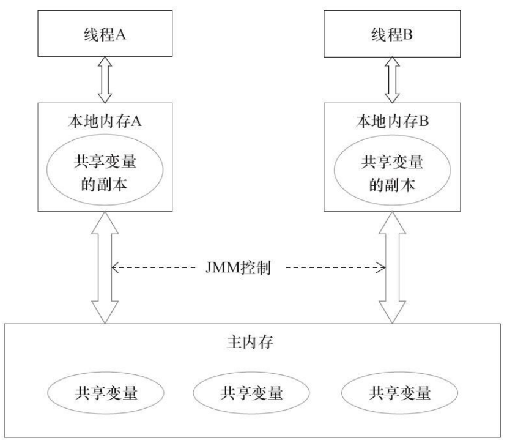

# 1 overview

## 1.1 上下文切换

CPU通过时间片分配算法来循环执行任务，当前任务执行一个时间片后会切换到下一个任务。但是，在切换前会保存上一个任务的状态，以便下次切换回这个任务时，可以再加载这个任务的状态。所以任务从保存到再加载的过程就是一次上下文切换。

在数据量较小时，并发的速度比串行要慢，原因就是线程有创建和上下文切换的开销。

减少上下文切换的方法有无锁并发编程、CAS算法、使用最少线程和使用协程。

- 无锁并发编程：将数据分段，不同的线程处理不同段的数据（Concurrent Hash Map）
- CAS算法：Java的Atomic包使用CAS算法来更新数据，而不需要加锁。
- 使用最少线程：线程池技术。
- 协程：在单线程里实现多任务的调度，并在单线程里维持多个任务间的切换。

## 1.2 悲观锁和乐观锁

锁的一种宏观分类方式是悲观锁和乐观锁。

悲观锁（Pessimistic Lock）：总是假设最坏的情况，每次取数据时都认为其他线程会修改该数据，所以每次在操作数据的时候都会上锁。传统的关系型数据库里边就用到了很多这种锁机制，比如行锁，表锁等，读锁，写锁等，都是在进行相关操作之前先上锁。Java中synchronized和`ReentrantLock`等独占锁就是悲观锁思想的实现。

乐观锁（Optimistic Lock）：总是假设最好的情况，每次取数据时都认为其他线程不会修改该数据，所以不会上锁，但是在更新的时候会判断在此期间内，其他线程有没有更新过这个数据，可以使用版本号机制和CAS算法实现。在Java中`java.util.concurrent.atomic`包下面的原子变量类就是使用了乐观锁的一种实现方式CAS实现的。

**悲观锁阻塞事务，乐观锁回滚重试。**

悲观锁适用于写多读少的情况，而乐观锁适用于读多写少的情况。

## 1.3 CAS算法

无锁算法Compare And Swap。

独占锁是一种悲观锁，synchronized就是一种独占锁，会导致其它所有需要锁的线程挂起，等待持有锁的线程释放锁。另一个更加有效的锁是乐观锁。即每次不加锁，而是假设没有冲突而去完成某项操作，如果因为冲突失败就重试，直到成功为止。乐观锁用到的机制就是CAS。

CAS是一种无锁算法，CAS有3个操作数，内存值V，旧的预期值A，要修改的新值B。当且仅当预期值A和内存值V相同时，将内存值V修改为B，否则什么都不做。`java.util.concurrent`包全完建立在CAS之上。


CPU去更新一个值时，先将备份的值与内存中的值进行比较，如果值不同，说明在备份值到写入新值之前，有其他线程对该值进行了修改，则取消本次操作。

CAS的缺点：

- ABA问题：因为CAS需要在操作值的时候检查下值有没有发生变化，如果没有发生变化则更新，但是如果一个值原来是A，变成了B，又变成了A，那么使用CAS进行检查时会发现它的值没有发生变化，但是实际上却变化了。ABA问题的解决思路就是使用版本号。在变量前面追加上版本号，每次变量更新的时候把版本号加一，那么A－B－A 就会变成1A-2B－3A。从Java1.5开始JDK的atomic包里提供了一个类`AtomicStampedReference`来解决ABA问题。这个类的`compareAndSet`方法作用是首先检查当前引用是否等于预期引用，并且当前标志是否等于预期标志，如果全部相等，则以原子方式将该引用和该标志的值设置为给定的更新值。
- 循环时间长，开销大：当CAS长时间不成功时，会给CPU带来非常大的执行开销。如果CAS写入不成功将触发等待 -> 重试机制，这种情况是一个自旋锁，简单来说就是适用于短期内获取不到，进行等待重试的锁，它不适用于长期获取不到锁的情况，另外，自旋循环对于性能开销比较大。
- 只能保证一个共享变量的原子操作：CAS 只对单个共享变量有效，当操作涉及跨多个共享变量时 CAS 无效。从 JDK 1.5开始，提供了`AtomicReference`类来保证引用对象之间的原子性，可以把多个变量放在一个对象里来进行 CAS 操作。所以我们可以使用锁或者利用`AtomicReference`类把多个共享变量合并成一个共享变量来操作。

## 1.3 互斥锁

mutex（mutual   exclusive）即互斥量（互斥体）。

```
//要保证函数体为原子操作

mutex_lock(mutex) {
    lock(bus);    //给总线加锁

    mutex = mutex - 1;
    if(mutex != 0)
        block()
    else
        success

    unlock(bus);  
}


mutex_unlock(mutex) {
    lock(bus);

    mutex = mutex + 1;
    if (mutex != 1) 
        wakeup();
    else
        success
    
   	unlock(bus);
}
```

## 1.4 自旋锁spinlock

```
void spin_lock(int * owner ) {
    while(!compare_and_set(owner, 0, 1) {
    }
}
```

## 1.5 `epoll`

`epoll`是Linux内核为处理大批量文件描述符而作了改进的poll，是Linux下多路复用IO接口select/poll的增强版本，它能显著提高程序在大量并发连接中只有少量活跃的情况下的系统CPU利用率。

`epoll`采用了红黑树来对它管理的FD集合作索引。

功能：加入新连接；检测部分节点有数据可读。

使用哈希的问题：需要多次扩容

使用B+数的问题：B+树主要用于磁盘索引，目的是减少寻址次数。

# 2 Java并发机制的底层实现

Java有两种加锁的方式，一种是synchronized关键字，另一种是lock接口的实现类。


**`ReentrantLock`、`ReadLock`、`WriteLock`** 是Lock接口最重要的三个实现类。对应了“可重入锁”、“读锁”和“写锁”。

## 2.1 volatile

在多线程并发编程中，volatile是轻量级的synchronized，它在多处理器开发中保证了共享变量的“可见性”。即一个线程在修改一个共享变量时，另一个线程可以读到这个修改的值。

volatile的使用恰当的话，它比synchronized的使用和执行成本更低，因为它不会引起线程上下文的切换和调度。

Java语言允许线程访问共享变量，为了确保共享变量能被准确和一致地更新，线程应该确保通过排他锁单独获得这个变量。

Java语言提供了volatile，在某种情况下比加锁更加方便。如果一个字段被声明成volatile，Java线程内存模型确保所有线程看到这个变量的值是一致的。

**volatile的原理：**

为了提高处理器的执行速度，在处理器和内存之间增加了多级缓存来提升。但是由于引入了多级缓存，就存在缓存数据不一致问题。

对于X86处理器，当一个线程修改一个volatile类型的共享变量时，JVM会向处理器添加一条Lock前缀的指令，将cache中的该变量立即写入到内存中。

缓存一致性协议：每个处理器通过嗅探在总线中传播的数据判断自己缓存的值是不是过期了，如果过期，就将cache中的缓存行设置为无效状态，CPU处理这个数据时，将从内存中重新获取最新的版本。

所以，如果一个变量被volatile所修饰的话，在每次数据变化之后，其值都会被强制刷入主存。而其他处理器的缓存由于遵守了缓存一致性协议，也会把这个变量的值从主存加载到自己的缓存中。这就保证了一个volatile在并发编程中，其值在多个缓存中是可见的。

**volatile与可见性：**

可见性是指当多个线程访问同一个变量时，一个线程修改了这个变量的值，其他线程能够立即看得到修改的值。

Java内存模型规定了所有的变量都存储在主内存中，每条线程有自己的工作内存（私有栈帧中的内容），线程的工作内存中保存了该线程中是用到的变量的主内存副本，线程对变量的所有操作都必须在工作内存中进行，而不能直接读写主内存。不同的线程之间也无法直接访问对方工作内存中的变量，线程间变量的传递均需要自己的工作内存和主存之间进行数据同步进行。所以，就可能出现线程1改了某个变量的值，但是线程2不可见的情况。

Java中的volatile关键字提供了一个功能，被其修饰的变量在被修改后可以立即同步到主内存，被其修饰的变量在每次使用前都从主内存刷新。同时，JVM也实现了缓存一致性协议，因此，可以使用volatile来保证多线程操作时变量的可见性。

**volatile与有序性：**

普通的变量仅仅会保证在该方法的执行过程中所依赖的赋值结果的地方都能获得正确的结果，而不能保证变量的赋值操作的顺序与程序代码中的执行顺序一致。而volatile可以禁止指令重排，这就保证了代码的程序会严格按照代码的先后顺序执行。被volatile修饰的变量的操作，会严格按照代码顺序执行。

**volatile不保证原子性。**

volatile方式的`i++`，总共是四个步骤：

`i++`实际为load、Increment、store、Memory Barriers 四个操作。

内存屏障是线程安全的,但是内存屏障之前的指令并不是.在某一时刻线程1将 i 的值load取出来，放置到cpu缓存中，然后再将此值放置到寄存器A中，然后A中的值自增1（寄存器A中保存的是中间值，没有直接修改i，因此其他线程并不会获取到这个自增1的值）。如果在此时线程2也执行同样的操作，获取值i=10,自增1变为11，然后马上刷入主内存。此时由于线程2修改了i的值，实时的线程1中的i=10的值缓存失效，重新从主内存中读取，变为11。接下来线程1恢复。将自增过后的A寄存器值11赋值给cpu缓存i。这样就出现了线程安全问题。


## 2.2. synchronized的实现原理和应用

未优化的synchronized被称为重量级锁。

synchronized实现同步的基础：

- 对于普通同步方法，锁是当前实例对象。
- 对于静态同步方法，锁是当前类的Class对象。
- 对于同步方法快，锁是Synchronized括号里配置的对象。

当一个线程试图访问同步代码块时，它首先必须得到锁，退出或抛出异常时必须释放锁，JVM基于进入和退出Monitor对象来实现同步和代码块同步。

JVM在编译后将`monitorenter`指令插入到同步代码块的开始位置，`monitorexit`插入到方法结束处和异常处，JVM要保证每个`monitorenter`与对应的`monitorexit`配对。任何对象都有一个monitor与之关联，当一个monitor被持有后，它将处于锁定状态。

### 1 Java对象头

synchronized用的锁是存在对象头里的。如果对象是数组类型，则JVM用3个Word存储对象头，如果对象是非数组类型，则JVM用两个Word存储对象头。一个Word等于4字节。

| 长度     | 内容                   | 说明                             |
| -------- | ---------------------- | -------------------------------- |
| 32/64bit | Mark Word              | 对象的hashcode或锁信息等         |
| 32/64bit | Class Metadata Address | 指向方法区中对象的类型数据       |
| 32/64bit | Array Length           | 数组的长度（如果对象是数组类型） |

Mark Word中会默认存储对象的`HashCode`、GC分代年龄和锁标记位。

| 锁状态   | 25bit      | 4bit       | 1bit是否是偏向锁 | 2bit锁标志位 |
| -------- | ---------- | ---------- | ---------------- | ------------ |
| 无锁状态 | `HashCode` | GC分代年龄 | 0                | 01           |

Mark Word中存储的数据会随着锁标志位的变化而变化。


### 2 锁的升级与对比

在JDK1.6中，锁一共有4种状态，从低到高依次是：无锁状态、偏向锁状态、轻量级锁状态和重量级锁状态，这几个状态会随着竞争情况逐渐升级。锁可以升级但不能降级。

**1 偏向锁**

`HotSpot`的作者发现在大多数情况下，锁不仅不存在多线程竞争，而且总是由同一线程多次获得，为了让线程获得锁的代价更低而引入了偏向锁。

当一个线程访问同步代码块并获取锁时，会在对象头和栈帧中的锁记录里存储锁偏向的线程id，以后该线程在进入和退出同步块时不需要进行CAS操作来加锁和解锁，只需简单地测试一下对象头的Mark Word里是否存储着指向当前线程的偏向锁，如果测试成功，表示线程已经获得了锁。如果测试失败，则需要再测试一下Mark Word中偏向锁的标识是否设置为1（表示当前是偏向锁）：如果没有，则使用CAS竞争锁；否则，尝试使用CAS将对象头的偏向锁指向当前线程。

偏向锁使用了一种等到竞争出现才释放锁的机制。偏向锁的撤销，需要等待全局安全点（在这个时间点上没有正在执行的字节码）。它会首先暂停拥有偏向锁的线程，然后检查持有偏向锁的线程是否活着，如果线程处于不活动状态，则将对象头设置为无锁状态；如果线程存活，拥有偏向锁的栈会被执行，遍历偏向对象的锁记录，栈中的锁记录和对象头的Mark Word要么重新偏向于其他线程，要么恢复到无锁或者标记对象不适合作为偏向锁，最后唤醒暂停的线程。


**2 轻量级锁**

线程在执行同步块之前，JVM会先在当前线程的栈桢中创建用于存储锁记录的空间，并将对象头中的Mark Word复制到锁记录中，官方称为Displaced Mark Word。然后线程尝试使用CAS将对象头中的Mark Word替换为指向锁记录的指针。如果成功，当前线程获得锁，如果失败，表示其他线程竞争锁，当前线程便尝试使用自旋来获取锁。

轻量级锁解锁时，会使用原子的CAS操作将Displaced Mark Word替换回到对象头，如果成功，则表示没有竞争发生。如果失败，表示当前锁存在竞争，锁就会膨胀成重量级锁。


因为自旋会消耗CPU，为了避免无用的自旋（比如获得锁的线程被阻塞住了)，一旦锁升级成重量级锁，就不会再恢复到轻量级锁状态。当锁处于这个状态下，其他线程试图获取锁时，都会被阻塞住，当持有锁的线程释放锁之后会唤醒这些线程，被唤醒的线程就会进行新一轮的夺锁之争。

## 2.3 原子操作的实现原理

CPU需要保证检测锁的状态并获取锁的动作的原子性，即在某一时刻只有一个进程可以获取到锁。一般是通过对缓存加锁或总线加锁的方式来实现多处理器之间的原子操作。

### 2.3.1 总线锁

多个处理器同时对共享变量进行读写操作，如`i++`时，操作后共享变量的值可能会与期望的不一致。

原因是多个处理器同时从内存中读取一个变量`i`并保存到缓存，然后+1，最后写入到系统内存中。处理器是使用总线锁来解决这个问题的，当一个处理器在总线上输出LOCK#信号时，其他处理器的请求将被阻塞。

### 2.3.2 缓存锁

总线锁定期间，其他CPU无法与内存进行通信，性能浪费比较严重，目前处理器在某些场合下使用缓存锁来代替总线锁进行优化。

Java中volatile关键字的原理就是缓存锁。

不能使用缓存锁的情况：

- 操作的数据不能被缓存在CPU内部，或操作的数据跨多个缓存行；
- 处理器不支持缓存锁定。

### 2.3.3 Java如何实现原子操作

Java中通过循环CAS来实现原子操作。自旋CAS实现的基本思路是循环进行CAS操作直到成功为止。

demo：基于CAS实现线程安全的计数器方法`safeCount`和一个非线程安全的计数器count。

```java
import java.util.*;
import java.util.concurrent.atomic.AtomicInteger;

public class Solution {
    private AtomicInteger atomicInteger = new AtomicInteger(0);
    private int i = 0;
    public static void main(String[] args) {
        final Solution solution = new Solution();
        List<Thread> ts = new ArrayList<>(600);
        for (int j = 0; j < 100; j++) {
            Thread t = new Thread(new Runnable() {
                @Override
                public void run() {
                    for (int i = 0; i < 10000; i++) {
                        solution.count();
                        solution.safeCount();
                    }
                }
            });
            ts.add(t);
        }
        for(Thread t : ts) {
            t.start();
        }
        for(Thread t : ts) {
            try {
                t.join();
            }catch (InterruptedException e) {
                e.printStackTrace();
            }
        }
        System.out.println(solution.i);
        System.out.println(solution.atomicInteger.get());
    }
    private void safeCount() {
        for(;;) {
            int i = atomicInteger.get();
            boolean suc = atomicInteger.compareAndSet(i, ++i);
            if(suc) {
                break;
            }
        }
    }
    private void count() {
        i++;
    }
}
//output:
//998380
//1000000
```

**除了偏向锁，JVM实现锁的方式都用了循环CAS，即当一个线程想进入同步块的时候使用循环CAS的方式来获取锁，当它退出同步块的时候使用循环CAS释放锁。**

# Java内存模型

## Java内存模型的基础

**JMM的抽象结构**

并发编程需要处理的两个关键问题是：线程之间如何同步；线程之间如何通信。

Java的并发采用的是共享内存模型，Java线程之间的通信总是隐式进行，整个通信过程对程序员完全透明。

Java中的所有实例域，静态域和数组元素都存储在堆内存中，堆内存在线程之间共享。

Java线程之间的通信由Java内存模型（JMM）控制，JMM决定一个线程对共享变量的写入何时对另一个线程可见。JMM定义了线程和内存之间的抽象关系：线程之间的共享变量存储在主内存，每个线程有一个私有的本地内存，存储该线程读/写共享内存的副本。本地内存是一个抽象概念，并不真实存在。



**指令的重排序**

在执行程序时，为了提高性能，编译器和处理器常常会对指令作重排序，重排序分三种类型：

- 编译器优化的重排序：编译器在不改变单线程程序语义的前提下，重新安排语句的执行顺序。
- 指令级并行的重排序
- 内存系统的重排序

从Java源代码到最终执行的指令序列，会分别经历这三种重排序：


2和3属于处理器重排序，可能会导致多线程程序出现内存可见性问题。JMM会禁止特定类型的编译器重排序，并插入特定类型的内存屏障指令，来禁止指定类型的处理器重排序。

