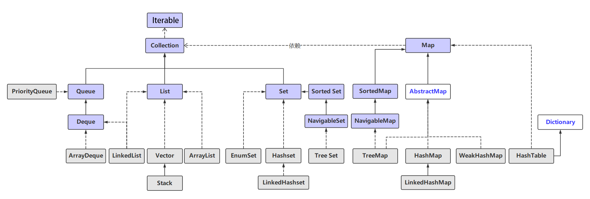

# 概述

Java集合框架提供了数据持有对象的方式，提供了对数据集合的操作。Java 集合框架位于 `java.util` 包下，主要有三个大类：**Collection(接口)**、**Map(接口)**、**集合工具类**。

集合类不同于数组，只能保存对象。Java集合大致可以分为List、Set、Queue和Map。List代表有序、可重复的组合，Set代表无序、不可重复的组合，Map代表具有映射关系的组合。它们均是由Collection或Map接口派生而来。

集合框架图：



访问List集合中的元素，可以通过索引来访问；访问Map中的元素，可以根据key来访问，因此Map中的key不可以重复；访问Set中的元素，只能根据元素本身来访问，这也是Set不允许重复的原因。

# Collcetion与Iterable接口

Collection接口是List、Set和Queue的父接口，其中定义的方法这三种容器都可以使用。

所有Colleation实现了都重写了toString方法，可直接打印。

常用方法：

```java
//向集合中添加一个元素，如果集合对象被add操作改变了，则返回true。
boolean add(Object o);
//将集合c的所有元素添加到集合中，即两个集合取并集，如果调用函数的集合被改变了，则返回true。
boolean addAll(Collection c);
//删除集合中的所有元素
void clear();
//集合中是否包含指定元素
boolean contains(Object o);
//集合中是否包含c中的所有元素
boolean containAll(Collection c);
//集合是否为空，当集合长度为0时返回true
boolean isEmpty();
//返回一个Iterator对象
Iterator iterator();
//删除集合中的指定元素o，当集合包含多个o时，删除第一个符合条件的元素
boolean remove(Object o);
//集合相减，如果删除了一个以上的元素，返回true
boolean removeAll(Collection c);
//取交集
boolean retainAll(Collection c);
//将集合转换成一个数组
Object[] toArray();
```

示例：

```java
public static void main(String[] args) {
    Collection c = new ArrayList();
    //添加元素
    c.add("elementOne");
    //容器中不能包含基本元素，但Java会自动装箱
    c.add(100);
    c.add('a');
    System.out.println(c);
    //删除元素
    c.remove(100);
    System.out.println(c);
    //确定集合是否包含某元素
    System.out.println("c中是否包含\"elementOne\":"+c.contains("elementOne"));
    Collection fruit = new HashSet();
    fruit.add("apple");
    fruit.add("watermelon");
    //向c中添加collection，参数只能是Collection对象
    c.addAll(fruit);
    //containsAll方法的参数也只能是Collection对象
    System.out.println("c中是否包含fruit："+c.containsAll(fruit));
    //removeAll
    c.removeAll(fruit);
    System.out.println(c);
    //删除所有元素
    c.clear();
    System.out.println(c);
    c.add("apple");
    System.out.println(c);
    //retainAll方法获取两个集合的交集
    fruit.retainAll(c);
    System.out.println("fruit:"+fruit);
}
```

## 使用Lambda表达式遍历集合

Java8为Iterable接口新增了一个forEach（ConsumerAction）default方法，该方法参数为一个函数式接口，Collection接口继承了Iterable接口，因此可使用forEach来遍历。

```java
public static void main(String[] args) {
    Collection<Integer> c = new ArrayList<>();
    c.add(1);
    c.add(2);
    c.forEach(obj -> System.out.println(obj));
}
```

Iterable的forEach方法接受一个Lambda表达式，该表达式的目标类型是Consumer，forEach方法会自动将集合元素逐个传给Lambda表达式的形参。

## 使用Iterator遍历集合

Iterator也是Java集合框架的成员，但它主要用于遍历Collection中的元素。

Iterator接口主要定义了4个方法：

- boolean hasNext()：被迭代的集合还没被遍历完时返回true。
- Object next()：返回集合里的下一个元素。
- void remove()：删除集合里上一次next()返回的元素。
- void forEachRemaining(Consumer action)：可使用Lambda表达式遍历集合元素。

```java
public static void main(String[] args) {
    Collection<Integer> c = new ArrayList<>();
    c.add(1);
    c.add(2);
    Iterator it = c.iterator();
    while(it.hasNext()) {
        int a = (int)it.next();
        System.out.print(a+" ");
        if(a == 2)
            //删除上传next()返回的元素
            it.remove();
    }
    System.out.println();
    //每次调用iterator会生成一个新的迭代器对象
    c.iterator().forEachRemaining(obj -> System.out.println(obj+" "));
}
```

迭代器迭代的过程中不能通过Collection的remove方法修改集合元素，否则会引发ConcurrentModificationException，只能通过迭代器的remove方法修改集合。

**源代码分析：**

ArrayList继承自抽象类AbstactList，但自己实现了iterator()方法。

```java
private class Itr implements Iterator<E> {
    int cursor;       // index of next element to return
    int lastRet = -1; // index of last element returned; -1 if no such
    int expectedModCount = modCount;

    public boolean hasNext() {
        return cursor != size;
    }

    @SuppressWarnings("unchecked")
    public E next() {
        checkForComodification();
        int i = cursor;
        if (i >= size)
            throw new NoSuchElementException();
        Object[] elementData = ArrayList.this.elementData;
        if (i >= elementData.length)
            throw new ConcurrentModificationException();
        cursor = i + 1;
        return (E) elementData[lastRet = i];
    }

    public void remove() {
        if (lastRet < 0)
            throw new IllegalStateException();
        checkForComodification();
        try {
            //调用外部类的方法
            ArrayList.this.remove(lastRet);
            cursor = lastRet;
            lastRet = -1;
            //保证expectedModCount和modcount的一致
            //如果仅调用ArrayList的remove方法，将不会修改expectedModCount，从而抛出异常
            expectedModCount = modCount;
        } catch (IndexOutOfBoundsException ex) {
            throw new ConcurrentModificationException();
        }
    }

    final void checkForComodification() {
        if (modCount != expectedModCount)
            throw new ConcurrentModificationException();
    }
}
```

注意：Iterator必须依赖于Collection对象，它是对象中的一个成员，由集合类中的私有内部类来实现接口。

## 使用Predicate操作集合


## 使用Stream操作集合

# Set集合

Set接口继承自Collection，和Collection方法相同，没有提供额外的方法。

但其规定add方法不能将相同的元素加入到Set中。

## HashSet

HashSet是Set接口的典型实现，大多数时候使用Set集合时就是使用这个实现类。HashSet按哈希算法来存储集合中的元素，因此具有很好的存取和查找性能。
HashSet具有以下特点：

- 不保证元素的排列顺序，元素顺序可能与添加顺序不同。
- HashSet不是同步的，假设有两个或者两个以上线程同时修改了HashSet集合时，则必须通过代码来保证其同步。
- 集合元素值可以是null。

当向HashSet集合中存入一个元素时，HashSet会调用该对象的 hashCode()方法来得到该对象的hashCode值,然后根据该hashCode值决定该对象在HashSet中的存储位置。如果有两个元素通过equals()方法比较返回true，但它们的 hashCode()方法返回值不相等，HashSet 将会把它们存储在不同的位置，依然可以添加成功。也就是说，HashSet集合判断两个元素相等的标准是两个对象通过 equals()方法比较相等，并且两个对象的hashCode()方法返回值也相等。

下面程序分别提供了三个类A、B和C，它们分别重写了equals()、hashCode()两个方法的一个或全部，通过此程序可以让读者看到HashSet判断集合元素相同的标准。

```java
class A {
    @Override
    public boolean equals(Object obj) {
        return true;
    }
}
class B {
    @Override
    public int hashCode() {
        return 100;
    }
}
class C {
    @Override
    public int hashCode() {
        return 5;
    }

    @Override
    public boolean equals(Object obj) {
        return true;
    }
}
public static void main(String[] args) {
    Set set = new HashSet();
    set.add(new A());
    set.add(new A());
    set.add(new B());
    set.add(new B());
    set.add(new C());
    set.add(new C());
    set.forEach(obj -> System.out.println(obj.toString()));
}
```

输出为：

```bash
com.lq.thinkingInJava.test.B@64
com.lq.thinkingInJava.test.B@64
com.lq.thinkingInJava.test.A@677327b6
com.lq.thinkingInJava.test.C@5
com.lq.thinkingInJava.test.A@1540e19d
```

可见，只有equals返回true且hashcode返回值相同时，set才会认为元素是相同的。

当把一个对象放入HashSet 中时，如果需要重写该对象对应类的equals()方法，则也应该重写其 hashCode()方法。规则是：如果两个对象通过 equals()方法比较返回true，这两个对象的hashCode值也应该相同。否则将会导致Set存储重复元素，违背哈希表的原则。

如果两个对象的 hashCode()方法返回的 hashCode值相同，但它们通过equals()方法比较返回false时，Set会在哈希值对应的地址用链表来保存多个对象，导致性能下降。

## LinkedHashSet

LinkedHashSet时HashSet的一个子类，同HashSet相比，它会维护一个链表保存元素的插入顺序，使得用户可以按照插入顺序来遍历集合中的元素。

example：

```java
public class Solution {
    public static void main(String[] args) {
        LinkedHashSet<Integer> set = new LinkedHashSet<>();
        set.add(1);
        set.add(2);
        System.out.println(set);
        set.remove(1);
        set.add(1);
        System.out.println(set);
    }
}
```

执行结果为：

```shell
[1, 2]
[2, 1]
```

## TreeSet

TreeSet是NavigableSet的实现类，NavigableSet继承了SortedSet接口。TreeSet可以确保元素处于排序状态，它提供了一些额外的方法：

- Comparator comparator()：返回TreeSet使用的比较器，使用默认比较器时返回null。
- Object first()：返回第一个元素。
- Object last()：返回最后一个元素。
- Object lower()：返回小于指定元素的第一个元素（参考元素不一定存在于TreeSet中）。
- Object higher()：返回大于指定元素的第一个元素（参考元素不一定存在于TreeSet中）。
- SortedSet subset(Object fromElement, Object toElement)：返回子集，范围为[fromElement, toElement)。
- SortedSet headSet(Object toElement)：返回小于等于toElement的元素组成的子集。
- SortedSet tailSet(Object fromElement)：返回大于等于fromElement的元素组成的子集。

与哈希集合采用hash算法来决定元素的存储位置不同，TreeSet采用红黑树的数据结构来存储集合元素。TreeSet支持两种排序规则。

### 一、自然排序

TreeSet会调用集合元素的compareTo方法比较元素的大小关系，并将元素升序排列。

Java提供了一个Comparable接口，其中定义了compareTo方法，对该方法的o1和o2参数，当方法返回负数时，代表o1小于o2；返回正数时代表o1大于o2；返回0时代表它们相等。

实现了Comparable接口的常见类：

- 数值型包装类：按数值大小比较。
- Character：按Unicode值比较。
- Boolean：true>false。
- String：按字符串中逐个字符的Unicode值比较。
- Data、Time：晚>早。

String类的compareTo方法实现：

```java
public int compareTo(String anotherString) {
    int len1 = value.length;
    int len2 = anotherString.value.length;
    int lim = Math.min(len1, len2);
    char v1[] = value;
    char v2[] = anotherString.value;

    int k = 0;
    while (k < lim) {
        char c1 = v1[k];
        char c2 = v2[k];
        if (c1 != c2) {
            return c1 - c2;
        }
        k++;
    }
    return len1 - len2;
}
```

当把一个对象加入TreeSet集合中时，TreeSet会调用该对象的compareTo方法与容器中的其他对象作比较，根据红黑树结构找到它的存储位置。当两个对象的compareTo方法返回0时，TreeSet会判断新对象为重复元素，拒绝其加入容器。compareTo方法是TreeSet判断元素相等的唯一标准。

如果向TreeSet 中添加一个可变对象后，并且后面程序修改了该可变对象的实例变量，这将导致它与其他对象的大小顺序发生了改变，但TreeSet不会再次调整它e们的顺序，甚至可能导致TreeSet 中保存的这两个对象通过compareTo(Object obj)方法比较返回0。

### 二、定制排序

可以通过自定义Comparator接口实现TreeSet的定制排序，该接口中包含了一个`int compare(T o1, T o2)`方法。由于Comparator是一个函数式接口，因此可以通过Lambda表达式代替Comparator对象。

示例(降序排列)：

```java
class M
{
    int age;

    public M(int age) {
        this.age = age;
    }

    @Override
    public String toString() {
        return "M{" +
                "age=" + age +
                '}';
    }
}
public class Test {
    public static void main(String[] args) {
        /*另一种方法
        TreeSet<M> treeSet = new TreeSet<M>(new Comparator<M>() {
            @Override
            public int compare(M o1, M o2) {
                return o1.age > o2.age ? -1 : o1.age < o2.age ? 1 : 0;
            }
        });
        */
        TreeSet<M> treeSet = new TreeSet<M>((o1, o2) -> {
            M m1 = (M)o1;
            M m2 = (M)o2;
            return m1.age > m2.age ? -1 : m1.age < m2.age ? 1 : 0;
        });
        treeSet.add(new M(-1));
        treeSet.add(new M(-3));
        treeSet.add(new M(9));
        System.out.println(treeSet);
    }
}
```

**注意**：元素只有在加入TreeSet时会进行排序，当程序执行过程中修改TreeSet中元素的值时，TreeSet不会对元素重新排序，因此应尽量避免修改TreeSet中元素的值。

## EnumSet


## 各Set实现类的性能分析

HashSet和TreeSet是Set的两个典型实现，HashSet的性能总是优于TreeSet，因为TreeSet需要额外的红黑树算法来维护集合元素的次序。只有当需要保持Set内元素有序时才使用TreeSet。

LinkedHashSet是HashSet的一个子类，对于普通的插入和删除操作，LinkedHashSet慢于HashSet，但是LinkedHashSet遍历元素更快。

EnumSet是所有Set类中性能最好的，但它只能保存同一个枚举类中的枚举值作为集合元素。

**这三个Set的实现类都是线程不安全的。**

# List集合

List集合代表一个元素有序、可重复的集合，集合中每个元素都具有自己的顺序索引。

## List接口与ListIterator接口

List作为Colleaction的子接口，继承了Collection接口的所有方法，同时增加了一些根据索引来操作元素的方法。

- void add(int index, Object element)：将指定元素插入到索引处，插入后element的索引为index。
- boolean addAll(int index, Collection c)：将指定集合的所有元素插入到索引之后，修改后index处的元素为collection中的第一个元素。
- Object get(int index)：返回索引为index的元素。
- int indexOf(Object o) ：返回o在list中第一次出现的位置索引。
- int lastIndexOf：返回o在list中最后一次出现的位置索引。
- Object remove(int index)：删除并返回index处的元素。
- Object set(int index, Object element)：将index索引处的元素替换为element，并返回被替换的元素。
- List subList(int fromIndex, toIndex)：前闭后开，返回子list。

Java8新增方法：

- void replaceAll(UnaryOperator operator)：根据operator指定的规则重新设置集合的所有元素。
- void sort(Comparator c)：根据Comparator对集合进行排序。

示例代码：

```java
public class Test {
    public static void main(String[] args) {
        List<String> list = new LinkedList<>();
        list.add("木");
        list.add("水");
        list.add("火");
        list.add("土");
        System.out.println(list);
        list.add(0, "金");
        System.out.println(list);
        //调用equals方法比较两个字符串
        System.out.println(list.indexOf("金"));
        list.remove(3);
        System.out.println(list);
        list.set(1, "x");
        System.out.println(list.subList(0,3));
    }
}
```

输出：

```shell
[木, 水, 火, 土]
[金, 木, 水, 火, 土]
0
[金, 木, 水, 土]
[金, x, 水]
```

Java8为List新增了sort和replaceAll两个常用方法，其中sort方法需要一个Comparator对象来控制元素排序，程序可使用Lambda表达式作为参数；replaceAll方法需要一个UnaryOperator（函数式接口）对象来控制元素排序，程序也可以使用Lambda表达式作为参数。

sort()和replaceAll()方法演示：

```java
public static void main(String[] args) {
    List<String> list = new LinkedList<>();
    list.add("吴国之祸");
    list.add("孙鲁育");
    list.add("班");
    list.add("月读");
    list.sort((o1, o2) -> {
        return ((String)o1).length() - ((String)o2).length();
    });
    System.out.println(list);
    list.replaceAll(ele -> ((String)ele+((String) ele).length()+"-"));
    System.out.println(list);
}
```

输出：

```
[班, 月读, 孙鲁育, 吴国之祸]
[班1-, 月读2-, 孙鲁育3-, 吴国之祸4-]
```

List相比Set还额外提供了一个listIterator方法，该方法返回一个ListIterator对象，在Iterator的基础上新增了以下方法：

- boolean hasPrevious()：判断是否有前一个元素。
- Object previous()：返回前一个元素。
- void add(Object o)：在上一次next返回的元素后添加一个元素。

示例程序：

```java
public static void main(String[] args) {
    List<String> list = new LinkedList<>();
    list.add("吴国之祸");
    list.add("孙鲁育");
    list.add("班");
    list.add("月读");
    ListIterator listIterator = list.listIterator();
    while (listIterator.hasNext()) {
        System.out.println(listIterator.next());
        listIterator.add("-----------------------");
    }
    System.out.println("反向遍历");
    while (listIterator.hasPrevious()) {
        System.out.println(listIterator.previous());
    }
}
```

输出：

```
吴国之祸
孙鲁育
班
月读
反向遍历
-----------------------
月读
-----------------------
班
-----------------------
孙鲁育
-----------------------
吴国之祸
```

## ArrayList和Vector

ArrayList和Vector是List的两个典型实现类，它们都是基于数组实现的，内部封装了一个动态的、允许再分配的Object[]数组。ArrayList和Vector使用initCapacity来设置数组的初始长度，当大小不够用时再自动扩容。ArrayList和Vector根据特有的算法进行自动扩容，当需要添加大量元素时，可使用ensureCapacity(int minCapacity)函数一次性扩容提高性能，避免ArrayList和Vector多次自动扩容。

ArrayList和Vector在用法上几乎完全相同，但由于Vector设计较早（JDK1.0），目前已经不推荐使用。

ArrayList是线程不安全的，Vector是线程安全的，因此ArrayList比Vector性能更好。即使要保证线程安全，也不推荐使用Vector，需要实现线程安全时可以通过Collections工具类将ArrayList变为线程安全的。

Vector还提供了一个Stack子类，但由于Vector是一个非常古老的集合类，存在很多问题，因此应尽量少用Stack类，可以使用ArrayDeque类来代替Vector实现栈的功能。

## 固定长度的list

工具类Arrays提供了一个方法aslist(Object... a)，可以将一个数组或指定个数的对象转换成一个List集合，但是这个List既不是ArrayList的实例，也不是Vector的实例，而是Arrays的内部类Arrays.ArrayList（私有静态内部类）的实例。

Arrays.ArrayList是一个固定长度的List集合，程序只能遍历和修改其中的元素，不能进行插入和删除操作。

# Queue集合

Queue用于模拟队列这种数据结构，即“先进先出”的容器。

Queue接口定义了以下的一些方法：

- void add(Object e)：将指定元素添加到队列的尾部。当队列有容量限制时，如果元素添加失败，add方法抛出IllegalStateException异常。
- boolean offer(Object e)：将指定元素添加到队列的尾部，添加成功时返回true，当由于队列容量限制添加失败时返回false。在有容量限制的队列中推荐使用offer方法。
- Object element()：获取队列头部的元素，但不删除该元素。如果队列为空，element方法会抛出NoSuchElementException异常。
- Object peek()：获取队列头部的元素，但不删除该元素。如果队列为空，则返回null。
- Object remove()：获取队列头部的元素，并删除该元素。如果队列为空，remove方法会抛出异常。

- Object poll()：获取队列头部的元素，并删除该元素。如果队列为空，则返回null。

Queue接口有一个PriorityQueue实现类，还有一个Deque（双端队列）子接口。Deque可以当栈或队列来使用。Java为Deque提供了ArrayDeque和LinkedList两个实现类。

## PriorityQueue

PriorityQueue是一个比较标准的队列实现类。之所以说它是比较标准的队列实现，而不是绝对标准的队列实现，是因为PriorityQueue保存队列元素的顺序并不是按加入队列的顺序，而是按队列元素的大小进行重新排序。因此当调用peek()方法或者 poll)方法取出队列中的元素时，并不是取出最先进入队列的元素，而是取出队列中最小的元素。从这个意义上来看，PriorityQueue已经违反了队列的最基本规则:先进先出（FIFO)。下面程序示范了PriorityQueue队列的用法。

```java
public static void main(String[] args) {
    PriorityQueue<Integer> priorityQueue = new PriorityQueue<>();
    priorityQueue.offer(100);
    priorityQueue.offer(50);
    priorityQueue.offer(70);
    System.out.println(priorityQueue);
    while (!priorityQueue.isEmpty())
        System.out.println(priorityQueue.poll());
}
```

```
[50, 100, 70]
50
70
100

Process finished with exit code 0
```

运行上面程序直接输出 PriorityQueue集合时，可能看到该队列里的元素并没有很好地按大小进行排序,但这只是受到PriorityQueue的toString()方法的返回值的影响。实际上,程序多次调用PriorityQueue集合对象的poll()方法，即可看到元素按从小到大的顺序“移出队列”

PriorityQueue不允许插入null元素，它还需要对队列元素进行排序，PriorityQueue的元素有两种排序方式。

- 自然排序：采用自然顺序的 PriorityQueue集合中的元素必须实现了Comparable接口，而且应该
  是同一个类的多个实例，否则可能导致ClassCastException异常。
- 定制排序：创建PriorityQueue队列时，传入一个Comparator对象，该对象负责对队列中的所有
  元素进行排序。采用定制排序时不要求队列元素实现Comparable接口。

## Deque与ArrayDeque

Deque是一个双端队列，它定义了以下方法：

- Object getFirst()：获取但不删除双端队列的第一个元素，失败时抛出异常。

- Object getLast()：获取但不删除双端队列的最后一个元素，失败时抛出异常。
- Object peekFirst()：获取但不删除该双端队列的第一个元素;如果此双端队列为空，则返回null。
- Object peekLast()：获取但不删除该双端队列的最后一个元素;如果此双端队列为空,则返回null。
- void addFirst(Object e)：将指定元素插入该双端队列的开头，失败时抛出异常。

- void addLast(Object e)：将指定元素插入该双端队列的末尾，失败时抛出异常。

- boolean offerFirst(Object e)：将指定元素插入该双端队列的开头，失败返回false。
- boolean offerLast(Object e)：将指定元素插入该双端队列的末尾，失败返回false。

- Object pollFirst()：获取并删除该双端队列的第一个元素；如果此双端队列为空，则返回null。
- Object pollLast()：获取并删除该双端队列的最后一个元素；如果此双端队列为空，则返回null。
- void push(Object e)（栈方法)：将一个元素push进该双端队列所表示的栈的栈顶，相当于addFirst(e)。
- Object pop()（栈方法)：pop出该双端队列所表示的栈的栈顶元素，相当于removeFirst()。
- Object removeFirst()：获取并删除该双端队列的第一个元素。
- Object removeFirstOccurrence(Object o)：删除该双端队列的第一次出现的元素o。
  Object removeLast()：获取并删除该双端队列的最后一个元素
  boolean removeLastOccurrence(Object o)：删除该双端队列的最后一次出现的元素o。

- Iterator descendingIlterator()：返回该双端队列对应的迭代器，该迭代器将以逆向顺序来迭代队列
  中的元素。

Queue与Deque方法的对照表如下：

| Queue           | Deque                     |
| --------------- | ------------------------- |
| add(e)/offer(e) | addLast(e)/offerLast(e)   |
| remove()/poll   | removeFirst()/pollFirst() |
| element()/peek  | getFirst()/peekFirst()    |

Stack与Deque方法的对照表如下：

| Stack  | Deque                     |
| ------ | ------------------------- |
| push() | addFirst()/offerFirst()   |
| pop()  | removeFirst()/pollFirst() |
| peek() | getFirst()/peekFirst()    |

ArrayDeque基于动态的、可重分配的Object数组实现了Deque接口。

示例一：ArrayDeque作为栈

```java
public static void main(String[] args) {
    ArrayDeque<String> stack = new ArrayDeque<>();
    stack.push("华");
    stack.push("山");
    System.out.println(stack.pop());
    System.out.println(stack.pop());
}
```

```
山
华

Process finished with exit code 0
```

示例二：ArrayDeque作为队列

```java
public static void main(String[] args) {
    // 当做队列来使用,先进先出
    ArrayDeque<String> queue = new ArrayDeque<>();
    queue.offer("疯狂Java讲义");
    queue.offer("轻量级JavaEE企业应用实践");
    queue.offer("疯狂Android讲义");
    System.out.println(queue); //[疯狂Java讲义, 轻量级JavaEE企业应用实践, 疯狂Android讲义]
    // 访问队列头部元素，但不将其poll出队列
    System.out.println(queue.peek());
    System.out.println(queue);
    // poll出第一个元素
    System.out.println(queue.poll());
    System.out.println(queue);// [轻量级JavaEE企业应用实践, 疯狂Android讲义]
}
```

```
[疯狂Java讲义, 轻量级JavaEE企业应用实践, 疯狂Android讲义]
疯狂Java讲义
[疯狂Java讲义, 轻量级JavaEE企业应用实践, 疯狂Android讲义]
疯狂Java讲义
[轻量级JavaEE企业应用实践, 疯狂Android讲义]

Process finished with exit code 0
```

## LinkedList

LinkedList与 ArrayList、ArrayDeque的实现机制完全不同，ArrayList、ArrayDeque内部以数组的形式来保存集合中的元素，因此随机访问集合元素时有较好的性能；而LinkedList 内部以链表的形式来保存集合中的元素，因此随机访问集合元素时性能较差，但在插入、删除元素时性能比较出色(只需改变指针所指的地址即可)。需要指出的是，虽然Vector也是以数组的形式来存储集合元素的，但因为它实现了线程同步功能（而且实现机制也不好)，所以各方面性能都比较差。

==注意：==

对于所有的内部基于数组的集合实现，例如ArrayList、ArrayDeque等，使用随机访问的性能比使用Iterator迭代访问的性能要好，因为随机访问会被映射成对数组元素的访问。

# 线性表的性能分析

Java提供的List是一个线性表接口，而ArrayList、Linkedlist 是线性表的两种典型实现：基于数组的线性表和基于链表的线性表。Queue 是一个队列接口，Deque是双端队列(既可作为队列使用，也可作为栈使用)。接下来对各种实现类的性能进行分析：

一般来说，由于数组以一块连续内存区来保存所有的数组元素，所以数组在随机访问时性能最好，所有的内部以数组作为底层实现的集合在随机访问时性能都比较好；而内部以链表作为底层实现的集合在执行插入、删除操作时有较好的性能。但总体来说，ArrayList的性能比LinkedList 的性能要好，因此大部分时候都应该考虑使用ArrayList。

关于使用List集合有如下建议：

- 如果需要遍历List集合元素，对于ArrayList、Vector集合，应该使用随机访问方法(get)来遍历集合元素；对于LinkedList集合，则应该采用迭代器（Iterator）来遍历集合元素。
- 经常执行插入和删除操纵时使用LinkedList。
- 要求实现线程安全的List时，可通过Collections工具类中的方法将普通实现类转为类型安全的实现类。

# Map集合

Map用于保存具有映射关系的数据，因此Map集合里保存着两组值，一组值用于保存key，另一组用于保存value，key和value都可以是任何引用类型的数据。Map里的key不允许重复。

key和value之间存在着单向一对一的关系，任意一个key有唯一的value与之对应，一个value可以对应多个key。

Map中的所有key可以构成一个Set。在JAVA中HashSet底层是通过一个value全部为null的Map来实现的。

Map中的所有value可以组成一个list，只是需要以一个对象作为索引。

Map定义了以下常用的方法：

- void clear()：清空Map。
- boolean containsKey(Object key)
- boolean containValue(Object value)
- Set entrySet()：返回Map中包含的key-value对组成的Set集合，每个集合元素都是Map.Entry（Entry是Map的内部类）对象。
- Object get(Object key)：返回key对应的value，key不存在时返回null。
- boolean isEmpty()
- Set keySet：返回Map中key构成的Set。
- Object put(Object key, Object value)：添加一个键值对，如果key已经存在，则更新其value。
- void putAll(Map m)：将m中的键值对全部添加到Map中。
- Object remove(Object key)：删除指定key对应的键值对，返回被删除的键值对的value。当key不存在时，返回null。
- boolean remove(Object key, Object value)：Java8新增方法，删除key-value对应的键值对，如果成功删除，返回true，否则返回false。
- int size()
- Collection values()：返回value组成的Collection。

Map的内部类Entry主要包含以下方法：

- Object getKey()
- Object getValue()
- Object setValue(V value)：设置Entry中的value，并返回修改后的值。

## Java 8为Map新增的方法

| 名称                                                         | 说明                                                         |
| ------------------------------------------------------------ | ------------------------------------------------------------ |
| Object compute(Object key, BiFunction remappingFunction)     | 该方法使用 remappingFunction 根据原 key-value 对计算一个新 value。只要新 value 不为 null，就使用新 value 覆盖原 value；如果原 value 不为 null，但新 value 为 null，则删除原 key-value 对；如果原 value、新 value 同时为 null，那么该方法不改变任何 key-value 对，直接返回 null。 |
| Object computeIfAbsent(Object key, Function mappingFunction) | 如果传给该方法的 key 参数在 Map 中对应的 value 为 null，则使用 mappingFunction 根据 key 计算一个新的结果，如果计算结果不为 null，则用计算结果覆盖原有的 value。如果原 Map 原来不包括该 key，那么该方法可能会添加一组 key-value 对。 |
| Object computeIfPresent(Object key, BiFunction remappingFunction) | 如果传给该方法的 key 参数在 Map 中对应的 value 不为 null，该方法将使用 remappingFunction 根据原 key、value 计算一个新的结果，如果计算结果不为 null，则使用该结果覆盖原来的 value；如果计算结果为 null，则删除原 key-value 对。 |
| **void forEach(BiConsumer action)****                        | 该方法是 Java 8 为 Map 新增的一个遍历 key-value 对的方法，通过该方法可以更简洁地遍历 Map 的 key-value 对。 |
| **Object getOrDefault(Object key, V defaultValue)**          | 获取指定 key 对应的 value。如果该 key 不存在，则返回 defaultValue。 |
| Object merge(Object key, Object value, BiFunction remappingFunction) | 该方法会先根据 key 参数获取该 Map 中对应的 value。如果获取的 value 为 null，则直接用传入的 value 覆盖原有的 value（在这种情况下，可能要添加一组 key-value 对）；如果获取的 value 不为 null，则使用 remappingFunction 函数根据原 value、新 value 计算一个新的结果，并用得到的结果去覆盖原有的 value。 |
| Object putIfAbsent(Object key, Object value)                 | 该方法会自动检测指定 key 对应的 value 是否为 null，如果该 key 对应的 value 为 null，该方法将会用新 value 代替原来的 null 值。 |
| **Object replace(Object key, Object value)**                 | 将 Map 中指定 key 对应的 value 替换成新 value。与传统 put() 方法不同的是，该方法不可能添加新的 key-value 对。如果尝试替换的 key 在原 Map 中不存在，该方法不会添加 key-value 对，而是返回 null。 |
| boolean replace(K key, V oldValue, V newValue)               | 将 Map 中指定 key-value 对的原 value 替换成新 value。如果在 Map 中找到指定的 key-value 对，则执行替换并返回 true，否则返回 false。 |
| replaceAll(BiFunction function)                              | 该方法使用 BiFunction 对原 key-value 对执行计算，并将计算结果作为该 key-value 对的 value 值。 |

示例程序：

```java
public static void main(String[] args) {
    Map<String, Integer> map = new HashMap<>();
    // 成对放入多个key-value对
    map.put("Java入门教程", 10);
    map.put("C语言入门教程", 20);
    map.put("Python基础教程", 30);
    // 尝试替换key为”Go语言入门教程”的 value，由于原 Map 中没有对应的 key
    // 因此Map没有改变，不会添加新的key-value对
    map.replace("Go语言入门教程", 40);
    System.out.println(map);
    // 使用原value与传入参数计算出来的结果覆盖原有的value
    map.merge("C语言入门教程", 25, (oldVal, param) -> (Integer) oldVal + (Integer) param);
    System.out.println(map);
    // 当key为"Java"对应的value为null (或不存在)时，使用计算的结果作为新value
    map.computeIfAbsent("Java", (key) -> ((String) key).length());
    System.out.println(map); // map 中添加了 Java=4 这组 key-value 对
    // 当key为"Java"对应的value存在时，使用计算的结果作为新value
    map.computeIfPresent("Java", (key, value) -> (Integer) value * (Integer) value);
    System.out.println(map); // map 中 Java=4 变成 Java=16
}
```

执行结果：

```
{Java入门教程=10, Python基础教程=30, C语言入门教程=20}
{Java入门教程=10, Python基础教程=30, C语言入门教程=45}
{Java=4, Java入门教程=10, Python基础教程=30, C语言入门教程=45}
{Java=16, Java入门教程=10, Python基础教程=30, C语言入门教程=45}

Process finished with exit code 0
```

## HashMap和Hashtable

HashMap和Hashtable的关系类似于ArrayList和Vector，它们的主要区别是：

1. Hashtable是线程安全的，而HashMap是线程不安全的。
2. Hashtable不允许null作为key或value，使用后会触发NullPointerExcepetion。HashMap允许一个key为null，多个value为null。

从命名上就可以看出来Hashtable是一个古老的类，甚至没有遵循JAVA命名规范。

同HashSet类似，HashMap判断两个元素是否相等的标准时：两个key通过equals方法返回true且他们的hashcode相等。HashMap包含containsValue方法，它判断两个value相等的标准是：两个value通过equals方法比较返回true。

注意：与HashSet类似，使用可变对象作为HashMap的key，如果对该对象的成员进行了修改，HashMap可能无法正确的访问到该对象（可能影响到对象的equals方法和hashcode方法的返回值）。

## LinkedHashMap

HashSet有一个LinkedHashSet子类，HashMap也有一个LinkedHashMap子类；LinkedHashMap也使用双向链表来维护key-value对的次序(其实只需要考虑key 的次序)，该链表负责维护Map 的迭代顺序，迭代顺序与key-value对的插入顺序保持一致。

LinkedHashMap可以避免对HashMap、Hashtable里的 key-value对进行排序（只要插入key-value对时保持顺序即可)，同时又可避免使用TreeMap所增加的成本。

LinkedHashMap需要维护元素的插入顺序，因此性能略低于HashMap 的性能；但因为它以链表来维护内部顺序，所以在迭代访问Map里的全部元素时将有较好的性能。下面程序示范了LinkedHashMap的功能：迭代输出LinkedHashMap的元素时，将会按添加key-value对的顺序输出。

```yaml
    public static void main(String[] args) {
        LinkedHashMap<String, Integer> map = new LinkedHashMap<>();
        // 成对放入多个key-value对
        map.put("alice", 100);
        map.put("bob", 20);
        map.put("mike", 30);
        map.forEach((key, value) -> System.out.println(key+":"+value));
    }
```

结果：

```
alice:100
bob:20
mike:30

Process finished with exit code 0
```

## Properties读写属性文件

Properties是Hashtable类的子类，相当于一个key和value都是String的Map。该类提供了如下的方法：

- String getProperty(String key)
- String getProperty(String key, String defaultValue)：key不存在时返回defaultValue。
- Object setProperty(String key, String value)：类似put方法。
- void load(InputStream inputStream)：从属性文件(以输入流表示)中加载 key-value对，把加载到的key-value对追加到Properties里。

- void store(OutputStream out, String comments)：将Properties 中的key-value对输出到指定的属性文件（以输出流表示）中。

示例程序:

```java
public class Test {
    public static void main(String[] args) throws Exception {
        Properties properties = new Properties();
        properties.setProperty("user", "root");
        properties.setProperty("password", "123");
        properties.store(new FileOutputStream("a.ini"), "comment line");
        Properties properties1 = new Properties();
        properties1.setProperty("tips", "you win!");
        properties1.load(new FileInputStream("a.ini"));
        System.out.println(properties1);
    }
}
```

输出：

```
{tips=you win!, user=root, password=123}
```

a.ini中的内容

```shell
#comment line
#Mon Nov 09 14:27:32 CST 2020
user=root
password=123
```

Properties还可以从XML文件中读取属性，或将属性保存到XML文件中。

## SortedMap和TreeMap

与TreeSet类似，TreeMap是NavigableMap的实现类，NavigableMap继承了SortedMap接口。TreeMap可以确保元素处于排序状态。TreeMap是一个红黑树，每个键值对是红黑树上的一个节点。TreeMap存储键值对时会根据key对节点进行排序。TreeMap也有两种排序方式，分别是根据对象的Comparable接口进行自然排序或者根据自定义Comparator进行排序。

类似于TreeSet 中判断两个元素相等的标准，TreeMap 中判断两个key相等的标准是：两个key通过compareTo()方法返回0，TreeMap即认为这两个key是相等的，初始，TreeMap会将这两个元素当作重复元素来处理。

如果使用自定义类作为TreeMap的 key，且想让TreeMap良好地工作，则重写该类的equals()方法和compareTo()方法时应保持一致的返回结果：两个 key通过equals()方法比较返回true时，它们通过compareTo()方法比较应该返回0。如果equals()方法与compareTo()方法的返回结果不一致，TreeMap与Map接口的规则就会冲突。

TreeMap不会动态维护集合中元素的顺序，当修改了TreeMap中已有的元素后，会使得元素的顺序被打乱，因此不能对TreeMap已有的元素进行修改。

TreeMap提供了以下的一些方法：

- Map.Entry firstEntry()：返回该Map中最小key所对应的key-value对，如果该Map为空，则返回null。
- Object firstKey()：返回该Map中的最小key值，如果该Map为空，则返回null。
- Map.Entry lastEntry()：返回该Map中最大key所对应的 key-value对，如果该Map为空或不存在这样的key-value对，则返回null。
- Object lastKey()：返回该Map中的最大key值，如果该Map为空或不存在这样的key，则返回null。
- Map.Entry higherEntry(Object key)：返回该Map中位于key后一位的 key-value对(即大于指定key的最小key所对应的 key-value对)。如果该Map为空，则返回null。
- Object higherKey(Object key)：返回该Map中位于key后一位的key值(即大于指定key 的最小key值)。如果该Map为空或不存在这样的key-value对，则都返回null。
- Map.Entry lowerEntry(Object key)：返回该Map中位于key前一位的key-value对(即小于指定key的最大key所对应的key-value对)。如果该Map为空或不存在这样的key-value对，则返回null。
- Object lowerKey(Object key)：返回该Map中位于key前一位的key值(即小于指定key 的最大key值)。如果该 Map为空或不存在这样的key，则返回null。
- NavigableMap subMap(Object fromKey, boolean fromInclusive, Object toKey, boolean tolnclusive)：返回该Map 的子Map，其 key的范围是从fromKey到toKey，布尔变量决定是否包含边界。
- SortedMap subMap(Object fromKey,Object toKey)：返回该Map 的子Map，其 key的范围是从fromKey到toKey，左闭右开。
- SortedMap tailMap(Object fromKey)：包括fromKey
- NavigableMap tailMap(Object fromKey, boolean inclusive)

- SortedMap headMap(Object toKey)：不包括toKey
- NavigableMap headMap(Object toKey, boolean inclusive)

## WeakHashMap

WeakHashMap与HashMap 的用法基本相似。与HashMap 的区别在于，HashMap的key保留了对实际对象的强引用，这意味着只要该HashMap对象不被销毁，该HashMap 的所有key所引用的对象就不会被垃圾回收，HashMap也不会自动删除这些 key 所对应的 key-value对；但WeakHashMap 的 key只保留了对实际对象的弱引用，这意味着如果WeakHashMap对象的key所引用的对象没有被其他强引用变量所引用，则这些key 所引用的对象可能被垃圾回收，WeakHashMap也可能自动删除这些key 所对应的key-value对

WeakHashMap中的每个key对象只持有对实际对象的弱引用，因此，当垃圾回收了该key所对应的实际对象之后，WeakHashMap会自动删除该kev对应的key-value对。

## EnumMap


## HashSet与HashMap

HashSet通过hash算法决定集合中元素的存储位置，HashMap通过hash算法决定集合中key的存储位置。

哈希表中可以存储元素的位置称为bucket，在通常情况下，一个bucket存储一个元素，此时有最好的性能：hash算法可以根据hashcode计算出bucket的存储位置，但发生哈希冲突时，一个bucket会以链表形式存储多个元素，搜索这些元素时将顺序搜索。

HashMap和HashSet都用hash算法决定元素的存储，它们具有以下属性：

- 容量capacity：hash中桶（bucket）的数量

- init capacity：初始容量。
- size：当前存储的元素数量。

- 装载因子load factor：等于size/capacity。

哈希表中还有一个负载极限变量，当load factor到达负载极限时，hash表会进行扩容，并将原有的对象重新分配，放入新的bucket，称为rehashing，JAVA中默认的负载极限为0.75。

# Collections工具类

Java提供了一个操作Set、List和 Map等集合的工具类:Collections，该工具类里提供了大量方法对集合元素进行排序、查询和修改等操作，还提供了将集合对象设置为不可变、对集合对象实现同步控制等方法。

## 排序

Collections提供了如下的方法对**List**进行排序：

- void reverse(List list)
- void shuffle(List list)：随机打乱list中元素的顺序。
- void sort(List list)：底层调用Arrays.sort函数。
- void sort(List list, Comparator c)
- void swap(List list, int i, int j)
- void rotate(List list, int distance)：distance为正数时，将list集合的后distance个元素整体移动到前面；distance为负数时，将list集合的前distance个元素移动到后面。即list整体的循环左移或右移。

## 查找、替换操作

- int binarySearch(List list, Object key)：使用二分查找法搜索指定的list集合，并返回其索引（list需处于有序状态）。
- Object max(Collection c)
- Object max(Collection c, Comparator comparator)
- Object min(Collection c)
- Object min(Collection c, Comparator comparator)
- void fill(List list, Object obj)
- int frequency(Collection c, Object o)：返回o在c中的出现次数。
- int indexOfSubList(List source, List target)：返回子List对象在父List对象中第一次出现的位置索引;如果父List中没有出现这样的子List，则返回-1。
- int lastIndexOfSubList(List source, List target)
- boolean replaceAll(List list, Object oldVal, Object newVal)：使用一个新值newVal替换List对象的所有旧值 oldVal.

## 同步控制

Collections类中提供了多个synchronizedXxx()方法,该方法可以将指定集合包装成线程同步的集合，从而可以解决多线程并发访问集合时的线程安全问题。

Java中常用的集合框架中的实现类HashSet、TreeSet、ArrayList、ArrayDeque、LinkedList、HashMap和TreeMap 都是线程不安全的。Collections提供了多个类方法可以把它们包装成线程同步的集合。

示例：

```java
public class Test {
    public static void main(String[] args) {
        List list = Collections.synchronizedList(new ArrayList());
        Set set = Collections.synchronizedSet(new HashSet());
        Map map = Collections.synchronizedMap(new HashMap());
    }
}
```

## 不可变集合

Collections提供了如下三类方法来返回一个不可变的集合。
1. emptyXxx():返回一个空的、不可变的集合对象。
2. singletonXxx():返回一个只包含指定对象（只有一个或一项元素）的、不可变的集合对象。
3. unmodifiableXxx():返回指定集合对象的不可变视图。

上面三类方法的参数是原有的集合对象，返回值是该集合的“只读”版本。通过Collections提供的三类方法生成只读的Collection或Map。