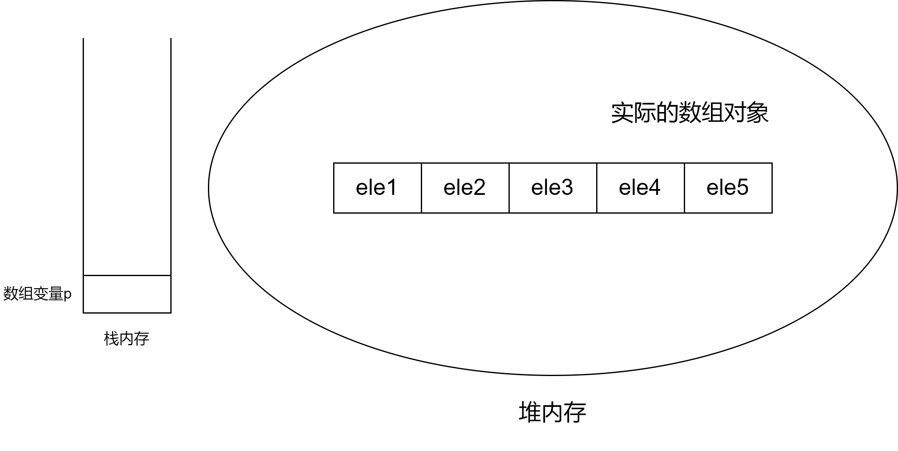
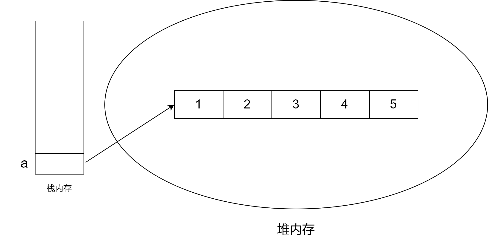
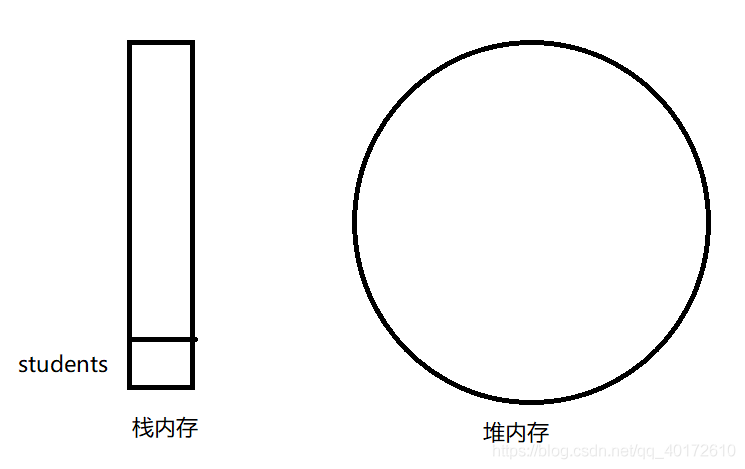
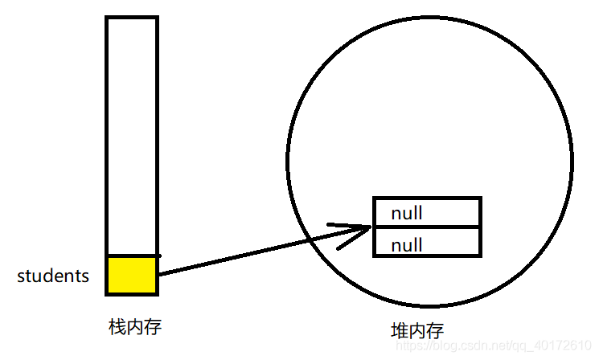
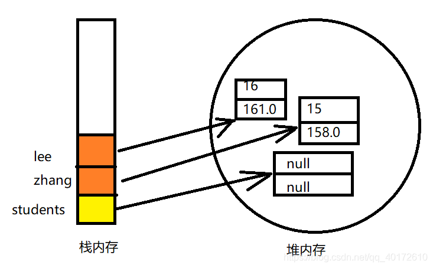
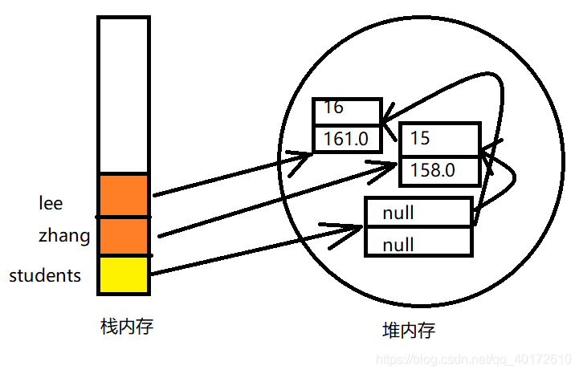

# Overview

数组是一种引用数据类型。

定义数组时，仅仅是定义了一个引用变量，因此不能指定数组的大小，只有在初始化时才能指定数组大小。

# 数组的初始化

数组的初始化有以下两种方法：

- 静态初始化：在初始化时由程序员提供数组的内容，系统来决定数组长度。

- 动态初始化：初始化时程序员只指定数组长度，系统来为数组元素分配初始值。

**1 静态初始化**

语法：

```java
arrayName = new type[]{ele1, ele2, ele3, ...};
//一种简洁写法
arrayName = {ele1, ele2, ele3, ...};
```

**2 动态初始化**

语法：

```java
arrayName = new type[length];
```

默认初始值：

1. 数值型：0
2. boolean型：false
3. char型：'\\u0000'
4. 引用型：null

# 数组在内存中的存储

实际的数组对象存储在堆内存中；如果数组的引用变量是一个局部变量，那么它将被存储在栈内存中。示意图如下：



只有通过p[index]的形式才能访问堆内存中的实际数组对象。

如果堆内存中数组不再有任何引用变量指向自己，则该数组所占的内存将会被系统的垃圾回收机制回收。因此，为了让垃圾回收机制回收一个数组所占的内存空间，可以将该数组的引用变量赋值为null。

## 基本类型的数组

对于基本类型的数组，数组元素的值直接保存在堆内存的数组对象中。

执行`int[] a = new int[] {1,2,3,4,5};`

其内存模型为：



## 引用类型的数组

示例：

```java
public class Test {
    public static void main(String[] args) {
        //定义一个students数组变量，类型是person[]
        Person[] students ;
        //数组动态初始化
        students = new Person[2];
        //创建Person类的实例化对象，并将这个Person类实例赋值给zhang
        Person zhang = new Person(15, 158);
        //创建Person类实例，并将这个Person类实例赋值给lee
        Person lee = new Person(16, 161);
        //将zhang和lee变量的值分别赋值给第一个元素
        students[0] = zhang ;
        students[1] = lee ;
        //输出打印信息，两个结果一致
        lee.information();
        students[1].information();
    }
}
class Person {
    public int age;
    public double height;

    public Person(int age, double height) {
        this.age = age;
        this.height = height;
    }

    public void information(){
        System.out.println("My age is :"+age+"My height is :"+height);
    }
}
```








# Arrays工具类

常用方法：

1 `int binarySearch(type[] a,type key)`：使用二分法查询key元素值在数组a中出现的索引；如果a数组不包含key元素值，则返回负数。调用该方法时要求数组中元素已经按升序排列，这样才能得到正确结果。

2 `int binarySearch(type[] a, int fromIndex, int toIndex, type key)`：搜索a数组中`fromIndex`到`toIndex`索引的元素（左闭右开）。调用该方法时要求数组中元素已经按升序排列，这样才能得到正确结果。

```java
	public static int binarySearch(int[] a, int fromIndex, int toIndex,
                                   int key) {
        rangeCheck(a.length, fromIndex, toIndex);
        return binarySearch0(a, fromIndex, toIndex, key);
    }
	private static int binarySearch0(int[] a, int fromIndex, int toIndex,
                                     int key) {
        int low = fromIndex;
        int high = toIndex - 1;

        while (low <= high) {
            int mid = (low + high) >>> 1;
            int midVal = a[mid];

            if (midVal < key)
                low = mid + 1;
            else if (midVal > key)
                high = mid - 1;
            else
                return mid; // key found
        }
        return -(low + 1);  // key not found.
    }
```

3 `type[] copyOf(type[] original, int newLength)`：该方法将把original数组复制成一个新数组，其中length是新数组的长度，大于原数组长度时将用0或false填充，type可以是`boolean`，`int`，byte，short等基本类型，也可以是引用类型。

demo：

```java
public class Test {
    public static void main(String[] args) {
        Test test = new Test();
        Apple[] apples = new Apple[3];
        apples[0] = test.new Apple(0);
        apples[1] = test.new Apple(1);
        apples[2] = test.new Apple(2);
        Apple[] copy = Arrays.copyOf(apples, apples.length + 2);
        for (Apple apple : copy) {
            System.out.println(apple.weight);
        }
        //output:0 1 2 null null
    }
    class Apple {
        int weight = 10;
        public Apple(int weight) {
            this.weight = weight;
        }
    }
}
```

4 `type[] copyOfRange(type[] original, int from,int to)`：左闭右开。

```java
public class Test {
    public static void main(String[] args) {
        int[] data = new int[10];
        for (int i = 0; i < 10; i++) {
            data[i] = i ^ (100 - i);
        }
        int[] copy = Arrays.copyOfRange(data, 0, 5);
        for (int i : copy) {
            System.out.print(i + " ");
        }
        //output:100 98 96 98 100 
    }
}
```

5 `boolean equals(type[] a1, type[] a2)`：如果a1数组和a2数组的长度相等，而且他们的数组元素也一一相同，该方法将返回true。

6 `void fill(type[] a, type value)`：该方法将会a数组里的所有元素赋值为value，type可以为基本类型和引用类型。

```java
public class Test {
    public static void main(String[] args) {
        List[] lists = new List[3];
        Arrays.fill(lists, new ArrayList<>());
        for (List list : lists) {
            System.out.println(list.toString());
        }
        //output：[]	[] []
    }
}
```

7 `void fill(type[] a, int fromIndex, int toIndex, type value)`：左闭右开。

8 `void sort(type[] a)`：该方法对数组a的数组元素进行排序。

9 `void sort(type[] a, int fromIndex, int toIndex)`：左闭右开。

10 `String toString(type[] a)`