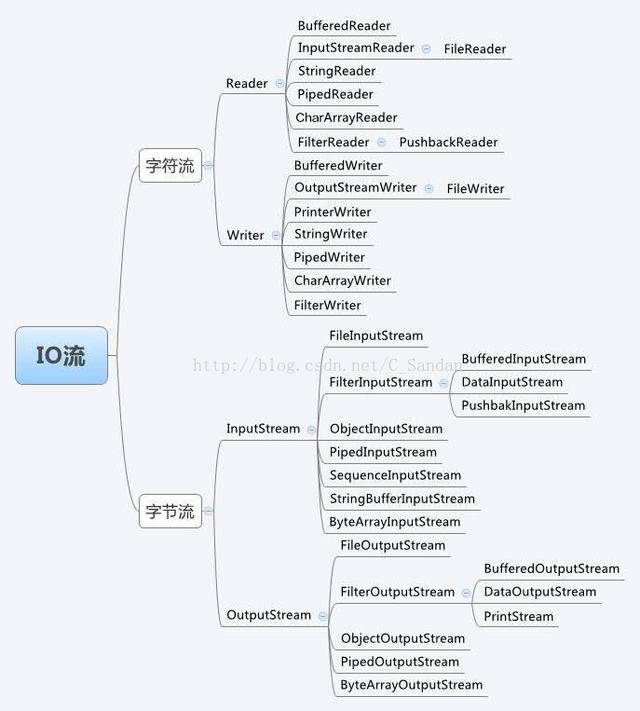
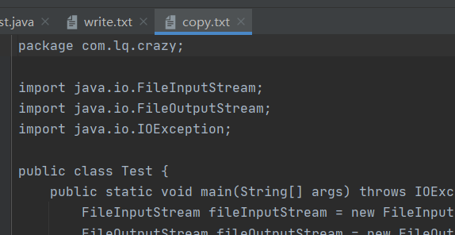
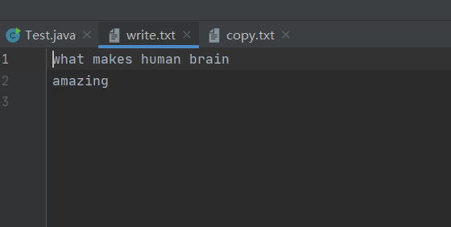
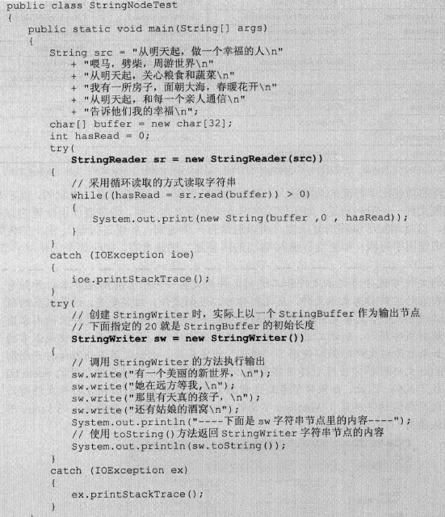
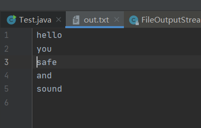
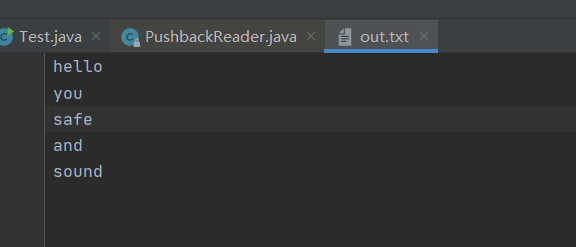
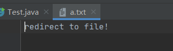
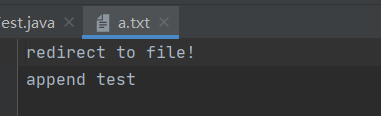
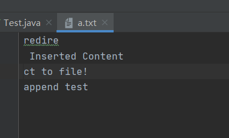

Java的IO是通过java.io包中的类和接口来支持，在java.io中主要包括输入、输出两种IO流，每种流又可分为字符流和字节流两种类型。字节流以字节为单位处理输入输出操作，字符流以字符为单位处理输入输出。

Java的IO流使用了一种装饰器设计模式，它将IO流分为底层节点流和上层处理流，其中节点流用于和底层的物理存储节点直接关联，将不同的物理节点流包装成统一的处理流，从而允许程序使用统一的输入输出代码来读取不同的物理存储节点的资源。

# File类

File类是java.io包下代表与平台无关的文件和目录，在程序中操作文件和目录都可以通过File类来完成。File能新建、删除、重命名文件和目录，但File不能访问文件内容本身，需要通过输入/输出流来辅助完成文件内容的访问。

## 构造方法

1. `File(File parent, String child)`：通过parent对象的路径和子路径创建新的File实例。
2. `File(String parent, String child)`：将两个路径名字符串标准化，然后根据两个路径创建对象实例。
3. `File(String pathname)`：将给定的路径名字符串标准化，然后创建新的File实例。

示例：

```java
public class Test {
    public static void main(String[] args) {
        //仅Windows有效('\\'中一个为转义符),Linux中为'/'
        File f1 = new File("D:\\io\\a.txt");
        //使用Java根据操作系统确定的分隔符创建File对象
        File f2 = new File("D:"+File.separator+"io"+File.separator+"a.txt");
        System.out.println(File.separator);
        System.out.println("f1:" + f1.getPath());
        System.out.println("f2:" + f2.getPath());
        //根据父File对象（需要是一个文件夹）和子路径名创建File对象
        File f3 = new File("D:\\io");
        File f4 = new File(f3, "a.txt");
        System.out.println("f4.toString() = " + f4);
        //根据父路径名和子路径名创建File对象
        File f5 = new File("D:\\io", "a.txt");
        System.out.println("f5.toString() = " + f5);
    }
}
```

输出：

```java
\
f1:D:\io\a.txt
f2:D:\io\a.txt
f4.toString() = D:\io\a.txt
f5.toString() = D:\io\a.txt
```

> `File.pathSeperator`为分隔多个文件的分隔符，Windows为分号，Linux为冒号。
>
> `File.seperator`为路径分隔符，Windows为\，Linux为/

## 常用方法

1. 访问文件名相关方法
	- `String getName()`：返回File对象所表示的文件名或文件夹名（目录对应的最后一级子路径名)。
	
	- `String getPath()`：返回File对象的路径字符串。
	- `File getAbsoluteFile()`：返回File对象的绝对路径对应的File。
	- `String getAbsolutePath()`：返回File对象的绝对路径字符串。
	- `File getParent()`：返回File对象的父目录名。
	- `boolean renameTo(File newName)`：重命名File对象，成功时返回true。
	
2. 文件检测相关方法

   - `boolean exits()`：判断File对象对应的文件或文件夹是否存在。
   - `boolean canWrite()`：判断File对象对应的文件或文件夹是否可写。
   - `boolean canRead()`：判断File对象对应的文件或文件夹是否可读。
   - `boolean isFile()`：判断File对象对应的是否是文件。
   - `boolean isDirectory()`：判断File对象对应的是否是目录。
   - `boolean isAbsolute()`：判断File对象对应的文件或目录是否是绝对路径。

3. 获取常规文件信息

   - `long lastModified()`：获取文件最后修改时间。
   - `long length()`：返回文件内容的长度。

4. 文件操作相关方法

   - `boolean createNewFile()`：创建该File对象指向的文件，成功时返回true。
   - `boolean delete()`：删除该File对象指向的文件或文件夹。
   - `static File createTempFile(String prefix, String suffix)`：在系统默认的临时文件目录中创建一个临时的空文件，使用给定前缀、系统生成的随机数和指定后缀作为文件名。可以通过File类直接调用。前缀至少长3个字节，后缀默认为`.tmp`。返回指向该文件的File对象。
   - `static File createTempFile(String prefix, String suffix, File directory)`：在指定目录生成临时文件。
   - `void deleteOnExit()`：注册一个删除hook，在JVM退出时删除该文件。

5. 目录操作相关方法

   - `boolean mkdir()`：创建一个File对象对应的目录，如果创建成功，返回true。
   - `String[] list()`：列出File对象的所有子文件名和文件夹名，返回String数组。
   - `File[] listFiles()`：返回File对象的所有子文件和文件夹组成的File数组。
   - `static File[] listRoots()`：列出系统所有的根路径。

示例程序：

```java
public class Test {
    public static void main(String[] args) throws IOException {
        File file = new File(".");
        //将输出一个点
        System.out.println(file.getName());
        System.out.println(file.getPath());
        //使用相对路径时，父路径为null，将输出null
        System.out.println(file.getParent());
        //获取绝对路径
        System.out.println(file.getAbsoluteFile());
        //获取上一级路径
        System.out.println(file.getAbsoluteFile().getParentFile().getPath());
        System.out.println(file.getAbsoluteFile().getParentFile().getName());
        //在当前路径创建一个临时文件
        File tmp = File.createTempFile("abc",".tmp", file);
        //JVM退出时自动删除
        tmp.deleteOnExit();
        File newFile = new File(System.currentTimeMillis()+"");
        System.out.println("newFile 是否存在："+ newFile.exists());
        //在当前目录创建newFile
        newFile.createNewFile();
        //newFile已经存在，因此mkdir返回false
        newFile.mkdir();
        //列出当前路径所有文件和文件夹
        System.out.println("当前路径下的所有文件与文件夹名");
        for(String s : file.list()) {
            System.out.println(s);
        }
        System.out.println("系统的根路径");
        for(File f : File.listRoots()) {
            System.out.println(f);
        }
    }
}
```


output：

```
.
.
null
D:\liuqi\IdeaProjects\leetcode\.
D:\liuqi\IdeaProjects\leetcode
leetcode
newFile 是否存在：false
当前路径下的所有文件与文件夹名
.idea
1606380575196
a.ini
abc3937630911032194841.tmp
leetcode.iml
out
src
系统的根路径
C:\
D:\
E:\

Process finished with exit code 0
```

# Java的IO流

Java将不同的输入输出源抽象表述成”流“，通过流的方式可以使Java抽象用相同的方式来访问不同的输入输出源。

## 流的分类

按不同的方式可以将流分成不同的种类。

1. 输入流和输出流

   Java的输入流主要由`InputStream`和`Reader`作为基类，输出流主要由`OutputStream`和`Writer`类作为基类。他们都是抽象类，无法直接创建实例。

2. 字节流和字符流

   字节流的数据单元是一个8位的字节，字符流的数据单元是16位的字符。

3. 节点流和处理流

   按照流的角色来分，可以分为节点流和处理流。

   可以从/向一个特定的IO设备读写数据的流，称为节点流，也叫低级流（Low Level Stream）。

   处理流用于对一个已存在的流进行连接或封装，通过封装后的流来实现数据读写功能。在使用处理流进行输入输出时，程序不会直接连接到数据源，而是会通过处理流包装的节点流作为中介。这样，就可以采用相同的代码访问不同的数据源，随着节点流的改变，访问的数据源也发生改变。

## 流的概念

Java把所有设备里的有序数据抽象成流模型。

Java的IO流里的四十多个类都是从以下4个基类派生出来的：

- `InputStream/Reader`：所有输入流的基类，前者为字节输入流，后者为字符输入流。
- `OutputStream/Writer`：所有输出流的基类，前者为字节输出流，后者为字符输出流。



# 字节流和字符流

## `InputStream`和`Reader`

`InputStream`中包含了如下三个方法：

- `int read()`：从输入流读取一个字节，返回转为`int`后的该字节里的数据。
- `int read(byte[] b)`：从输入流最多读取`b.length`个字节，将数据存入b数据，返回读取的字节数。
- `int read(byte[] b, int off, int len)`：从输入流最多读取`len`个字节的数据，并在b的off位置开始存储读取到的数据，返回读取的字节数。

`Reader`中包含了如下的三个方法：

- `int read()`：从输入流中读取单个字符。
- `int read(char[] b)`
- `int read(char[] b, int off, int len)`

其他的两个方法都是通过调用无参read方法实现的。

它们支持以下的几个方法用于移动记录指针：

- `void mark(int readAheadLimit)`：在记录指针当前位置做一个标记。
- `boolean markSupport()`：检查当前流是否支持mark操作。
- `void reset`：将流的记录指针重新定位到上一次记录标记的位置。
- `long skip(long n)`：记录指针向前移动n个字节/字符。

### `FileInputStream`

`FileInputStream`是`InputStream`的一个用于读取文件的子类，并且是一个节点流。其构造方法接收一个File对象或一个文件的路径。

示例程序如下：

```java
public class Test {
    public static void main(String[] args) throws IOException {
        FileInputStream fileInputStream = new FileInputStream("./src/com/lq/crazy/Test.java");
        byte[] buff = new byte[10];
        int hasRead = 0;
        while((hasRead = fileInputStream.read(buff)) > 0) {
            System.out.println(new String(buff, 0, hasRead));
        }
        fileInputStream.close();
    }
}
```

输出：

```
package co
m.lq.crazy
;

impor
t java.io.
```

程序每次输出十个字节的数据（当文件中存在汉字时，由于一个汉字占两个字节，因此如果读文件时某一次只读到半个汉字，即一个字节，则会打印出乱码）。

程序中打开的IO资源不属于内存里的资源，垃圾回收机制无法回收该资源，因此应该显式关闭文件IO资源。

### `FileReader`

`FileReader`是`Reader`的一个用于读取文件的子类，并且是一个节点流。其构造方法同样接收一个File对象或一个文件的路径。

示例程序：

```java
public class Test {
    public static void main(String[] args) throws IOException {
        FileReader fileReader = new FileReader("./src/com/lq/crazy/Test.java");
        char[] buff = new char[20];
        int hasRead = 0;
        while((hasRead = fileReader.read(buff)) > 0) {
            System.out.println(new String(buff, 0, hasRead));
        }
        fileReader.close();
    }
}
```

输出：

```
package com.lq.crazy
;

import java.io.
FileInputStream;
im
port java.io.FileRea
```

## `OutputStream`和`Writer`

`OuputStream`提供了以下三个方法：

- `void write(int c)`：将指定的字节输出到输出流中。

- `void write(byte[] buf)`：将字节数组的内容输出到输出流中。
- `void write(byte[] buf, int off, int len)`：指定offset和length。

`Writer`提供的方法：

- `void write(int c)`：将指定的字符输出到输出流中。

- `void write(char[] buf)`
- `void write(char[] buf, int off, int len)`

Writer对象还可以以String对象作为参数：

- `void write(String str)`：将`str`对象输出到输出流。
- `void write(String str, int off, int len)`

### `FileOutputStream`

`FileOutputStream`是`OutputStream`的一个用于写入文件的子类。

示例程序：

```java
public class Test {
    public static void main(String[] args) throws IOException {
        FileInputStream fileInputStream = new FileInputStream("./src/com/lq/crazy/Test.java");
        //在IDEA中，相对目录为.../projectName/
        //在eclipse中相对目录为.../src/
        //程序路径中的./可以省略，直接写成"copy.txt"
        FileOutputStream fileOutputStream = new FileOutputStream("./copy.txt");
        byte[] buff = new byte[1024];
        int hasRead = 0;
        while((hasRead = fileInputStream.read(buff)) > 0) {
            fileOutputStream.write(buff, 0, hasRead);
        }
        fileInputStream.close();
    }
}
```

当文件不存在时，`FileOutputStream`会自动创建文件。



### `FileWriter`

当需要直接处理字符串文件时，`Writer`将是一个更好的选择。

`FileWriter`是`Writer`的一个用于写入文件的子类。

示例程序：

```java
public static void main(String[] args) throws IOException {
    FileWriter fileWriter = new FileWriter("write.txt");
    fileWriter.write("what makes human brain \r\n");
    fileWriter.write("amazing\r\n");
    fileWriter.close();
}
```

文件不存在时，程序将自动创建文件。



# 输入/输出流体系

上面介绍了四个基类和它们的四个节点流子类。基类的方法使用起来较为繁琐，通过使用处理流可以简化编程。

JAVA输入输出流体系中常用的流分类：

| 分类       | 字节输入流             | 字节输出流              | 字符输入流        | 字符输出流        |
| ---------- | ---------------------- | ----------------------- | ----------------- | ----------------- |
| 抽象基类   | `InputStream`          | `OutputStream`          | `Reader`          | `Writer`          |
| 访问文件   | `FileInpueStream`      | `FileOutputStream`      | `FileReader`      | `FileWriter`      |
| 访问数组   | `ByteArrayInpueStream` | `ByteArrayOutputStream` | `charArrayReader` | `CharArrayWriter` |
| 访问管道   | `PipedInputStream`     | `PipedOutputStream`     | `PipedReader`     | `PipedWriter`     |
| 访问字符串 |                        |                         | `StringReader`    | `StringWriter`    |
| 缓冲流     | `BufferInputStream`    | `BufferInputStream`     | `BufferReader`    | `BufferReader`    |
| 转换流     |                        |                         | `InputStreamReader` | `InputStreamWriter` |
| 对象流     | `ObjectOutputStream` | `ObjectOutputStream` |                     |                     |
| 抽象基类   | `FilterInputStream`    | `FilterOutputStream` | `FilterReader` | `FilterWriter` |
| 打印流     |                        | `PrintStream` |                   | `PrintWriter` |
| 推回输入流 | `PushbackInputStream` |                         | `PushbackReader` |                   |
| 特殊流     | `DataInputStream` | `DataOutputStream` |                   |                   |

通常来说，字节流比字符流功能更强大，字符流只能处理文本文件，而字节流能处理所有的二进制文件。

表中列出了以数组或字符串等为物理节点的节点流，它们的使用过程与以文件为物理节点的节点流完全相似，只是输入和输出的目标由文件变成了字符串或数组。

示例：



访问管道的流主要用于实现进程间的通信。

缓冲流具有缓冲功能，可以提高输入输出的效率，但需要使用flush方法才会将缓冲区的内容输出到物理节点。

对象流主要用于实现对象的序列化。

## 处理流示例

`PrintStream`接收一个`OutputStream`对象作为构造方法的参数，可以更方便的进行输出操作。

example:

```java
public class Test {
    public static void main(String[] args) throws IOException {
        PrintStream printStream = new PrintStream(new FileOutputStream("out.txt"));
        printStream.println("right");
        printStream.print(555);
        printStream.close();
    }
}
```

`System.out`对象的类型就是`printStream`。

## 转换流

`InputStreamReader`和`OutputStreamWriter`用于将字节的输入输出流转换为字符输出输出流。

示例：Java的System.in是一个字节输入流，使用起来不太方便，可以使用`InputStreamReader`将其转换成一个字节输入流（`InputStreamReader`是Reader的一个子类，不是抽象类，可以直接实例化），之后包装成`BufferReader`，方便地读取数据。

```java
public class Test {
    public static void main(String[] args) {
        try {
            BufferedReader bufferedReader = new BufferedReader(new InputStreamReader(System.in));
            //append=true时会在文件尾追加写入数据
            BufferedWriter bufferedWriter = new BufferedWriter(new OutputStreamWriter(new FileOutputStream("out.txt", true)));
            String str = null;
            while((str = bufferedReader.readLine()) != null) {
                if(str.equals("exit"))
                    break;
                bufferedWriter.write(str+'\n');
            }
            bufferedWriter.close();
            bufferedReader.close();
        } catch (Exception e) {
            e.printStackTrace();
        }
    }
}
```

输出：

```
safe
and
sound
exit

Process finished with exit code 0
```



## 推回输入流

在输入输出流体系中有两个特殊的流，`PushbackInputStream`和`PushbackReader`，它们含有以下三个方法：

- `void unread(byte[]/char[] buf)`：将一个字节/字符数组的内容推回到推回缓冲区里，允许重复读取刚刚读取到的内容。
- `void unread(byte[]/char[] buf, int off, int len)`：将字节或字符数据从offset起的length个数据推回到推回缓冲区。
- `void unread(int b)`：将一个字节/字符推回到推回缓冲区（b是char或者byte对应的值）。

这两个流带有一个推回缓冲区，调用unread方法时会将数据放到推回缓冲区中。这两个流在执行read方法时会首先从推回缓冲区取数据，推回缓冲区没有数据时再从输入流中取数据。

程序在创建`PushbackInputStream`和`PushbackReader`时需要指定推回缓冲区的大小，默认的推回缓冲区大小为1。当程序推回到退回缓冲区的数据超出推回缓冲区的存储空间时会触发`Pushback buffer overflow`的`IOException`。

示例程序：

```java
public class Test {
    public static void main(String[] args) {
        try {
            PushbackReader pushbackReader = new PushbackReader(new FileReader("out.txt"), 10);
            char[] buff = new char[3];
            String lastContent = "";
            int hasRead = 0;
            while((hasRead = pushbackReader.read(buff)) > 0) {
                String content = new String(buff, 0, hasRead);
                int targetIndex = 0;
                if((targetIndex = (lastContent+content).indexOf("and")) > 0) {
                    pushbackReader.unread((lastContent+content).toCharArray());
                    if(targetIndex > 3) {
                        buff = new char[targetIndex];
                    }
                    pushbackReader.read(buff, 0, targetIndex);
                    System.out.println(new String(buff, 0, targetIndex));
                    break;
                }else {
                    System.out.println(lastContent);
                    lastContent = content;
                }
            }
        } catch (Exception e) {
            e.printStackTrace();
        }
    }
}
```

输出：



```
hel
lo

you

sa
fe


Process finished with exit code 0
```

找到指定字符串（本例中为“and”），并输出该字符串前的所有内容。

# 重定向标准输入/输出

在System类中提供了三个重定向标准输入/输出的方法：

- `static void setErr(PrintStream err)`
- `static void setIn(InputStream in)`
- `static void setOut(PrintStream out)`

示例一：将`System.out`重定向到文件输出

```java
public class Test {
    public static void main(String[] args) {
        try {
            PrintStream printStream = new PrintStream(new FileOutputStream("a.txt", true));
            System.setOut(printStream);
            System.out.println("redirect to file!");
        }catch (Exception e) {
            e.printStackTrace();
        }
    }
}
```

输出：



示例二：将标准输入重定向到文件，并用Scanner包装。

```java
public static void main(String[] args) {
    try {
        FileInputStream fileInputStream = new FileInputStream("a.txt");
        System.setIn(fileInputStream);
        Scanner scanner = new Scanner(System.in);
        while(scanner.hasNextLine()){
            System.out.println(scanner.nextLine());
        }
    }catch (Exception e) {
        e.printStackTrace();
    }
}
```

```
redirect to file!

Process finished with exit code 0
```

# JVM读写其他进程的数据

使用Runtime对象的exec()方法可以运行平台上的其他程序，该方法产生一个Process对象，Process对象代表由Java程序启动的子进程。Process类提供了以下三个方法，用于让程序和其子进程进行通信。

- `InputStream getErrorStream()`：获取子进程的错误流。
- `InputStream getInputStream()`：获取子进程的输入流。
- `InputStream getOutputStream()`：获取子进程的输出流。

这里的输入流和输出流都是相对于Java程序而言的，输入流指java程序从子进程读数据的流。

示例程序：运行windows的`dir`命令，并获取`cmd`子进程的输入流。

```java
public class A {
    public static void main(String[] args) {
        try {
            String[] cmd = {"cmd.exe", "/c", "dir", "D:\\MySQL\\mysql-5.7.30"};
            Process process = Runtime.getRuntime().exec(cmd);
            BufferedReader bufferedReader = new BufferedReader(new InputStreamReader(process.getInputStream()));
            String str = null;
            while ((str = bufferedReader.readLine()) != null)
                System.out.println(str);
        } catch (IOException e) {
            e.printStackTrace();
        }
    }
}
```

输出（中文有乱码，以UTF8的方式打开GBK文件）：

```
 ������ D �еľ�û�б�ǩ��
 �������� 0DF5-1B4B

 D:\MySQL\mysql-5.7.30 ��Ŀ¼

2020/09/17  23:51    <DIR>          .
2020/09/17  23:51    <DIR>          ..
2020/09/17  23:47    <DIR>          bin
.....
```

# `RandomAccessFile`

`RandomAccessFile`是输入输出流体系中功能最丰富的文件内容访问类，它能够对文件实现随机读写。`RandomAccessFile`不能对除文件外的其他物理节点进行访问。

`RandomAccessFile`中包含一个可自由移动的记录指针，操作该指针的方法有：

- `long getFilePointer()`：返回文件记录指针的当前位置。
- `void seek(long pos)`：将文件记录指针定位到position位置，单位为字节。

`RandomAccessFile`类的构造方法可以接收文件路径字符串或者File对象作为参数，同时，还需要一个mode参数，指定文件的访问权限：

- `r`：只读模式。
- `rw`：可读可写，当文件不存在时创建该文件。
- `rws`：读写模式打开文件，并且要求实时将文件内容或**文件元数据**的每个更新同步到底层存储设备。
- `rwd`：读写模式打开文件，只要求实时将文件内容的每个更新同步到底层存储设备。

`RandomAccessFile`读写文件的单位是字节。

示例一：从指定位置开始读数据

```java
public class Test {
    public static void main(String[] args) {
        try {
            RandomAccessFile randomAccessFile = new RandomAccessFile("src/com/lq/crazy/Test.java", "r");
            System.out.println("文件指针起始位置："+randomAccessFile.getFilePointer());
            //文件的第一个字节处
            randomAccessFile.seek(700);
            byte[] buff = new byte[1024];
            int hasRead = 0;
            while((hasRead = randomAccessFile.read(buff)) > 0) {
                System.out.println(new String(buff, 0, hasRead));
            }
        }catch (Exception e) {
            e.printStackTrace();
        }
    }
}
```

输出：

```
文件指针起始位置：0
        e.printStackTrace();
        }
    }
}
```

示例二：在文件尾追加数据

```java
public class Test {
    public static void main(String[] args) {
        try {
            RandomAccessFile randomAccessFile = new RandomAccessFile("a.txt", "rw");
            randomAccessFile.seek(randomAccessFile.length());
            randomAccessFile.write("append test \r\n".getBytes());
        }catch (Exception e) {
            e.printStackTrace();
        }
    }
}
```

输出：




向指定文件的中间插入内容时，咋将文件读写指针移动到目标位置后，要在临时文件中保存目标位置之后的内容，然后移动指针，写入数据，在指针之后写入临时文件中的数据。

示例：

```java
public class Test {
    public static void main(String[] args) {
        try {
            String content = "\r\n Inserted Content \r\n";
            RandomAccessFile randomAccessFile = new RandomAccessFile("a.txt", "rw");
            File tmp = File.createTempFile("tmp", null);
            tmp.deleteOnExit();
            FileOutputStream fileOutputStream = new FileOutputStream(tmp);
            FileInputStream fileInputStream = new FileInputStream(tmp);
            int pos = 6;
            randomAccessFile.seek(pos);
            byte[] buff = new byte[64];
            int hasRead = 0;
            while((hasRead = randomAccessFile.read(buff)) > 0) {
                fileOutputStream.write(buff, 0, hasRead);
            }
            randomAccessFile.seek(pos);
            randomAccessFile.write(content.getBytes());
            while ((hasRead = fileInputStream.read(buff)) > 0) {
                randomAccessFile.write(buff, 0, hasRead);
            }
        }catch (Exception e) {
            e.printStackTrace();
        }
    }
}
```

输出：



> 多线程网络下载工具，例如IDM，可以通过`RandomAccessFile`类来实现。

# NIO


