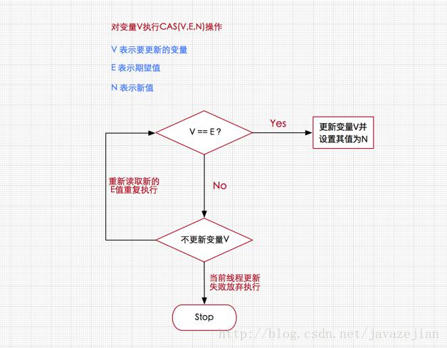
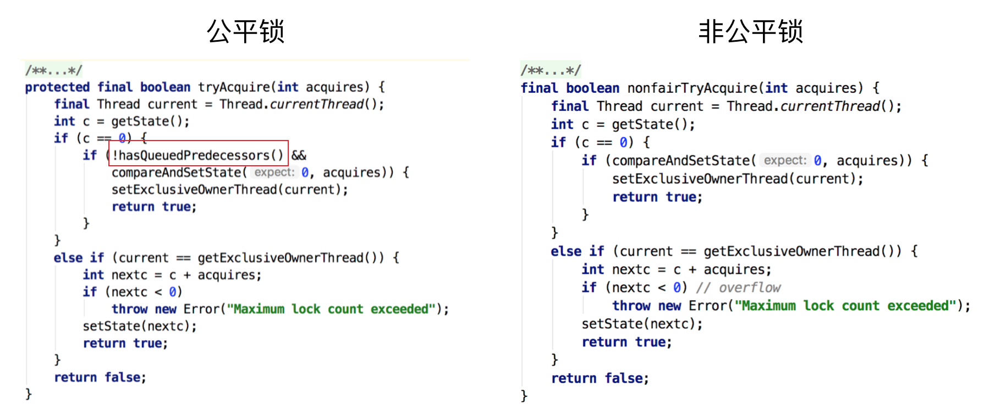
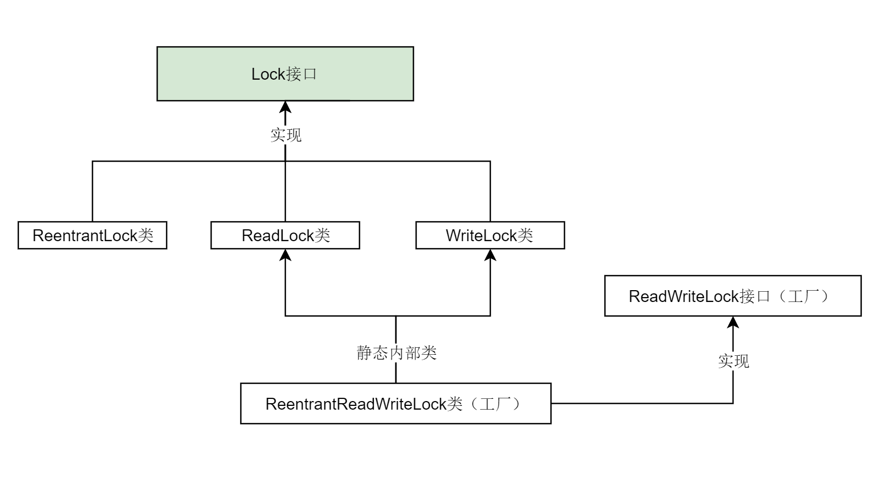
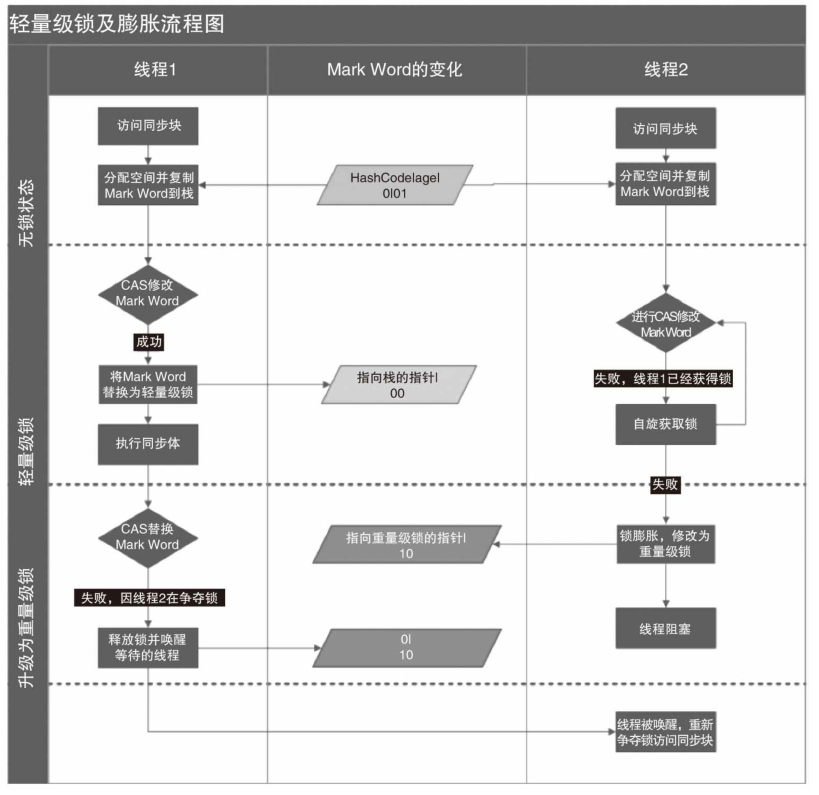

# overview

## 1.1 上下文切换

CPU通过时间片分配算法来循环执行任务，当前任务执行一个时间片后会切换到下一个任务。但是，在切换前会保存上一个任务的状态，以便下次切换回这个任务时，可以再加载这个任务的状态。所以任务从保存到再加载的过程就是一次上下文切换。

在数据量较小时，并发的速度比串行要慢，原因就是线程有创建和上下文切换的开销。

减少上下文切换的方法有无锁并发编程、CAS算法、使用最少线程和使用协程。

- 无锁并发编程：将数据分段，不同的线程处理不同段的数据（Concurrent Hash Map）
- CAS算法：Java的Atomic包使用CAS算法来更新数据，而不需要加锁。
- 使用最少线程：线程池技术。
- 协程：在单线程里实现多任务的调度，并在单线程里维持多个任务间的切换。
## 1.2 CAS算法

无锁算法Compare And Swap。

独占锁是一种悲观锁，synchronized就是一种独占锁，会导致其它所有需要锁的线程挂起，等待持有锁的线程释放锁。另一个更加有效的锁是乐观锁。即每次不加锁，而是假设没有冲突而去完成某项操作，如果因为冲突失败就重试，直到成功为止。

乐观锁用到的机制是CAS。CAS是一种无锁算法，CAS有3个操作数，内存值V，旧的预期值A，要修改的新值B。当且仅当预期值A和内存值V相同时，将内存值V修改为B，否则什么都不做。`java.util.concurrent`包全完建立在CAS之上。



CPU去更新一个值时，先将备份的值与内存中的值进行比较，如果值不同，说明在备份值到写入新值之前，有其他线程对该值进行了修改，则取消本次操作。

CAS的缺点：

- ABA问题：因为CAS需要在操作值的时候检查下值有没有发生变化，如果没有发生变化则更新，但是如果一个值原来是A，变成了B，又变成了A，那么使用CAS进行检查时会发现它的值没有发生变化，但是实际上却变化了。ABA问题的解决思路就是使用版本号。在变量前面追加上版本号，每次变量更新的时候把版本号加一，那么A－B－A 就会变成1A-2B－3A。从Java1.5开始JDK的atomic包里提供了一个类`AtomicStampedReference`来解决ABA问题。这个类的`compareAndSet`方法作用是首先检查当前引用是否等于预期引用，并且当前标志是否等于预期标志，如果全部相等，则以原子方式将该引用和该标志的值设置为给定的更新值。
- 循环时间长，开销大：当CAS长时间不成功时，会给CPU带来非常大的执行开销。如果CAS写入不成功将触发等待 -> 重试机制，这种情况是一个自旋锁，简单来说就是适用于短期内获取不到，进行等待重试的锁，它不适用于长期获取不到锁的情况，另外，自旋循环对于性能开销比较大。
- 只能保证一个共享变量的原子操作：CAS 只对单个共享变量有效，当操作涉及跨多个共享变量时 CAS 无效。从 JDK 1.5开始，提供了`AtomicReference`类来保证引用对象之间的原子性，可以把多个变量放在一个对象里来进行 CAS 操作。所以我们可以使用锁或者利用`AtomicReference`类把多个共享变量合并成一个共享变量来操作。

## 1.3 锁

Java中的锁分类：


### 1.3.1 悲观锁和乐观锁

锁的一种宏观分类方式是悲观锁和乐观锁。

悲观锁（Pessimistic Lock）：总是假设最坏的情况，每次取数据时都认为其他线程会修改该数据，所以每次在操作数据的时候都会上锁。传统的关系型数据库里边就用到了很多这种锁机制，比如行锁，表锁等，读锁，写锁等，都是在进行相关操作之前先上锁。Java中synchronized和`ReentrantLock`等独占锁就是悲观锁思想的实现。

乐观锁（Optimistic Lock）：总是假设最好的情况，每次取数据时都认为其他线程不会修改该数据，所以不会上锁，但是在更新的时候会判断在此期间内，其他线程有没有更新过这个数据，可以使用版本号机制和CAS算法实现。在Java中`java.util.concurrent.atomic`包下面的原子变量类就是使用了乐观锁的一种实现方式CAS实现的。

**悲观锁阻塞事务，乐观锁回滚重试。**

- 悲观锁适合写操作多的场景，先加锁可以保证写操作时数据正确。
- 乐观锁适合读操作多的场景，不加锁的特点能够使其读操作的性能大幅提升。

### 1.3.2 互斥锁

mutex（mutual   exclusive）即互斥量（互斥体）。

```
//要保证函数体为原子操作

mutex_lock(mutex) {
    lock(bus);    //给总线加锁

    mutex = mutex - 1;
    if(mutex != 0)
        block()
    else
        success

    unlock(bus);  
}


mutex_unlock(mutex) {
    lock(bus);

    mutex = mutex + 1;
    if (mutex != 1) 
        wakeup();
    else
        success
    
   	unlock(bus);
}
```

### 1.3.3 自旋锁与适应性自旋锁

阻塞或唤醒一个Java线程需要操作系统切换CPU状态来完成，这种状态转换需要耗费处理器时间。如果同步代码块中的内容过于简单，状态转换消耗的时间有可能比用户代码执行的时间还要长。

在许多场景中，同步资源的锁定时间很短，为了这一小段时间去切换线程，线程挂起和恢复现场的花费可能会让系统得不偿失。如果物理机器有多个处理器，能够让两个或以上的线程同时并行执行，我们就可以让后面那个请求锁的线程不放弃CPU的执行时间，看看持有锁的线程是否很快就会释放锁。

而为了让当前线程“稍等一下”，我们需让当前线程进行自旋，如果在自旋完成后前面锁定同步资源的线程已经释放了锁，那么当前线程就可以不必阻塞而是直接获取同步资源，从而避免切换线程的开销。这就是自旋锁。


自旋锁本身是有缺点的，它不能代替阻塞。自旋等待虽然避免了线程切换的开销，但它要占用处理器时间。如果锁被占用的时间很短，自旋等待的效果就会非常好。反之，如果锁被占用的时间很长，那么自旋的线程只会白浪费处理器资源。所以，自旋等待的时间必须要有一定的限度，如果自旋超过了限定次数（默认是10次，可以使用`-XX:PreBlockSpin`来更改）没有成功获得锁，就应当挂起线程。

自旋锁的实现原理同样也是CAS，`AtomicInteger`中调用unsafe进行自增操作的源码中的do-while循环就是一个自旋操作，如果修改数值失败则通过循环来执行自旋，直至修改成功。


自旋锁在JDK1.4.2中引入，JDK 6中变为默认开启，并且引入了自适应的自旋锁（适应性自旋锁）。

自适应意味着自旋的时间（次数）不再固定，而是由前一次在同一个锁上的自旋时间及锁的拥有者的状态来决定。如果在同一个锁对象上，自旋等待刚刚成功获得过锁，并且持有锁的线程正在运行中，那么虚拟机就会认为这次自旋也是很有可能再次成功，进而它将允许自旋等待持续相对更长的时间。如果对于某个锁，自旋很少成功获得过，那在以后尝试获取这个锁时将可能省略掉自旋过程，直接阻塞线程，避免浪费处理器资源。

### 1.3.4 公平锁与非公平锁

公平锁是指多个线程按照申请锁的顺序来获取锁，线程直接进入队列中排队，队列中的第一个线程才能获得锁。公平锁的优点是等待锁的线程不会饿死。缺点是整体吞吐效率相对非公平锁要低，等待队列中除第一个线程以外的所有线程都会阻塞，CPU唤醒阻塞线程的开销比非公平锁大。

非公平锁是多个线程加锁时直接尝试获取锁，获取不到才会到等待队列的队尾等待。但如果此时锁刚好可用，那么这个线程可以无需阻塞直接获取到锁，所以非公平锁有可能出现后申请锁的线程先获取锁的场景。非公平锁的优点是可以减少唤起线程的开销，整体的吞吐效率高，因为线程有几率不阻塞直接获得锁，CPU不必唤醒所有线程。缺点是处于等待队列中的线程可能会饿死，或者等很久才会获得锁。

实现：



### 1.3.5 可重入锁与非可重入锁

可重入锁又名递归锁，是指在同一个线程在外层方法获取锁的时候，再进入该线程的内层方法会自动获取锁（前提锁对象得是同一个对象或者 class），不会因为之前已经获取过还没释放而阻塞。Java中`ReentrantLock`和`synchronized`都是可重入锁，可重入锁的一个优点是可一定程度避免死锁。下面用示例代码来进行分析：

```Java
public class Widget {
    public synchronized void doSomething() {
        System.out.println("方法1执行...");
        doOthers();
    }

    public synchronized void doOthers() {
        System.out.println("方法2执行...");
    }
}
```

在上面的代码中，类中的两个方法都是被内置锁synchronized修饰的，`doSomething()`方法中调用`doOthers()`方法。因为内置锁是可重入的，所以同一个线程在调用`doOthers()`时可以直接获得当前对象的锁，进入`doOthers()`进行操作。

如果是一个不可重入锁，那么当前线程在调用`doOthers()`之前需要将执行`doSomething()`时获取当前对象的锁释放掉，实际上该对象锁已被当前线程所持有，且无法释放。所以此时会出现死锁。

实现：


### 1.3.6 独享锁与共享锁

独享锁也叫排他锁，是指该锁一次只能被一个线程所持有。如果线程T对数据A加上排它锁后，则其他线程不能再对A加任何类型的锁。获得排它锁的线程即能读数据又能修改数据。JDK中的synchronized和JUC中Lock的实现类就是互斥锁。

共享锁是指该锁可被多个线程所持有。如果线程T对数据A加上共享锁后，则其他线程只能对A再加共享锁，不能加排它锁。获得共享锁的线程只能读数据，不能修改数据。

独享锁与共享锁也是通过AQS来实现的，通过实现不同的方法，来实现独享或者共享。


## 1.4 epoll

`epoll`是Linux内核为处理大批量文件描述符而作了改进的poll，是Linux下多路复用IO接口select/poll的增强版本，它能显著提高程序在大量并发连接中只有少量活跃的情况下的系统CPU利用率。

`epoll`采用了红黑树来对它管理的FD集合作索引。

功能：加入新连接；检测部分节点有数据可读。

使用哈希的问题：需要多次扩容

使用B+数的问题：B+树主要用于磁盘索引，目的是减少寻址次数。

# Java并发机制的底层实现

Java有两种加锁的方式，一种是synchronized关键字，另一种是lock接口的实现类。



**`ReentrantLock`、`ReadLock`、`WriteLock`** 是Lock接口最重要的三个实现类。对应了“可重入锁”、“读锁”和“写锁”。

## 2.1 volatile

在多线程并发编程中，volatile是轻量级的synchronized，它在多处理器开发中保证了共享变量的“可见性”。即：

1. 写入的 `volatile` 变量在写完之后能被别的 CPU 在下一次读取中读取到；
2. 写入 `volatile` 变量之前的操作在别的 CPU 看到 `volatile` 的最新值后一定也能被看到；

volatile的使用恰当的话，它比synchronized的使用和执行成本更低，因为它不会引起线程上下文的切换和调度。

Java语言提供了volatile，在某种情况下比加锁更加方便。如果一个字段被声明成volatile，Java线程内存模型确保所有线程看到这个变量的值是一致的，Java语言保证使用volatile关键字修饰的变量在读取时，必须从主内存中获取最新的值，写入时一定实时写入到主内存（工作内存和主内存是JMM中的抽象概念，不一定实际存在）。

使用volatile

```java
class demo {
	volatile int i = 1;
    public void set(int num) {
        i = num;
    }
    public void inc() {
        i++;
    }
    public void get() {
        return i;
    }
}
```

使用锁

```java
class demo {
	int i = 1;
    public synchronized void set(int num) {
        i = num;
    }
    public void inc() {
        int tmp = get();
        tmp = tmp + 1;
        set(tmp);
    }
    public synchronized void get() {
        return i;
    }
}
```

上面的两段代码是等价的，对于get和set操作，使用volatile变量和使用锁的效果是一致的，但是对于`inc`操作，多线程环境下这样的操作不具有原子性。

### volatile底层原理

未优化的缓存一致性协议能够保证并发编程的可见性，但加入了写缓冲器和无效队列之后，必须由编译器在生成的机器码中插入内存屏障才能保证可见性。

> 内存屏障（memory barriers）：一组处理器指令，用于实现对内存操作的顺序限制。
>
> 缓存行（cache line）：CPU高速缓存中可以分配的最小存储单位。处理器填写缓存行时会加载整个缓存行。

#### **缓存一致性协议**

为了提高处理器的执行速度，在处理器和内存之间增加了多级缓存来提升。但是由于引入了多级缓存，就存在缓存数据不一致问题。

对于单核CPU，通常有两种方式：

- **通写法(Write Through)**：每次cache中的内容被修改后立即写入到内存。
- **写回法(Write Back)**：cache 中内容被修改后，延迟写入内存。当cache和内存数据不一致时以cache中的数据为准。

对于多核CPU来说，cache与主存的内容同步可能会存在多线程竞争问题，又引入了以下操作：

- **写失效**：当一个CPU修改了数据，其他CPU中的该数据失效
- **写更新**：当一个CPU修改了数据，通知其他CPU对该数据进行更新

在CPU层面，提供了两种解决方案：

- **总线锁**：在多CPU情况下，某个CPU对共享变量进行操作时对总线加锁，其他CPU不能对该变量进行读写，会影响CPU性能。
- **缓存锁**：降低了锁的粒度，基于缓存一致性协议。

缓存一致性协议：当CPU写数据时，如果发现操作的变量是共享变量，即在其他CPU中也存在该变量的副本，会发出信号通知其他CPU将该变量的缓存行置为无效状态，因此当其他CPU需要读取这个变量时，发现自己缓存中缓存该变量的缓存行是无效的，那么它就会从内存重新读取。

**缓存一致性协议需要满足两种特性：**

1. 写序列化：缓存一致性协议要求总线上任意时间只能出现一个CPU写事件，多核并发的写事件会通过总线仲裁机制转换成串行化的写事件序列。
2. 写传播：一个处理器的写操作对其他处理器可见。
   - 方式一：嗅探，CPU监听总线上的所有活动。
   - 方式二：基于目录，总线事件仅发送给需要接受的CPU。

通常使用的缓存一致性协议为MESI(Modified Exclusive Shared Invalid)，实现了写回法，写失效，缓存行锁，写传播，写序列化和嗅探机制。

四种状态：

- M: 被修改（Modified)

  当前 CPU 缓存有最新数据， 其他 CPU 拥有失效数据，当前 CPU 数据与内存不一致，但以当前 CPU 数据为准。

- E: 独享的（Exclusive)

  只有当前 CPU 有数据，其他 CPU 没有该数据，当前 CPU 数据与内存数据一致。

- S: 共享的（Shared)

  当前 CPU 与其他 CPU 拥有相同数据，并与内存中数据一致。

- I: 无效的（Invalid）

  当前 CPU 数据失效，其他 CPU 数据可能有可能无，数据应从内存中读取，且当前 CPU 与 内存数据不一致。

处理器对缓存的请求：

- `PrRd`：CPU 读操作
- `PrWr`：CPU 写操作

总线对缓存的请求：

- `BusRd`: 窥探器请求指出其他处理器请求**读**一个缓存块
- `BusRdX`: 窥探器请求指出其他处理器请求**写**一个该处理器不拥有的缓存块
- `BusUpgr`: 窥探器请求指出其他处理器请求**写**一个该处理器拥有的缓存块
- `Flush`: 窥探器请求指出请求**回写**整个缓存到主存
- `FlushOpt`: 窥探器请求指出整个缓存块被发到总线以发送给另外一个处理器（缓存到缓存的复制）

不同状态时，执行不同操作，会产生不同的状态转移。

**当前CPU状态为Modified**

- `PrRd`：直接从缓存中读取数据，无总线事务生成，状态不变。
- `PrWr`：直接修改当前 CPU 缓存数据，无总线事务生成，状态不变。

**当前状态为Exclusive**

- `PrRd`：无总线事务生成，状态不变。
- `PrWr`：修改当前 CPU 缓存值，无总线事务生成，状态改为 M。

**当前状态为Shared**

- `PrRd`：状态不变，无总线事务生成。
- `PrWr`：发出总线事务`BusUpgr`信号，状态改为M，其他缓存看到`BusUpgr`信号时标记缓存行为Invalid。

**当前CPU状态为Invalid**

- `PrRd`： CPU 缓存不可用，需要读内存。给总线发出`BusRd`信号，其他处理器看到`BusRd`，检查自己是否有失效的数据副本，向发送者回复Response。
  - 如果其他缓存有有效的副本，则状态转换为Shared。
  - 如果其他缓存都没有有效的副本，则从主存读取数据，状态转换为Exclusive。
- `PrWr`：当前 CPU 缓存不可用，需要写内存。给总线发出`BusRdX`信号，状态转换为Modified。
  - 如果其他缓存有有效的副本，则从其中一个缓存中获取数据，并向缓存块中写入修改后的值。
  - 否则，从主存中获取数据。

总线操作的状态转化：

| 初始状态  | 操作             | 响应                                                      |
| --------- | ---------------- | --------------------------------------------------------- |
| Invalid   | `BusRd`          | 状态保持不变，信号忽略                                    |
| Invalid   | `BusRdX/BusUpgr` | 状态保持不变，信号忽略                                    |
| Exclusive | `BusRd`          | 状态变为共享<br>发出总线`FlushOpt`信号并发出块的内容      |
| Exclusive | `BusRdX`         | 状态变为无效<br/>发出总线`FlushOpt`信号并发出块的内容     |
| Shared    | `BusRd`          | 状态变为共享<br/>可能发出总线`FlushOpt`信号并发出块的内容 |
| Shared    | `BusRdX`         | 状态变为无效<br/>可能发出总线`FlushOpt`信号并发出块的内容 |
| Modified  | `BusRd`          | 状态变为共享<br/>发出总线`FlushOpt`信号并发出块的内容     |
| Modified  | `BusRdX`         | 状态变为无效<br/>发出总线`FlushOpt`信号并发出块的内容     |

写操作仅在缓存行是 Modified 或 Excluded 状态时可自由执行。如果在共享状态或无效状态，其他缓存都要先把该缓存行置为无效，这种广播操作称作*Request For Ownership (RFO)*。


**MESI的问题：**

在 MESI 中，依赖总线嗅探机制，整个过程是串行的，可能会发生阻塞。

1. 若 CPU 发生RFO（让其他 CPU 将缓存修改为 Invalid 状态），首先需要发送一个 Invalidate 消息给到其他缓存了该数据的 CPU，随后阻塞并等待其他 CPU 的 ACK。
2. 对于 CPU 收到总线的读信号，需要失效缓存。当其高速缓存压力很大时，要求实时的处理失效事件也存在一定的困难，会有一定的延迟。

**为了解决MESI中的处理器等待问题，引入了写缓冲区和失效队列。**

#### 写缓冲区与失效队列

**写缓冲区Store Buffer**

写缓冲区是每个 CPU 私有的一块比高速缓存还小的存储部件，当使用了写缓冲区后，每当发生CPU的写操作（需要其他 CPU 将缓存无效化时），当前 CPU 不再阻塞地等待其他 CPU 的确认回执，而是直接将更新的值写入写缓冲区，然后继续执行后续指令，随后在某个时刻异步将数据写入到 cache 中，并将状态更新为 M 。

**存储转发Store Forwarding**

在进行 LR 时，CPU 会先在写缓冲区中查询记录是否存在，如果存在则会从写缓冲区中直接获取。

写缓冲区帮助处理器实现了异步写数据的能力，使得处理器处理指令的能力大大提升。

**失效队列**

失效队列也是每个 CPU 私有的，使用失效队列后，发生总线读事务时对应的 CPU 缓存不再同步地失效缓存并发送确认回执，而是将失效消息放入失效队列，立即发送ACK，随后在 CPU 空闲时异步将 cache 行置为 Invalid 状态。

失效队列解决了删除数据等待的问题。

**写缓冲区和失效队列虽然解决了缓冲一致性协议执行时，由于总线事务导致的CPU等待问题，但又导致了内存系统重排序（伪重排序）和可见性问题。**

由于写缓冲器和无效化队列的出现，处理器对cache的写入都变成了异步操作，且写缓冲和失效队列中的数据可能以任意顺序刷新到主存中。

例如：

可见性问题

CPU1 更新变量到写缓冲器中，而 CPU2 在收到 Invalidate 消息后，回复ACK，并向无效化队列写入一条无效化缓存的消息，当 CPU2 还未消费无效化队列的信息，并读取变量时，读到的依然是旧值；或者 CPU1 在未收到全部 ACK，修改的数据仍位于写缓冲中时，CPU3 进行读操作，读到的仍然是旧值。

伪重排序问题

Store-Load重排序，对于代码：

```
int a = 10;
int b = 2;
void f() {
	a = 20;
	int c = b;
}
```

当 CPU 将对变量 a 和 c 的写入记录到写缓冲中，且 c 变量先于 a 变量从写缓冲中刷新到 cache ，则会导致代码的执行顺序看起来变为了 2 -> 1，而这是由于写缓冲区写入 cache 顺序的随机性导致的，有的观点也将这种由于可见性导致的重排序称为内存系统重排序。

处理器在写缓冲器满、I/O指令被执行时会将写缓冲器中的内容写入高速缓存中。但从变量更新角度来看，处理器本身无法保障这种更新的”及时“性。为了保证处理器对共享变量的更新可被其他处理器同步，编译器等底层系统借助一类称为内存屏障的特殊指令来实现。

#### 内存屏障

**内存屏障**（英语：Memory barrier），也称**内存栅栏**，**内存栅障**，**屏障指令**等，是一类同步屏障指令，它使得 CPU 或编译器在对内存进行操作的时候, 严格按照一定的顺序来执行, 也就是说在memory barrier 之前的指令和memory barrier之后的指令不会由于系统优化等原因而导致乱序。

大多数现代计算机为了提高性能而采取乱序执行，这使得内存屏障成为必须。

**内存屏障 (Memory Barrier)**分为**写屏障（Store Barrier）**、**读屏障（Load Barrier）**和**全屏障（Full Barrier）**，其作用有两个：

1. 防止指令之间的重排序：写屏障会禁止屏障前后的写指令的重排序，读屏障会禁止屏障前后的读指令的重排序，全屏障会禁止屏障前后的读写指令之间的重排序。
2. 保证数据的可见性：写屏障会阻塞直到 Store Buffer 中的数据刷新到主存中读屏障会阻塞直到 Invalid Queue 中的消息执行完毕。

内存屏障的一种实现：

- 当CPU收到屏障指令时，不将屏障指令放入序列缓冲区，而将屏障指令及后续所有指令放入一个FIFO队列中（指令是按批发送的，不然没有乱序的必要）
- 允许乱序执行完序列缓冲区中的所有指令
- 从FIFO队列中取出屏障指令，执行（并刷新缓存等，实现内存可见性的语义）
- 将FIFO队列中的剩余指令放入序列缓冲区
- 恢复正常的乱序执行

Java中的内存屏障

| 屏障类型              | 指令示例                   | 说明                                                         |
| :-------------------- | :------------------------- | :----------------------------------------------------------- |
| `LoadLoad Barriers`   | `Load1;LoadLoad;Load2`     | 该屏障确保Load1先于Load2及其后所有 load 指令完成，且屏障前的 Load 指令不会排序到屏障后。 |
| `StoreStore Barriers` | `Store1;StoreStore;Store2` | 该屏障确保Store1立刻刷新数据到内存(使其对其他处理器可见)的操作先于Store2及其后所有存储指令的操作，且屏障前的 Store 指令不会被排序到屏障后。 |
| `LoadStore Barriers`  | `Load1;LoadStore;Store2`   | Ensures that Load1 completes before Store2 and any subsequent store operations.  Loads before Load1 may *not* float below Store2 and any  subsequent store operations. |
| `StoreLoad Barriers`  | `Store1;StoreLoad;Load2`   | Ensures that Store1 completes before Load2 and any subsequent load operations.  Stores before Store1 may *not* float below Load2 and any subsequent load operations. |

`StoreLoad Barriers`同时具备其他三个屏障的效果，因此也称之为`全能屏障`（`mfence,memory fence or full barrier`），是目前大多数处理器所支持的；但是相对其他屏障，该屏障的开销相对昂贵。

不同的CPU架构对内存屏障的实现也不同。

如果硬件架构本身已经保证了内存可见性（如单核处理器、一致性足够的内存模型等），或者硬件架构本身不进行处理器重排序、有更强的重排序语义（能够分析多核间的数据依赖）、或在单核处理器上重排序，那么volatile就是一个空标记，不会插入相关语义的内存屏障。

在具体实现上，x86架构下，`LoadLoad`、`LoadStore`、`StoreStore`三种屏障是空操作（由架构本身保证相关指令不进行重排序），`StoreLoad`通过lock前缀指令实现的，在x86架构下`HotSpot`虚拟机中 volatile 的底层实现是在变量赋值指令前加上 lock 前缀。

### volatile内存语义的增强

为了让volatile的读写具有和锁的获取与释放相同的效果，JSR对volatile的语义进行了增强，在编译器层面，对volatile变量的读写与普通变量的读写重排序规则做出了一定的限制，与volatile在内存屏障上的优化结合，实现了对对某个未被锁保护的变量的访问操作进行排序。

volatile变量需要维护的特性：

- 可见性，每次读 `volatile` 变量总能读到它最新值，即最后一个对它的写入操作，不管这个写入是不是当前线程完成的。
- 禁止指令重排，也即维护 `happens-before` 关系，对 `volatile` 变量的写入不能重排到写入之前的操作之前，从而保证别的线程看到写入值后就能知道写入之前的操作都已经发生过；对 `volatile` 的读取操作一定不能被重排到后续操作之后，比如我需要读 `volatile`后根据读到的值做一些事情，做这些事情如果重排到了读 `volatile` 之前，则相当于没有满足读 `volatile` 需要读到最新值的要求，因为后续这些事情是根据一个旧 `volatile` 值做的。

| 是否能重排序 | 第二个操作 |             |             |
| ------------ | ---------- | ----------- | ----------- |
| 第一个操作   | 普通读/写  | volatile 读 | volatile 写 |
| 普通读/写    |            |             | NO          |
| volatile 读  | NO         | NO          | NO          |
| volatile 写  |            | NO          | NO          |


volatile变量的内存屏障：

- 在每个volatile写操作前插入`StoreStore`屏障，在写操作后插入`StoreLoad`屏障；
- 在每个volatile读操作后插入`LoadLoad`和`LoadStore`屏障；

volatile的内存屏障策略非常严格保守，保证了线程可见性。

例如，对于双重检查锁定与延迟初始化模型：

```java
public class Singleton1_3 {
  private static volatile Singleton1_3 singleton = null;
  public int f1 = 1;   // 触发部分初始化问题
  public int f2 = 2;
  private Singleton1_3() {
  }
  public static Singleton1_3 getInstance() {
    if (singleton == null) {
      synchronized (Singleton1_3.class) {
        // must be a complete instance
        if (singleton == null) {
          singleton = new Singleton1_3();
        }
      }
    }
    return singleton;
  }
}
```

通过增强的volatile语义，new关键字，禁止对象初始化与实例引用赋值两个操作之间的重排序，能够防止其他线程在某个线程已经进入临界区时，获取到值为null的引用变量。

### volatile不保证原子性

volatile可以保证单个变量的读/写具有原子性，但不保证一个代码块的原子性。

volatile方式的`i++`，总共是四个步骤：load、Increment、store、Memory Barriers。

内存屏障是线程安全的,但是内存屏障之前的指令并不是。在某一时刻线程1将 i 的值load取出来，放置到CPU缓存中，然后再将此值放置到寄存器A中，然后A中的值自增1（寄存器A中保存的是中间值，没有直接修改i，因此其他线程并不会获取到这个自增1的值）。如果在此时线程2也执行同样的操作，获取值i=10,自增1变为11，然后马上刷入主内存。此时由于线程2修改了i的值，实时的线程1中的i=10的值缓存失效，重新从主内存中读取，变为11。接下来线程1恢复。将自增过后的A寄存器值11赋值给CPU缓存i。这样就出现了线程安全问题。

### **总结**

1. 为了解决CPU与主存速度的不匹配，引入了cache，但导致了缓存一致性问题。
2. 为了解决缓存一致性问题，引入了MESI(缓存一致性协议)，但总线事务等待其他CPU的响应导致了CPU等待的问题
3. 引入了写缓冲队列和无效化队列，但导致了重排序和一致性问题
4. 引入内存屏障解决重排序与一致性问题。

在逻辑层面上，Java内存模型规定了所有的变量都存储在主内存中，每条线程有自己的工作内存，线程的工作内存中保存了该线程中是用到的变量的主内存副本，线程对变量的所有操作都必须在工作内存中进行，而不能直接读写主内存。不同的线程之间也无法直接访问对方工作内存中的变量，线程间变量的传递均需要自己的工作内存和主存之间进行数据同步进行。所以，就可能出现线程1改了某个变量的值，但是线程2不可见的情况，Java中的volatile关键字提供了一个功能，被其修饰的变量在被修改后可以立即同步到主内存，被其修饰的变量在每次使用前都从主内存刷新。

**工作内存和主内存都是抽象的概念，具体实现由JVM决定。**

JVM在处理volatile关键字时，首先对Java编译器重排序做出一定限制，再使用内存屏障对CPU重排序做出一定限制，最后通过MESI协议的支持，实现volatile的功能。


## 2.2. synchronized的实现原理和应用

未优化的synchronized被称为重量级锁，需要在用户态和内核态之间切换，效率很低。

synchronized实现同步的基础：

- 对于普通同步方法，锁是当前实例对象。

  ```java
  synchronized void method() {
      //业务代码
  }
  ```

- 对于静态同步方法，锁是当前类的Class对象。

  ```java
  synchronized static void method() {
      //业务代码
  }
  ```

- 对于同步方法快，锁是Synchronized括号里配置的对象。

  ```java
  synchronized(this) {
      //业务代码
  }
  ```

当一个线程试图访问同步代码块时，它首先必须得到锁，退出或抛出异常时必须释放锁，JVM基于进入和退出Monitor对象来实现同步和代码块同步。

JVM在编译后将`monitorenter`指令插入到同步代码块的开始位置，`monitorexit`插入到方法结束处和异常处，JVM要保证每个`monitorenter`与对应的`monitorexit`配对。

> 在 Java 虚拟机(`HotSpot`)中，Monitor 是基于 C++实现的，由[ObjectMonitor](https://github.com/openjdk-mirror/jdk7u-hotspot/blob/50bdefc3afe944ca74c3093e7448d6b889cd20d1/src/share/vm/runtime/objectMonitor.cpp)实现的。每个对象中都内置了一个 `ObjectMonitor`对象。
>
> 另外，`wait/notify`等方法也依赖于`monitor`对象，这就是为什么只有在同步的块或者方法中才能调用`wait/notify`等方法，否则会抛出`java.lang.IllegalMonitorStateException`的异常的原因。

在执行`monitorenter`时，会尝试获取对象的锁，如果锁的计数器为 0 则表示锁可以被获取，获取后将锁计数器设为 1 也就是加 1。

在执行 `monitorexit` 指令后，将锁计数器设为 0，表明锁被释放。如果获取对象锁失败，那当前线程就要阻塞等待，直到锁被另外一个线程释放为止。

`synchronized` 修饰的方法并没有 `monitorenter` 指令和 `monitorexit` 指令，取得代之的确实是 `ACC_SYNCHRONIZED` 标识，该标识指明了该方法是一个同步方法。JVM 通过该 `ACC_SYNCHRONIZED` 访问标志来辨别一个方法是否声明为同步方法，从而执行相应的同步调用。

demo（双重校验锁实现对象那个单例）：

```java
public class Singleton {
	//volatile 防止指令重排
    private volatile static Singleton uniqueInstance;
    private Singleton() {
    }
    public  static Singleton getUniqueInstance() {
       //先判断对象是否已经实例过，没有实例化过才进入加锁代码
        if (uniqueInstance == null) {
            //类对象加锁
            synchronized (Singleton.class) {
                //两个if，防止多个线程轮流执行synchronized方法
                if (uniqueInstance == null) {
                    uniqueInstance = new Singleton();
                }
            }
        }
        return uniqueInstance;
    }
}
```

**构造方法本身就是线程安全的，不能使用synchronized修饰。**

### 1 Java对象头

synchronized用的锁是存在对象头里的。如果对象是数组类型，则JVM用3个Word存储对象头，如果对象是非数组类型，则JVM用两个Word存储对象头。一个Word等于4字节。

| 长度     | 内容                   | 说明                             |
| -------- | ---------------------- | -------------------------------- |
| 32/64bit | Mark Word              | 对象的`hashcode`或锁信息等       |
| 32/64bit | Class Metadata Address | 指向方法区中对象的类型数据       |
| 32/64bit | Array Length           | 数组的长度（如果对象是数组类型） |

Mark Word中会默认存储对象的`HashCode`、GC分代年龄和锁标记位，这些数据都是与对象自身定义无关的数据。

| 锁状态   | 25bit      | 4bit       | 1bit是否是偏向锁 | 2bit锁标志位 |
| -------- | ---------- | ---------- | ---------------- | ------------ |
| 无锁状态 | `HashCode` | GC分代年龄 | 0                | 01           |

Mark Word中存储的数据会随着锁标志位的变化而变化。

Monitor可以理解为一个同步工具或一种同步机制，通常被描述为一个对象。每一个Java对象就有一把看不见的锁，称为内部锁或者Monitor锁。

Monitor是线程私有的数据结构，每一个线程都有一个可用monitor record列表，同时还有一个全局的可用列表。每一个被锁住的对象都会和一个monitor关联，同时monitor中有一个Owner字段存放拥有该锁的线程的唯一标识，表示该锁被这个线程占用。

synchronized通过Monitor来实现线程同步，Monitor是依赖于底层的操作系统的Mutex Lock（互斥锁）来实现的线程同步。

**无锁状态**

| 25bit            | 4bit         | 1bit(是否是偏向锁) | 2bit(锁标志位) |
| ---------------- | ------------ | ------------------ | -------------- |
| 对象的`hashCode` | 对象分代年龄 | 0                  | 01             |

**偏向锁状态**

| 23bit  | 2bit  | 4bit         | 1bit | 2bit |
| ------ | ----- | ------------ | ---- | ---- |
| 线程ID | epoch | 对象分代年龄 | 1    | 01   |

**轻量级锁状态**

| 30bit                | 2bit |
| -------------------- | ---- |
| 指向栈中锁记录的指针 | 00   |

**重量级锁状态**

| 30bit                      | 2bit |
| -------------------------- | ---- |
| 指向互斥量(重量级锁)的指针 | 10   |

### 2 锁的升级与对比

JDK1.6对锁的实现引入了大量的优化，JDK1.6中，锁一共有4种状态，从低到高依次是：无锁状态、偏向锁状态、轻量级锁状态和重量级锁状态，这几个状态会随着竞争情况逐渐升级。

#### 1 偏向锁

`HotSpot`的作者发现在大多数情况下，锁不仅不存在多线程竞争，而且总是由同一线程多次获得，为了让线程获得锁的代价更低而引入了偏向锁。

当一个线程访问同步代码块并获取锁时，会在 Mark Word 里存储锁偏向的线程ID。在线程进入和退出同步块时不再通过 CAS 操作来加锁和解锁，而是检测 Mark Word 里是否存储着指向当前线程的偏向锁。引入偏向锁是为了在无多线程竞争的情况下尽量减少不必要的轻量级锁执行路径，因为轻量级锁的获取及释放依赖多次CAS原子指令，而偏向锁只需要在置换 `ThreadID` 的时候依赖一次CAS原子指令即可。

偏向锁只有遇到其他线程尝试竞争偏向锁时，持有偏向锁的线程才会释放锁，线程不会主动释放偏向锁。偏向锁的撤销，需要等待全局安全点（在这个时间点上没有字节码正在执行），它会首先暂停拥有偏向锁的线程，判断锁对象是否处于被锁定状态。撤销偏向锁后恢复到无锁（标志位为“01”）或轻量级锁（标志位为“00”）的状态。

偏向锁在JDK 6及以后的JVM里是默认启用的。可以通过JVM参数关闭偏向锁：`-XX:-UseBiasedLocking=false`，关闭之后程序默认会进入轻量级锁状态。

**加锁**

JVM中的每个类有一个类似 mark word 的 prototype_header，用来标记该 class 的 epoch 和偏向开关等信息。

加锁时会在栈中申请一个Lock Record。


工作流程：

设需要加锁的对象是o，其类型为T。

1. 从当前线程的栈中找到一个空闲的`Lock Record`，判断`Lock Record`是否空闲的依据是其`obj`字段是否为null。注意这里是按内存地址从低往高找到最后一个可用的`Lock Record`，换而言之，就是找到内存地址最高的可用`Lock Record`。
2. 获取到`Lock Record`后，为其`obj`字段赋值o。
3. 判断锁对象的Mark Word是否是偏向锁模式，即低3bit是否为101。
4. `if`偏向的线程是当前线程且Mark Word的epoch字段等于class的epoch字段，则直接执行同步代码。
5. `else if` class 的 prototype_header 中偏向模式是关闭的，则说明 class 执行了批量撤销，进入轻量级锁的逻辑。
6. `else if` 对象中的 epoch 不等于 class中 的 epoch，说明程序执行了批量重偏向，利用CAS将锁对象的mark word替换为一个偏向当前线程且 epoch 为类的epoch 的新的 mark word。如果CAS失败，说明存在竞争，则撤销偏向锁。
7. `else `，执行到此处时，说明当前要么偏向别的线程，要么是匿名偏向（即没有偏向任何线程），构建一个Mark Word，尝试CAS替换掉锁对象的mark word，如果修改成功，则执行同步代码块，否则，撤销偏向锁。

**撤销锁**

偏向锁使用了一种等到竞争出现才释放锁的机制。偏向锁的撤销，需要等待全局安全点（在这个时间点上没有正在执行的字节码）。

它会首先暂停拥有偏向锁的线程A，然后判断这个线程A，此时有两种情况：
1：A 线程已经退出了同步代码块，或者是已经不在存活了，如果是上面两种情况之一的，此时就会直接
撤销偏向锁，变成无锁状态。
2：A 线程还在同步代码块中，此时将 A 线程的偏向锁升级为轻量级锁。

**批量重偏向与撤销**

从偏向锁的加锁解锁过程中可以看出，当只有一个线程反复进入同步块时，偏向锁带来的性能开销基本可以忽略，但是当有其他线程尝试获得锁时，就需要等到`safe point`时将偏向锁撤销为无锁状态或升级为轻量级/重量级锁。当运行时的场景本身存在多线程竞争的，那偏向锁的存在不仅不能提高性能，而且会导致性能下降。因此，JVM中增加了一种批量重偏向/撤销的机制。

存在如下两种情况：

1.一个线程创建了大量对象并执行了初始的同步操作，之后在另一个线程中将这些对象作为锁进行之后的操作。这种case下，会导致大量的偏向锁撤销操作。

2.存在明显多线程竞争的场景下使用偏向锁是不合适的，例如生产者/消费者队列。

批量重偏向（`bulk rebia`s）机制是为了解决第一种场景。批量撤销（bulk revoke）则是为了解决第二种场景。

其做法是：以 class 为单位，为每个 class 维护一个偏向锁撤销计数器，每一次该 class 的对象发生偏向撤销操作时，该计数器+1，当这个值达到重偏向阈值（默认20）时，JVM就认为该 class 的偏向锁有问题，因此会进行批量重偏向。每个 class 对象会有一个对应的`epoch`字段，每个处于偏向锁状态对象的`mark word`也有该字段，其初始值为创建该对象时，class中的`epoch`的值。每次发生批量重偏向时，就将该值+1，同时遍历JVM中所有线程的栈，找到该 class 所有正处于加锁状态的偏向锁，将其`epoch`字段改为新值。下次获得锁时，发现当前对象的`epoch`值和 class 的`epoch`不相等，则直接通过CAS操作将其`mark word`的Thread Id 改成当前线程Id。

当达到重偏向阈值后，假设该class计数器继续增长，当其达到批量撤销的阈值后（默认40），JVM就认为该class的使用场景存在多线程竞争，会标记该class为不可偏向，之后，对于该class的锁，直接走轻量级锁的逻辑。


#### 2 轻量级锁

当出现竞争现象时，偏向锁会升级为轻量级锁，其他线程会通过自旋的形式尝试获取锁，不会阻塞，从而提高性能。

在代码进入同步块的时候，如果同步对象锁状态为无锁状态（锁标志位为“01”状态，是否为偏向锁为“0”），虚拟机首先将在当前线程的栈帧中建立一个名为锁记录（Lock Record）的空间，用于存储锁对象目前的Mark Word的拷贝，然后拷贝对象头中的Mark Word复制到锁记录中。

拷贝成功后，虚拟机将使用CAS操作尝试将对象的Mark Word更新为指向Lock Record的指针，并将Lock Record里的owner指针指向对象的Mark Word。

如果这个更新动作成功了，那么这个线程就拥有了该对象的锁，并且对象Mark Word的锁标志位设置为“00”，表示此对象处于轻量级锁定状态。

如果轻量级锁的更新操作失败了，虚拟机首先会检查对象的Mark Word是否指向当前线程的栈帧，如果是就说明当前线程已经拥有了这个对象的锁，那就可以直接进入同步块继续执行，否则说明多个线程竞争锁。

若当前只有一个等待线程，则该线程通过自旋进行等待。但是当自旋超过一定的次数，或者一个线程在持有锁，一个在自旋，又有第三个来访时，轻量级锁升级为重量级锁。

**加锁**

线程在执行同步块之前，JVM会先在当前线程的栈帧中创建用户存储锁记录的空间，并将对象头中的`MarkWord`复制到锁记录中。然后线程尝试使用CAS将对象头中的`MarkWord`替换为指向锁记录的指针。如果成功, 当前线程获得锁；否则，表示其它线程竞争锁，当前线程便尝试使用自旋来获取锁。

**轻量级锁解锁**

轻量级锁解锁时，会使用原子的CAS操作将当前线程的锁记录替换回到对象头，如果成功，表示没有竞争发生；如果失败，表示当前锁存在竞争，锁就会膨胀成重量级锁。

**总结**

总结一下加锁解锁过程，有线程A和线程B来竞争对象c的锁。这时线程A和线程B同时将对象c的MarkWord复制到自己的锁记录中，两者竞争去获取锁。假设线程A成功获取锁，并将对象c的对象头中的线程ID(MarkWord中)修改为指向自己的锁记录的指针，这时线程B仍旧通过CAS去获取对象c的锁，因为对象c的MarkWord中的内容已经被线程A改了，所以获取失败。此时为了提高获取锁的效率，线程B会循环去获取锁，这个循环是有次数限制的，如果在循环结束之前CAS操作成功，那么线程B就获取到锁，如果循环结束依然获取不到锁，则获取锁失败，对象c的MarkWord中的记录会被修改为重量级锁，然后线程B就会被挂起，之后有线程C来获取锁时，看到对象c的MarkWord中的是重量级锁的指针，说明竞争激烈，直接挂起。

解锁时，线程A尝试使用CAS将对象c的MarkWord改回自己栈中复制的那个MarkWord，因为对象c中的MarkWord已经被指向为重量级锁了，所以CAS失败. 线程A会释放锁并唤起等待的线程，进行新一轮的竞争。




## 2.3 原子操作的实现原理

CPU需要保证检测锁的状态并获取锁的动作的原子性，即在某一时刻只有一个进程可以获取到锁。一般是通过对缓存加锁或总线加锁的方式来实现多处理器之间的原子操作。

### 2.3.1 总线锁

多个处理器同时对共享变量进行读写操作，如`i++`时，操作后共享变量的值可能会与期望的不一致。

原因是多个处理器同时从内存中读取一个变量`i`并保存到缓存，然后+1，最后写入到系统内存中。处理器是使用总线锁来解决这个问题的，当一个处理器在总线上输出LOCK#信号时，其他处理器的请求将被阻塞。

### 2.3.2 缓存锁

总线锁定期间，其他CPU无法与内存进行通信，性能浪费比较严重，目前处理器在某些场合下使用缓存锁来代替总线锁进行优化。

Java中volatile关键字的原理就是缓存锁。

不能使用缓存锁的情况：

- 操作的数据不能被缓存在CPU内部，或操作的数据跨多个缓存行；
- 处理器不支持缓存锁定。

### 2.3.3 Java如何实现原子操作

Java中通过循环CAS来实现原子操作。自旋CAS实现的基本思路是循环进行CAS操作直到成功为止。

demo：基于CAS实现线程安全的计数器方法`safeCount`和一个非线程安全的计数器count。

```java
import java.util.*;
import java.util.concurrent.atomic.AtomicInteger;

public class Solution {
    private AtomicInteger atomicInteger = new AtomicInteger(0);
    private int i = 0;
    public static void main(String[] args) {
        final Solution solution = new Solution();
        List<Thread> ts = new ArrayList<>(600);
        for (int j = 0; j < 100; j++) {
            Thread t = new Thread(new Runnable() {
                @Override
                public void run() {
                    for (int i = 0; i < 10000; i++) {
                        solution.count();
                        solution.safeCount();
                    }
                }
            });
            ts.add(t);
        }
        for(Thread t : ts) {
            t.start();
        }
        for(Thread t : ts) {
            try {
                t.join();
            }catch (InterruptedException e) {
                e.printStackTrace();
            }
        }
        System.out.println(solution.i);
        System.out.println(solution.atomicInteger.get());
    }
    private void safeCount() {
        for(;;) {
            int i = atomicInteger.get();
            boolean suc = atomicInteger.compareAndSet(i, ++i);
            if(suc) {
                break;
            }
        }
    }
    private void count() {
        i++;
    }
}
//output:
//998380
//1000000
```

**除了偏向锁，JVM实现锁的方式都用了循环CAS，即当一个线程想进入同步块的时候使用循环CAS的方式来获取锁，当它退出同步块的时候使用循环CAS释放锁。**

# Java内存模型

## Overview

并发编程需要处理的两个关键问题是：线程之间如何同步；线程之间如何通信。

Java的并发采用的是共享内存模型，Java线程之间的通信总是隐式进行，整个通信过程对程序员完全透明。JMM是一个逻辑上的概念，在物理内存中并不一定实际存在。


Java线程之间的通信由Java内存模型（JMM）控制，JMM决定一个线程对共享变量的写入何时对另一个线程可见。JMM定义了线程和内存之间的抽象关系：线程之间的共享变量存储在主内存，每个线程有一个私有的本地内存，存储该线程读/写共享内存的副本。JMM规定线程对变量的所有的操作(读，取)都必须在工作内存中完成，而不能直接读写主内存中的变量，不同线程之间也不能直接访问对方工作内存中的变量，线程间变量的值的传递需要通过主内存中转来完成。

JMM的这种规定导致了可见性问题。

线程的工作内存中保存着线程的方法调用信息和方法的局部变量（仅当前线程可见），主内存中保存着对象类型。


硬件内存架构：


JMM与硬件内存架构的映射：


由于对象和变量会存储在内存的不同区域，导致了以下的问题：

- 共享变量的可见性
- 读写共享变量的竞争

Java使用了volatile和锁来解决这两个问题。


## 指令的重排序

在执行程序时，为了提高性能，编译器和处理器常常会对指令作重排序，重排序分三种类型：

- 编译器优化的重排序：编译器在不改变单线程程序语义的前提下，重新安排语句的执行顺序。
- 指令级并行的重排序
- 内存系统的重排序

从Java源代码到最终执行的指令序列，会分别经历这三种重排序：


2和3属于处理器重排序，可能会导致多线程程序出现内存可见性问题。JMM会禁止特定类型的编译器重排序，并插入特定类型的内存屏障指令，来禁止指定类型的处理器重排序。

数据依赖性：

- 写后读
- 读后写
- 写后写

编译器和处理器对操作进行重排序时，会遵守数据依赖性，不会改变存在数据依赖关系的两个操作的执行顺序，但重排序不会考虑多个CPU或线程之间的数据依赖性。

**AS-IF-SERIAL语义：**指的是重排序保证单线程情况下程序执行结果的正确性。

重排序对多线程的影响：

```java
class ReorderExample {
	int a = 0;
	boolean flag = false;
	public void writer() {
		a = 1;
		flag = true;
	}
	public void reader() {
		if(flag) {
			int i = a * a;
			.....
		}
	}
}
```

线程A执行writer，线程B执行reader时，可能会引发语义错误：


顺序一致性模型指的是一个线程中的所有操作按照程序顺序来执行，在多线程情况下，整体上无序，但同一个线程的指令是按序执行的，如`A1->B1->B2->B3->A2->A3`。

JMM不保证顺序一致性，未同步的程序在JMM中整体无序，且单个线程的指令也可能是无序的。


按照是否真正发生了指令的重排序，也可将重排序分为：

- 真重排序：由编译器、处理器出于优化的目的，对指令所做的重排序。
- 伪重排序：由于可见性问题，导致指令没有重排序，但出现了重排序的效果。


## happens-before规则

JVM定义的Happens-Before原则是一组偏序关系：**对于两个操作A和B，这两个操作可以在不同的线程中执行。如果A Happens-Before B（A 和 B 存在 happens-before 关系），那么可以保证，当A操作执行完后，A操作的执行结果对B操作是可见的。**

Happens-Before的规则包括：

- 程序顺序规则 
- 锁定规则
- volatile变量规则
- 线程启动规则
- 线程结束规则
- 中断规则
- 终结器规则
- 传递性规则

**程序顺序规则**

在一个线程内部，按照程序代码的**书写**顺序，书写在前面的代码操作Happens-Before书写在后面的代码操作。这时因为*Java语言规范*要求JVM在单个线程内部要维护类似严格串行的语义，如果多个操作之间有先后依赖关系，则不允许对这些操作进行重排序。

**锁定规则**

对锁M解锁之前的**所有**操作Happens-Before对锁M加锁之后的**所有**操作。

```arduino
class HappensBeforeLock {
    private int value = 0;
    
    public synchronized void setValue(int value) {
        this.value = value;
    }
    
    public synchronized int getValue() {
        return value;
    }
}
```

上面这段代码，`setValue`和`getValue`两个方法共享同一个监视器锁。假设`setValue`方法在线程A中执行，`getValue`方法在线程B中执行。在某种线程执行顺序下，`setValue`方法会先对value变量赋值，然后释放锁。`getValue`方法会先获取到同一个锁后，再读取value的值。所以根据锁定原则，线程A中对value变量的修改，可以被线程B感知到。
如果这个两个方法上没有synchronized声明，则在线程A中执行`setValue`方法对value赋值后，线程B中`getValue`方法返回的value值并不能保证是最新值。
本条锁定规则对显示锁(`ReentrantLock`)和内置锁(synchronized)在加锁和解锁等操作上有着相同的内存语义。

**volatile变量规则**

对一个volatile变量的写操作及这个写操作之前的所有操作Happens-Before对这个变量的读操作及这个读操作之后的所有操作。

**线程启动规则**

Thread对象的start方法及**书写**在start方法前面的代码操作Happens-Before此线程的每一个动作。
start方法和新线程中的动作一定是在两个不同的线程中执行。*线程启动规则*可以这样去理解：调用start方法时，会将start方法之前所有操作的结果同步到主内存中，新线程创建好后，需要从主内存获取数据。这样在start方法调用之前的所有操作结果对于新创建的线程都是可见的。

**线程终止规则**

线程中的任何操作都Happens-Before其它线程检测到该线程已经结束。这个说法有些抽象，下面举例子对其进行说明。
假设两个线程s、t。在线程s中调用`t.join()`方法。则线程s会被挂起，等待t线程运行结束才能恢复执行。当`t.join()`成功返回时，s线程就知道t线程已经结束了。所以根据本条原则，在t线程中对共享变量的修改，对s线程都是可见的。类似的还有`Thread.isAlive`方法也可以检测到一个线程是否结束。
可以猜测，当一个线程结束时，会把自己所有操作的结果都同步到主内存。而任何其它线程当发现这个线程已经执行结束了，就会从主内存中重新刷新最新的变量值。所以结束的线程A对共享变量的修改，对于其它检测了A线程是否结束的线程是可见的。

**中断规则**

一个线程在另一个线程上调用interrupt,Happens-Before被中断线程检测到interrupt被调用。

**终结器规则**

一个对象的构造函数执行结束Happens-Before它的finalize()方法的开始。
“结束”和“开始”表明在时间上，一个对象的构造函数必须在它的finalize()方法调用时执行完。
根据这条原则，可以确保在对象的finalize方法执行时，该对象的所有field字段值都是可见的。

**传递性规则**

如果操作A Happens-Before B，B Happens-Before C，那么可以得出A Happens-Before C。


