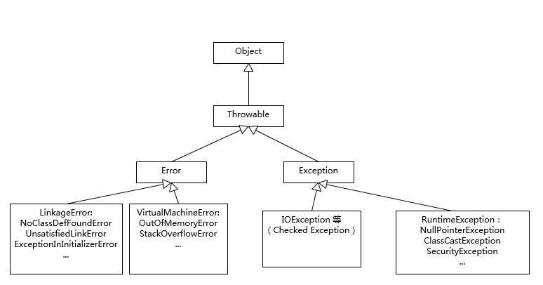

# Overview

Java 的异常处理机制可以让程序具有极好的容错性，让程序更加健壮。当程序出现意外情形时，系统会自动生成一个 Exception 对象来通知程序，从而实现将“业务功能实现代码”与“错误处理代码”分离，提供良好的可读性。

Java 使用 try-catch 语句块来捕获异常，如果 try 块中的代码正常执行，则继续执行后续的代码；如果 try 块中代码的执行过程中出现异常，则系统自动生成一个异常对象，并提交给Java Runtime，这个过程称为抛出异常。

当 Java Runtime 接收到异常后，会寻找能够处理该异常对象的 catch 块，如果找到合适的 catch 块，则把该异常交给 catch 块处理，否则，运行时环境终止，Java程序退出。

demo：

```java
public static void main(String[] args) {
    try {
        process1();
        process2();
        process3();
    } catch (IOException e) {
        System.out.println(e);
    } catch (NumberFormatException e) {
        System.out.println(e);
    }
}
```

try-catch 语句中，只有一个 catch 块会被执行。应该先捕获小异常（子类），再捕获大异常。

> try 和 catch 后面的花括号{}不能省略，try 块中的变量在 catch 块中不可见。

# 异常体系

异常类的继承体系：



Throwable 是异常体系的根节点，Error 指的是与 JVM 相关的错误，如系统崩溃，动态链接失败等，这类错误无法回复或不可能捕获，将导致应用程序中断，常见的 Error 如：

- `OutOfMemoryError`：内存耗尽
- `NoClassDefFoundError`：无法加载某个Class
- `StackOverflowError`：栈溢出

某些异常是应用程序逻辑处理的一部分，应该捕获并处理。例如：

- `NumberFormatException`：数值类型的格式错误
- `FileNotFoundException`：未找到文件
- `SocketException`：读取网络失败

还有一些异常是程序逻辑编写不对造成的，应该修复程序本身。例如：

- `NullPointerException`：对某个`null`的对象调用方法或字段
- `IndexOutOfBoundsException`：数组索引越界

`Exception`又分为两大类：

1. `RuntimeException`以及它的子类；
2. 非`RuntimeException`（包括`IOException`、`ReflectiveOperationException`等等）

Java规定：

- 必须捕获的异常，包括`Exception`及其子类，但不包括`RuntimeException`及其子类，这种类型的异常称为Checked Exception，必须在源代码里显式地进行捕获处理，这是编译期检查的一部分。
- 不需要捕获的异常，包括`Error`及其子类，`RuntimeException`及其子类。

当某个方法的声明中表明可能抛出某种异常时，在方法的调用处必须对异常进行捕获，例如：

```java
public byte[] getBytes(String charsetName) throws UnsupportedEncodingException {
    ...
}
```

```java
public class Main {
    public static void main(String[] args) {
        byte[] bs = toGBK("中文");
        System.out.println(Arrays.toString(bs));
    }

    static byte[] toGBK(String s) {
        try {
            // 用指定编码转换String为byte[]:
            return s.getBytes("GBK");
        } catch (UnsupportedEncodingException e) {
            // 如果系统不支持GBK编码，会捕获到UnsupportedEncodingException:
            System.out.println(e); // 打印异常信息
            return s.getBytes(); // 尝试使用用默认编码
        }
    }
}
```

## 对比Exception和Error

Exception 和 Error 都是继承了 Throwable 类，在 Java 中只有 Throwable 类型的实例才可以被抛出（throw）或者捕获（catch），它是异常处理机制的基本组成类型。

Exception 和 Error 体现了 Java 平台设计者对不同异常情况的分类。Exception 是程序正常运行中，可以预料的意外情况，可能并且应该被捕获，进行相应处理。

Error 是指在正常情况下，不大可能出现的情况，绝大部分的 Error 都会导致程序（比如 JVM 自身）处于非正常的、不可恢复状态。既然是非正常情况，所以不便于也不需要捕获，常见的比如 `OutOfMemoryError` 之类，都是 Error 的子类。

## `NoClassDefFoundError` 和 `ClassNotFoundException` 有什么区别


## 异常处理机制的问题

- try-catch 代码段会产生额外的性能开销，或者换个角度说，它往往会影响 JVM 对代码进行优化，所以建议仅捕获有必要的代码段，尽量不要一个大的 try 包住整段的代码；与此同时，利用异常控制代码流程，也不是一个好主意，远比我们通常意义上的条件语句（if/else、switch）要低效。
- Java 每实例化一个 Exception，都会对当时的栈进行快照，这是一个相对比较重的操作。如果发生的非常频繁，这个开销可就不能被忽略了。


# finally

无论是否有异常发生，都要执行某些语句时，可以把这些语句放到 finally 块中（即使 catch 块中有 return 语句，也需要先执行  finally 中的代码）。

> 一般不建议在 finally 中包含 throws 和 return 语句，因为会覆盖 catch 中的 return 和 throws。

demo：

```java
public static void main(String[] args) {
    try {
        process1();
        process2();
        process3();
    } catch (UnsupportedEncodingException e) {
        System.out.println("Bad encoding");
    } catch (IOException e) {
        System.out.println("IO error");
    } finally {
        System.out.println("END");
    }
}
```

`finally`有几个特点：

1. `finally`语句不是必须的，可写可不写；
2. `finally`总是最后执行。

如果没有发生异常，就正常执行`try { ... }`语句块，然后执行`finally`。如果发生了异常，就中断执行`try { ... }`语句块，然后跳转执行匹配的`catch`语句块，最后执行`finally`。

某些情况下，可以没有`catch`，只使用`try ... finally`结构。例如：

```java
void process(String file) throws IOException {
    try {
        ...
    } finally {
        System.out.println("END");
    }
}
```

因为方法声明了 throws ，所以可以不写 catch 。

特殊案例：

```java
try {
  // do something
  System.exit(1);
} finally{
  System.out.println(“Print from finally”);
}
```

这里 finally 中的代码不会被执行。


# 抛出异常

当某个方法抛出了异常时，如果当前方法没有捕获异常，异常就会被抛到上层调用方法，直到遇到某个`try ... catch`被捕获为止。

**throws 关键字位于方法的声明之后，花括号之前，由 Java 运行时抛出异常，而 throw 关键字位于代码中，程序会主动抛出一个异常。**

**协作处理异常：**在实际应用中，通常需要多个方法协作处理同一个异常。

demo：

```java
public class Main {
    public static void main(String[] args) {
        try {
            process1();
        } catch (Exception e) {
            System.out.println(e.getMessage());
        }
    }

    static void process1() {
        try {
            process2();
        } catch (NullPointerException e) {
            e.printStackTrace();
            throw new IllegalArgumentException("参数不能为空");
        }
    }

    static void process2() {
        throw new NullPointerException();
    }
}
```

`printStackTrace` 方法用于打印出抛出异常的方法的调用栈。

在大型企业级应用中，这样的处理方式非常常见，应用对异常的处理通常分为两部分：

1. 通过日志来记录异常发生的详细情况
2. 向应用使用者提供某些提示信息

在实际应用中，程序不应该把底层的 SQL Exception 异常传到用户界面：

- 用户不在意底层异常
- 暴露底层异常过程给攻击者会降低系统安全性

通常会捕获原始异常，并抛出一个新的业务异常，新的业务异常中包含了对用户的提示信息，这种处理方式也成为异常转译。

**这种把异常捕获，接着保存原始信息，然后抛出另一个异常的设计模式就是责任链模式。**

在 JDK1.4 之后，可以通过构造函数，将原始异常作为 cause ，传递到上层方法，上层方法可以通过 cause 引用得知异常的信息。

**练习：如果传入的参数为负，则抛出`IllegalArgumentException`**

```java
public class Main {
    public static void main(String[] args) {
        try {
            System.out.println(tax(2000, 0.1));
            System.out.println(tax(-200, 0.1));
            System.out.println(tax(2000, -0.1));
        } catch (IllegalArgumentException e) {
            e.printStackTrace();
        }
    }

    static double tax(int salary, double rate) {
        // TODO: 如果传入的参数为负，则抛出IllegalArgumentException
        if (salary < 0 | rate < 0) {
            throw new IllegalArgumentException("参数为负");
        }
        return salary * rate;
    }
}
```


# 自定义异常

Java标准库定义的常用异常包括：

```ascii
Exception
│
├─ RuntimeException
│  │
│  ├─ NullPointerException
│  │
│  ├─ IndexOutOfBoundsException
│  │
│  ├─ SecurityException
│  │
│  └─ IllegalArgumentException
│     │
│     └─ NumberFormatException
│
├─ IOException
│  │
│  ├─ UnsupportedCharsetException
│  │
│  ├─ FileNotFoundException
│  │
│  └─ SocketException
│
├─ ParseException
│
├─ GeneralSecurityException
│
├─ SQLException
│
└─ TimeoutException
```

在一个大型项目中，可以自定义新的异常类型，但是，保持一个合理的异常继承体系是非常重要的。

一个常见的做法是自定义一个`BaseException`作为“根异常”，然后，派生出各种业务类型的异常。

`BaseException`需要从一个适合的`Exception`派生，通常建议从`RuntimeException`派生：

```java
public class BaseException extends RuntimeException {
}
```

其他业务类型的异常就可以从`BaseException`派生：

```java
public class UserNotFoundException extends BaseException {
}

public class LoginFailedException extends BaseException {
}

...
```

自定义的`BaseException`应该提供多个构造方法：

```java
public class BaseException extends RuntimeException {
    public BaseException() {
        super();
    }

    public BaseException(String message, Throwable cause) {
        super(message, cause);
    }

    public BaseException(String message) {
        super(message);
    }

    public BaseException(Throwable cause) {
        super(cause);
    }
}
```

上述构造方法实际上都是原样照抄`RuntimeException`。这样，抛出异常的时候，就可以选择合适的构造方法。

# 使用断言

断言（Assertion）是一种调试程序的方式。在Java中，使用`assert`关键字来实现断言。

demo：

```java
public static void main(String[] args) {
    double x = Math.abs(-123.45);
    assert x >= 0;
    System.out.println(x);
}
```

语句`assert x >= 0;`即为断言，断言条件`x >= 0`预期为`true`。如果计算结果为`false`，则断言失败，抛出`AssertionError`。

使用`assert`语句时，还可以添加一个可选的断言消息：

```
assert x >= 0 : "x must >= 0";
```

这样，断言失败的时候，`AssertionError`会带上消息`x must >= 0`，更加便于调试。

Java断言的特点是：断言失败时会抛出`AssertionError`，导致程序结束退出。因此，断言不能用于可恢复的程序错误，只应该用于开发和测试阶段。

对于可恢复的程序错误，不应该使用断言。

JVM默认关闭断言指令，即遇到`assert`语句就自动忽略了，不执行。

要执行`assert`语句，必须给Java虚拟机传递`-enableassertions`（可简写为`-ea`）参数启用断言。

实际开发中，很少使用断言。更好的方法是编写单元测试。

# JDK Logging

在程序中使用打印语句输出信息时，需要不停的添加或删除打印语句，为此，引入了日志 Logging 。

日志的好处包括：

1. 可以设置输出样式，避免自己每次都写`"ERROR: " + var`；
2. 可以设置输出级别，禁止某些级别输出。例如，只输出错误日志；
3. 可以被重定向到文件，这样可以在程序运行结束后查看日志；
4. 可以按包名控制日志级别，只输出某些包打的日志；

Java自带日志包的使用：

```java
import java.util.logging.Level;
import java.util.logging.Logger;
public class Hello {
    public static void main(String[] args) {
        Logger logger = Logger.getGlobal();
        logger.info("start process...");
        logger.warning("memory is running out...");
        logger.fine("ignored.");
        logger.severe("process will be terminated...");
    }
}
```

```
Mar 02, 2019 6:32:13 PM Hello main
INFO: start process...
Mar 02, 2019 6:32:13 PM Hello main
WARNING: memory is running out...
Mar 02, 2019 6:32:13 PM Hello main
SEVERE: process will be terminated...
```

JDK的Logging定义了7个日志级别，从严重到普通：

- SEVERE
- WARNING
- INFO
- CONFIG
- FINE
- FINER
- FINEST

默认情况下，INFO级别以下的日志不会被打印出来。

# `Commons Logging + Log4j`

和Java标准库提供的日志不同，Commons Logging是一个第三方日志库，它是由Apache创建的日志模块。

Commons Logging的特色是，它可以挂接不同的日志系统，并通过配置文件指定挂接的日志系统。默认情况下，Commons Loggin自动搜索并使用Log4j（Log4j是另一个流行的日志系统），如果没有找到Log4j，再使用JDK Logging。

使用Commons Logging只需要和两个类打交道，并且只有两步：

第一步，通过`LogFactory`获取`Log`类的实例； 第二步，使用`Log`实例的方法打日志。

示例代码如下：

```java
import org.apache.commons.logging.Log;
import org.apache.commons.logging.LogFactory;
public class Main {
    public static void main(String[] args) {
        Log log = LogFactory.getLog(Main.class);
        log.info("start...");
        log.warn("end.");
    }
}
```

Commons Logging定义了6个日志级别：

- FATAL
- ERROR
- WARNING
- INFO
- DEBUG
- TRACE

默认级别是`INFO`。

使用Commons Logging时，如果在静态方法中引用`Log`，通常直接定义一个静态类型变量：

```java
// 在静态方法中引用Log:
public class Main {
    static final Log log = LogFactory.getLog(Main.class);

    static void foo() {
        log.info("foo");
    }
}
```

在实例方法中引用`Log`，通常定义一个实例变量：

```java
// 在实例方法中引用Log:
public class Person {
    protected final Log log = LogFactory.getLog(getClass());

    void foo() {
        log.info("foo");
    }
}
```

注意到实例变量log的获取方式是`LogFactory.getLog(getClass())`，虽然也可以用`LogFactory.getLog(Person.class)`，但是前一种方式有个非常大的好处，就是子类可以直接使用该`log`实例。例如：

```java
// 在子类中使用父类实例化的log:
public class Student extends Person {
    void bar() {
        log.info("bar");
    }
}
```

由于Java类的动态特性，子类获取的`log`字段实际上相当于`LogFactory.getLog(Student.class)`，但却是从父类继承而来，并且无需改动代码。

此外，Commons Logging的日志方法，例如`info()`，除了标准的`info(String)`外，还提供了一个非常有用的重载方法：`info(String, Throwable)`，这使得记录异常更加简单：

```java
try {
    ...
} catch (Exception e) {
    log.error("got exception!", e);
}
```

# `SLF4J + Logback`

SLF4J类似于 Commons Logging ，也是一个日志接口，而`Logback`类似于Log4j，是一个日志的实现。

SLF4J 对 log4j 改进了一些改进。

在Commons Logging中，我们要打印日志：

```
int score = 99;
p.setScore(score);
log.info("Set score " + score + " for Person " + p.getName() + " ok.");
```

拼字符串是一个非常麻烦的事情，所以SLF4J的日志接口改进成这样了：

```
int score = 99;
p.setScore(score);
logger.info("Set score {} for Person {} ok.", score, p.getName());
```

Commons Logging和SLF4J的接口区别：

| Commons Logging                         | SLF4J                     |
| :-------------------------------------- | :------------------------ |
| `org.apache.commons.logging.Log`        | `org.slf4j.Logger`        |
| `org.apache.commons.logging.LogFactory` | `org.slf4j.LoggerFactory` |

使用：

```java
import org.slf4j.Logger;
import org.slf4j.LoggerFactory;

class Main {
    final Logger logger = LoggerFactory.getLogger(getClass());
}
```

