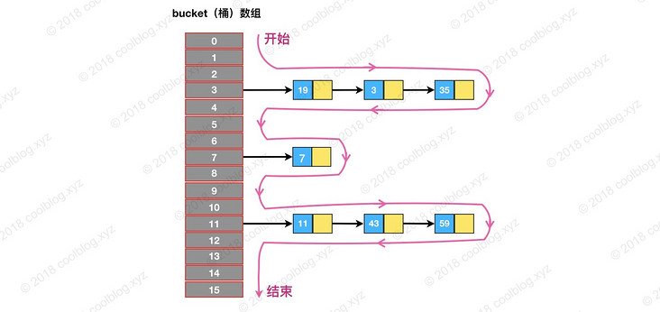
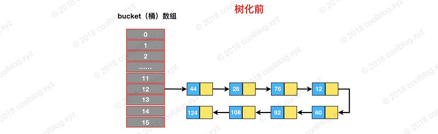
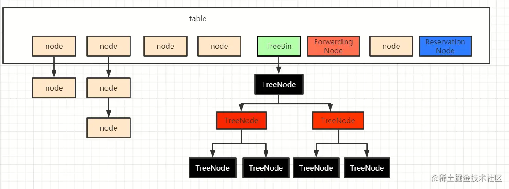

# ArrayList

因为 ArrayList 是基于数组实现的，所以支持快速随机访问。RandomAccess 接口标识着该类支持快速随机访问。

```java
public class ArrayList<E> extends AbstractList<E>
        implements List<E>, RandomAccess, Cloneable, java.io.Serializable
```

数组的默认大小为 10。

```java
private static final int DEFAULT_CAPACITY = 10;
```

<div align="center">  </div><br>

## 1. 构造方法

```java

    /**
     * Shared empty array instance used for empty instances.
     */
    private static final Object[] EMPTY_ELEMENTDATA = {};

    /**
     * Shared empty array instance used for default sized empty instances. We
     * distinguish this from EMPTY_ELEMENTDATA to know how much to inflate when
     * first element is added.
     */

    private static final Object[] DEFAULTCAPACITY_EMPTY_ELEMENTDATA = {};	
	/**
     * Constructs an empty list with the specified initial capacity.
     *
     * @param  initialCapacity  the initial capacity of the list
     * @throws IllegalArgumentException if the specified initial capacity
     *         is negative
     */
    public ArrayList(int initialCapacity) {
        if (initialCapacity > 0) {
            this.elementData = new Object[initialCapacity];
        } else if (initialCapacity == 0) {
            //private static final Object[] EMPTY_ELEMENTDATA = {}; 有参构造方法的默认空数组
            this.elementData = EMPTY_ELEMENTDATA;
        } else {
            throw new IllegalArgumentException("Illegal Capacity: "+
                                               initialCapacity);
        }
    }

    /**
     * Constructs an empty list with an initial capacity of ten.
     */
    public ArrayList() {
        //private static final Object[] DEFAULTCAPACITY_EMPTY_ELEMENTDATA = {};无参构造方法的默认空数组
        this.elementData = DEFAULTCAPACITY_EMPTY_ELEMENTDATA;
    }

    /**
     * Constructs a list containing the elements of the specified
     * collection, in the order they are returned by the collection's
     * iterator.
     *
     * @param c the collection whose elements are to be placed into this list
     * @throws NullPointerException if the specified collection is null
     */
    public ArrayList(Collection<? extends E> c) {
        Object[] a = c.toArray();
        if ((size = a.length) != 0) {
            if (c.getClass() == ArrayList.class) {
                elementData = a;
            } else {
                elementData = Arrays.copyOf(a, size, Object[].class);
            }
        } else {
            // replace with empty array.
            elementData = EMPTY_ELEMENTDATA;
        }
    }
```


## 2. 添加元素与扩容

添加元素时使用 ensureCapacityInternal() 方法来保证容量足够，如果不够时，需要使用 grow() 方法进行扩容，新容量的大小为 `oldCapacity + (oldCapacity >> 1)`，即 oldCapacity+oldCapacity/2。其中 oldCapacity >> 1 需要取整，所以新容量大约是旧容量的 1.5 倍左右。

扩容操作需要调用 `Arrays.copyOf()` 把原数组整个复制到新数组中，这个操作代价很高，因此最好在创建 ArrayList 对象时就指定大概的容量大小，减少扩容操作的次数。

从calculateCapacity函数的代码可以看出：DEFAULTCAPACITY_EMPTY_ELEMENTDATA和EMPTY_ELEMENTDATA的主要区别在于，添加第一个元素时，DEFAULTCAPACITY_EMPTY_ELEMENTDATA会直接将数组大小调整为10，而EMPTY_ELEMENTDATA会将数组大小调整为1。

```java
    public boolean add(E e) {
        ensureCapacityInternal(size + 1);  // Increments modCount!!
        elementData[size++] = e;
        return true;
    }
	private void ensureCapacityInternal(int minCapacity) {
        ensureExplicitCapacity(calculateCapacity(elementData, minCapacity));
    }
	/**
	*从calculateCapacity部分的代码可以看出，当调用了默认的构造方法时，
	*
	*/
	private static int calculateCapacity(Object[] elementData, int minCapacity) {
        if (elementData == DEFAULTCAPACITY_EMPTY_ELEMENTDATA) {
            return Math.max(DEFAULT_CAPACITY, minCapacity);
        }
        return minCapacity;
    }
	private void ensureExplicitCapacity(int minCapacity) {
        modCount++;
        // overflow-conscious code
        if (minCapacity - elementData.length > 0)
            grow(minCapacity);
    }

	public void ensureCapacity(int minCapacity) {
        int minExpand = (elementData != DEFAULTCAPACITY_EMPTY_ELEMENTDATA)
            // any size if not default element table
            ? 0
            // larger than default for default empty table. It's already
            // supposed to be at default size.
            : DEFAULT_CAPACITY;

        if (minCapacity > minExpand) {
            ensureExplicitCapacity(minCapacity);
        }
    }

	private void grow(int minCapacity) {
        // overflow-conscious code
        int oldCapacity = elementData.length;
        int newCapacity = oldCapacity + (oldCapacity >> 1);
        //1.5倍旧容量仍然小于新容量时，将新容量设置为minCapacity
        if (newCapacity - minCapacity < 0)
            newCapacity = minCapacity;
        if (newCapacity - MAX_ARRAY_SIZE > 0)
            newCapacity = hugeCapacity(minCapacity);
        // minCapacity is usually close to size, so this is a win:
        elementData = Arrays.copyOf(elementData, newCapacity);
    }
```

在中间添加元素时：

```java
    public void add(int index, E element) {
        rangeCheckForAdd(index);
        ensureCapacityInternal(size + 1);  // Increments modCount!!
        System.arraycopy(elementData, index, elementData, index + 1,
                         size - index);
        elementData[index] = element;
        size++;
    }
```

会将索引后的元素复制一遍，插入元素消耗的时间与插入位置有关。

## 3. 删除元素

需要调用 System.arraycopy() 将 index+1 后面的元素都复制到 index 位置上，该操作的时间复杂度为 O(N)，可以看到 ArrayList 删除元素的代价是非常高的。

```java
public E remove(int index) {
    rangeCheck(index);

    modCount++;
    E oldValue = elementData(index);

    int numMoved = size - index - 1;
    if (numMoved > 0)
        System.arraycopy(elementData, index+1, elementData, index,
                         numMoved);
    elementData[--size] = null; // clear to let GC do its work

    return oldValue;
}
```

## 4. 序列化

ArrayList 基于数组实现，并且具有动态扩容特性，因此保存元素的数组不一定都会被使用，那么就没必要全部进行序列化。

保存元素的数组 elementData 使用 transient 修饰，该关键字声明数组默认不会被序列化。

```java
transient Object[] elementData; // non-private to simplify nested class access
```

ArrayList 实现了 writeObject() 和 readObject() 来控制只序列化数组中有元素填充那部分内容。

```
private void writeObject(java.io.ObjectOutputStream s)
    throws java.io.IOException{
    // Write out element count, and any hidden stuff
    int expectedModCount = modCount;
    s.defaultWriteObject();

    // Write out size as capacity for behavioural compatibility with clone()
    s.writeInt(size);

    // Write out all elements in the proper order.
    for (int i=0; i<size; i++) {
        s.writeObject(elementData[i]);
    }

    if (modCount != expectedModCount) {
        throw new ConcurrentModificationException();
    }
}

private void readObject(java.io.ObjectInputStream s)
    throws java.io.IOException, ClassNotFoundException {
    elementData = EMPTY_ELEMENTDATA;

    // Read in size, and any hidden stuff
    s.defaultReadObject();

    // Read in capacity
    s.readInt(); // ignored

    if (size > 0) {
        // be like clone(), allocate array based upon size not capacity
        int capacity = calculateCapacity(elementData, size);
        SharedSecrets.getJavaOISAccess().checkArray(s, Object[].class, capacity);
        ensureCapacityInternal(size);

        Object[] a = elementData;
        // Read in all elements in the proper order.
        for (int i=0; i<size; i++) {
            a[i] = s.readObject();
        }
    }
}
```

序列化时需要使用 ObjectOutputStream 的 writeObject() 将对象转换为字节流并输出。而 writeObject() 方法在传入的对象存在 writeObject() 的时候会去反射调用该对象的 writeObject() 来实现序列化。反序列化使用的是 ObjectInputStream 的 readObject() 方法，原理类似。

```java
ArrayList list = new ArrayList();
ObjectOutputStream oos = new ObjectOutputStream(new FileOutputStream(file));
oos.writeObject(list);
```

## 5. modCount

modCount变量记录list尺寸被改变大小的次数。

```java
    /**
     * The number of times this list has been <i>structurally modified</i>.
     * Structural modifications are those that change the size of the
     * list, or otherwise perturb it in such a fashion that iterations in
     * progress may yield incorrect results.
     *
     * <p>This field is used by the iterator and list iterator implementation
     * returned by the {@code iterator} and {@code listIterator} methods.
     * If the value of this field changes unexpectedly, the iterator (or list
     * iterator) will throw a {@code ConcurrentModificationException} in
     * response to the {@code next}, {@code remove}, {@code previous},
     * {@code set} or {@code add} operations.  This provides
     * <i>fail-fast</i> behavior, rather than non-deterministic behavior in
     * the face of concurrent modification during iteration.
     *
     * <p><b>Use of this field by subclasses is optional.</b> If a subclass
     * wishes to provide fail-fast iterators (and list iterators), then it
     * merely has to increment this field in its {@code add(int, E)} and
     * {@code remove(int)} methods (and any other methods that it overrides
     * that result in structural modifications to the list).  A single call to
     * {@code add(int, E)} or {@code remove(int)} must add no more than
     * one to this field, or the iterators (and list iterators) will throw
     * bogus {@code ConcurrentModificationExceptions}.  If an implementation
     * does not wish to provide fail-fast iterators, this field may be
     * ignored.
     */
    protected transient int modCount = 0;
```

在迭代器中：

```java
@Override
public void forEach(Consumer<? super E> action) {
    Objects.requireNonNull(action);
    final int expectedModCount = modCount;
    @SuppressWarnings("unchecked")
    final E[] elementData = (E[]) this.elementData;
    final int size = this.size;
    for (int i=0; modCount == expectedModCount && i < size; i++) {
        action.accept(elementData[i]);
    }
    if (modCount != expectedModCount) {
        throw new ConcurrentModificationException();
    }
}
```

在多线程环境下，当执行forEach的过程中，其他线程调用了list的add，remove等方法时，就会改变list的modCount变量，导致list在遍历过程中发生改变，为了不给程序带来不可预知的错误，迭代器会抛出异常。

## 6. toArray

```java
public <T> T[] toArray(T[] a) {
        if (a.length < size)
            // Make a new array of a's runtime type, but my contents:
            return (T[]) Arrays.copyOf(elementData, size, a.getClass());
        System.arraycopy(elementData, 0, a, 0, size);
        if (a.length > size)
            a[size] = null;
        return a;
}
```

使用方法：

泛型toArray方法的参数是一个数组，用于存储ArrayList的元素，当数组的大小小于等于list的大小时，编译器会自动将其修改为ArrayList的大小，当数组大小大于ArrayList大小时，会对list进行扩充并填充默认值。

**T必须是一个类**

demo:

```java
public class Solution {
    public static void main(String[] args) {
        List<Integer> list = new ArrayList<>();
        list.add(100);
        list.add(200);
        list.add(300);
        Integer[] a = list.toArray(new Integer[0]);
        Integer[] c = list.toArray(new Integer[20]);
        System.out.println(a.length); //3
        System.out.println(c.length); //20
    }
}
```


# CopyOnWriteArrayList

## 1. 读写分离

写操作在一个复制的数组上进行，读操作还是在原始数组中进行，读写分离，互不影响。

写操作需要加锁，防止并发写入时导致写入数据丢失。

写操作结束之后需要把原始数组指向新的复制数组。

```java
public boolean add(E e) {
    final ReentrantLock lock = this.lock;
    lock.lock();
    try {
        Object[] elements = getArray();
        int len = elements.length;
        Object[] newElements = Arrays.copyOf(elements, len + 1);
        newElements[len] = e;
        setArray(newElements);
        return true;
    } finally {
        lock.unlock();
    }
}

final void setArray(Object[] a) {
    array = a;
}
```

```java
@SuppressWarnings("unchecked")
private E get(Object[] a, int index) {
    return (E) a[index];
}
```

## 2. 适用场景

CopyOnWriteArrayList 在写操作的同时允许读操作，大大提高了读操作的性能，因此很适合读多写少的应用场景。

但是 CopyOnWriteArrayList 有其缺陷：

- 内存占用：在写操作时需要复制一个新的数组，使得内存占用为原来的两倍左右；
- 数据不一致：读操作不能读取实时性的数据，因为部分写操作的数据还未同步到读数组中。

所以 CopyOnWriteArrayList 不适合内存敏感以及对实时性要求很高的场景。

# LinkedList

基于双向链表实现，实现了Deque和List接口。

```java
private static class Node<E> {
    E item;
    Node<E> next;
    Node<E> prev;

    Node(Node<E> prev, E element, Node<E> next) {
        this.item = element;
        this.next = next;
        this.prev = prev;
    }
}
```

每个链表存储了头指针和尾指针：

```java
transient Node<E> first;
transient Node<E> last;
```

结构：

<div align="center">  </div>


# HashMap

## 1. 存储结构

JDK1.7采用数组+链表；JDK1.8采用数组+链表+红黑树

一般情况下，以默认容量16为例，阈值等于12就扩容，单条链表能达到长度为8的概率是相当低的，除非Hash攻击或者HashMap容量过大出现某些链表过长导致性能急剧下降的问题，红黑树主要是为了结果这种问题。在正常情况下，效率相差并不大。

内部包含了一个 Entry 类型的数组 table。Entry 存储着键值对。它包含了四个字段，从 next 字段我们可以看出 Entry 是一个链表。即数组中的每个位置被当成一个桶，一个桶存放一个链表。HashMap 使用拉链法来解决冲突，同一个链表中存放哈希值和散列桶取模运算结果相同的 Entry。

<div align="center">  </div><br>

```java
transient Entry[] table;
```

```java
static class Node<K,V> implements Map.Entry<K,V> {
    final int hash;
    final K key;
    V value;
    Node<K,V> next;

    Node(int hash, K key, V value, Node<K,V> next) {
        this.hash = hash;
        this.key = key;
        this.value = value;
        this.next = next;
    }

    public final K getKey()        { return key; }
    public final V getValue()      { return value; }
    public final String toString() { return key + "=" + value; }

    public final int hashCode() {
        //最终调用Object自身的hashCode方法，这是一个Native方法
        //每个Entry的哈希值是key和value的哈希值异或的结果
        return Objects.hashCode(key) ^ Objects.hashCode(value);
    }

    public final V setValue(V newValue) {
        V oldValue = value;
        value = newValue;
        return oldValue;
    }

    public final boolean equals(Object o) {
        if (o == this)
            return true;
        if (o instanceof Map.Entry) {
            Map.Entry<?,?> e = (Map.Entry<?,?>)o;
            if (Objects.equals(key, e.getKey()) &&
                Objects.equals(value, e.getValue()))
                return true;
        }
        return false;
    }
}
```

HashMap单个桶中存放的链表是一个单链表。

**Jdk1.8**

- hash是final修饰，也就是说hash值一旦确定，就不会再重新计算hash值了。
- 新增了一个TreeNode节点，为了转换为红黑树。

**Jdk1.7**

- hash是可变的，因为有rehash的操作。


## 2. 拉链法的工作原理

```java
HashMap<String, String> map = new HashMap<>();
map.put("K1", "V1");
map.put("K2", "V2");
map.put("K3", "V3");
```

- 新建一个 HashMap，默认大小为 16；
- 插入 &lt;K1,V1\> 键值对，先计算 K1 的 hashCode 为 115，使用除留余数法得到所在的桶下标 115%16=3。
- 插入 &lt;K2,V2\> 键值对，先计算 K2 的 hashCode 为 118，使用除留余数法得到所在的桶下标 118%16=6。
- 插入 &lt;K3,V3\> 键值对，先计算 K3 的 hashCode 为 118，使用除留余数法得到所在的桶下标 118%16=6，插在 &lt;K2,V2\> 前面。

查找需要分成两步进行：

- 计算键值对所在的桶；
- 在链表上顺序查找，时间复杂度显然和链表的长度成正比。

<div align="center">  </div>

## 3. put 操作

**JDK1.8的优化**：当桶中元素较多时，将链表转换为红黑树，加快元素的查找；元素不存在时，尾插法插入元素

**在链表中插入元素的改动：**

```java
public V put(K key, V value) {
    return putVal(hash(key), key, value, false, true);
}

static final int hash(Object key) {
    int h;
    //让key的高位和低位均参与hash运算，防止数值相近的key全部定位到同一个桶里
    //key为null时，规定其存放的桶索引为0
    return (key == null) ? 0 : (h = key.hashCode()) ^ (h >>> 16);
}
final V putVal(int hash, K key, V value, boolean onlyIfAbsent,
                   boolean evict) {
    //临时存放节点数组
    Node<K,V>[] tab;
    //元素应该插入的桶中的链表头节点
    Node<K,V> p; 
    //n为表长，i为桶的索引
    int n, i;
    if ((tab = table) == null || (n = tab.length) == 0)
        //resize函数见扩容
        n = (tab = resize()).length;
    //通过与操作实现求余的效果，计算桶的索引
    if ((p = tab[i = (n - 1) & hash]) == null)
        //头节点为空时，直接插入节点
        tab[i] = newNode(hash, key, value, null);
    else {
        //e指向需要覆盖的节点
        Node<K,V> e; 
        K k;
        //头节点就是要找的节点时，将头节点赋值给e
        if (p.hash == hash &&
            ((k = p.key) == key || (key != null && key.equals(k))))
            e = p;
        //如果桶的结构是红黑树，执行红黑树的插入方法
        else if (p instanceof TreeNode)
            e = ((TreeNode<K,V>)p).putTreeVal(this, tab, hash, key, value);
        //在链表中找节点
        else {
            for (int binCount = 0; ; ++binCount) {
                if ((e = p.next) == null) {
                    //链表中不存在key相同的节点，则新建节点，插入到链表尾部
                    p.next = newNode(hash, key, value, null);
                    // 插入元素后如果桶中元素个数大于等于TREEIFY_THRESHOLD - 1
                    // 则将链表转换为红黑树
                    if (binCount >= TREEIFY_THRESHOLD - 1) // -1 for 1st
                        treeifyBin(tab, hash);
                    break;
                }
                if (e.hash == hash &&
                    ((k = e.key) == key || (key != null && key.equals(k))))
                    break;
                p = e;
            }
        }
        //存在key相同的节点时，覆盖value
        if (e != null) { // existing mapping for key
            V oldValue = e.value;
            if (!onlyIfAbsent || oldValue == null)
                e.value = value;
            afterNodeAccess(e);
            return oldValue;
        }
    }
    ++modCount;
    //当节点数大于阈值时，扩容
    if (++size > threshold)
        resize();
    //可选的插入后操作
    afterNodeInsertion(evict);
    return null;
}

```

红黑树的put操作：

```java
final TreeNode<K,V> putTreeVal(HashMap<K,V> map, Node<K,V>[] tab,
                                       int h, K k, V v) {
    Class<?> kc = null;
    boolean searched = false;
    TreeNode<K,V> root = (parent != null) ? root() : this;
    for (TreeNode<K,V> p = root;;) {
        int dir, ph; K pk;
        if ((ph = p.hash) > h)
            dir = -1;
        else if (ph < h)
            dir = 1;
        else if ((pk = p.key) == k || (k != null && k.equals(pk)))
            return p;
        else if ((kc == null &&
                  (kc = comparableClassFor(k)) == null) ||
                 (dir = compareComparables(kc, k, pk)) == 0) {
            if (!searched) {
                TreeNode<K,V> q, ch;
                searched = true;
                if (((ch = p.left) != null &&
                     (q = ch.find(h, k, kc)) != null) ||
                    ((ch = p.right) != null &&
                     (q = ch.find(h, k, kc)) != null))
                    return q;
            }
            dir = tieBreakOrder(k, pk);
        }

        TreeNode<K,V> xp = p;
        if ((p = (dir <= 0) ? p.left : p.right) == null) {
            Node<K,V> xpn = xp.next;
            TreeNode<K,V> x = map.newTreeNode(h, k, v, xpn);
            if (dir <= 0)
                xp.left = x;
            else
                xp.right = x;
            xp.next = x;
            x.parent = x.prev = xp;
            if (xpn != null)
                ((TreeNode<K,V>)xpn).prev = x;
            moveRootToFront(tab, balanceInsertion(root, x));
            return null;
        }
    }
}
```


HashMap 允许插入键为 null 的键值对。但是因为无法调用 null 的 hashCode() 方法，也就无法确定该键值对的桶下标，只能通过强制指定一个桶下标来存放。HashMap 使用第 0 个桶存放键为 null 的键值对。

## 4. 确定桶下标

很多操作都需要先确定一个键值对所在的桶下标。

```java
int hash = hash(key);
int i = indexFor(hash, table.length);
```

**4.1 计算 hash 值**  

**JDK1.8对hash方法进行了优化**：加入了扰动函数，让高位也参与运算

```java
static final int hash(Object key) {
    int h;
    //让key的高位和低位均参与hash运算，防止数值相近的key全部定位到同一个桶里
    //key为null时，规定其存放的桶索引为0
    return (key == null) ? 0 : (h = key.hashCode()) ^ (h >>> 16);
}
```

```java
public final int hashCode() {
    return Objects.hashCode(key) ^ Objects.hashCode(value);
}
```

**4.2 取模**  

令 x = 1\<\<4，即 x 为 2 的 4 次方，它具有以下性质：

```
x   : 00010000
x-1 : 00001111
```

令一个数 y 与 x-1 做与运算，可以去除 y 位级表示的第 4 位以上数：

```
y       : 10110010
x-1     : 00001111
y&(x-1) : 00000010
```

这个性质和 y 对 x 取模效果是一样的：

```
y   : 10110010
x   : 00010000
y%x : 00000010
```

位运算的代价比求模运算小的多，因此在进行这种计算时用位运算的话能带来更高的性能。

确定桶下标的最后一步是将 key 的 hash 值对桶个数取模：hash%capacity，如果能保证 capacity 为 2 的 n 次方，那么就可以将这个操作转换为位运算。

```java
int indexFor(int h, int length) {
    return h & (length-1);
}
```

## 5. 构造方法

```java
static final int DEFAULT_INITIAL_CAPACITY = 16;

static final int MAXIMUM_CAPACITY = 1 << 30;

static final float DEFAULT_LOAD_FACTOR = 0.75f;

transient Entry[] table;

transient int size;

int threshold;

final float loadFactor;

transient int modCount;

public HashMap(int initialCapacity, float loadFactor) {
    if (initialCapacity < 0)
        throw new IllegalArgumentException("Illegal initial capacity: " +
                                           initialCapacity);
    if (initialCapacity > MAXIMUM_CAPACITY)
        initialCapacity = MAXIMUM_CAPACITY;
    if (loadFactor <= 0 || Float.isNaN(loadFactor))
        throw new IllegalArgumentException("Illegal load factor: " +
                                           loadFactor);
    this.loadFactor = loadFactor;
    //空表，threshold将在第一次扩容时作为表的初始大小
    this.threshold = tableSizeFor(initialCapacity);
}
public HashMap(int initialCapacity) {
    this(initialCapacity, DEFAULT_LOAD_FACTOR);
}
public HashMap() {
    //threshold = 0
    this.loadFactor = DEFAULT_LOAD_FACTOR; // all other fields defaulted
}
```

**JDK7和JDK8初始化的区别：**

Jdk1.7：

- table是直接赋值给了一个空数组，在第一次put元素时初始化和计算容量。
- table是单独定义的inflateTable（）初始化方法创建的。

Jdk1.8

- table没有赋值，为null，属于懒加载，构造方法时已经计算好了新的容量位置（大于等于给定容量的最小2的次幂）。
- table是在第一次调用put时，resize（）方法创建的。


## 6. 扩容-基本原理

设 HashMap 的 table 长度为 M，需要存储的键值对数量为 N，如果哈希函数满足均匀性的要求，那么每条链表的长度大约为 N/M，因此查找的复杂度为 O(N/M)。

为了让查找的成本降低，应该使 N/M 尽可能小，因此需要保证 M 尽可能大，也就是说 table 要尽可能大。HashMap 采用动态扩容来根据当前的 N 值来调整 M 值，使得空间效率和时间效率都能得到保证。

和扩容相关的参数主要有：capacity、size、threshold 和 load_factor。

|    参数    | 含义                                                         |
| :--------: | :----------------------------------------------------------- |
|  capacity  | table 的容量大小，默认为 16。需要注意的是 capacity 必须保证为 2 的 n 次方。 |
|    size    | 键值对数量。                                                 |
| threshold  | size 的临界值，当 size 大于等于 threshold 就必须进行扩容操作。 |
| loadFactor | 装载因子，table 能够使用的比例，threshold = (int)(capacity* loadFactor)。 |

```java
final Node<K,V>[] resize() {
    Node<K,V>[] oldTab = table;
    int oldCap = (oldTab == null) ? 0 : oldTab.length;
    int oldThr = threshold;
    int newCap, newThr = 0;
    if (oldCap > 0) {
        //容量达到2^30时，无法再扩容
        if (oldCap >= MAXIMUM_CAPACITY) {
            threshold = Integer.MAX_VALUE;
            return oldTab;
        }
        //扩容后未超出最大容量，且旧容量大于等于默认初始容量时，将阈值和容量变为原来的两倍
        else if ((newCap = oldCap << 1) < MAXIMUM_CAPACITY &&
                 oldCap >= DEFAULT_INITIAL_CAPACITY)
            newThr = oldThr << 1; // double threshold
    }
    //旧容量为0，且阈值不为0，说明创建了哈希表而没有添加元素，threshold被初始化为tableSizeFor(initialCapacity);
    //newThr = 0
    else if (oldThr > 0) // initial capacity was placed in threshold
        newCap = oldThr; 
    //调用了默认的无参构造方法，threshold = 0
    else {               // zero initial threshold signifies using defaults
        newCap = DEFAULT_INITIAL_CAPACITY;
        newThr = (int)(DEFAULT_LOAD_FACTOR * DEFAULT_INITIAL_CAPACITY);
    }
    //说明之前进入了else if的逻辑分支，对threshold做初始化
    if (newThr == 0) {
        float ft = (float)newCap * loadFactor;
        newThr = (newCap < MAXIMUM_CAPACITY && ft < (float)MAXIMUM_CAPACITY ?
                  (int)ft : Integer.MAX_VALUE);
    }
    //修改threshold为capacity*load_factor
    threshold = newThr;
    @SuppressWarnings({"rawtypes","unchecked"})
    Node<K,V>[] newTab = (Node<K,V>[])new Node[newCap];
    table = newTab;
    if (oldTab != null) {
        for (int j = 0; j < oldCap; ++j) {
            Node<K,V> e;
            if ((e = oldTab[j]) != null) {
                //将其置为null，用于gc
                oldTab[j] = null;
                if (e.next == null)
                    //如果桶里只有一个元素，将其放到新表中的正确位置
                    //新位置的计算方法见扩容-重新计算桶下标
                    newTab[e.hash & (newCap - 1)] = e;
                else if (e instanceof TreeNode)
                    //执行红黑树的复制操作
                    ((TreeNode<K,V>)e).split(this, newTab, j, oldCap);
                else { // preserve order
                    //执行链表的复制操作，保留顺序
                    Node<K,V> loHead = null, loTail = null; //留在原位元素的链表
                    Node<K,V> hiHead = null, hiTail = null; //索引+oldCap的元素的链表
                    Node<K,V> next;
                    do {
                        //设oldCap中1在第x位，则链表中元素x位为1时，复制到新表中的位置+oldCap
                        //元素x位为0时，位置不变
                        next = e.next;
                        if ((e.hash & oldCap) == 0) {
                            if (loTail == null)
                                loHead = e;
                            else
                                loTail.next = e;
                            loTail = e;
                        }
                        else {
                            if (hiTail == null)
                                hiHead = e;
                            else
                                hiTail.next = e;
                            hiTail = e;
                        }
                    } while ((e = next) != null);
                    //将两个链表插入到不同位置
                    if (loTail != null) {
                        loTail.next = null;
                        newTab[j] = loHead;
                    }
                    if (hiTail != null) {
                        hiTail.next = null;
                        newTab[j + oldCap] = hiHead;
                    }
                }
            }
        }
    }
    return newTab;
}
```

扩容使用 resize() 实现，需要注意的是，扩容操作同样需要把 oldTable 的所有键值对重新插入 newTable 中，因此这一步是很费时的。


## 7. 扩容-重新计算桶下标

在进行扩容时，需要把键值对重新计算桶下标，从而放到对应的桶上。在前面提到，HashMap 使用 hash%capacity 来确定桶下标。HashMap capacity 为 2 的 n 次方这一特点能够极大降低重新计算桶下标操作的复杂度。

假设原数组长度 capacity 为 16，扩容之后 new capacity 为 32：

```html
capacity     : 00010000
new capacity : 00100000
```

对于一个 Key，它的哈希值 hash 在第 5 位：

- 为 0，那么 hash%00010000 = hash%00100000，桶位置和原来一致；
- 为 1，hash%00010000 = hash%00100000 + 16，桶位置是原位置 + 16。


## 8. 计算数组容量

HashMap 构造函数允许用户传入的容量不是 2 的 n 次方，因为它可以自动地将传入的容量转换为 2 的 n 次方。

先考虑如何求一个数的掩码，对于 10010000，它的掩码为 11111111，可以使用以下方法得到：

```
mask |= mask >> 1    11011000   //将1右侧一位的0或1变为1
mask |= mask >> 2    11111110   //将11右侧两位的0或1变为11
mask |= mask >> 4    11111111   //将1111右侧四位的0或1变为1111
```

mask+1 是大于原始数字的最小的 2 的 n 次方。

```
num     10010000
mask+1 100000000
```

以下是 HashMap 中计算数组容量的代码：

```java
static final int tableSizeFor(int cap) {
    int n = cap - 1;  //大于等于原始数字
    n |= n >>> 1;
    n |= n >>> 2;
    n |= n >>> 4;
    n |= n >>> 8;
    n |= n >>> 16;
    //当计算出的n大于2^30时，仍返回2^30
    //cap=0时，返回1
    return (n < 0) ? 1 : (n >= MAXIMUM_CAPACITY) ? MAXIMUM_CAPACITY : n + 1;
}
```

## 9. 与 Hashtable 的比较

- Hashtable 使用 synchronized 来进行同步。
- HashMap 可以插入键为 null 的 Entry。
- HashMap 的迭代器是 fail-fast 迭代器。
- HashMap 不能保证随着时间的推移 Map 中的元素次序是不变的。

## 10 遍历

遍历所有不为空的桶




## 11 链表的树化

在扩容过程中，树化要满足两个条件：

1. 链表长度大于等于 TREEIFY_THRESHOLD
2. 桶数组容量大于等于 MIN_TREEIFY_CAPACITY

HashMap 在设计之初，并没有考虑到以后会引入红黑树进行优化。所以并没有像 TreeMap 那样，要求键类实现 comparable 接口或提供相应的比较器。但由于树化过程需要比较两个键对象的大小，在键类没有实现 comparable 接口的情况下，怎么比较键与键之间的大小了就成了一个棘手的问题。为了解决这个问题，HashMap 是做了三步处理，确保可以比较出两个键的大小，如下：

1. 比较键与键之间 hash 的大小，如果 hash 相同，继续往下比较
2. 检测键类是否实现了 Comparable 接口，如果实现调用 compareTo 方法进行比较
3. 如果仍未比较出大小，就需要进行仲裁了，仲裁方法为 tieBreakOrder




红黑树拆分：红黑树保留了链表中的顺序，因此红黑树的链化过程与扩容后链表重新映射的代码类似

红黑树链化：转换为Node链表

## 12 删除

HashMap 的删除操作并不复杂，仅需三个步骤即可完成。第一步是定位桶位置，第二步遍历链表并找到键值相等的节点，第三步删除节点。

**删除后需要修复链表或红黑树**


# 面试题

1、“你知道HashMap的工作原理吗？” “你知道HashMap的get()方法的工作原理吗？”

答：HashMap基于哈希算法，向HashMap添加元素时，首先对key执行hash函数，将其高位与（高位>>>16）异或，然后对哈希表的size求余（采用位操作实现，但要求size必须为2的幂），计算出桶的索引，然后更新桶中某个元素的值或向链表添加一个元素。get方法首先对key执行hash函数，然后计算桶索引，最后在桶中遍历查找与key值相同，或equals返回true的节点。

2、“当两个对象key的hashcode相同会发生什么？”

　　因为hashcode相同，所以它们的bucket位置相同，‘碰撞’会发生。因为HashMap使用LinkedList存储对象，这个Entry(包含有键值对的Map.Entry对象)会存储在LinkedList中。(当向 HashMap 中添加 key-value 对，由其 key 的 hashCode() 返回值决定该 key-value 对（就是 Entry 对象）的存储位置。当两个 Entry 对象的 key 的 hashCode() 返回值相同时，将由 key 通过 eqauls() 比较值决定是采用覆盖行为，还是将对象加入链表。

3、“如果两个键的hashcode相同，你如何获取值对象？”

　　当我们调用get()方法，HashMap会使用键对象的hashcode找到bucket位置，然后获取值对象。如果有两个值对象储存在同一个bucket，将会遍历LinkedList直到找到值对象。找到bucket位置之后，会调用keys.equals()方法去找到LinkedList中正确的节点，最终找到要找的值对象。(当程序通过 key 取出对应 value 时，系统只要先计算出该 key 的 hashCode() 返回值，在根据该 hashCode 返回值找出该 key 在 table 数组中的索引，然后取出该索引处的 Entry，最后返回该 key 对应的 value 即可。)

4、“如果HashMap的大小超过了负载因子(load factor)定义的容量，怎么办？”

　　当一个map填满了75%的bucket时候，和其它集合类(如ArrayList等)一样，将会创建原来HashMap大小的两倍的bucket数组，来重新调整map的大小，并将原来的对象放入新的bucket数组中。这个过程叫作rehashing，因为它调用hash方法找到新的bucket位置。

5、一般用什么作为key值？

⼀般⽤Integer、String这种不可变类当HashMap当key，⽽且String最为常⽤。

- 因为字符串是不可变的，所以在它创建的时候hashcode就被缓存了，不需要重新计算。 这就使得字符串很适合作为Map中的键，字符串的处理速度要快过其它的键对象。 这就是HashMap中的键往往都使⽤字符串。

- 因为获取对象的时候要⽤到equals()和hashCode()⽅法，那么键对象正确的重写这两个⽅法是⾮常重要的,这些类已 经很规范的覆写了hashCode()以及equals()⽅法。

**6、HashMap为什么是线程不安全的？**

JDK7引发的线程不安全问题：

```java
void transfer(Entry[] newTable, boolean rehash) {
    int newCapacity = newTable.length;
    for (Entry<K,V> e : table) {
        while(null != e) {
            Entry<K,V> next = e.next;
            if (rehash) {
                e.hash = null == e.key ? 0 : hash(e.key);
            }
            int i = indexFor(e.hash, newCapacity);
            
            // 导致线程不安全的操作
            e.next = newTable[i];
            newTable[i] = e;

            
            e = next;
        }
    }
}
```

扩容函数调用了tranfer方法，重新定位每个桶的下标，并采用头插法迁移到新数组中。头插法会将链表的顺序翻转，多线程环境下可能形成死循环。

(A对e.next作出修改，未刷入主存，B重定位完成，A继续执行，产生死循环)


JDK8引发的线程不安全问题：

```java
final V putVal(int hash, K key, V value, boolean onlyIfAbsent,
               boolean evict) {
    Node<K,V>[] tab; Node<K,V> p; int n, i;
    if ((tab = table) == null || (n = tab.length) == 0)
        n = (tab = resize()).length;
    if ((p = tab[i = (n - 1) & hash]) == null)
        // 此处阻塞时，会产生覆盖数据问题
        tab[i] = newNode(hash, key, value, null);
    ...//省略部分代码

        ++modCount;  //此操作不是原子操作
    if (++size > threshold)
        resize();
    afterNodeInsertion(evict);
    return null;
}
```

1. ++modCount不是原子操作，多线程环境下导致计算错误时，产生线程安全问题（modCount的作用是防止iterator遍历过程中对map进行了修改）。

2. 当线程a和b插入元素的哈希值相同，a执行到第八行阻塞，b在tab[i]插入数据，随后a恢复执行，则数据将被覆盖。

3. 如果不停地往 map 中添加新的数据，它便会在合适的时机进行扩容。而在扩容期间，它会新建一个新的空数组，并且用旧的项填充到这个新的数组中去。那么，在这个填充的过程中，如果有线程获取值，很可能会取到 null 值，而不是我们所希望的、原来添加的值。
4. 无法保证可见性，线程A向Map中添加了一个元素后，线程B不一定能看到（先将对象的引用复制到线程本地栈，将next修改为一个值，随后flush到主存中，主存中的next指针可能仍然为null）。


# ConcurrentHashMap

## 结构



## 常量

```java
/**
 * 容量的最大值
 */
private static final int MAXIMUM_CAPACITY = 1 << 30;

/**
 * 容量的默认值
 */
private static final int DEFAULT_CAPACITY = 16;

/**
 * 数组的最大容量，这个在ArrayList里也有，大部分人赞同的答案是：
 * 减少一些机器发生内存溢出的可能性【https://www.zhihu.com/question/27999759】
 */
static final int MAX_ARRAY_SIZE = Integer.MAX_VALUE - 8;

/**
 * 这个哈希表默认的并发级别，用于兼容以前的版本
 */
private static final int DEFAULT_CONCURRENCY_LEVEL = 16;

/**
 * 负载因子
 */
private static final float LOAD_FACTOR = 0.75f;

/**
 * 链表转换为树的阈值
 */
static final int TREEIFY_THRESHOLD = 8;

/**
 * 树转换为链表的阈值
 */
static final int UNTREEIFY_THRESHOLD = 6;

/**
 * 在链表转换为树之前，当前槽节点的数量必须大于这个值
 */
static final int MIN_TREEIFY_CAPACITY = 64;

/**
 * 在树转换为链表之前，当前槽节点的数量必须不大于这个值
 */
private static final int MIN_TRANSFER_STRIDE = 16;

/**
 * 用于在扩容时生成随机数的种子
 */
private static final int RESIZE_STAMP_BITS = 16;

/**
 * 并行进行扩容的最大线程数
 */
private static final int MAX_RESIZERS = (1 << (32 - RESIZE_STAMP_BITS)) - 1;

/**
 * 记录sizeCtl大小所需要进行的偏移位数【现在没看懂什么意思】
 */
private static final int RESIZE_STAMP_SHIFT = 32 - RESIZE_STAMP_BITS;


static final int MOVED     = -1; // 标识 ForwardingNode 节点
static final int TREEBIN   = -2; // 标识红黑树根节点
static final int RESERVED  = -3; // 标识 ReservationNode 节点
static final int HASH_BITS = 0x7fffffff; // 标识普通节点

/** CPU的核心数量，用于扩容时使用 */
static final int NCPU = Runtime.getRuntime().availableProcessors();
```

## 变量

```java
/**
 * Node 数组
 */
transient volatile Node<K,V>[] table;

/**
 * 扩容过程中使用的 Node 数组，采用渐进式数据迁移的方式
 */
private transient volatile Node<K,V>[] nextTable;

/**
 * 基础计数器，主要在无线程竞争的条件下使用，在 table 初始化时也被用来做 fallback 操作，通过 CAS 进行更新
 */
private transient volatile long baseCount;

/**
 * table 初始化和扩容的状态标识：
 * >0:数组初始化后的容量
 * 0:默认初始值
 * -1:单线程扩容
 * -1(1 + nThread):多线程扩容
 */
private transient volatile int sizeCtl;

/**
 * 扩容时另一个表的下标
 */
private transient volatile int transferIndex;

/**
 * 在扩容或创建 CounterCells 时的自旋锁.
 */
private transient volatile int cellsBusy;

/**
 * CounterCell 数组，用于热点数据分段计算，跟 LongAddr 的 Cell 差不多
 */
private transient volatile CounterCell[] counterCells;
```

## put方法

```java
final V putVal(K key, V value, boolean onlyIfAbsent) {
    if (key == null || value == null) throw new NullPointerException();
    // 根据 key 计算出 hash 值
    int hash = spread(key.hashCode());
    int binCount = 0;
    // 一直循环，直到break
    for (Node<K,V>[] tab = table;;) {
        Node<K,V> f; 
        int n, i, fh; 
        // 如果数组为空就先初始化数组
        if (tab == null || (n = tab.length) == 0)
            tab = initTable();
        // 下标的计算方式：(table.length - 1) & key.hashCode
        // unsafe获取i处的数据
        // 如果计算出的下标的槽的元素为空，执行CAS添加元素
        else if ((f = tabAt(tab, i = (n - 1) & hash)) == null) {
            // 当向一个空bin添加元素时使用无锁的CAS
            // 如果失败，继续循环CAS
            if (casTabAt(tab, i, null, new Node<K,V>(hash, key, value)))
                break;                   // no lock when adding to empty bin
        }
        // 判断槽的状态是否为 MOVED，即该节点是一个 Fowarding 节点，f的hash值为-1
        // 正在进行扩容操作，尝试协助数据迁移。
        else if ((fh = f.hash) == MOVED)
            tab = helpTransfer(tab, f);
        else {
            V oldVal = null;
            // 加锁执行添加元素操作
            // 锁f是通过tabAt方法获取的
            // 也就是说，当发生hash碰撞时，会以链表的头结点作为锁
            synchronized (f) {
                // 这个检查的原因在于：
                // tab引用的是成员变量table，table在发生了rehash之后，原来index上的Node可能会变
                // 这里就是为了确保在put的过程中，没有受到rehash的影响，指定index上的Node仍然是f
                // 如果不是f，那这个锁就没有意义了
                if (tabAt(tab, i) == f) {
                    // 确保put没有发生在扩容的过程中，fh=-1时表示正在扩容
                    if (fh >= 0) {
                        binCount = 1;
                        // 遍历链表，如果链表中存在和 key 的 hash 值相同的元素，替换该节点的 value 值
                        for (Node<K,V> e = f;; ++binCount) {
                            K ek;
                            if (e.hash == hash &&
                                ((ek = e.key) == key ||
                                 (ek != null && key.equals(ek)))) {
                                oldVal = e.val;
                                if (!onlyIfAbsent)
                                    e.val = value;
                                break;
                            }
                            Node<K,V> pred = e;
                            if ((e = e.next) == null) {
                                pred.next = new Node<K,V>(hash, key, value);
                                break;
                            }
                        }
                    }
                    // 如果是红黑树，执行红黑树的插入操作
                    else if (f instanceof TreeBin) {
                        Node<K,V> p;
                        binCount = 2;
                        // 将 key-value 值放入红黑树中
                        if ((p = ((TreeBin<K,V>)f).putTreeVal(hash, key,
                                                       value)) != null) {
                            oldVal = p.val;
                            if (!onlyIfAbsent)
                                p.val = value;
                        }
                    }
                }
            }
            // 判断要不要链表转红黑树
            if (binCount != 0) {
                // TREEIFY_THRESHOLD = 8
                if (binCount >= TREEIFY_THRESHOLD)
                    treeifyBin(tab, i);
                if (oldVal != null)
                    return oldVal;
                break;
            }
        }
    }
    addCount(1L, binCount);
    return null;
}
```

## get方法

```java
/**
 * Returns the value to which the specified key is mapped,
 * or {@code null} if this map contains no mapping for the key.
 *
 * <p>More formally, if this map contains a mapping from a key
 * {@code k} to a value {@code v} such that {@code key.equals(k)},
 * then this method returns {@code v}; otherwise it returns
 * {@code null}.  (There can be at most one such mapping.)
 *
 * @throws NullPointerException if the specified key is null
 */
public V get(Object key) {
    Node<K, V>[] tab; Node<K, V> e; Node<K, V> p;
    int n; int eh; K ek;
    int h = spread(key.hashCode());
    tab = table; n = tab.length; e = tabAt(tab, (n - 1) & h);
    if (tab != null && n > 0 && e != null) {
        eh = e.hash;
        if (eh == h) {
            ek = e.key;
            if (ek == key || (ek != null && key.equals(ek))) {
                return e.val;
            }
        } else if (eh < 0) {
            p = e.find(h, key);
            return p != null ? p.val : null;
        }
        e = e.next;
        while (e != null) {
            ek = e.key;
            if (e.hash == h && (ek == key || (ek != null && key.equals(ek)))) {
                return e.val;
            }
            e = e.next;
        }
    }
    return null;
}
```

通过上面的源码，我们可以看到，在 `ConcurrentHashMap` 类的 `get` 方法并没有任何加锁操作，那是如何来保证线程安全的。

```java
/**
 * Key-value entry.  This class is never exported out as a
 * user-mutable Map.Entry (i.e., one supporting setValue; see
 * MapEntry below), but can be used for read-only traversals used
 * in bulk tasks.  Subclasses of Node with a negative hash field
 * are special, and contain null keys and values (but are never
 * exported).  Otherwise, keys and vals are never null.
 */
static class Node<K,V> implements Map.Entry<K,V> {
    final int hash;
    final K key;
    volatile V val;
    volatile Node<K,V> next;

    Node(int hash, K key, V val, Node<K,V> next) {
        this.hash = hash;
        this.key = key;
        this.val = val;
        this.next = next;
    }

    public final K getKey()       { return key; }
    public final V getValue()     { return val; }
    public final int hashCode()   { return key.hashCode() ^ val.hashCode(); }
    public final String toString(){ return key + "=" + val; }
    public final V setValue(V value) {
        throw new UnsupportedOperationException();
    }

    ... ...
}
```

`get` 操作可以无锁是由于 `Node` 的元素 `val` 和指针 `next` 是用 `volatile` 修饰的，在多线程环境下一个线程修改结点的 `val` 或者新增节点的时候保证对另外一个线程可见的。


# TreeMap

TreeMap是一个红黑树，基于NavigableMap，根据 key 的 natural order 或者传入构造方法的自定义比较器进行排序。TreeMap 可以保证对containsKey、get、put 和 remove 操作，其时间复杂度为 logN 。

TreeMap 的实现并不是线程安全的，多线程环境下，需要手动添加相关的同步操作。

使用自定义比较器时，当且仅当 equals 方法返回 true 时，compare 方法返回0。

TreeMap的 get 操作和 containsKey 操作均基于二分查找：

```java
	final Entry<K,V> getEntry(Object key) {
        // Offload comparator-based version for sake of performance
        if (comparator != null)
            //基于比较器的二分查找
            return getEntryUsingComparator(key);
        if (key == null)
            throw new NullPointerException();
        @SuppressWarnings("unchecked")
            Comparable<? super K> k = (Comparable<? super K>) key;
        Entry<K,V> p = root;
        while (p != null) {
            int cmp = k.compareTo(p.key);
            if (cmp < 0)
                p = p.left;
            else if (cmp > 0)
                p = p.right;
            else
                return p;
        }
        return null;
    }
```

**put：**

```java
	/**
	* 当TreeMap中存在key时，仅仅对value做一个更新，当自定义比较器根据value进行排序时，此处不会更新key的位置
	* 当TreeMap中不存在key，找到key的位置后，在红黑树插入新节点
	*/
	public V put(K key, V value) {
        Entry<K,V> t = root;
        if (t == null) {
            compare(key, key); // type (and possibly null) check

            root = new Entry<>(key, value, null);
            size = 1;
            modCount++;
            return null;
        }
        int cmp;
        Entry<K,V> parent;
        // split comparator and comparable paths
        Comparator<? super K> cpr = comparator;
        if (cpr != null) {
            do {
                parent = t;
                cmp = cpr.compare(key, t.key);
                if (cmp < 0)
                    t = t.left;
                else if (cmp > 0)
                    t = t.right;
                else
                    return t.setValue(value);
            } while (t != null);
        }
        else {
            if (key == null)
                throw new NullPointerException();
            @SuppressWarnings("unchecked")
                Comparable<? super K> k = (Comparable<? super K>) key;
            do {
                parent = t;
                cmp = k.compareTo(t.key);
                if (cmp < 0)
                    t = t.left;
                else if (cmp > 0)
                    t = t.right;
                else
                    return t.setValue(value);
            } while (t != null);
        }
        Entry<K,V> e = new Entry<>(key, value, parent);
        if (cmp < 0)
            parent.left = e;
        else
            parent.right = e;
        fixAfterInsertion(e);
        size++;
        modCount++;
        return null;
    }
```

**remove：**remove方法会将 key 对应的节点删除，随后对红黑树进行调整，让红黑树保持平衡。

demo：自定义比较器

```java
// leetcode 2034. 股票价格波动
class StockPrice {
    TreeMap<Integer, Integer> map;
    int current = -1;
    Map<Integer, Integer> data;
    public StockPrice() {
        data = new HashMap<>();
        map = new TreeMap<>((o1, o2) -> {
            // 由于treemap使用比较器判断key是否重复，所以
            // 在比较器中实现equals，当且仅当key和value都相等，才返回0
            if(data.get(o1).equals(data.get(o2)) && o1.equals(o2)) {
                return 0;
            }
            // 出现value相同，key不同的两个元素时，不能返回0（否则会覆盖值）
            // value相同时，可以根据其key排序，或者固定返回1/-1
            if(data.get(o1).equals(data.get(o2))) {
                return o1.compareTo(o2);
            }
            // 都不满足时，根据price排序
            return data.get(o1).compareTo(data.get(o2));
        });
    }
    
    public void update(int timestamp, int price) {

        if(!data.containsKey(timestamp)) {
            // 当map中不包含key时
            // 需要先向data中插入元素，不然map无法正确基于比较器插入元素
            data.put(timestamp, price);
            map.put(timestamp, price);
        }else {
            // 这里有个坑
            // 因为treemap自定义比较器用到了data的数据
            // remove方法也需要用到比较器，必须先从treemap删除数据
            // 然后再更新data中的数据
            // 再向treemap插入数据
            map.remove(timestamp);
            data.put(timestamp, price);
            map.put(timestamp, price);
        }
        current = Math.max(current, timestamp);
    }
    
    public int current() {
        return map.get(current);
    }
    
    public int maximum() {
        return map.get(map.lastKey());
    }
    
    public int minimum() {
        return map.get(map.firstKey());
    }
}

/**
 * Your StockPrice object will be instantiated and called as such:
 * StockPrice obj = new StockPrice();
 * obj.update(timestamp,price);
 * int param_2 = obj.current();
 * int param_3 = obj.maximum();
 * int param_4 = obj.minimum();
 */
```

