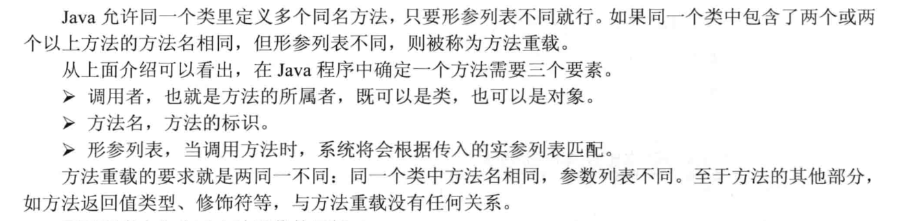

面向对象三大特征：封装、继承和多态。

**JAVA用引用操纵对象**

Java将一切看作对象，但操作对象的标识符实际上是对象的一个“引用”。

Java用new创建的对象由JVM进行管理，没有作用域的概念。

对象的this引用总是总是指向调用该方法的对象，通常有以下两种情形：

- 构造器中引用正在初始化的对象
- 方法中引用调用该方法的对象

# Java内存分配

1. 寄存器：这是最快的存储区，编程人员无法直接控制。

2. 栈：位于通用RAM中，但通过栈指针可以直接从CPU获得支持。栈指针若向下移动，则分配新的内存，若向上移动，则释放内存。创建JAVA程序时，JVM必须知道存储在栈中的所有项的确切生命周期，以便上下移动栈指针。对象引用大多存于栈中。

3. 堆：位于RAM，一种通用的内存池，用于存放所有的JAVA对象。堆不同于堆栈的好处是：编译器不需要知道存储的数据在堆中存活多长时间。因此，在堆里分配存储有很大的灵活性。代价是用堆进行存储分配和清理要消耗更长的时间。

# Java中的引用

引用类型：

强引用（Strong Reference），就是我们最常见的普通对象引用，只要还有强引用指向一个对象，就能表明对象还“活着”，垃圾收集器不会碰这种对象。对于一个普通的对象，如果没有其他的引用关系，只要超过了引用的作用域或者显式地将相应（强）引用赋值为 null，就是可以被垃圾收集的了，当然具体回收时机还是要看垃圾收集策略。

软引用（Soft Reference），是一种相对强引用弱化一些的引用，可以让对象豁免一些垃圾收集，只有当 JVM 认为内存不足时，才会去试图回收软引用指向的对象。JVM 会确保在抛出 `OutOfMemoryError` 之前，清理软引用指向的对象。软引用通常用来实现内存敏感的缓存，如果还有空闲内存，就可以暂时保留缓存，当内存不足时清理掉，这样就保证了使用缓存的同时，不会耗尽内存。

弱引用（Weak Reference）并不能使对象豁免垃圾收集，仅仅是提供一种访问在弱引用状态下对象的途径。这就可以用来构建一种没有特定约束的关系，比如，维护一种非强制性的映射关系，如果试图获取时对象还在，就使用它，否则重现实例化。它同样是很多缓存实现的选择。

对于幻象引用，有时候也翻译成虚引用，你不能通过它访问对象。幻象引用仅仅是提供了一种确保对象被 finalize 以后，做某些事情的机制，比如，通常用来做所谓的 Post-Mortem 清理机制。


这是 Java 定义的不同可达性级别（reachability level），具体如下：

- 强可达（Strongly Reachable），就是当一个对象可以有一个或多个线程可以不通过各种引用访问到的情况。比如，我们新创建一个对象，那么创建它的线程对它就是强可达。
- 软可达（Softly Reachable），就是当我们只能通过软引用才能访问到对象的状态。
- 弱可达（Weakly Reachable），类似前面提到的，就是无法通过强引用或者软引用访问，只能通过弱引用访问时的状态。这是十分临近 finalize 状态的时机，当弱引用被清除的时候，就符合 finalize 的条件了。
- 幻象可达（Phantom Reachable），上面流程图已经很直观了，就是没有强、软、弱引用关联，并且 finalize 过了，只有幻象引用指向这个对象的时候。
- 当然，还有一个最后的状态，就是不可达（unreachable），意味着对象可以被清除了。

判断对象可达性，是 JVM 垃圾收集器决定如何处理对象的一部分考虑。

所有引用类型，都是抽象类 `java.lang.ref.Reference` 的子类，你可能注意到它提供了 get() 方法：


除了幻象引用（因为 get 永远返回 null），如果对象还没有被销毁，都可以通过 get 方法获取原有对象。这意味着，利用软引用和弱引用，我们可以将访问到的对象，重新指向强引用，也就是人为的改变了对象的可达性状态！这也是为什么上面图里有些地方画了双向箭头。

所以，对于软引用、弱引用之类，垃圾收集器可能会存在二次确认的问题，以保证处于弱引用状态的对象，没有改变为强引用。


不同的引用类型，主要体现的是**对象不同的可达性（reachable）状态和对垃圾收集的影响**。


# 方法

同一个类的一个方法调用另外一个方法时，如果被调方法是普通方法，则默认使用this作为调用者；如果被调方法是静态方法，则默认使用类作为调用者。表面上看起来某些方法可以被独立执行，但实际上还是使用this或者类来作为调用者。

static修饰的方法属于类本身，普通方法属于类的实例化对象。

**当声明一个类引用并赋值为null时，可以通过空引用访问其对应的类方法，即类中的static方法。**


## 方法的参数传递机制

JAVA里方法的参数传递机制只有一种，即值传递。也就是将实际参数的数值赋值给方法中的形参局部变量，方法的执行过程中只是对实际参数的复制品进行操作，不会影响其原本的实际参数。


## 可变参数列表

从JDK 1.5之后，Java允许定义形参个数可变的参数，从而允许为方法指定数量不确定的形参。如果在定义方法时，在最后一个形参的类型后增加三点(...)，则表明该形参可以接受多个参数值，多个参数值被当成数组传入。下面程序定义了一个形参个数可变的方法。

示例：

```java
public class Test {    
	public void output(int... numbers) {
    	for(int i : numbers)            
    		System.out.print(i+"-->");    
    }    
    public static void main(String[] args) {
    	new Test().output(5,6,7,8,10);    
    } 
}
```

**注意：**长度可变的形参只能处于形参列表的最后。一个方法中最多只能包含一个长度可变的形参。长度可变的形参本质就是一个数组类型的形参，因此调用包含一个长度可变形参的方法时，这个长度可变的形参既可以传入多个参数，也可以传入一个数组。

## 方法重载Overload



方法重写（override）：指子类覆盖父类中的同名方法。

# 成员变量与局部变量

## 成员变量

static修饰的变量属于类，在第一次加载类时初始化。

实例成员变量在实例化时初始化。


## 局部变量

保存在方法的栈内存中，随方法的结束而回收。基本类型的局部变量直接保存在栈内存，引用类型的局部变量在栈中保存其对象的地址。

JAVA的自定义类中，基本类型的成员变量会被自动初始化。

**基本类型的局部变量不会被自动初始化，它会是一个随机值。**

使用new关键字创建数组并赋值给局部数组的引用时，数组中的初始元素为0。

# 封装


# 包装类

| 基本数据类型 | 包装类      |
| ------------ | ----------- |
| `char`       | `Character` |
| `byte`       | `Byte`      |
| `short`      | `Short`     |
| `int`        | `Integer`   |
| `long`       | Long        |
| `float`      | `Float`     |
| `double`     | `Double`    |
| `boolean`    | `Boolean`   |

JDK1.5为包装类提供了自动拆箱和装箱的功能，开发者可近似将基本类型的变量当成对象使用。

包装类可以实现基本数据类型与字符串之间的转换，共有以下两种方法：

- 利用包装类提供的`parseXXX(String x)`静态方法（除Character类，其他类均提供了该方法）。
- 利用包装类的构造器`Xxx(String s)`。


```java
public class Primitive
{
    public static void main(String[] args){
        String intStr = "12345";
        int t1 = Integer.parseInt(intStr);
        int t2 = new Integer(intStr);
        //输出12345
        System.out.println(t2);
    }
}
```

两个包装类进行比较时，由于包装类是引用类型，因此只有两个包装类指向同一个对象时使用``==``运算符才会返回true。

```java
public class Test {
    public static void main(String[] args) {
        //输出false
        System.out.println(new Integer(3) == new Integer(3));
    }
}
```

由于Integer类的缓存机制，自动装箱后包装类对象的比较会出现一些奇怪的情况：

```java
public class Test {
    public static void main(String[] args) {
        Integer a = 10;
        Integer b = 10;
        System.out.println(a == b);
        Integer x = 10000;
        Integer y = 10000;
        System.out.println(x == y);
        System.out.println(a == new Integer(10));
    }
}
```

输出：

```
true
false
false

Process finished with exit code 0
```

原因：在Integer类的源代码中，创建了一个cache数组存储对-128到127的数对应的Integer对象，在程序中创建-128到127的Integer对象时，实际上只是将对象的引用指向了cache中的对象，没有创建新的对象，因此两个-128-127的Integer引用相比较时，它们数值相等就会返回true。

**注意：**只有使用`Integer.valueOf`或者自动装箱（底层调用`valueOf`函数）创建Integer时才会得到缓存的对象，使用new关键字来创建Integer对象时，即使是-128到127的数字也会返回一个新的对象）。

可以通过equals方法判断包装类的对象在数值上是否相等。

Java8为包装类新增了一些方法：

- `static String toUnsignedString(int/long i)`：将整数或长整数转换成无符号整数对应的字符串。
- `static String toUnsignedString(int/long i, int radix)`：将整数或长整数转换成指定进制的无符号整数对应的字符串。
- `static xxx parseUnsignedXxx(String s)`：将字符串解析成无符号的xxx类型变量。
- `static xxx parseUnsignedXxx(String s, int radix)`：指定进制。
- ...(操作无符号整数的方法)

# 处理对象

## `toString`方法

`Object`类的`toString`方法会返回该对象实现类的`类名+@+hashcode`，用户可根据实际情况重写`toString`方法。

## ==运算符

==作用于基本类型时，比较两个基本类型数值是否相同。

==作用于引用类型时，比较两个引用类型是否指向同一个对象。

**String类的特殊之处：**

`"hello"`直接量与`new String("hello")`的区别：当Java程序使用形如`hello`的字符串直接量（或者其他可在编译时确定的字符串直接量），JVM会使用常量池来管理这些字符串；当使用`new String("hello")`时，JVM会先使用常量池来管理`hello`直接量，再调用String的构造器在堆内存创建一个对象。`new String("hello")`共产生了两个字符串对象。

==常量池专门用于管理在编译时确定并被保存在.class文件中的一些数据，包括了类、方法、接口中的常量和字符串常量。==

示例：

```
public class Test {
    public static void main(String[] args) {
        String s1 = "l";
        String s2 = "q";
        //s3可在编译时确定，直接指向常量区的"lq"
        String s3 = "l" + "q";
        //指向常量区的"lq"
        String s4 = "lq";
        //指向堆内存中的"lq"
        String s5 = new String("lq");
        //无法在编译时确定，会指向堆内存的"lq"
        String s6 = s1 + s2;
        System.out.println(s3 == s4);
        System.out.println(s4 == s6);
        System.out.println(s5 == s6);
    }
}
```

```java
true
false
false

Process finished with exit code 0
```

JAVA常量池保证内容相同的字符串常量只有一个，因此编译器确定的引用变量，只要其对应的字符串内容相同，它们就会指向常量池的同一个对象。

程序运行期间才能确定的字符串对象在堆中存储。

## equals方法
`equals`方法是Object类提供的一个实例方法，Object类默认的`equals`方法和==运算符的效果相同，可以通过重写`equals()`方法来实现自定义的相等标准。

- String的`equals()`方法用来判断两个字符串是否相等

- `实例名.getCall()`和`类名.class`

- 正确重写`euqls()`方法应该满足的条件
  - 自反性：对任意x，`x.equals(x)`一定返回true
  - 对称性：对任意x和y，如果`y.equals(x)`返回true，则`x.equals(y)`也返回true
  - 传递性：对任意x、y、z，如果`x.equals(y)`返回true，`y.equals(z)`返回true，则`x.equals(z)`一定返回true
  - 对任何不是null的x，`x.equals(null)`一定返回false

# final修饰符

final可以用于修饰类、变量和方法。

final修饰变量时，表示该变量一旦获得了初始值就不能再被改变。

## final成员变量

成员变量是随类初始化或对象初始化而初始化的。当类初始化时,系统会为该类的类变量分配内存，并分配默认值；当创建对象时，系统会为该对象的实例变量分配内存，并分配默认值。也就是说，当执行静态初始化块时可以对类变量赋初始值；当执行普通初始化块、构造方法时可对实例变量赋初始值。因此，成员变量的初始值可以在定义该变量时指定默认值，也可以在初始化块、构造方法中指定初始值。

因此JAVA规定final修饰的成员变量必须由程序员显式地指定初始值，系统不会对final成员进行隐式初始化。

总结起来，final修饰的类变量、实例变量指定初始值的地方如下：

- 类变量：在声明该变量时指定其初始值，或者在静态初始化块中指定初始值，且必须是二者之一。
- 实例变量：在构造方法、普通初始化块或声明该变量时指定初始值，且必须是三者之一。

## final局部变量

系统不会自动初始化局部变量，final修饰的局部变量在程序执行过程中只能赋值一次。

## final修饰基本类型变量和引用类型变量的区别

- 基本类型：final修饰的基本类型变量不能重新赋值。
- 引用类型：对final修饰的引用类型变量而言，final只保证该引用不会指向其他的对象，即其地址值不变，其指向的对象的内容可以发生改变。

## 可执行宏替换的final变量

如果一个final变量满足以下条件：

- 在定义final变量时制定了初始值。
- 该初始值可以在编译时确定下来。

例如：

```java
public class Test {
    public static void main(String[] args) {
        final int a = 5000;
        System.out.println(a);
    }
}
```

在程序执行时，a变量并不存在，`System.out.println(a)`在编译后实际执行的是`System.out.println(5)`

```java
public class Test {
    public static void main(String[] args) {
        final int a = 5 + 2;
        final double b = 1.2 / 3;
        final String str = "ab" + "cd";
        final String str2 = "ab" + "cd" + 23;
        //编译时无法确定其值，存储在堆中
        final String str3 = "abcd" + String.valueOf(23);
        System.out.println(str2 == "abcd23");
        System.out.println(str3 == "abcd23");
    }
}
```

执行结果

```bash
true
false
```

对编译时可以确定值的final变量，java编译器会把它当作”宏变量”来处理，进行宏替换。`a、b、str、str1`都是宏变量。

对于编译时可以确定的普通变量，java编译器并不会将其当作宏变量进行值替换。例如：

`String str4 = "a" + "bcd";`

虽然编译时可以确定str4的值，但编译器不会将该普通变量当作宏变量，它仍然在堆内存中。执行`str4 == str`将会返回false。

**注意：**final变量只有在声明时进行初始化，编译器才会将它当作宏变量。

## final方法

final修饰的方法不能被重写（override），不希望子类重写父类的某个方法时，可以使用final修饰父类的这个方法。

final修饰的方法可以被重载（overload）。

tip：父类的private方法对子类是不可见的，即使用final修饰private方法，子类仍可以定义与该private方法完全相同的方法，该方法是子类的一个新方法，与父类的private方法无关。

## final类

不可变（immutable）类的意思是创建该类的实例后，其实例对象不可改变。JAVA提供的包装类和String类都是不可变类。当创建它们的实例后，其实例不允许改变。

如果要创建自定义不可变类，需要遵守以下规则：

- 使用private和final修饰该类的成员变量。
- 提供带参构造器初始化成员变量。
- 仅提供getter方法。
- 如果有必要，重写Object类的`hashCode`和`equals`方法。`equals`方法根据成员变量的值判断对象是否相等，`equals`方法判断相等的两个对象，其`hashCode`也应该相等。

## final 关键字的作用

- 使用 final 修饰参数或者变量，也可以清楚地避免意外赋值导致的编程错误，甚至，有人明确推荐将所有方法参数、本地变量、成员变量声明成 final。
- final 变量产生了某种程度的不可变（immutable）的效果，所以，可以用于保护只读数据，尤其是在并发编程中，因为明确地不能再赋值 final 变量，有利于减少额外的同步开销，也可以省去一些防御性拷贝的必要。

需要注意的是，**final 并不等同于 immutable**，比如下面这段代码：

```java
 final List<String> strList = new ArrayList<>();
 strList.add("Hello");
 strList.add("world");  
 List<String> unmodifiableStrList = List.of("hello", "world");
 unmodifiableStrList.add("again");
```

final 只能约束 `strList` 这个引用不可以被赋值，但是 `strList` 对象行为不被 final 影响，添加元素等操作是完全正常的。如果我们真的希望对象本身是不可变的，那么需要相应的类支持不可变的行为。在上面这个例子中，`List.of` 方法创建的本身就是不可变 List，最后那句 add 是会在运行时抛出异常的。

# 初始化块

初始化块的作用和构造器类似，也可以对JAVA对象进行初始化操作。

## 使用方法

初始化块是Java类里可以出现的第四种成员（还有成员变量、方法和构造器），一个类里可以有多个初始化块，相同类型的初始化块之间有顺序，先定义的先执行，其语法如下：

```
[修饰符]{
	//code
	...
}
```

修饰符只能是static，使用static修饰的初始化块成为静态初始化块。初始化块里的代码可以包含任意可执行语句。

示例：

```java
public class Person {
    {
        int a = 6;
        if(a > 0)
            System.out.println("init block: partial variable a > 0");
        System.out.println("init block of person");
    }
    {
        System.out.println("second init block");
    }
    public Person() {
        System.out.println("no arg constructor");
    }

    public static void main(String[] args) {
        new Person();
    }
}
```

输出：

```
init block: partial variable a > 0
init block of person
second init block
no arg constructor
```

程序只在创建对象时隐式执行初始化块，再执行构造方法。

普通初始化块和声明实例变量指定的默认值都可以认为是对象的初始化代码，执行顺序与源程序中的排列顺序相同（可以将声明与初始化语句拆成两句，之后判断顺序）。

```java
public class Test {
    {
        a = 10;
    }
    int a = 9;
    //相当于:
    //int a;
	//{a = 9}
    public static void main(String[] args) {
        System.out.println(new Test().a);
        //输出a = 9
    }
}
```

## 初始化块和构造器

如果所有构造器都有一段公共的初始化代码，则可以把这段代码放到初始化块中以精简程序。

在初始化对象时，总是会溯源其顶层父类，执行其初始化块->构造方法，再执行子类的初始化块，构造方法...

**静态初始化块：**

静态初始化块也称类初始化块，它仅在类初始化时执行一次。静态初始化块不能对实例变量进行初始化。

**Java初始化代码执行顺序：**

父类静态变量声明➡父类静态变量初始化块 ➡子类静态变量声明➡子类静态变量初始化块

➡父类非静态变量声明➡父类非静态变量初始化➡父类构造方法➡子类非静态变量声明➡子类非静态变量初始化➡子类构造方法


# `Classpath`和 `jar`

`classpath`是JVM用到的一个环境变量，它用来指示JVM如何搜索`class`。

因为 Java 是编译型语言，源码文件是`.java`，而编译后的`.class`文件才是真正可以被 JVM 执行的字节码。因此，JVM 需要知道，如果要加载一个`abc.xyz.Hello`的类，应该去哪搜索对应的`Hello.class`文件。

所以，`classpath`就是一组目录的集合，它设置的搜索路径与操作系统相关。例如，在Windows系统上，用`;`分隔，带空格的目录用`""`括起来，可能长这样：

```shell
C:\work\project1\bin;C:\shared;"D:\My Documents\project1\bin"
```

在Linux系统上，用`:`分隔，可能长这样：

```shell
/usr/shared:/usr/local/bin:/home/liaoxuefeng/bin
```

现在我们假设`classpath`是`.;C:\work\project1\bin;C:\shared`，当JVM在加载`abc.xyz.Hello`这个类时，会依次查找：

- `<当前目录>\abc\xyz\Hello.class`
- `C:\work\project1\bin\abc\xyz\Hello.class`
- `C:\shared\abc\xyz\Hello.class`

注意到`.`代表当前目录。如果 JVM 在某个路径下找到了对应的`class`文件，就不再往后继续搜索。如果所有路径下都没有找到，就报错。

`classpath`的设定方法有两种：

在系统环境变量中设置`classpath`环境变量，不推荐；

在启动JVM时设置`classpath`变量，推荐。

我们强烈不推荐在系统环境变量中设置`classpath`，那样会污染整个系统环境。在启动JVM时设置`classpath`才是推荐的做法。实际上就是给`java`命令传入`-classpath`或`-cp`参数：

```shell
java -classpath .;C:\work\project1\bin;C:\shared abc.xyz.Hello
```

或者使用`-cp`的简写：

```shell
java -cp .;C:\work\project1\bin;C:\shared abc.xyz.Hello
```

没有设置系统环境变量，也没有传入`-cp`参数，那么JVM默认的`classpath`为`.`，即当前目录：

```shell
java abc.xyz.Hello
```

上述命令告诉JVM只在当前目录搜索`Hello.class`。

在IDE中运行Java程序，IDE自动传入的`-cp`参数是当前工程的`bin`目录和引入的jar包。

通常，我们在自己编写的`class`中，会引用Java核心库的`class`，例如，`String`、`ArrayList`等。这些`class`应该上哪去找？

有很多“如何设置`classpath`”的文章会告诉你把JVM自带的`rt.jar`放入`classpath`，但事实上，根本不需要告诉 JVM 如何去 Java 核心库查找`class`，JVM 怎么可能笨到连自己的核心库在哪都不知道？

 不要把任何Java核心库添加到`classpath`中！JVM根本不依赖`classpath`加载核心库！

更好的做法是，不要设置`classpath`！默认的当前目录`.`对于绝大多数情况都够用了。

假设我们有一个编译后的`Hello.class`，它的包名是`com.example`，当前目录是`C:\work`，那么，目录结构必须如下：

```ascii
C:\work
└─ com
   └─ example
      └─ Hello.class
```

运行这个`Hello.class`必须在当前目录下使用如下命令：

```shell
C:\work> java -cp . com.example.Hello
```

JVM根据`classpath`设置的`.`在当前目录下查找`com.example.Hello`，即实际搜索文件必须位于`com/example/Hello.class`。如果指定的`.class`文件不存在，或者目录结构和包名对不上，均会报错。

## jar包

如果有很多`.class`文件，散落在各层目录中，肯定不便于管理。如果能把目录打一个包，变成一个文件，就方便多了。

jar包就是用来干这个事的，它可以把`package`组织的目录层级，以及各个目录下的所有文件（包括`.class`文件和其他文件）都打成一个jar文件，这样一来，无论是备份，还是发给客户，就简单多了。

jar包实际上就是一个zip格式的压缩文件，而jar包相当于目录。如果我们要执行一个jar包的`class`，就可以把jar包放到`classpath`中：

```shell
java -cp ./hello.jar abc.xyz.Hello
```

这样JVM会自动在`hello.jar`文件里去搜索某个类。

那么问题来了：如何创建jar包？

因为jar包就是zip包，所以，直接在资源管理器中，找到正确的目录，点击右键，在弹出的快捷菜单中选择“发送到”，“压缩(zipped)文件夹”，就制作了一个zip文件。然后，把后缀从`.zip`改为`.jar`，一个jar包就创建成功。

假设编译输出的目录结构是这样：

```ascii
package_sample
└─ bin
   ├─ hong
   │  └─ Person.class
   │  ming
   │  └─ Person.class
   └─ mr
      └─ jun
         └─ Arrays.class
```

这里需要特别注意的是，jar包里的第一层目录，不能是`bin`，而应该是`hong`、`ming`、`mr`。如果在Windows的资源管理器中看，应该长这样：


如果长这样：


说明打包打得有问题，JVM 仍然无法从 jar 包中查找正确的`class`，原因是`hong.Person`必须按`hong/Person.class`存放，而不是`bin/hong/Person.class`。

jar 包还可以包含一个特殊的`/META-INF/MANIFEST.MF`文件，`MANIFEST.MF`是纯文本，可以指定`Main-Class`和其它信息。JVM会自动读取这个`MANIFEST.MF`文件，如果存在`Main-Class`，我们就不必在命令行指定启动的类名，而是用更方便的命令：

```java
java -jar hello.jar
```

jar包还可以包含其它jar包，这个时候，就需要在`MANIFEST.MF`文件里配置`classpath`了。

在大型项目中，不可能手动编写`MANIFEST.MF`文件，再手动创建zip包。Java社区提供了大量的开源构建工具，例如[Maven](https://www.liaoxuefeng.com/wiki/1252599548343744/1255945359327200)，可以非常方便地创建jar包。

## 小结

JVM通过环境变量`classpath`决定搜索`class`的路径和顺序；

不推荐设置系统环境变量`classpath`，始终建议通过`-cp`命令传入；

jar包相当于目录，可以包含很多`.class`文件，方便下载和使用；

`MANIFEST.MF`文件可以提供jar包的信息，如`Main-Class`，这样可以直接运行jar包。

