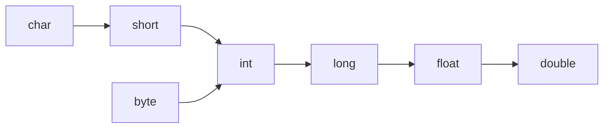

# 注释
Java共有三种注释方式：
1. 单行注释
2. 多行注释
3. 文档注释

## 文档注释
如果编写Java源代码时添加了合适的文档注释，通过JDK提供的javadoc工具可以直接将源代码里的文档注释提取成一份系统的API文档。
文档注释以(/\*\*)开始，\*/结束，中间的部分会全部到提取到API文档中。
示例：
```java
package java.util;

import java.util.function.Consumer;

/**
 * An iterator over a collection.  {@code Iterator} takes the place of
 * {@link Enumeration} in the Java Collections Framework.  Iterators
 * differ from enumerations in two ways:
 *
 * <ul>
 *      <li> Iterators allow the caller to remove elements from the
 *           underlying collection during the iteration with well-defined
 *           semantics.
 *      <li> Method names have been improved.
 * </ul>
 *
 * <p>This interface is a member of the
 * <a href="{@docRoot}/../technotes/guides/collections/index.html">
 * Java Collections Framework</a>.
 *
 * @param <E> the type of elements returned by this iterator
 *
 * @author  Josh Bloch
 * @see Collection
 * @see ListIterator
 * @see Iterable
 * @since 1.2
 */
public interface Iterator<E> {
    /**
     * Returns {@code true} if the iteration has more elements.
     * (In other words, returns {@code true} if {@link #next} would
     * return an element rather than throwing an exception.)
     *
     * @return {@code true} if the iteration has more elements
     */
    boolean hasNext();

    /**
     * Returns the next element in the iteration.
     *
     * @return the next element in the iteration
     * @throws NoSuchElementException if the iteration has no more elements
     */
    E next();
......
```
# 标识符
Java的标识符以字母、下划线(_)或美元符($)开头，后面可以跟任意数量的字母，下划线、美元符和数字。此处的字母还可以是中文字符，日文字符等。
标识符的规则：
- 标识符不能是保留字或关键字。
- 标识符不能包含空格。
- 标识符只能包含美元符和下划线，不能包含其他特殊字符。
```java
public class Solution {
    public static void main(String[] args) {
        int a国家 = 10;
        System.out.println(a国家);
    }
}
```

# 基本类型
JAVA的基本类型直接存储在堆栈中，基本类型所占存储空间的大小是固定的，如下表。
基本类型分为boolean类型和数值类型，数值类型分为整数类型和浮点类型，整数类型包括byte、char（无符号整型）、short、int和long，浮点类型包括float和double。
| 基本类型    | 大小    |
| ----------- | ------- |
| **boolean** | -       |
| **char**    | 2 bytes |
| **byte**    | 1 byte  |
| **short**   | 2 bytes |
| **int**     | 4 bytes |
| **long**    | 8 bytes |
| **float**   | 4 bytes |
| **double**  | 8 bytes |

## 整型
int是最常用的整数类型，通常情况下，直接给出一个整数值默认就是int类型。需要注意的是：
- 当把一个在byte或short表示范围内的int值赋值给一个byte或short变量时，系统会自动改变变量类型。
- 当使用个超过int类型的数时，系统不会自动将其转为long，而是会报错。需要在数字后加L或l后缀。

通过给常量添加前缀可以使用十进制以外的表示形式：
- 0x或0X前缀代表十六进制数
- 0前缀代表八进制
- 0b或0B前缀代表二进制数

## 字符型
字符型值有三种表示形式：
- 通过单个字符来指定字符型值，如'a','H'
- 通过转义字符表示特殊字符型值，如'\r','\n'
- 使用Unicode值来表示字符，如'\uXXXX'

由于计算机保存字符时，实际保存的是字符的编号，因此char可以当作16位的无符号整数使用，表示范围位0-65535。
如果把0-65535的int数赋值给char类型变量，系统会将其当作char来处理。
例如：
```java
public static void main(String[] args) {
        char a = 65;
        System.out.println(a);
}
\\output:
\\A
```

==Java中的常用转义字符：==

| 转义字符 | 描述   |
| -------- | ------ |
| \b       | 退格符 |
| \n       | 换行符 |
| \r       | 回车符 |
| \t       | 制表符 |
| \\\      | \\     |
| \\"      | "      |
| \\'      | '      |

## 浮点型

Java语言的浮点数有两种表示形式。
- 十进制数形式：这种形式就是简单的浮点数，例如5.12、512.0、.512。浮点数必须包含一个小数点，否则会被当成int类型处理。
- 科学计数法形式：例如5.12e2(即5.12×10^2^)。必须指出的是，只有浮点类型的数值才可以使用科学计数法形式表示。例如,51200是一个int值，但512E2则是浮点类型的值。

Java还提供了三个特殊的浮点数值：正无穷大、负无穷大和非数，用于表示溢出和出错。例如，使用一个正数除以0将得到正无穷大，使用一个负数除以0将得到负无穷大，0.0除以0.0或对一个负数开方将得到一个非数。正无穷大通过 Double或 Float类POSITIVE_INFINITY表示，负无穷大通过Double或Float类的NEGATIVE_INFINITY表示，非数通过Double或Float类的NaN表示。

所有的正无穷大数值都是相等的，所有的负无穷大数值都是相等的，而NaN不与任何数值相等，甚至和NaN都不相等。

> 浮点数除以0.0才会得到NaN，整数除以0时会直接抛出除0异常。

JAVA中默认的浮点数为double类型，需要float类型时可以在字面量后面加f后缀。

- xxxF，大小写F代表float
- xxxD，大小写d代表double

## 数值中使用下划线分割

Java7引入了一个新特性，可以在数值中任意使用下划线，不影响数值。

例如：

`int x = 100_0000_0000_0000_0000;`

# 基本数据类型的类型转换

## 自动类型转换

一个数值范围小的类型可以自动转为一个数值范围大的类型。



## 强制类型转换

当需要把箭头右边的类型转换为左边的类型时，就需要进行强制类型转换。

示例：

```java
public class Test {
    public static void main(String[] args) {
        int iValue = 233;
        byte bValue = (byte)iValue; //强制转换
        System.out.println(bValue); // 变成-23

        double dValue = 3.98;
        int tol = (int)dValue;
        System.out.println(tol); // 变成了3
    }
}
```

Java进行类型转换时会保留低位的x位。将32位的int转换为8位的byte时，低位的8位为0b11101001，补码表示形式下其对应的数值为-23。将浮点数强制转换为整数时，会截断浮点数的小数部分。

### 表达式中类型的自动提升

当一个算术表达式中包含多个基本类型的值时，整个算术表达式的数据类型将发生自动提升。Java定义了如下的自动提升规则：

- 所有的byte类型、short类型和 char类型将被提升到int类型。
- 整个算术表达式的数据类型自动提升到与表达式中最高等级操作数同样的类型。

# 赋值运算符

赋值运算符支持连续赋值，一次为多个变量赋值是正确的。

```java
int a, b, c;
a = b = c = 10;
```


# 按位操作符
- &：按位与

- |：按位或
- ~：按位非

- ^：按位异或

- \<\<：左移操作符，最低位补0

- \>\>：右移操作符，正数最高位补0，负数补1

- \>\>\>：无符号右移操作符，最高位总是补0

# 逻辑运算符

逻辑运算符用于操作两个布尔变量，主要有6个：

- &&：短路与
- &：不短路与
- ||：短路或
- |：不短路或
- ！：非
- ^：异或，两个操作数不同时，返回true。

# 运算符的结合性与优先级

**运算符的优先级（从高到低）**

| 优先级 | 描述         | 运算符                  |
| ------ | ------------ | ----------------------- |
| 1      | 括号         | ()、[]                  |
| 2      | 正负号       | +、-                    |
| 3      | 自增自减，非 | ++、--、!               |
| 4      | 乘除，取余   | *、/、%                 |
| 5      | 加减         | +、-                    |
| 6      | 移位运算     | <<、>>、>>>             |
| 7      | 大小关系     | >、>=、<、<=            |
| 8      | 相等关系     | ==、!=                  |
| 9      | 按位与       | &                       |
| 10     | 按位异或     | ^                       |
| 11     | 按位或       | \|                      |
| 12     | 逻辑与       | &&                      |
| 13     | 逻辑或       | \|\|                    |
| 14     | 条件运算     | ?:                      |
| 15     | 赋值运算     | =、+=、-=、*=、/=、%=   |
| 16     | 位赋值运算   | &=、\|=、<<=、>>=、>>>= |