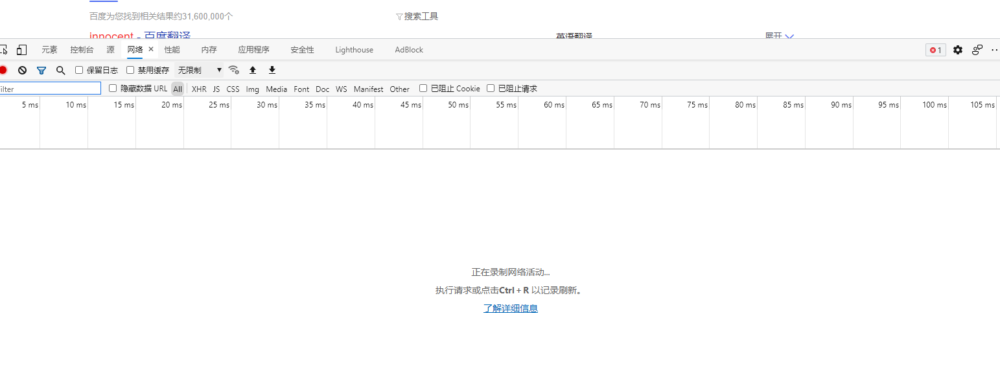
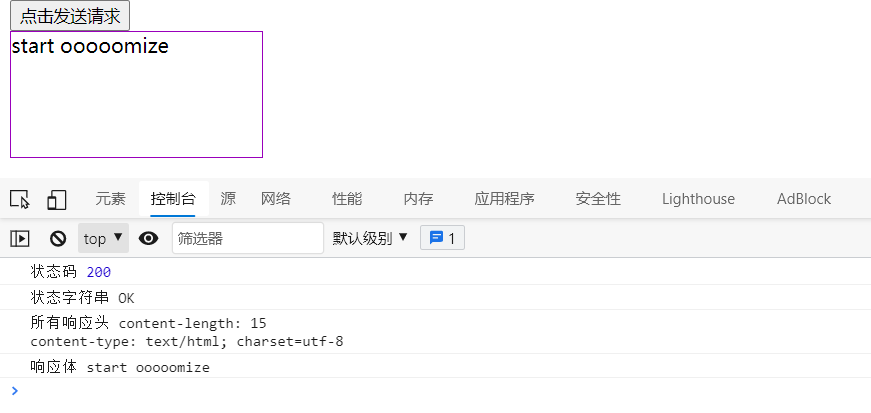
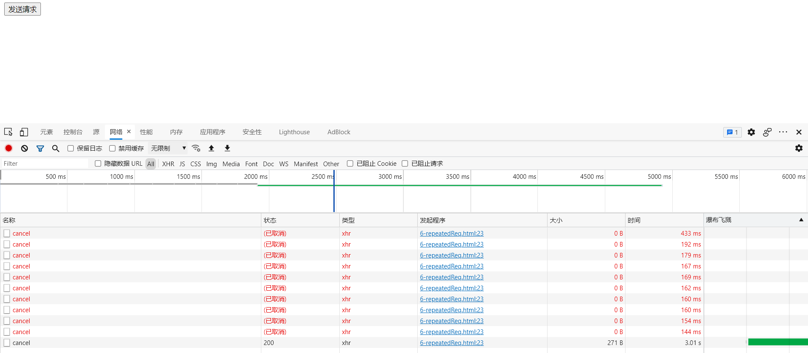

# AJAX概述

异步java script和xml（**A**synchronous **J**avascript **A**nd **X**ML），在不刷新页面的情况下作出相应。

优点：

1. 无需刷新页面与服务器端进行通信。
2. 允许根据用户事件来更新部分页面内容。

缺点：

1. 没有浏览历史，不能后退。
2. 存在跨域问题。
3. SEO不友好，爬虫爬不到。


# XML简介

可扩展标记语言(Extensible Markup Language)，被设计来存储和传输数据。

XML没有预定义标签，全是自定义标签。

eg：

```xml
<boy>
    <name>Mike</name>
    <age>55</age>
    <hometown>Yanan</hometown>
</boy>
```

XML文件是早期AJAX进行数据交换的方式。


# 控制台

demo，在百度搜索innocent。

一、点击网络



二、刷新并选择第一条请求


请求头和响应头分别是HTTP请求报文和响应报文的首部字段。

点击查看源，可以查看请求报文的源代码。

# Nodejs

Node.js 是一个基于 Chrome V8 引擎的 JavaScript 运行时。

# Express

基于Node.js平台，快速、开放、极简的Web开发框架。

demo

```javascript
//1. 引入express
const express = require('express');

//2. 创建应用对象
const app = express();

//3. 路由规则
app.get('/', (request, response) => {
    response.send('start ooooomize');
});

//4. 监听端口启动服务
app.listen(8000, ()=>{
    console.log("服务已启动，8000端口监听中....");
});
```

访问localhost:8000

请求报文头：

```
GET / HTTP/1.1
Host: localhost:8000
Connection: keep-alive
Cache-Control: max-age=0
sec-ch-ua: " Not;A Brand";v="99", "Microsoft Edge";v="91", "Chromium";v="91"
sec-ch-ua-mobile: ?0
DNT: 1
Upgrade-Insecure-Requests: 1
User-Agent: Mozilla/5.0 (Windows NT 10.0; Win64; x64) AppleWebKit/537.36 (KHTML, like Gecko) Chrome/91.0.4472.114 Safari/537.36 Edg/91.0.864.59
Accept: text/html,application/xhtml+xml,application/xml;q=0.9,image/webp,image/apng,*/*;q=0.8,application/signed-exchange;v=b3;q=0.9
Sec-Fetch-Site: none
Sec-Fetch-Mode: navigate
Sec-Fetch-User: ?1
Sec-Fetch-Dest: document
Accept-Encoding: gzip, deflate, br
Accept-Language: zh-CN,zh;q=0.9,en;q=0.8,en-GB;q=0.7,en-US;q=0.6
If-None-Match: W/"f-gnkdYU4qUjiXE+06wX095m6zF4k"
```

响应报文头：

```
Content-Length: 15
Content-Type: text/html; charset=utf-8
Date: Wed, 30 Jun 2021 07:40:51 GMT
ETag: W/"f-gnkdYU4qUjiXE+06wX095m6zF4k"
X-Powered-By: Express
```

响应体：

```
start ooooomize
```

# AJAX Get请求

demo:

HTML

```html
<!DOCTYPE html>
<html lang="en">
<head>
  <meta charset="UTF-8">
  <meta http-equiv="X-UA-Compatible" content="IE=edge">
  <meta name="viewport" content="width=device-width, initial-scale=1.0">
  <title>Ajax GET 请求</title>
  <style>
    #result {
      width: 200px;
      height: 100px;
      border: solid 1px #90b;
    }
  </style>
</head>
<body>
  <button>点击发送请求</button>
  <div id="result"></div>
  <script>
    //获取button元素
    const btn = document.getElementsByTagName('button')[0];
    const result = document.getElementById('result');
    //绑定事件
    btn.onclick = function(){
      // 1. 创建对象(AJAX对象)
      const xhr = new XMLHttpRequest();
      // 2. 初始化 设置请求方法和url
      xhr.open('GET', 'http://127.0.0.1:8000/server')
      // 3. 发送
      xhr.send();
      // 4. 事件绑定 处理服务端返回的结果
      xhr.onreadystatechange = function(){
        // readyState 是 xhr 对象中的属性, 表示状态 0 1 2 3 4
        //0 未初始化 1 open调用完毕 2 send完毕 3 返回了部分结果 4 服务端返回了所有结果
        //该函数会被调用四次（状态改变四次） 
        //判断 (服务端返回了所有的结果)
        if(xhr.readyState === 4){
          //判断响应状态码 200  404  403 401 500
          if(xhr.status >= 200 && xhr.status < 300){
            // 处理结果 行 头 空行 体
            // 响应
            console.log('状态码', xhr.status); // 状态码
            console.log('状态字符串', xhr.statusText); // 状态字符串
            console.log('所有响应头', xhr.getAllResponseHeaders()); // 所有响应头
            console.log('响应体', xhr.response); // 响应体
            
            //设置 result 的文本
            result.innerHTML=xhr.response;
          }else{
          }
        }
      } 
    }
  </script>
</body>
</html>
```

服务端：

```javascript
//1. 引入express
const express = require('express');

//2. 创建应用对象
const app = express();

//3. 路由规则
app.get('/server', (request, response) => {
    //设置响应头，设置允许跨域
    response.setHeader('Access-Control-Allow-Origin', '*');
    //设置响应体
    response.send('start ooooomize');
});

//4. 监听端口启动服务
app.listen(8000, ()=>{
    console.log("服务已启动，8000端口监听中....");
});
```

结果：




# AJAX Post请求

服务端

```js
//1. 引入express
const express = require('express');

//2. 创建应用对象
const app = express();

//3. 路由规则
app.post('/server', (request, response) => {
    //设置响应头，设置允许跨域
    response.setHeader('Access-Control-Allow-Origin', '*');
    //设置响应体
    response.send('post response!');
});

//4. 监听端口启动服务
app.listen(8000, ()=>{
    console.log("服务已启动，8000端口监听中....");
});
```

HTML

鼠标悬浮到div后向后端发一个POST请求。

```html
<!DOCTYPE html>
<html lang="en">
<head>
  <meta charset="UTF-8">
  <meta http-equiv="X-UA-Compatible" content="IE=edge">
  <meta name="viewport" content="width=device-width, initial-scale=1.0">
  <title>Ajax POST 请求</title>
  <style>
    #result {
      width: 200px;
      height: 100px;
      border: solid 1px #906;
    }
  </style>
</head>
<body>
  <div id="result"></div>
  <script>
    //获取元素对象
    const result = document.getElementById('result');
    //绑定事件
    result.addEventListener("mouseover", function() {
        // 1. 创建对象(AJAX对象)
        const xhr = new XMLHttpRequest();
        // 2. 初始化 设置请求方法和url
        xhr.open('POST', 'http://127.0.0.1:8000/server');

        //设置请求头,xhr.setRequestHeader(name,value)
        xhr.setRequestHeader('Accept','/*');

        // 3. 发送，设置POST请求体
        xhr.send('a=10&b=20&c=20');
        // 4. 事件绑定 处理服务端返回的结果
        xhr.onreadystatechange = function() {
            if(xhr.readyState === 4) {
                if(xhr.status >= 200 && xhr.status < 300) {
                    //处理服务端返回的结果
                    result.innerHTML = xhr.response;
                }
            }
        }
    })  
  </script>
</body>
</html>
```

# JSON响应

HTML

```html
<!DOCTYPE html>
<html lang="en">
<head>
  <meta charset="UTF-8">
  <meta http-equiv="X-UA-Compatible" content="IE=edge">
  <meta name="viewport" content="width=device-width, initial-scale=1.0">
  <title>Ajax POST 请求</title>
  <style>
    #result {
      width: 200px;
      height: 100px;
      border: solid 1px #906;
    }
  </style>
</head>
<body>
  <div id="result"></div>
  <script>
      //获取元素对象
      const result = document.getElementById('result');
      //绑定键盘按下事件
      window.onkeydown = function() {
          // 1. 创建对象(AJAX对象)
          const xhr = new XMLHttpRequest();
          // 2. 初始化 设置请求方法和url
          xhr.open('GET', 'http://127.0.0.1:8000/jsonserver');
          // 3. 设置response类型为JSON
          xhr.responseType = 'json';
          // 4. 发送，设置POST请求体
          xhr.send();
          // 5. 事件绑定 处理服务端返回的结果
          xhr.onreadystatechange = function() {
              if(xhr.readyState === 4) {
                  if(xhr.status >= 200 && xhr.status < 300) {
                      //处理服务端返回的结果
                      result.innerHTML = xhr.response.state + '-----' + xhr.response.name;
                      
                  }
              }
          }
      }
  </script>
</body>
</html>
```

server：

```js
//1. 引入express
const express = require('express');

//2. 创建应用对象
const app = express();

//3. 路由规则
app.get('/jsonserver', (request, response) => {
    //设置响应头，设置允许跨域
    response.setHeader('Access-Control-Allow-Origin', '*');
    //设置响应体
    const data = {
        state: 'alive',
        name: 'wangwang'
    };
    response.send(JSON.stringify(data));
});

//4. 监听端口启动服务
app.listen(8000, ()=>{
    console.log("服务已启动，8000端口监听中....");
});
```

# AJAX设置响应超时

HTML

```html
<!DOCTYPE html>
<html lang="en">
<head>
  <meta charset="UTF-8">
  <meta http-equiv="X-UA-Compatible" content="IE=edge">
  <meta name="viewport" content="width=device-width, initial-scale=1.0">
  <title>Ajax Set Timeout</title>
  <style>
    #result {
      width: 200px;
      height: 100px;
      border: solid 1px #90b;
    }
  </style>
</head>
<body>
  <button>点击发送请求</button>
  <div id="result"></div>
  <script>
    //获取button元素
    const btn = document.getElementsByTagName('button')[0];
    const result = document.getElementById('result');
    //绑定事件
    btn.onclick = function(){
      const xhr = new XMLHttpRequest();
      xhr.timeout = 2000;
      xhr.open('GET', 'http://127.0.0.1:8000/delay')
      xhr.send();
      xhr.onreadystatechange = function(){
        if(xhr.readyState === 4){
          if(xhr.status >= 200 && xhr.status < 300){
            result.innerHTML = xhr.response;
          }
        }
      };
      xhr.ontimeout = function() {
          alert("网络异常");
      };
    }
  </script>
</body>
</html>
```

服务端

```js
//1. 引入express
const express = require('express');

//2. 创建应用对象
const app = express();

//3. 路由规则
app.get('/delay', (request, response) => {
    //设置响应头，设置允许跨域
    response.setHeader('Access-Control-Allow-Origin', '*');
    //添加延时控制
    setTimeout(() => {
        response.send('延时响应');
    }, 3000);
});

//4. 监听端口启动服务
app.listen(8000, ()=>{
    console.log("服务已启动，8000端口监听中....");
});
```

# 取消AJAX请求

使用xhr的abort()方法。

服务端

```js
//1. 引入express
const express = require('express');

//2. 创建应用对象
const app = express();

//3. 路由规则
app.get('/cancel', (request, response) => {
    //设置响应头，设置允许跨域
    response.setHeader('Access-Control-Allow-Origin', '*');
    //添加延时控制
    setTimeout(() => {
        response.send('延时响应');
    }, 3000);
});

//4. 监听端口启动服务
app.listen(8000, ()=>{
    console.log("服务已启动，8000端口监听中....");
});
```

HTML

```html
<!DOCTYPE html>
<html lang="en">
<head>
  <meta charset="UTF-8">
  <meta http-equiv="X-UA-Compatible" content="IE=edge">
  <meta name="viewport" content="width=device-width, initial-scale=1.0">
  <title>Ajax Cancel Request</title>
</head>
<body>
  <button id = "send">发送请求</button>
  <button id = "cancel">取消请求</button>
  <script>
    //获取button元素
    const btn1 = document.getElementById('send');
    const btn2 = document.getElementById('cancel');
    //使用全局变量保存XMLHttpRequest
    let x = null;
    btn1.onclick = function(){
      console.log('btn1');
      const xhr = new XMLHttpRequest();
      x = xhr;
      xhr.open('GET', 'http://127.0.0.1:8000/cancel')
      xhr.send();
    };
    btn2.onclick = function() {
      x.abort();
    };
  </script>
</body>
</html>
```

# 重复请求问题

发出一个请求时，检测是否已经发出过同样的请求，如果有，则取消掉之前的请求，发送新的请求。

服务端

```js
//1. 引入express
const express = require('express');

//2. 创建应用对象
const app = express();

//3. 路由规则
app.get('/cancel', (request, response) => {
    //设置响应头，设置允许跨域
    response.setHeader('Access-Control-Allow-Origin', '*');
    //添加延时控制
    setTimeout(() => {
        response.send('延时响应');
    }, 3000);
});

//4. 监听端口启动服务
app.listen(8000, ()=>{
    console.log("服务已启动，8000端口监听中....");
});
```

前端：

```html
<!DOCTYPE html>
<html lang="en">
<head>
  <meta charset="UTF-8">
  <meta http-equiv="X-UA-Compatible" content="IE=edge">
  <meta name="viewport" content="width=device-width, initial-scale=1.0">
  <title>Ajax Cancel Request</title>
</head>
<body>
  <button id = "send">发送请求</button>
  <script>
    //获取button元素
    const btn = document.getElementById('send');
    let xhr = null;
    //绑定事件
    let isSending = false;
    btn.onclick = function(){
      if(isSending)
        xhr.abort();  
      xhr = new XMLHttpRequest();
      isSending = true;
      xhr.open('GET', 'http://127.0.0.1:8000/cancel')
      xhr.send();
      xhr.onreadystatechange = function() {
          if(xhr.readyState === 4) {
              isSending = false;
          }
      }
    };
  </script>
</body>
</html>
```




# Jquery中的AJAX

导入Jquery

``<script src="https://cdn.bootcdn.net/ajax/libs/jquery/3.6.0/jquery.min.js"></script>``