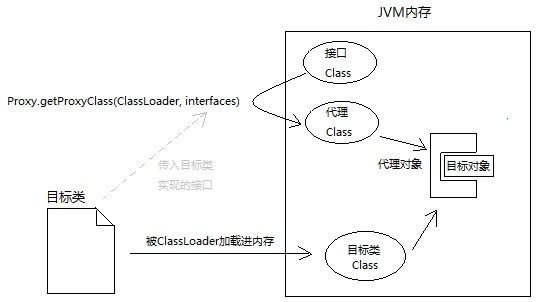

# 一、overview

代理模式是一种设计模式，提供了对目标对象额外的访问方式，即通过代理对象访问目标对象，这样可以在不修改原目标对象的前提下，提供额外的功能操作，扩展目标对象的功能。


# 二、静态代理

这种代理方式需要代理对象和目标对象实现一样的接口。

优点：可以在不修改目标对象的前提下扩展目标对象的功能。

缺点：

1. 冗余。由于代理对象要实现与目标对象一致的接口，会产生过多的代理类。
2. 不易维护。一旦接口增加方法，目标对象与代理对象都要进行修改。

> 举例：保存用户功能的静态代理实现

- 接口类： `IUserDao`

```java
package com.proxy;

public interface IUserDao {
    public void save();
}
```

- 目标对象：`UserDao`

```java
package com.proxy;

public class UserDao implements IUserDao{

    @Override
    public void save() {
        System.out.println("保存数据");
    }
}
```

- 静态代理对象：`UserDaoProxy` 需要实现`IUserDao`接口，**之所以实现相同接口，是为了尽可能保证代理对象的内部结构和目标对象一致，这样我们对代理对象的操作最终都可以转移到目标对象身上，代理对象只需专注于增强代码的编写。**

```java
package com.proxy;

public class UserDaoProxy implements IUserDao{

    private IUserDao target;
    public UserDaoProxy(IUserDao target) {
        this.target = target;
    }
    
    @Override
    public void save() {
        System.out.println("开启事务");//扩展了额外功能
        target.save();
        System.out.println("提交事务");
    }
}
```

- 测试类：`TestProxy`

```java
package com.proxy;

import org.junit.Test;

public class StaticUserProxy {
    @Test
    public void testStaticProxy(){
        //目标对象
        IUserDao target = new UserDao();
        //代理对象
        UserDaoProxy proxy = new UserDaoProxy(target);
        proxy.save();
    }
}
```

- 输出结果

```bash
开启事务
保存数据
提交事务
```

# 三、动态代理

动态代理利用了 JDK API，动态地在内存中创建代理对象，从而实现对目标对象的代理功能。动态代理又被称为 JDK 代理或接口代理。

静态代理与动态代理的区别主要在：

- 静态代理在编译时就已经实现，编译完成后代理类是一个实际的class文件。
- 动态代理是在运行时动态生成的，即编译完成后没有实际的class文件，而是在运行时动态生成类字节码，并加载到JVM中。

**特点：**
动态代理对象不需要实现接口，但是要求目标对象必须实现接口，否则不能使用动态代理。

JDK中生成代理对象主要涉及的类有：

- `java.lang.reflect.Proxy`，主要方法为：

  ```java
  // 传入类加载器和一组接口，返回代理Class对象（拷贝接口的类结构信息到一个新的Class对象，并且新的Class对象带有构造器）
  public static Class<?> getProxyClass(ClassLoader loader,
                                           Class<?>... interfaces)
          throws IllegalArgumentException
  {
      final Class<?>[] intfs = interfaces.clone();
      final SecurityManager sm = System.getSecurityManager();
      if (sm != null) {
          checkProxyAccess(Reflection.getCallerClass(), loader, intfs);
      }
  
      return getProxyClass0(loader, intfs);
  }
  ```

- `java.lang.reflect.InvocationHandler`

  ```java
  // 在代理实例上执行方法，并返回处理结果
  public Object invoke(Object proxy, Method method, Object[] args)
          throws Throwable;
  ```

图示：



demo：

- `IUserDao`

```java
package com.learning;

public interface IUserDao {
    void save();
}
```

- `UserDao`

```java
package com.learning;

public class UserDao implements IUserDao {
    @Override
    public void save() {
        System.out.println("保存数据");
    }
}
```

- 测试类

```java
public class Test {
    public static void main(String[] args) throws Throwable {
        // 返回含有构造方法的 class 对象
        Class IUserDaoProxyClazz = Proxy.getProxyClass(IUserDao.class.getClassLoader(), IUserDao.class);
        // 返回带参构造器
        Constructor constructor = IUserDaoProxyClazz.getConstructor(InvocationHandler.class);
        // 反射创建代理实例
        IUserDao userDao = (IUserDao) constructor.newInstance(new InvocationHandler() {
            @Override
            public Object invoke(Object proxy, Method method, Object[] args) throws Throwable {
                UserDao userDao = new UserDao();
                Object res = method.invoke(userDao, args);
                return res;
            }
        });
        userDao.save();
    }
}
```

这样的写法会导致代理不同的对象时，需要对代理类进行修改，改进：

```java
public class Test {
    public static void main(String[] args) throws Throwable {
        UserDao target = new UserDao();
        IUserDao userDao = (IUserDao)getProxy(target); 
        userDao.save();
    }
    private static Object getProxy(final Object target) throws Exception {
        Class proxyClazz = Proxy.getProxyClass(target.getClass().getClassLoader(), target.getClass().getInterfaces());
        Constructor constructor = proxyClazz.getConstructor(InvocationHandler.class);
        Object proxy = constructor.newInstance(new InvocationHandler() {
            @Override
            public Object invoke(Object proxy, Method method, Object[] args) throws Throwable {
                System.out.println("method start");
                Object res = method.invoke(target, args);
                System.out.println("method end");
                return res;
            }
        });
        return proxy;
    }
}
```

实际编程中，一般不用`getProxyClass()`，而是使用Proxy类的另一个静态方法：`Proxy.newProxyInstance()`，直接返回代理实例：

```java
public class MyDynamicProxy {
    public static  void main (String[] args) {
        HelloImpl hello = new HelloImpl();
        MyInvocationHandler handler = new MyInvocationHandler(hello);
        // 构造代码实例，底层实现是 generateProxyClass byte[] 并进行了类加载
        Hello proxyHello = (Hello) Proxy.newProxyInstance(HelloImpl.class.getClassLoader(), HelloImpl.class.getInterfaces(), handler);
        // 调用代理方法
        proxyHello.sayHello();
    }
}

interface Hello {
    void sayHello();
}

class HelloImpl implements  Hello {
    @Override
    public void sayHello() {
        System.out.println("Hello World");
    }
}

class MyInvocationHandler implements InvocationHandler {
    private Object target;
    public MyInvocationHandler(Object target) {
        this.target = target;
    }
    @Override
    public Object invoke(Object proxy, Method method, Object[] args)
            throws Throwable {
        // 在生产系统中，我们可以轻松扩展类似逻辑进行诊断、限流等。
        System.out.println("Invoking sayHello");
        Object result = method.invoke(target, args);
        return result;
    }
}
```


所谓的动态代理就是这样一种 class，它是在运行时生成的 class，在生成它时你必须提供一组 interface 给它，然后该 class 就宣称它实现了这些 interface，但是其实它不会替你做实质性的工作，而是根据你在生成实例时提供的参数 handler (即 `InvocationHandler`接口的实现类)，由这个 Handler 来接管实际的工作。

# 四、CGLIB代理

> CGLIB is a powerful, high performance and quality Code Generation Library. It can extend JAVA classes and implement interfaces at runtime.

CGLIB特点

- JDK 的动态代理有一个限制，就是使用动态代理的对象必须实现一个或多个接口。如果想代理没有实现接口的类，就可以使用 CGLIB  实现。
- CGLIB 是一个强大的高性能的代码生成包，它可以在运行期扩展 Java 类与实现 Java 接口。它广泛的被许多 AOP 的框架使用，例如Spring AOP 和`dynaop`，为他们提供方法的 interception（拦截）。
- CGLIB 包的底层是通过使用一个小而快的字节码处理框架 ASM，来转换字节码并生成新的类。不鼓励直接使用 ASM，因为它需要你对 JVM 内部结构包括 class 文件的格式和指令集都很熟悉。

CGLIB 与动态代理最大的**区别**就是

- 使用动态代理的对象必须实现一个或多个接口
- 使用 CGLIB 代理的对象则无需实现接口，实现代理类无侵入。

使用 CGLIB 需要引入 CGLIB 的jar包，如果你已经有spring-core的jar包，则无需引入，因为spring中包含了 CGLIB。

- CGLIB 的Maven坐标

```xml
<dependency>
    <groupId>cglib</groupId>
    <artifactId>cglib</artifactId>
    <version>3.2.5</versi
```

demo：

- 目标对象：`UserDao`

```java
package com.cglib;

public class UserDao{

    public void save() {
        System.out.println("保存数据");
    }
}
```

- 代理对象：`ProxyFactory`

```java
package com.cglib;

import java.lang.reflect.Method;

import net.sf.cglib.proxy.Enhancer;
import net.sf.cglib.proxy.MethodInterceptor;
import net.sf.cglib.proxy.MethodProxy;

public class ProxyFactory implements MethodInterceptor{

    private Object target;//维护一个目标对象
    public ProxyFactory(Object target) {
        this.target = target;
    }
    
    //为目标对象生成代理对象
    public Object getProxyInstance() {
        //工具类
        Enhancer en = new Enhancer();
        //设置父类
        en.setSuperclass(target.getClass());
        //设置回调函数
        en.setCallback(this);
        //创建子类对象代理
        return en.create();
    }

    @Override
    public Object intercept(Object obj, Method method, Object[] args, MethodProxy proxy) throws Throwable {
        System.out.println("开启事务");
        // 执行目标对象的方法
        Object returnValue = method.invoke(target, args);
        System.out.println("关闭事务");
        return null;
    }
}
```

- 测试类：`TestProxy`

```java
package com.cglib;

import org.junit.Test;

public class TestProxy {

    @Test
    public void testCglibProxy(){
        //目标对象
        UserDao target = new UserDao();
        System.out.println(target.getClass());
        //代理对象
        UserDao proxy = (UserDao) new ProxyFactory(target).getProxyInstance();
        System.out.println(proxy.getClass());
        //执行代理对象方法
        proxy.save();
    }
}
```

- 输出结果

```bash
class com.cglib.UserDao
class com.cglib.UserDao$$EnhancerByCGLIB$$552188b6
开启事务
保存数据
关闭事务
```

# 五、CGLIB 和 JDK 代理的区别

**JDK动态代理:**

利用拦截器(拦截器必须实现`InvocationHanlder`)加上**反射机制**生成一个实现代理接口的匿名类，在调用具体方法前调用`InvokeHandler`来处理。

**CGLIB 动态代理:** 利用ASM开源包，对代理对象类的class文件加载进来，通过修改其**字节码**生成子类来处理。

**使用JDK还是CGLIB？**

1. 如果目标对象实现了接口，默认情况下会采用JDK的动态代理实现AOP，也可以强制使用 CGLIB 代理。  
2. 如果目标对象没有实现接口，必须采用CGLIB库，Spring会自动在JDK动态代理和CGLIB之间转换。

**JDK动态代理和CGLIB字节码生成的区别？** 

1. JDK动态代理只能对实现了接口的类生成代理，而不能针对普通类。 
2. CGLIB是针对类实现代理，主要是对指定的类生成一个子类，覆盖其中的方法，并覆盖其中方法实现增强，但是因为采用的是继承，所以该类或方法最好不要声明成final，final类或方法是无法继承的。