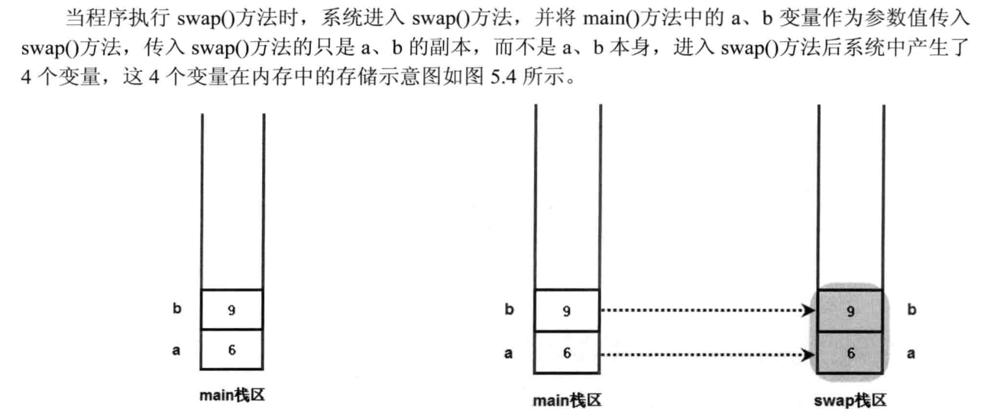
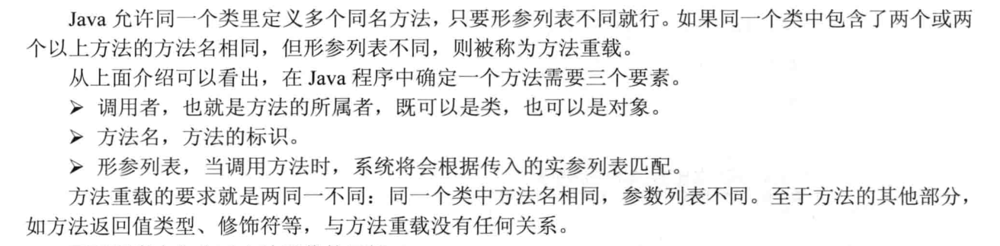
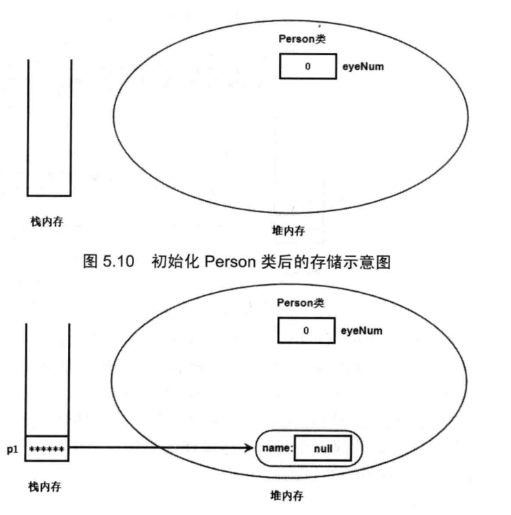

面向对象三大特征：封装、继承和多态。

**JAVA用引用操纵对象**


Java将一切看作对象，但操作对象的标识符实际上是对象的一个“引用”。

Java用new创建的对象由JVM进行管理，没有作用域的概念。

对象的this引用总是总是指向调用该方法的对象，通常有以下两种情形：

- 构造器中引用正在初始化的对象
- 方法中引用调用该方法的对象

# Java内存分配

1. 寄存器：这是最快的存储区，编程人员无法直接控制。

2. 堆栈（栈）：位于通用RAM中，但通过堆栈指针可以直接从CPU获得支持。堆栈指针若向下移动，则分配新的内存，若向上移动，则释放内存。创建JAVA程序时，JVM必须知道存储在堆栈中的所有项的确切生命周期，以便上下移动堆栈指针。对象引用大多存于堆栈中。

3. 堆：位于RAM，一种通用的内存池，用于存放所有的JAVA对象。堆不同于堆栈的好处是：编译器不需要知道存储的数据在堆中存活多长时间。因此，在堆里分配存储有很大的灵活性。代价是用堆进行存储分配和清理要消耗更长的时间。


# 方法

同一个类的一个方法调用另外一个方法时，如果被调方法是普通方法，则默认使用this作为调用者；如果被调方法是静态方法，则默认使用类作为调用者。表面上看起来某些方法可以被独立执行，但实际上还是使用this或者类来作为调用者。

static修饰的方法属于类本身，普通方法属于类的实例化对象。

**当声明一个类引用并赋值为null时，可以通过空引用访问其对应的类方法，即类中的static方法。**


## 方法的参数传递机制

JAVA里方法的参数传递机制只有一种，即值传递。也就是将实际参数的数值赋值给方法中的形参局部变量，方法的执行过程中只是对实际参数的复制品进行操作，不会影响其原本的实际参数。



## 可变参数列表

从JDK 1.5之后，Java允许定义形参个数可变的参数，从而允许为方法指定数量不确定的形参。如果在定义方法时，在最后一个形参的类型后增加三点(...)，则表明该形参可以接受多个参数值，多个参数值被当成数组传入。下面程序定义了一个形参个数可变的方法。

示例：

```java
public class Test {    
	public void output(int... numbers) {
    	for(int i : numbers)            
    		System.out.print(i+"-->");    
    }    
    public static void main(String[] args) {
    	new Test().output(5,6,7,8,10);    
    } 
}
```

**注意：**长度可变的形参只能处于形参列表的最后。一个方法中最多只能包含一个长度可变的形参。长度可变的形参本质就是一个数组类型的形参，因此调用包含一个长度可变形参的方法时，这个长度可变的形参既可以传入多个参数，也可以传入一个数组。

## 方法重载Overload



方法重写（override）：指子类覆盖父类中的同名方法。

# 成员变量与局部变量

## 成员变量

staic修饰的变量属于类，例如eyeNum，在第一次加载类时初始化。

实例成员变量在实例化时初始化。



## 局部变量

保存在方法的栈内存中，随方法的结束而回收。基本类型的局部变量直接保存在栈内存，引用类型的局部变量在栈中保存其对象的地址。

JAVA的自定义类中，基本类型的成员变量会被自动初始化。

**局部变量不会被自动初始化，它会是一个随机值**

# 包装类

| 基本数据类型 | 包装类      |
| ------------ | ----------- |
| `char`       | `Character` |
| `byte`       | `Byte`      |
| `short`      | `Short`     |
| `int`        | `Integer`   |
| `long`       | Long        |
| `float`      | `Float`     |
| `double`     | `Double`    |
| `boolean`    | `Boolean`   |

JDK1.5为包装类提供了自动拆箱和装箱的功能，开发者可近似将基本类型的变量当成对象使用。

包装类可以实现基本数据类型与字符串之间的转换，共有以下两种方法：

- 利用包装类提供的`parseXXX(String x)`静态方法（除Character类，其他类均提供了该方法）。
- 利用包装类的构造器`Xxx(String s)`。


```java
public class Primitive
{
    public static void main(String[] args){
        String intStr = "12345";
        int t1 = Integer.parseInt(intStr);
        int t2 = new Integer(intStr);
        //输出12345
        System.out.println(t2);
    }
}
```

两个包装类进行比较时，由于包装类是引用类型，因此只有两个包装类指向同一个对象时使用``==``运算符才会返回true。

```java
public class Test {
    public static void main(String[] args) {
        //输出false
        System.out.println(new Integer(3) == new Integer(3));
    }
}
```

由于Integer类的缓存机制，自动装箱后包装类对象的比较会出现一些奇怪的情况：

```java
public class Test {
    public static void main(String[] args) {
        Integer a = 10;
        Integer b = 10;
        System.out.println(a == b);
        Integer x = 10000;
        Integer y = 10000;
        System.out.println(x == y);
        System.out.println(a == new Integer(10));
    }
}
```

输出：

```
true
false
false

Process finished with exit code 0
```

原因：在Integer类的源代码中，创建了一个cache数组存储对-128到127的数对应的Integer对象，在程序中创建-128到127的Integer对象时，实际上只是将对象的引用指向了cache中的对象，没有创建新的对象，因此两个-128-127的Integer引用相比较时，它们数值相等就会返回true。

**注意：**只有使用`Integer.valueOf`或者自动装箱（底层调用`valueOf`函数）创建Integer时才会得到缓存的对象，使用new关键字来创建Integer对象时，即使是-128到127的数字也会返回一个新的对象）。

可以通过equals方法判断包装类的对象在数值上是否相等。

Java8为包装类新增了一些方法：

- `static String toUnsignedString(int/long i)`：将整数或长整数转换成无符号整数对应的字符串。
- `static String toUnsignedString(int/long i, int radix)`：将整数或长整数转换成指定进制的无符号整数对应的字符串。
- `static xxx parseUnsignedXxx(String s)`：将字符串解析成无符号的xxx类型变量。
- `static xxx parseUnsignedXxx(String s, int radix)`：指定进制。
- ...(操作无符号整数的方法)

# 处理对象

## `toString`方法

`Object`类的`toString`方法会返回该对象实现类的`类名+@+hashcode`，用户可根据实际情况重写`toString`方法。

## ==运算符

==作用于基本类型时，比较两个基本类型数值是否相同。

==作用于引用类型时，比较两个引用类型是否指向同一个对象。

**String类的特殊之处：**

`"hello"`直接量与`new String("hello")`的区别：当Java程序使用形如`hello`的字符串直接量（或者其他可在编译时确定的字符串直接量），JVM会使用常量池来管理这些字符串；当使用`new String("hello")`时，JVM会先使用常量池来管理`hello`直接量，再调用String的构造器在堆内存创建一个对象。`new String("hello")`共产生了两个字符串对象。

==常量池专门用于管理在编译时确定并被保存在.class文件中的一些数据，包括了类、方法、接口中的常量和字符串常量。==

示例：

```
public class Test {
    public static void main(String[] args) {
        String s1 = "l";
        String s2 = "q";
        //s3可在编译时确定，直接指向常量区的"lq"
        String s3 = "l" + "q";
        //指向常量区的"lq"
        String s4 = "lq";
        //指向堆内存中的"lq"
        String s5 = new String("lq");
        //无法在编译时确定，会指向堆内存的"lq"
        String s6 = s1 + s2;
        System.out.println(s3 == s4);
        System.out.println(s4 == s6);
        System.out.println(s5 == s6);
    }
}
```

```java
true
false
false

Process finished with exit code 0
```

JAVA常量池保证内容相同的字符串常量只有一个，因此编译器确定的引用变量，只要其对应的字符串内容相同，它们就会指向常量池的同一个对象。

程序运行期间才能确定的字符串对象在堆中存储。

## equals方法
`equals`方法是Object类提供的一个实例方法，Object类默认的`equals`方法和==运算符的效果相同，可以通过重写`equals()`方法来实现自定义的相等标准。

- String的`equals()`方法用来判断两个字符串是否相等

- `实例名.getCall()`和`类名.class`

- 正确重写`euqls()`方法应该满足的条件
  - 自反性：对任意x，`x.equals(x)`一定返回true
  - 对称性：对任意x和y，如果`y.equals(x)`返回true，则`x.equals(y)`也返回true
  - 传递性：对任意x、y、z，如果`x.equals(y)`返回true，`y.equals(z)`返回true，则`x.equals(z)`一定返回true
  - 对任何不是null的x，`x.equals(null)`一定返回false

# final修饰符

final可以用于修饰类、变量和方法。

final修饰变量时，表示该变量一旦获得了初始值就不能再被改变。

## final成员变量

成员变量是随类初始化或对象初始化而初始化的。当类初始化时,系统会为该类的类变量分配内存，并分配默认值；当创建对象时，系统会为该对象的实例变量分配内存，并分配默认值。也就是说，当执行静态初始化块时可以对类变量赋初始值；当执行普通初始化块、构造方法时可对实例变量赋初始值。因此，成员变量的初始值可以在定义该变量时指定默认值，也可以在初始化块、构造方法中指定初始值。

因此JAVA规定final修饰的成员变量必须由程序员显式地指定初始值，系统不会对final成员进行隐式初始化。

总结起来，final修饰的类变量、实例变量指定初始值的地方如下：

- 类变量：在声明该变量时指定其初始值，或者在静态初始化块中指定初始值，且必须是二者之一。
- 实例变量：在构造方法、普通初始化块或声明该变量时指定初始值，且必须是三者之一。

## final局部变量

系统不会自动初始化局部变量，final修饰的局部变量在程序执行过程中只能赋值一次。

## final修饰基本类型变量和引用类型变量的区别

- 基本类型：final修饰的基本类型变量不能重新赋值。
- 引用类型：对final修饰的引用类型变量而言，final只保证该引用不会指向其他的对象，即其地址值不变，其指向的对象的内容可以发生改变。

## 可执行宏替换的final变量

如果一个final变量满足以下条件：

- 在定义final变量时制定了初始值。
- 该初始值可以在编译时确定下来。

例如：

```java
public class Test {
    public static void main(String[] args) {
        final int a = 5000;
        System.out.println(a);
    }
}
```

在程序执行时，a变量并不存在，`System.out.println(a)`在编译后实际执行的是`System.out.println(5)`

```java
public class Test {
    public static void main(String[] args) {
        final int a = 5 + 2;
        final double b = 1.2 / 3;
        final String str = "ab" + "cd";
        final String str2 = "ab" + "cd" + 23;
        //编译时无法确定其值，存储在堆中
        final String str3 = "abcd" + String.valueOf(23);
        System.out.println(str2 == "abcd23");
        System.out.println(str3 == "abcd23");
    }
}
```

执行结果

```bash
true
false
```

对编译时可以确定值的final变量，java编译器会把它当作”宏变量”来处理，进行宏替换。`a、b、str、str1`都是宏变量。

对于编译时可以确定的普通变量，java编译器并不会将其当作宏变量进行值替换。例如：

`String str4 = "a" + "bcd";`

虽然编译时可以确定str4的值，但编译器不会将该普通变量当作宏变量，它仍然在堆内存中。执行`str4 == str`将会返回false。

**注意：**final变量只有在声明时进行初始化，编译器才会将它当作宏变量。

## final方法

final修饰的方法不能被重写（override），不希望子类重写父类的某个方法时，可以使用final修饰父类的这个方法。

final修饰的方法可以被重载（overload）。

tip：父类的private方法对子类是不可见的，即使用final修饰private方法，子类仍可以定义与该private方法完全相同的方法，该方法是子类的一个新方法，与父类的private方法无关。

## final类

不可变（immutable）类的意思是创建该类的实例后，其实例对象不可改变。JAVA提供的包装类和String类都是不可变类。当创建它们的实例后，其实例不允许改变。

如果要创建自定义不可变类，需要遵守以下规则：

- 使用private和final修饰该类的成员变量。
- 提供带参构造器初始化成员变量。
- 仅提供getter方法。
- 如果有必要，重写Object类的`hashCode`和`equals`方法。`equals`方法根据成员变量的值判断对象是否相等，`equals`方法判断相等的两个对象，其`hashCode`也应该相等。

# 初始化块

初始化块的作用和构造器类似，也可以对JAVA对象进行初始化操作。

## 使用方法

初始化块是Java类里可以出现的第四种成员（还有成员变量、方法和构造器），一个类里可以有多个初始化块，相同类型的初始化块之间有顺序，先定义的先执行，其语法如下：

```
[修饰符]{
	//code
	...
}
```

修饰符只能是static，使用static修饰的初始化块成为静态初始化块。初始化块里的代码可以包含任意可执行语句。

示例：

```java
public class Person {
    {
        int a = 6;
        if(a > 0)
            System.out.println("init block: partial variable a > 0");
        System.out.println("init block of person");
    }
    {
        System.out.println("second init block");
    }
    public Person() {
        System.out.println("no arg constructor");
    }

    public static void main(String[] args) {
        new Person();
    }
}
```

输出：

```
init block: partial variable a > 0
init block of person
second init block
no arg constructor
```

程序只在创建对象时隐式执行初始化块，再执行构造方法。

普通初始化块和声明实例变量指定的默认值都可以认为是对象的初始化代码，执行顺序与源程序中的排列顺序相同（可以将声明与初始化语句拆成两句，之后判断顺序）。

```java
public class Test {
    {
        a = 10;
    }
    int a = 9;
    //相当于:
    //int a;
	//{a = 9}
    public static void main(String[] args) {
        System.out.println(new Test().a);
        //输出a = 9
    }
}
```

## 初始化块和构造器

如果所有构造器都有一段公共的初始化代码，则可以把这段代码放到初始化块中以精简程序。

在初始化对象时，总是会溯源其顶层父类，执行其初始化块->构造方法，再执行子类的初始化块，构造方法...

**静态初始化块：**

静态初始化块也称类初始化块，它仅在类初始化时执行一次。静态初始化块不能对实例变量进行初始化。

**Java初始化代码执行顺序：**

父类静态变量声明➡父类静态变量初始化块 ➡父类静态变量声明➡父类静态变量初始化块

➡父类非静态变量声明➡父类非静态变量初始化➡父类构造方法➡子类非静态变量声明➡子类非静态变量初始化➡子类构造方法